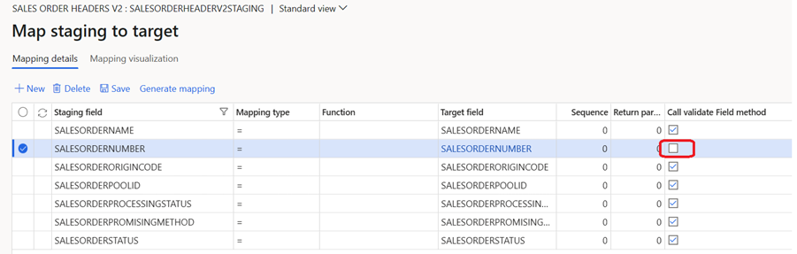
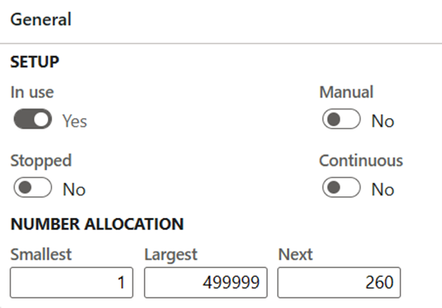
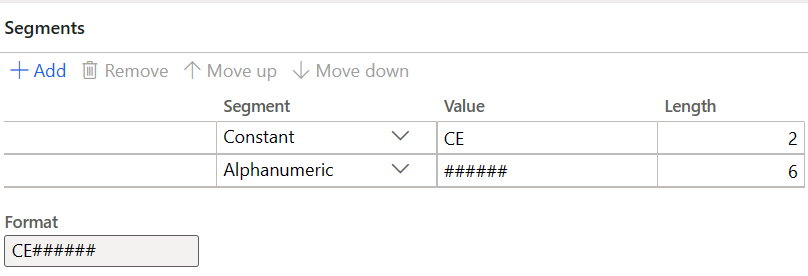
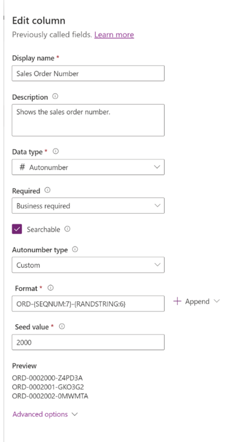

# Configure number sequences and autonumber columns when using dual-write

By default, the [number sequences](../../../fin-ops/organization-administration/number-sequence-overview.md) in finance and operations apps and the [autonumber columns](/powerapps/maker/data-platform/autonumber-fields) in customer engagement apps aren't connected. In a scenario that involves a multi-mastered table, you must either plan for separate number sequence formats or create a range for each application. Here are some examples:

- In the finance and operations app, use F0001, F0002, and F0003. In the customer engagement app, use C0001, C0002, and C0003.
- In the finance and operations app, use US0001 through US4999. In the customer engagement app, use US5000 through US9999.

For the preceding examples to work in finance and operations data management when you do a live synchronization, you must ensure that field data validation is disabled for the autonumber field in the data entity mappings. If there's a business reason to run the validation, we recommend that you review the number sequence settings of the data entities that are in scope in the finance and operations app. These rules are validated only when the initial synchronization is run. Live synchronization isn't affected.

During the initial synchronization, if field data validation is enabled for the autonumber field, you must verify the following items for both the customer engagement app and the finance and operation app:

- The length of autonumber sequences must match.
- The numeric sequence value in the customer engagement app must be in the interval that's defined by the **Smallest** and **Largest** values in the number sequence settings in the finance and operation app.
- The constants that are used must be identical.

The number sequence settings that are used by data entities such as customers, orders, or quotes in finance and operations apps can be found on the **Accounts receivable parameters** and **Number sequences** pages. For more information, see [Number sequences](../../../fin-ops/organization-administration/number-sequence-overview.md).

During the dual-write initial synchronization, you might receive an error message that resembles one of the following examples:

> Field ABC does not allow editing. Number CE-20000001 does not match format \#\#\#\#\#\#. Validations failed.

> Field ABC does not allow editing. Highest number allowed is 4999. Validations failed.

In this case, you must review the autonumber sequences in the customer engagement app and the number sequence settings in the finance and operations app, and update them as appropriate. Alternatively, you can skip the validation by disabling field validation at the data entity level in finance and operations data management.

If a table is created in only one system, set up the number sequence in the source app only. For more information, see [Autonumber columns](/powerapps/maker/data-platform/autonumber-fields).

## Disable field validation in the finance and operations data entity for the dual-write initial synchronization

To disable field validation in the finance and operations data entity for the dual-write initial synchronization, follow these steps.

1. In the finance and operations app, go to **Data Management** \> **Data entities**.
1. Select to update a data entity, and then, for the autonumber field, clear the **Call validate Field method** checkbox.
1. Select **Save**.

For more information, see [Optimize data migration for finance and operations apps](../../sysadmin/optimize-data-migration.md).

## Finance and operations number sequence settings

When you work with autonumbering in finance and operations apps, it's important that you understand the [number sequence settings](../../../fin-ops/organization-administration/number-sequence-overview.md).

- **Manual** – You should set this option to **No** if you want the system to generate values.
- **Smallest** – This field defines the smallest numeric value that's allowed for the number sequence.
- **Largest** – This field defines the largest numeric value that's allowed for the number sequence.
- **Next** – This field indicates the next numeric value that should be used in the number sequence.
- **To a higher number** and **To a lower number** – These options let users enter a value that's larger or smaller than the **Next** value.
- **Continuous** – This option helps prevent gaps and enables values to be reused when records are deleted. If there's a requirement to enable this option, you should carefully analyze the performance impact.

In the number sequence, you can have different segments that make up the full value. These segments can include constants or the company name.

Even after you enable data validation and confirm that the format of the column (for example, the sales order number) in Dataverse matches the number sequence, users might still receive the following error messages.

| Error message | Cause |
|---|---|
| Field \[field name\] does not allow editing. Invalid specification of \[field name\] does not allow change to a higher number. Validations failed. | The number sequence setup doesn't allow for edits. This error occurs when the **Manual**, **To a lower number**, or **To a higher number** option is set to **No**. To fix the issue, set one of these options to **Yes**. |
| Incoming \[field name\] \< Lowest number allowed is \[number\]. Validations failed. | The incoming values (numeric part) must be within the number allocation range for the finance and operations number sequence. (The number should be less than the largest value.) |
| Incoming \[field name\] \> highest number allowed is \[number\]. Validations failed. | The incoming values (numeric part) must be within the number allocation range for the finance and operations number sequence. (The number should be more than the smallest value.) |

## Dataverse autonumbering

[Autonumber columns](/power-apps/maker/data-platform/autonumber-fields) are Dataverse columns that automatically generate alphanumeric strings whenever they're created. Makers can customize the format of these columns as they prefer, and then rely on the system to generate matching values and automatically fill them in at runtime. For example, in the following illustration, the **Sales Order Number** column has been set up as an autonumber column in Dataverse.

## Prevent counter increments in finance and operations apps during the initial synchronization

If you don't want the finance and operations counter to increase when Dataverse records are created during the initial synchronization, set the **Continuous** option to **Yes** for the appropriate finance and operations number sequence.

## Largest value in finance and operations number sequence settings is reached

If the **Largest** value that's defined in the number sequence settings is reached, the user receives the following error message:

> Number sequence \[number\] has been exceeded. Number selection is canceled.

To fix this issue, increase the **Largest** value and/or the length of the alphanumeric segment format. For more information, see [Number sequences](../../../fin-ops/organization-administration/number-sequence-overview.md).
