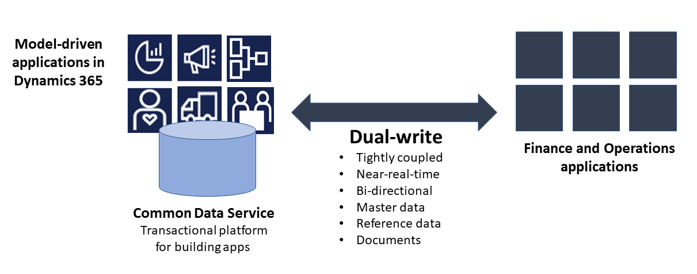
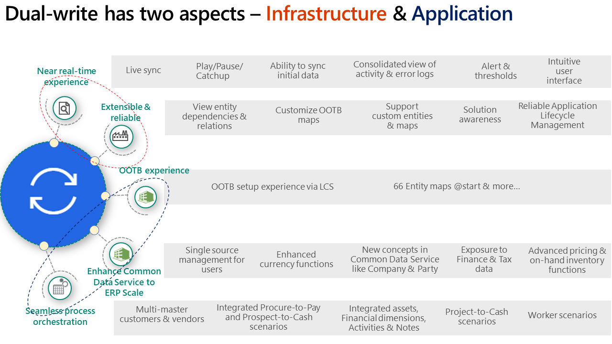

---
# required metadata

title: Dual-write overview
description: Dual-write is an out-of-the-box infrastructure that provides seamless near-real-time interaction between Microsoft Dynamics 365 model-driven applications and Finance and Operations applications.
author: shsrav
manager: AnnBe
ms.date: 02/06/2020
ms.topic: article
ms.prod: 
ms.service: dynamics-ax-applications
ms.technology: 

# optional metadata

ms.search.form: 
# ROBOTS: 
audience: Application User, IT Pro
# ms.devlang: 
ms.reviewer: rhaertle
ms.search.scope: Core, Operations
# ms.tgt_pltfrm: 
ms.custom: 
ms.assetid: 
ms.search.region: global
ms.search.industry: 
ms.author: 
ms.dyn365.ops.version: 
ms.search.validFrom: 2020-01-06

---

# Dual-write overview

[!include [banner](../../includes/banner.md)]

[!include [banner](../../includes/preview-banner.md)]

## What is dual-write?

Dual-write is an out-of-the-box infrastructure that provides seamless near-real-time interaction between Microsoft Dynamics 365 model-driven applications and Finance and Operations applications. When data on customers, products, people, and operations flow seamlessly beyond application boundaries, it create a digital feedback loop and empowers all departments in an organization.

Dual-write provides a tightly coupled, bi-directional integration between Dynamics 365 for Finance and Operations and the Common Data Service. Any create, read, update change in Finance and Operations results in writes, in near-real-time, to the Common Data Service and vice versa. This tight data integration provides an integrated user experience across the apps.

The dual-write infrastructure is extensible and reliable, and includes the following key features: 

+ Synchronous and bi-directional data flow between applications.
+ Synchronization with play, pause, and catchup modes supports the system during online and offline/async modes. 
+ Ability to synchronize initial data between the applications.
+ Consolidated view of activity and error logs for data administrators.
+ Ability to configure custom alerts and thresholds, and subscribe to notifications.
+ Intuitive user-interface for filtering and transformations.
+ Ability to set and view entity dependencies and relationships.
+ Extensible for both standard and custom entities and maps.
+ Reliable application lifecycle management.
+ Out-of-the-box setup experience for new customers.
 
Dual-write application orchestration harmonizes the concepts between Finance and Operations applications and model-driven apps in Dynamics 365. This integration supports these scenarios:

+ Integrated customer master.
+ Access to customer Loyalty cards and reward points.
+ Unified product mastering experience.
+ Awareness of organization hierarchy.
+ Integrated vendor master.
+ Access to finance and tax reference data.
+ Experience Finance & Operations price engine on-demand.
+ Integrated prospect to cash experience. 
+ Ability to serve both in-house and customer assets through field agents.
+ Integrated procure to pay experience.
+ Integrated Activities and Notes for customer data and documents.
+ Lookup on-hand inventory availability and details.
+ Seamless project to cash experience.
+ Ability to handle multiple addresses and roles through the 'Party' concept.
+ Single source management for Dynamics 365 users.
+ Integrated channels for retailing and marketing.
+ Visibility to promotions and discounts.
+ Request to service functions.
+ Streamline service operations.
 
