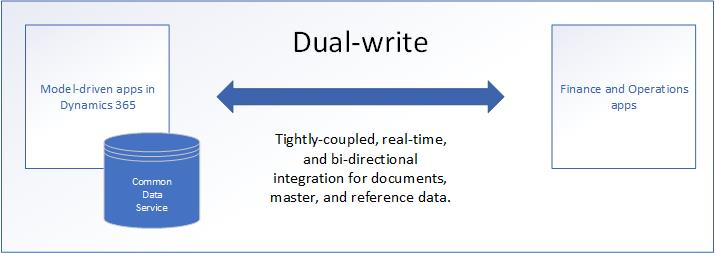

# Dual-write overview

[!include [banner](../../includes/banner.md)]

## What is dual-write?

Dual-write is an out-of-box infrastructure that provides near-real-time interaction between customer engagement apps and Finance and Operations apps. When data about customers, products, people, and operations flows beyond application boundaries, all departments in an organization are empowered.

Dual-write provides tightly coupled, bidirectional integration between Finance and Operations apps and Dataverse. Any data change in Finance and Operations apps causes writes to Dataverse, and any data change in Dataverse causes writes to Finance and Operations apps. This automated data flow provides an integrated user experience across the apps.

Dual-write has two aspects: an *infrastructure* aspect and an *application* aspect.

### Infrastructure

The dual-write infrastructure is extensible and reliable, and includes the following key features:

+ Synchronous and bidirectional data flow between applications
+ Synchronization, together with play, pause, and catchup modes to support the system during online and offline/asynchronous modes.
+ Ability to sync initial data between the applications
+ Combined view of activity and error logs for data admins
+ Ability to configure custom alerts and thresholds, and to subscribe to notifications
+ Intuitive user interface (UI) for filtering and transformations
+ Ability to set and view table dependencies and relationships
+ Extensibility for both standard and custom tables and maps
+ Reliable application lifecycle management
+ Out-of-box setup experience for new customers

### Application

Dual-write creates a mapping between concepts in Finance and Operations apps and concepts in customer engagement apps. This integration supports the following scenarios:

+ Integrated customer master
+ Access to customer loyalty cards and reward points
+ Unified product mastering experience
+ Awareness of organization hierarchy
+ Integrated vendor master
+ Access to finance and tax reference data
+ On-demand price engine experience
+ Integrated prospect-to-cash experience
+ Ability to serve both in-house assets and customer assets through field agents
+ Integrated procure-to-pay experience
+ Integrated activities and notes for customer data and documents
+ Ability to look up on-hand inventory availability and details
+ Project-to-cash experience
+ Ability to handle multiple addresses and roles through the party concept

## Top reasons to use dual-write

Dual-write provides data integration across Microsoft Dynamics 365 applications. This robust framework links environments and enables different business applications to work together. Here are the top reasons why you should use dual-write:

+ Dual-write provides tightly coupled, near-real-time, and bidirectional integration between finance and operations apps and customer engagement apps. This integration makes Microsoft Dynamics 365 the one-stop shop for all your business solutions. Customers who use Dynamics 365 Finance and Dynamics 365 Supply Chain Management, but who use non-Microsoft solutions for customer relationship management (CRM), are moving toward Dynamics 365 for its dual-write support.
+ Data from customers, products, operations, projects, and the Internet of Things (IoT) automatically flows to Dataverse through dual-write. This connection is useful for businesses that are interested in Power Platform expansions.
+ The dual-write infrastructure follows the no-code/low-code principle. Minimal engineering effort is required to extend the standard table-to-table maps and to include custom maps.
+ Dual-write supports both online mode and offline mode. Microsoft is the only company that offers support for online and offline modes.

## What does dual-write mean for developers and architects of customer engagement apps?

Dual-write automates the data flow between Finance and Operations apps and customer engagement apps. Dual-write consists of two AppSource solutions that are installed on Dataverse. The solutions expand the table schema, plugins, and workflows on Dataverse so that they can scale to ERP size. For a successful implementation, developers and architects of customer engagement apps must understand these changes and collaborate with their counterparts on Finance and Operations apps.

To create parity with Finance and Operations applications, dual-write makes some crucial changes in the Dataverse schema. If you understand the plan, you can avoid some design and development rework in the future.

+ When the dual-write AppSource package is installed, Dataverse will have new concepts such as company and party. These concepts help applications built on Dataverse, including Dynamics 365 Sales, Dynamics 365 Marketing, Dynamics 365 Customer Service, and Dynamics 365 Field Service, to interact seamlessly with Finance and Operations apps.

+ Activities and notes are unified and expanded to support both C1s (users of the system) and C2s (customers of the system).

+ To prevent data loss during currency transmission between Finance and Operations apps and the Dataverse, you'll be able to extend the number of decimal places in the currency data type of customers engagement apps. The feature autotranslates existing rows to the new extended state at the metadata layer. During this process, the currency value is translated to decimal data rather than money data, and the currency value supports 10 decimal places. This feature is opt-in, and organizations that don't need more than 4 decimal places of precision do not need to opt in. For more information, see [Currency data-type migration for dual-write](currrency-decimal-places.md).

+ [Date effectivity](../../dev-tools/date-effectivity.md) will be added to Dataverse. It will support past, present, and future data on the same table.

+ Product [unit conversions](../../../../supply-chain/pim/tasks/manage-unit-measure.md) are supported for products, quotes, orders, and invoices.

For more information about upcoming changes, see [What's new or changed in dual-write](whats-new-dual-write.md).

[!INCLUDE[footer-include](../../../../includes/footer-banner.md)]
