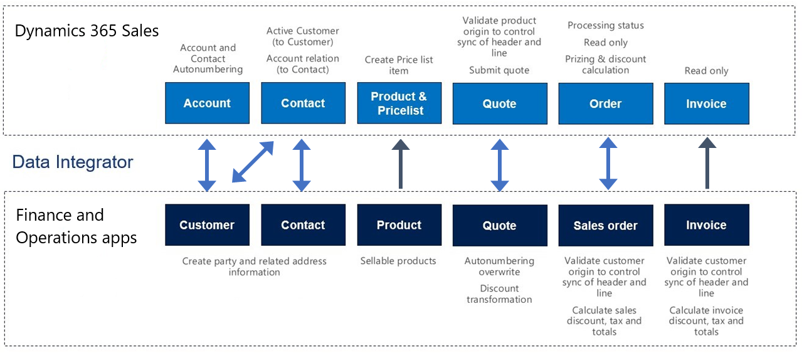

# Quote-to-cash in dual-write

[!include [banner](../../includes/banner.md)]

In Microsoft Dynamics 365 apps, the quote-to-cash process occurs through quotations or order processing workflows, and the financials are reconciled and recognized. Integration of quote-to-cash with dual-write creates a workflow that takes a quotation and an order that originate in either Dynamics 365 Sales or Dynamics 365 Supply Chain Management, and makes the quotation and order available in both apps.

In the app interfaces, you can access the processing statuses and invoice information in real time. Therefore, you can more easily manage functions such as product stocking, inventory handling, and fulfillment in Supply Chain Management, without having to re-create the quotations and orders.

For information about customer and contact integration, see [Integrated customer master](customer-mapping.md). For information about product integration, see [Unified product experience](product-mapping.md).

> [!NOTE]
> In Dynamics 365 Sales, both prospect and customer refer to a record in the **Account** table where the **RelationshipType** column is either **Prospect** or **Customer**. If your business logic includes an **Account** qualification process where the **Account** record is created and qualified as a prospect first and then as a customer, that record synchronizes to the finance and operations app only when it is a customer (`RelationshipType=Customer`) and vice versa. Synchronizing  the **Account** row as a prospect and supporting the prospect in an integrated quotation process, will require  a custom map to integrate the prospect data and customizations to business logic.
>  
## Prerequisites and mapping setup

Before you can sync sales quotations, you must update the following settings.

### Setup in Sales

In Sales, go to **Settings \> Administration \> System settings \> Sales**, and make sure that the following settings are used:

- The **Use system pricing calculation** system option is set to **Yes**.
- The **Discount calculation method** column is set to **Line item**.

> [!NOTE]
> In Dynamics 365 Supply Chain Management an alternate approach to pricing on sales quotations and sales orders is available. In the alternate approach  Dynamics 365 Supply Chain Management becomes the price master and no pricing related calculations are performed in Dynamics 365 Sales for Sales orders and sales quotations. This approach takes effect when feature **Make Supply Chain Management price master when integrated with Dynamics 365 Sales** in enabled. It is recommended to enable this feature. Please note that per Microsoft lifecycle policy this feature is planned to become default enabled 6 months after release, and mandatory on, 6 months following default enabled. For more information on this feature see [Sync on-demand with the Supply Chain Management pricing engine](pricing-engine.md).

### Sites and warehouses

In Supply Chain Management, the **Site** and **warehouse** columns are required for quotation lines and order lines. If you set the site and warehouse in the default order settings, those columns will automatically be set when you add a product to a quotation line or an order line.

### Number sequences for quotations and orders

The number sequences for Supply Chain Management and Sales aren't connected when quotations and orders are created and synced in Sales and Supply Chain Management. If a sales order that is created in Sales is synced to Supply Chain Management, it has the same sales order number in Supply Chain Management. To help ensure that the sales order number isn't duplicated, you must use different number sequence systems in the two apps.

For example, the number sequence in Supply Chain Management is **1, 2, 3, 4, 5, ...**, and the number sequence in Sales is **100, 99, 98, ...**. If you create 100 sales orders in Sales, an order number will eventually be generated that already exists in Supply Chain Management. In other words, the two number sequences will eventually overlap as sales orders are created in Supply Chain Management and Sales. Instead, you might use a number sequence such as **F1, F2, F3, ...** in Supply Chain Management and a number sequence such as **C1, C2, C3, ...** in Sales. These number sequences will never produce duplicate sales order numbers.

## Sales quotations

Sales quotations can be created in either Sales or Supply Chain Management. If you create a quotation in Sales, it's synced to Supply Chain Management in real time. Likewise, if you create a quotation in Supply Chain Management, it's synced to Sales in real time. Note the following points:

- You can add a discount to the product on the quotation. In this case, the discount will be synced to Supply Chain Management. The **Discount**, **Charges**, and **Tax** columns on the header are controlled by a setup in Supply Chain Management. This setup doesn't support integration mapping. Instead, the **Price**, **Discount**, **Charge**, and **Tax** columns are maintained and handled in Supply Chain Management.
- The **Discount %**, **Discount**, and **Freight Amount** columns on the sales quotation header are read-only columns.
- The **Freight terms**, **Delivery terms**, **Shipping method**, and **Delivery mode** columns aren't part of the default mappings. To map these columns, you must set up a value mapping that is specific to the data in the organizations that the table is synced between.

> [!NOTE]
> In Dynamics 365 Supply Chain Management version 10.0.34 it is possible to have the sales quotation lifecycle integrated between Dynamics 365 Sales and Supply Chain Management. Integrating sales quotation lifecycle takes effect when feature **Integrate Sales Quotation lifecycle with Dynamics 365 Sales** in enabled. When this feature is enabled, state and status transition throughout the lifecycle of a sales quotation is mapped between the two applications while applying a policy of ownership to control the available actions for a sales quotation when in either Dynamics 365 Sales or in Supply Chain Management. Please note that per Microsoft lifecycle policy this feature is planned to become default enabled 6 months after release, and mandatory on, 6 months following default enabled. For more information on this feature see [Add efficiency in Quote to Cash with Dynamics 365 Sales](add-efficiency-in-quote-to-cash.md). Also note that feature **Make Supply Chain Management price master when integrated with Dynamics 365 Sales** when enabled changes how calculations are performed for sales quotations in Dynamics 365 Sales for sales quotations and sales orders.

If you are also using the Field Service solution, make sure to re-enable the **Quote Line Quick Create** parameter. Re-enabling the parameter lets you continue creating quote lines using the quick create function.

1. Navigate to your Dynamics 365 Sales application.
2. Select the settings icon in the top navigation bar.
3. Select **Advanced Settings**.
4. Choose the **Customize the System** option.
5. Select the **Quote Line** menu item.
6. Go to the **Data Services** section and select the **Allow quick create** checkbox.

## Sales orders

Sales orders can be created in either Sales or Supply Chain Management. If you create a sales order in Sales, it's synced to Supply Chain Management in real time. Likewise, if you create a sales order in Supply Chain Management, it's synced to Sales in real time. Note the following points:

- Write-in products on Dynamics 365 Sales will appear as product categories in Dynamics 365 Supply Chain Management.
- Discount calculation and rounding:

    - The discount calculation model in Sales differs from the discount calculation model in Supply Chain Management. In Supply Chain Management, the final discount amount on a sales line can be the result of a combination of discount amounts and discount percentages. If this final discount amount is divided by the quantity on the line, rounding can occur. However, this rounding isn't considered if a rounded per-unit discount amount is synced to Sales. To help ensure that the full discount amount from a sales line in Supply Chain Management is correctly synced to Sales, the full amount must be synced without being divided by the line quantity. Therefore, you must define the discount calculation method as **Line item** in Sales.
    - When a sales order line is synced from Sales to Supply Chain Management, the full line discount amount is used. Because Supply Chain Management has no column that can store the full discount amount for a line, the amount is divided by the quantity and stored in the **Line discount** column. Any rounding that occurs during this division is stored in the **Sales charges** column on the sales line.

### Example: Synchronization from Sales to Supply Chain Management

You have the following sales order:

- **Sales:** Quantity = 3, per-line discount = $10.00
- **Supply Chain Management:** Quantity = 3, line discount amount = $3.33, sales charge = –$0.01

If you sync from Supply Chain Management to Sales, you get the following result:

- **Supply Chain Management:** Quantity = 3, line discount amount = $3.33, sales charge = –$0.01
- **Sales:** Quantity = 3, per-line discount = (3 × $3.33) + $0.01 = $10.00

> [!NOTE]
> In Dynamics 365 Supply Chain Management an alternate approach to pricing on sales quotations and sales orders is available. In the alternate approach  Dynamics 365 Supply Chain Management becomes the price master and no pricing related calculations are performed in Dynamics 365 Sales for Sales orders and sales quotations. This approach takes effect when feature **Make Supply Chain Management price master when integrated with Dynamics 365 Sales** in enabled. Please note that per Microsoft lifecycle policy this feature is planned to become default enabled 6 months after release, and mandatory on, 6 months following default enabled. For more information on this feature see [Sync on-demand with the Supply Chain Management pricing engine](pricing-engine.md).

## Dual-write solution for Sales

New columns have been added to the **Order** table and appear on the page. Most of these columns appear on the **Integration** tab in Sales. To learn more about how the status columns are mapped, see [Set up the mapping for sales order status columns](sales-status-map.md).

- The **Create Invoice** and **Cancel Order** buttons on the **Sales order** page are hidden in Sales.
- The **Sales order status** value will remain **Active** to help ensure that changes from Supply Chain Management can flow to the sales order in Sales. To control this behavior, set the default **Statecode \[Status\]** value to **Active**.

> [!NOTE]
> To support  new features introduced in Dynamics 365 Supply Chain Management version 10.0.34 a new dual write solution (version XXXX) for supply chain is released. This solution includes selective updates to the status integration of sales orders. When updating to the new Dual-Write Supply chain solution, some of the changes are in effect for the existing CDS Sales order headers (salesorders) entity while aditional changes are in effect with the Dynamics 365 Sales order headers (salesorders) entity. For more information on these changes included in the dual write solution see _New page_.

## Invoices

Sales invoices are created in Supply Chain Management and synced to Sales. Note the following points:

- An **Invoice number** column has been added to the **Invoice** table and appears on the page.
- The **Create invoice** button on the **Sales order** page is hidden, because invoices will be created in Supply Chain Management and synced to Sales. The **Invoice** page can't be edited, because invoices will be synced from Supply Chain Management.
- The **Sales order status** value is automatically changed to **Invoiced** when the related invoice from Supply Chain Management has been synced to Sales. Additionally, the owner of the sales order that the invoice was created from is assigned as the owner of the invoice. Therefore, the owner of the sales order can view the invoice.
- The **Freight terms**, **Delivery terms**, and **Delivery mode** columns aren't included in the default mappings. To map these columns, you must set up a value mapping that is specific to the data in the organizations that the table is synced between.

## Templates

Prospect-to-cash includes a collection of core table maps that work together during data interaction, as shown in the following table.

| Finance and operations apps | Customer engagement apps | Description |
|-----------------------------|-----------------------------------|-------------|
[All products](mapping-reference.md#138) | msdyn_globalproducts | |
[Customers V3](mapping-reference.md#101) | accounts | |
[Customers V3](mapping-reference.md#116) | contacts | |
[Contacts V2](mapping-reference.md#221) | msdyn_contactforparties | |
[CDS sales order headers](mapping-reference.md#217) | salesorders | |
[CDS sales order lines](mapping-reference.md#216) | salesorderdetails | |
[CDS sales quotation header](mapping-reference.md#215) | quotes | |
[CDS sales quotation lines](mapping-reference.md#214) | quotedetails | |
[Released products V2](mapping-reference.md#189) | msdyn_sharedproductdetails | |
[Sales invoice headers V2](mapping-reference.md#118) | invoices | The Sales invoice headers V2 table in the finance and operations app contains invoices for sales orders and free text invoices. A filter is applied in Dataverse for dual-write that will filter out any free text invoice documents. |
[Sales invoice lines V2](mapping-reference.md#117) | invoicedetails | |
[Sales order origin codes](mapping-reference.md#186) | msdyn_salesorderorigins | |
[Dynamics 365 Sales order headers]() | salesorders | Entity introduced with feature Add efficiency in Quote to Cash with Dynamics 365 Sales |
[Dynamics 365 Sales order lines]() | salesorderdetails | Entity introduced with feature Add efficiency in Quote to Cash with Dynamics 365 Sales |
[Dynamics 365 Sales quotation header]() | quotes | Entity introduced with feature Add efficiency in Quote to Cash with Dynamics 365 Sales |
[Dynamics 365 Sales quotation lines]() | quotedetails | Entity introduced with feature Add efficiency in Quote to Cash with Dynamics 365 Sales |
[Dynamics 365 Sales feature management states]() | msdyn_supplychainfeaturestate | Entity introduced with feature Add efficiency in Quote to Cash with Dynamics 365 Sales |

For information about price lists, see [Unified product experience](product-mapping.md).

**Note** The five entities prefixed with Dynamics are explained in more detail in [How to enable Add efficiency in Quote to Cash with Dynamics 365 Sales](enable-efficiency-in-quote-to-cash.md)

## Limitations

- Return orders are not supported. A return order is a sales order with sales order type **returned order**
- Financial dimensions must be set for the master data, for example, customer and vendor. When a customer is added to a quotation or sales order, the financial dimensions associated with the customer record flow to the order automatically. Currently dual-write does not include financial dimensions data for master data.

[!INCLUDE[footer-include](../../../../includes/footer-banner.md)]
