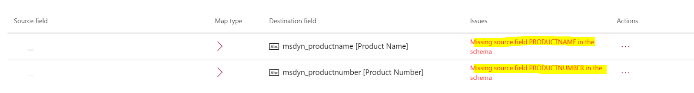

# Troubleshoot issues from upgrades of Finance and Operations apps

[!include [banner](../../includes/banner.md)]


This topic provides troubleshooting information for dual-write integration between Finance and Operations apps and Dataverse. Specifically, it provides information that can help you fix issues that are related to upgrades of Finance and Operations apps.

> [!IMPORTANT]
> Some of the issues that this topic addresses might require either the system admin role or Microsoft Azure Active Directory (Azure AD) tenant admin credentials. The section for each issue explains whether a specific role or credentials are required.

## Database synchronization errors

**Required role to fix the issue:** System admin

You might receive an error message that resembles the following example when you try to use the **DualWriteProjectConfiguration** table to update a Finance and Operations app to Platform update 30.

```console
Infolog diagnostic message: 'Cannot select a row in Dual write project sync (DualWriteProjectConfiguration). The SQL database has issued an error.' on category 'Error'. 10/28/2019 15:18:20: Infolog diagnostic message: 'Object Server Database Synchronizer: ' on category 'Error'. 10/28/2019 15:18:20: Infolog diagnostic message: '[Microsoft][ODBC Driver 17 for SQL Server][SQL Server]Invalid column name 'ISDELETE'.' on category 'Error'. 10/28/2019 15:18:20: Infolog diagnostic message: 'SELECT T1.PROJECTNAME,T1.EXTERNALENTITYNAME,T1.INTERNALENTITYNAME,T1.EXTERNALENVIRONMENTURL,T1.STATUS,T1.ENABLEBATCHLOOKUP,T1.PARTITIONMAP,T1.QUERYFILTEREXPRESSION,T1.INTEGRATIONKEY,T1.ISDELETE,T1.ISDEBUGMODE,T1.RECVERSION,T1.PARTITION,T1.RECID FROM DUALWRITEPROJECTCONFIGURATION T1 WHERE (PARTITION=5637144576)' on category 'Error'. 10/28/2019 15:18:20: Infolog diagnostic message: 'session 1043 (Admin)' on category 'Error'. 10/28/2019 15:18:20: Infolog diagnostic message: 'Stack trace: Call to TTSCOMMIT without first calling TTSBEGIN.' on category 'Error'.
10/28/2019 15:18:20: Application configuration sync failed.
Microsoft.Dynamics.AX.Framework.Database.TableSyncException: Custom action threw exception(s), please investigate before synchronizing again: 'InfoException:Stack trace: Call to TTSCOMMIT without first calling TTSBEGIN."
```

To fix the issue, follow these steps.

1. Sign in to the virtual machine (VM) for the Finance and Operations app.
2. Open Visual Studio as an admin, and open the Application Object Tree (AOT).
3. Search for **DualWriteProjectConfiguration**.
4. In the AOT, right-click **DualWriteProjectConfiguration**, and select **Add to new project**. Select **OK** to create the new project that uses default options.
5. In Solution Explorer, right-click **Project properties**, and set **Synchronize Database on Build** to **True**.
6. Build the project, and confirm that the build is successful.
7. On the **Dynamics 365** menu, select **Synchronize database**.
8. Select **Synchronize** to do a full database synchronization.
9. After the full database synchronization is successful, rerun the database synchronization step in Microsoft Dynamics Lifecycle Services (LCS) and use the manual upgrade scripts as applicable, so that you can proceed with the update.

## Missing table columns issue on maps

**Required role to fix the issue:** System admin

On the **Dual-write** page, you might receive an error message that resembles the following example:

*Missing source field \<field name\> in the schema.*



To fix the issue, first follow these steps to make sure that the columns are in the table.

1. Sign in to the VM for the Finance and Operations app.
2. Go to **Workspaces \> Data management**, select the **Framework parameters** tile, and then, on the **Table settings** tab, select **Refresh table list** to refresh the tables.
3. Go to **Workspaces \> Data management**, select the **Data tables** tab, and make sure that the table is listed. If the table isn't listed, sign in to the VM for the Finance and Operations app, and make sure the table is available.
4. Open the **Table mapping** page from the **Dual-write** page in the Finance and Operations app.
5. Select **Refresh table list** to automatically fill the columns in the table mappings.

If the issue still isn't fixed, follow these steps.

> [!IMPORTANT]
> These steps guide you through the process of deleting a table and then adding it again. To avoid issues, be sure to follow the steps exactly.

1. In the Finance and Operations app, go to **Workspaces \> Data management**, and select the **Data tables** tile.
2. Find the table that is missing the attribute. Click **Modify target mapping** in the toolbar.
3. On the **Map staging to target** pane, click **Generate mapping**.
4. Open the **Table mapping** page from the **Dual-write** page in the Finance and Operations app.
5. If the attribute is not auto-populated on the map, add it manually by clicking **Add attribute** button and then clicking **Save**. 
6. Select the map and click **Run**.


[!INCLUDE[footer-include](../../../../includes/footer-banner.md)]