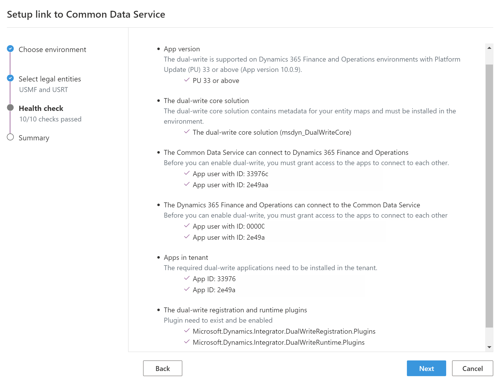
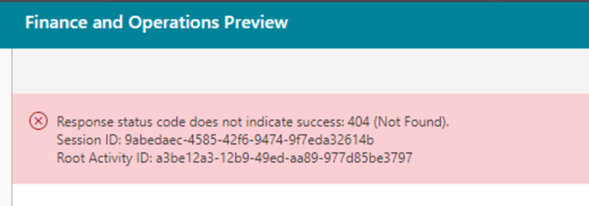

# Troubleshoot issues during initial setup

[!include [banner](../../includes/banner.md)]

This topic provides troubleshooting information for dual-write integration between Finance and Operations apps and Dataverse. Specifically, it provides information that can help you fix issues that might occur during the initial setup of dual-write integration.

> [!IMPORTANT]
> Some of the issues that this topic addresses might require either the system admin role or Microsoft Azure Active Directory (Azure AD) tenant admin credentials. The section for each issue explains whether a specific role or credentials are required.

## You can't link a Finance and Operations app to Dataverse

**Required role to set up dual-write:** System administrator in Finance and Operations apps and Dataverse.

Errors on the **Setup link to Dataverse** page are usually caused by incomplete setup or permissions issues. Make sure that the whole health check passes on the **Setup link to Dataverse** page, as shown in the following illustration. You can't link dual-write unless the whole health check passes.

You must have Azure AD tenant admin credentials to link the Finance and Operations and Dataverse environments. After you link the environments, users can sign in by using their account credentials and update an existing table map.

## Find the limit on the number of legal tables or companies that can be linked for dual-write

You might receive the following error message when you try to enable maps:

*Dual write failure - Plugin registration failed: [(Unable to get partition map for project
DWM-1ae35e60-4bc2-4905-88ea-69efd3b29260-7f12cb89-1550-42e2-858e-4761fc1443ea.
Error Exceeds the maximum partitions allowed for mapping
DWM-1ae35e60-4bc2-4905-88ea-69efd3b29260-7f12cb89-1550-42e2-858e-4761fc1443ea)],
One or more errors occurred.*

The current limit when you link the environments is approximately 40 legal tables. This error occurs if you try to enable maps, and more than 40 legal tables are linked between the environments.

## Connection set failed while linking environment

While linking the dual-write environment, the action fails with an error message:

*Saving connection set failed! An item with the same key has already been added.*

Dual-write does not support multiple legal entities/companies with the same name. For example, If you have two companies with "DAT" name in the Dataverse then it will get this error message.

To unblock the customer, remove duplicate records from **cdm_company** table in Dataverse. Also, if the **cdm_company** table has records with blank name, remove or correct those records.

## Error when opening the Dual-write page in Finance and Operations apps

You might receive the following error message when you try to link a Dataverse environment for dual-write:

*Response status code does not indicate success: 404 (Not Found).*

This error occurs when the app consent step is not complete. You can validate if consent has been provided by logging on to `portal.azure.com` using the tenant admin account, and check if the 3rd party app with ID `33976c19-1db5-4c02-810e-c243db79efde` shows up in AAD’s Enterprise applications list. If not, then rerun the consent step as described in the next section.

### Providing App consent

+ Launch the following URL with your admin credentials.

    `https://login.microsoftonline.com/common/oauth2/authorize?client_id=33976c19-1db5-4c02-810e-c243db79efde&response_type=code&prompt=admin_consent`

+ Select **Accept** to consent. You are providing the consent to install the app (with `id=33976c19-1db5-4c02-810e-c243db79efde`) in your tenant.
+ This app is required for Dataverse to communicate to Finance and Operations apps.

    

> [!NOTE]
> If this doesn't work, launch the URL in private mode of Microsoft Edge or incognito mode of Chrome .

## Finance and Operations environment is not discoverable

You might receive the following error message:

*Finance and Operations apps environment \*\*\*.cloudax.dynamics.com is not discoverable.*

There are two things that can cause an issue with environment not being discoverable:

+ The user used for login is not in the same tenant as the Finance and Operations instance.
+ There are some legacy Finance and Operations instances that were Microsoft-hosted that had an issue with discovery. To fix this, update the Finance and Operations instance. The environment becomes discoverable with any update.

[!INCLUDE[footer-include](../../../../includes/footer-banner.md)]
