# Troubleshoot issues during initial synchronization

[!include [banner](../../includes/banner.md)]

This article provides troubleshooting information for dual-write integration between finance and operations apps and Dataverse. Specifically, it provides information that can help you fix issues that might occur during initial synchronization.

> [!IMPORTANT]
> Some of the issues that this article addresses might require either the system admin role or Microsoft Microsoft Entra tenant admin credentials. The section for each issue explains whether a specific role or credentials are required.

## Check for initial synchronization errors in a finance and operations app

After you enable the mapping templates, the status of the maps should be **Running**. If the status is **Not running**, errors occurred during initial synchronization. To view the errors, select the **Initial sync details** tab on the **Dual-write** page.

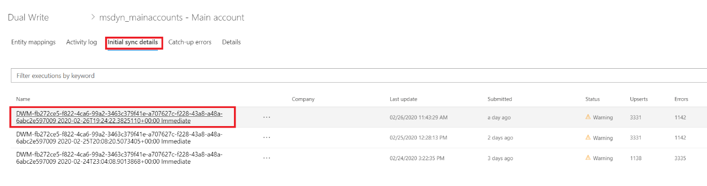

In some cases, it may seem like the initial sync is stuck. If you see the initial sync status as **Running** for a long time, you can dig further into the status by examining the **FinOps job name** details in finance and operations apps. The following screenshots show how these items are related:

1. From the table map screen, select the **Initial sync details** tab, and select the desired execution. This takes you to the **Execution details** screen, that provides the **FinOps job name**.

    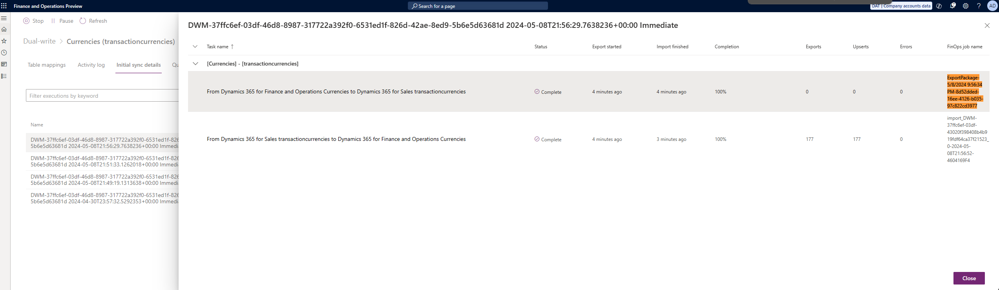

2. Navigate to Data Management in finance and operations apps and find the **Job history** section. Search for the **FinOps job name** from step 1 in the **Execution group id** column. Once selected, you can select the **Execution details** button for more detail about the status of the job.

    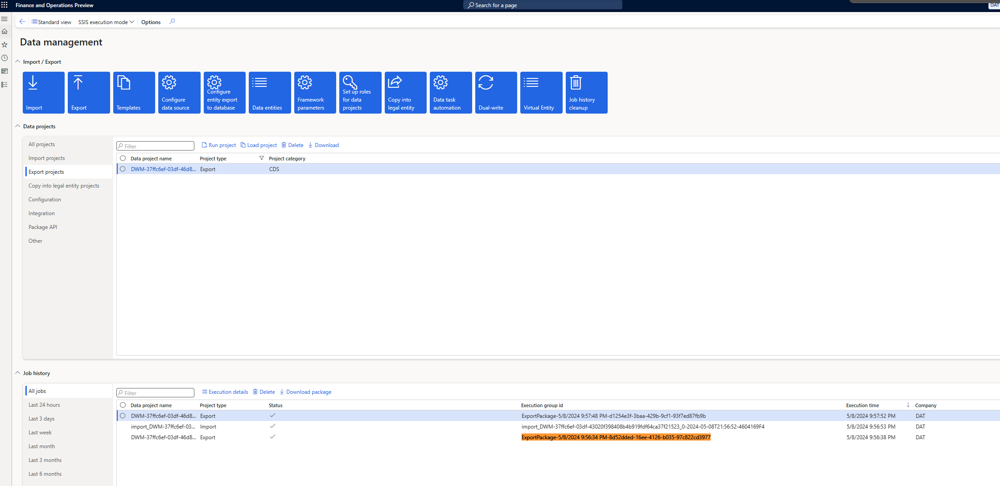

## You can't complete initial synchronization: 400 Bad Request

**Required role to fix the issue:** System admin

You might receive the following error message when you try to run the mapping and initial synchronization:

*(\[Bad Request\], The remote server returned an error: (400) Bad Request.), AX export encountered an error.*

Here's an example of the full error message.

```console
Dual write Initial Sync completed with status: Error. Following are the details:
Executed leg: From AX Financial dimensions to CRM msdyn_dimensionattributes
with exported records count: 0, ImportRecordsErrorCount: 0,
ImportRecordsInsertedCount: 0 and ImportRecordsUpdatedCount: 0
ErrorsDetails:
Dual write Initial sync failed
Message: ([Bad Request], The remote server returned an error: (400) Bad Request.), AX export encountered an error
Stacktrace: at
Microsoft.Dynamics.Integrator.QueryGenerator.AxClient.\<ExportAxPackage\>d__16.MoveNext()
in X:\\bt\\1024532\\repo\\src\\Core\\QueryGenerator\\AxClient.cs:line 265
\--- End of stack trace from previous location where exception was thrown ---
at System.Runtime.ExceptionServices.ExceptionDispatchInfo.Throw()
at System.Runtime.CompilerServices.TaskAwaiter.HandleNonSuccessAndDebuggerNotification(Task task)
at Microsoft.D365.ServicePlatform.Context.ServiceContext.Activity.\<ExecuteAsync\>d__11\`2.MoveNext()
\--- End of stack trace from previous location where exception was thrown ---
```

If this error occurs consistently, and you can't complete the initial synchronization, follow these steps to fix the issue.

1. Sign in to the virtual machine (VM) for the finance and operations app.
2. Open Microsoft Management Console.
3. In the **Services** pane, make sure that the Microsoft Dynamics 365 Data import export framework service is running. Restart it if it has been stopped, because the initial synchronization requires it.

## Initial synchronization error: 403 Forbidden

You might receive the following error message during initial synchronization:

*(\[Forbidden\], The remote server returned an error: (403) Forbidden.), AX export encountered an error*

To fix the issue, follow these steps.

1. Sign in to the finance and operations app.
2. On the **Microsoft Entra applications** page, delete the **DtAppID** client, and then add it again.

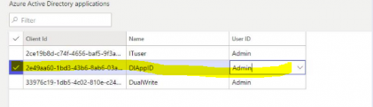

## Self-reference or circular reference failures during initial synchronization

You might receive an error messages if any of your mappings have self-references or circular references. The errors fall into these categories:

- [Errors in the Vendors V2–to–msdyn_vendors table mapping](#error-vendor-map)
- [Errors in the Customers V3–to–Accounts table mapping](#error-customer-map)

## <a id="error-vendor-map"></a>Resolve errors in the Vendors V2–to–msdyn_vendors table mapping

You might encounter initial synchronization errors for the mapping of **Vendors V2** to **msdyn\_vendors** if the tables have existing rows where there are values in the **PrimaryContactPersonId** and **InvoiceVendorAccountNumber** columns. These errors occur because **InvoiceVendorAccountNumber** is a self-referencing column, and **PrimaryContactPersonId** is a circular reference in the vendor mapping.

The error messages that you receive has the following form.

*Couldn't resolve the guid for the field: \<field\>. The lookup wasn't found: \<value\>. Try this URL(s) to check if the reference data exists: `https://focdsdevtest2.crm.dynamics.com/api/data/v9.0/<entity>?$select=<field>&$filter=<field> eq <value>`*

Here are some examples:

- *Couldn't resolve the guid for the field: msdyn\_vendorprimarycontactperson.msdyn\_contactpersonid. The lookup wasn't found: 000056. Try this URL(s) to check if the reference data exists: `https://focdsdevtest2.crm.dynamics.com/api/data/v9.0/contacts?$select=msdyn_contactpersonid.contactid&$filter=msdyn_contactpersonid eq '000056'`*
- *Couldn't resolve the guid for the field: msdyn\_invoicevendoraccountnumber.msdyn\_vendoraccountnumber. The lookup wasn't found: V24-1. Try this URL(s) to check if the reference data exists: `https://focdsdevtest2.crm.dynamics.com/api/data/v9.0/msdn_vendors?$select=msdyn_vendoraccountnumber,msdyn_vendorid&$filter=msdyn_vendoraccountnumber eq 'V24-1'`*

If any rows in the vendor table have values in the **PrimaryContactPersonId** and **InvoiceVendorAccountNumber** columns, follow these steps to complete the initial synchronization.

1. In the finance and operations app, delete the **PrimaryContactPersonId** and **InvoiceVendorAccountNumber** columns from the mapping, and then save the mapping.

    1. On the dual-write mapping page for **Vendors V2 (msdyn\_vendors)**, on the **Table mappings** tab, in the left filter, select **finance and operations apps.Vendors V2**. In the right filter, select **Sales.Vendor**.
    2. Search for **primarycontactperson** to find the **PrimaryContactPersonId** source column.
    3. Select **Actions**, and then select **Delete**.

        

    4. Repeat these steps to delete the **InvoiceVendorAccountNumber** column.

        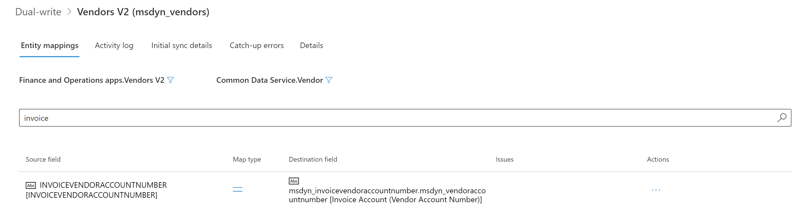

    5. Save your changes to the mapping.

2. Turn off change tracking for the **Vendors V2** table.

    1. In the **Data management** workspace, select the **Data tables** tile.
    2. Select the **Vendors V2** table.
    3. On the Action Pane, select **Options**, and then select **Change tracking**.

        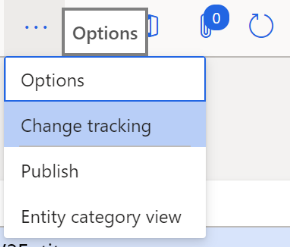

    4. Select **Disable Change Tracking**.

        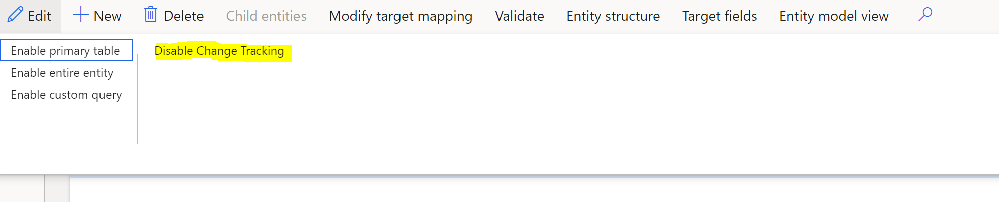

3. Run initial synchronization for the **Vendors V2 (msdyn\_vendors)** mapping. The initial synchronization should run successfully, without any errors.
4. Run initial synchronization for the **CDS Contacts V2 (contacts)** mapping. You must sync this mapping if you want to sync the primary contact column on the vendors table, because initial synchronization must also be done for the contact rows.
5. Add the **PrimaryContactPersonId** and **InvoiceVendorAccountNumber** columns back to the **Vendors V2 (msdyn\_vendors)** mapping, and then save the mapping.
6. Run initial synchronization again for the **Vendors V2 (msdyn\_vendors)** mapping. Because change tracking is turned off, all the rows are synced.
7. Turn change tracking back on for the **Vendors V2** table.

## <a id="error-customer-map"></a>Resolve errors in the Customers V3–to–Accounts table mapping

You might encounter initial synchronization errors for the mapping of **Customers V3** to **Accounts** if the tables have existing rows where there are values in the **ContactPersonID** and **InvoiceAccount** columns. These errors occur because **InvoiceAccount** is a self-referencing column, and **ContactPersonID** is a circular reference in the vendor mapping.

The error messages that you receive has the following form.

*Couldn't resolve the guid for the field: \<field\>. The lookup wasn't found: \<value\>. Try this URL(s) to check if the reference data exists: `https://focdsdevtest2.crm.dynamics.com/api/data/v9.0/<entity>?$select=<field>&$filter=<field> eq <value>`*

Here are some examples:

- *Couldn't resolve the guid for the field: primarycontactid.msdyn\_contactpersonid. The lookup wasn't found: 000056. Try this URL(s) to check if the reference data exists: `https://focdsdevtest2.crm.dynamics.com/api/data/v9.0/contacts?$select=msdyn_contactpersonid.contactid&$filter=msdyn_contactpersonid eq '000056'`*
- *Couldn't resolve the guid for the field: msdyn\_billingaccount.accountnumber. The lookup wasn't found: 1206-1. Try this URL(s) to check if the reference data exists: `https://focdsdevtest2.crm.dynamics.com/api/data/v9.0/accounts?$select=accountnumber.account&$filter=accountnumber eq '1206-1'`*

If any rows in the customer table have values in the **ContactPersonID** and **InvoiceAccount** columns, follow these steps to complete the initial synchronization. You can use this approach for any out-of-box tables, such **Accounts** and **Contacts**.

1. In the finance and operations app, delete the **ContactPersonID** and **InvoiceAccount** columns from the **Customers V3 (accounts)** mapping, and then save the mapping.

    1. On the dual-write mapping page for **Customers V3 (accounts)**, on the **Table mappings** tab, in the left filter, select **finance and operations app.Customers V3**. In the right filter, select **Dataverse.Account**.
    2. Search for **contactperson** to find the **ContactPersonID** source column.
    3. Select **Actions**, and then select **Delete**.

        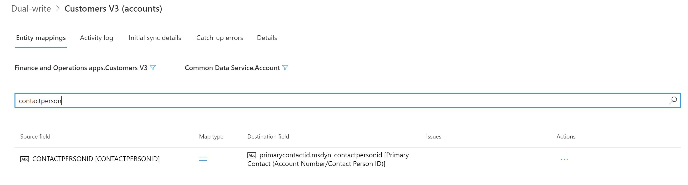

    4. Repeat these steps to delete the **InvoiceAccount** column.

        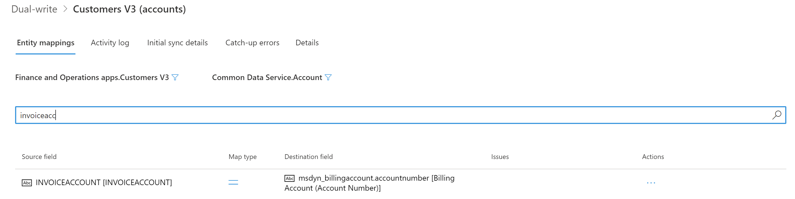

    5. Save your changes to the mapping.

2. Turn off change tracking for the **Customers V3** table.

    1. In the **Data management** workspace, select the **Data tables** tile.
    2. Select the **Customers V3** table.
    3. On the Action Pane, select **Options**, and then select **Change tracking**.

        

    4. Select **Disable Change Tracking**.

        

3. Run initial synchronization for the **Customers V3 (Accounts)** mapping. The initial synchronization should run successfully, without any errors.
4. Run initial synchronization for the **CDS Contacts V2 (contacts)** mapping.

    > [!NOTE]
    > There are two maps that have the same name. Be sure to select the map that has the following description on the **Details** tab: **Dual-write template for sync between FO.CDS Vendor Contacts V2 to CDS.Contacts. Requires new package \[Dynamics365SupplyChainExtended\].**

5. Add the **InvoiceAccount** and **ContactPersonId** columns back to the **Customers V3 (Accounts)** mapping, and then save the mapping. Both the **InvoiceAccount** column and the **ContactPersonId** column are now part of live synchronization mode again. In the next step, you do the initial synchronization for these columns.
6. Run initial synchronization again for the **Customers V3 (Accounts)** mapping. Because change tracking is turned off, the data for **InvoiceAccount** and **ContactPersonId** is synced from the finance and operations app to Dataverse.
7. To sync the data for **InvoiceAccount** and **ContactPersonId** from Dataverse to the finance and operations app, you must use a data integration project.

    1. In Power Apps, create a data integration project between the **Sales.Account** and **finance and operations apps.Customers V3** tables. The data direction must be from Dataverse to the finance and operations app. Because **InvoiceAccount** is a new attribute in dual-write, you might want to skip initial synchronization for it. For more information, see [Integrate data into Dataverse](/power-platform/admin/data-integrator).

        The following illustration shows a project that updates **CustomerAccount** and **ContactPersonId**.

        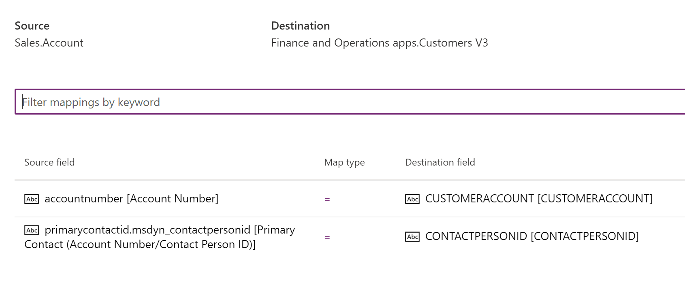

    2. Add the company criteria in the filter on the Dataverse side, so that only rows that match the filter criteria is updated in the finance and operations app. To add a filter, select the filter button. Then, in the **Edit query** dialog box, you can add a filter query such as **\_msdyn\_company\_value eq '\<guid\>'**.

        > [NOTE]
        > If the filter button isn't present, create a support ticket to ask the data integration team to enable the filter capability on your tenant.

        If you don't enter a filter query for **\_msdyn\_company\_value**, all the rows are synced.

        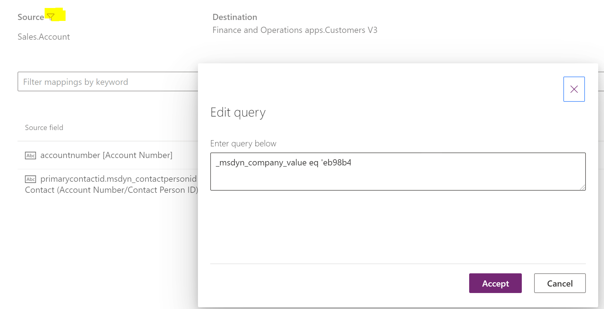

    The initial synchronization of the rows is now completed.

8. In the finance and operations app, turn change tracking back on for the **Customers V3** table.

## Initial sync failure on maps with more than 10 lookup fields

You might receive the following error message when you try run an initial sync failure on **Customers V3 - Accounts**, **Sales orders** mappings, or any map with more than 10 lookup fields:

*CRMExport: Package execution complete. Error Description 5 Attempts to get data from https://xxxxx//datasets/yyyyy/tables/accounts/items?$select=accountnumber, address2_city, address2_country, ... (msdyn_company/cdm_companyid eq 'ID')&$orderby=accountnumber asc failed.*

Because of the lookup limitation on the query, the initial sync fails when the entity mapping contains more than 10 lookups. For more information, see [Retrieve related table records with a query](/powerapps/developer/common-data-service/webapi/retrieve-related-entities-query).

To fix this issue, follow these steps:

1. Remove optional lookup fields from the dual-write entity map so that the number of lookups is 10 or fewer.
2. Save the map and do the initial sync.
3. When the initial sync for the first step is successful, add the remaining lookup fields and remove the lookup fields that you synced in first step. Make sure that the number of lookup fields is 10 or fewer. Save the map and run the initial sync.
4. Repeat these steps until all the lookup fields are synced.
5. Add all the lookup fields back to the map, save the map, and run the map with **Skip initial sync**.

This process enables the map for live sync mode.

## Known issue during initial sync of Party postal addresses and party electronic addresses

You might receive the following error message when you try to run the initial syn of Party postal addresses and party electronic addresses:

*Party number couldn't be found in Dataverse.*

There's a range set on **DirPartyCDSEntity** in finance and operations apps that filters parties of type **Person** and **Organization**. As a result, an initial sync of the **CDS Parties – msdyn_parties** mapping doesn't sync parties of other types, including **Legal Entity** and **Operating Unit**. When the initial sync runs for **CDS Party postal addresses (msdyn_partypostaladdresses)** or **Party Contacts V3 (msdyn_partyelectronicaddresses)** you might receive the error.

We're working on a fix to remove the party type range on the finance and operations entity so that parties of all types can synchronize to Dataverse successfully.

## Are there any performance issues while running initial sync for Customers or Contacts data?

If you have run the initial sync for **Customer** data and have the **Customer** maps running and then you are run the initial sync for **Contacts** data, there might be performance issues during inserts and updates to the **LogisticsPostalAddress** and **LogisticsElectronicAddress** tables for **Contact** addresses. The same global postal address and electronic address tables are tracked for **CustCustomerV3Entity** and **VendVendorV2Entity** and dual-write tries to build more queries to write data to other side. If you have already run the initial sync for **Customer**, then stop the corresponding map while running initial sync for **Contacts** data. Do the same thing for the **Vendor** data. When the initial sync is finished, you can run all the maps by skipping the initial sync.

## Float data type that has a zero value can't be synchronized

Initial synchronization might fail for records that have a zero value for a price field, such as **Fixed payment amount** or **Amount** in the transaction currency. In this case, you receive an error message that resembles the following example:

*An error occurred while validating input parameters: Microsoft.OData.ODataException: Can't convert the literal '000000' to the expected type'Edm.Decimal',...*

The issue is with the **Language locale** value under **Source data formats** in the **Data management** module. Change the value of the **Language locale** field to **en-us**, and then try again.

[!INCLUDE[footer-include](../../../../includes/footer-banner.md)]
