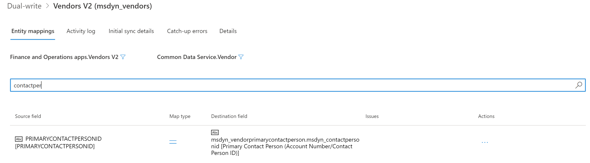

---
# required metadata

title: Troubleshoot issues during initial synchronization
description: This topic provides troubleshooting information that can help you fix issues that might occur during initial synchronization.
author: RamaKrishnamoorthy 
manager: AnnBe
ms.date: 03/16/2020
ms.topic: article
ms.prod: 
ms.service: dynamics-ax-applications
ms.technology: 

# optional metadata

ms.search.form: 
# ROBOTS: 
audience: Application User, IT Pro
# ms.devlang: 
ms.reviewer: rhaertle
# ms.tgt_pltfrm: 
ms.custom: 
ms.assetid: 
ms.search.region: global
ms.search.industry: 
ms.author: ramasri
ms.dyn365.ops.version: 
ms.search.validFrom: 2020-03-16

---

# Troubleshoot issues during initial synchronization

[!include [banner](../../includes/banner.md)]

[!include [rename-banner](~/includes/cc-data-platform-banner.md)]

This topic provides troubleshooting information for dual-write integration between Finance and Operations apps and Dataverse. Specifically, it provides information that can help you fix issues that might occur during initial synchronization.

> [!IMPORTANT]
> Some of the issues that this topic addresses might require either the system admin role or Microsoft Azure Active Directory (Azure AD) tenant admin credentials. The section for each issue explains whether a specific role or credentials are required.

## Check for initial synchronization errors in a Finance and Operations app

After you enable the mapping templates, the status of the maps should be **Running**. If the status is **Not running**, errors occurred during initial synchronization. To view the errors, select the **Initial sync details** tab on the **Dual-write** page.


## You can't complete initial synchronization: 400 Bad Request

**Required role to fix the issue:** System admin

You might receive the following error message when you try to run the mapping and initial synchronization:

*(\[Bad Request\], The remote server returned an error: (400) Bad Request.), AX export encountered an error*

Here is an example of the full error message.

```console
Dual write Initial Sync completed with status: Error. Following are the details:
Executed leg: From AX Financial dimensions to CRM msdyn_dimensionattributes
with exported records count: 0, ImportRecordsErrorCount: 0,
ImportRecordsInsertedCount: 0 and ImportRecordsUpdatedCount: 0
ErrorsDetails:
Dual write Initial sync failed
Message: ([Bad Request], The remote server returned an error: (400) Bad Request.), AX export encountered an error
Stacktrace: at
Microsoft.Dynamics.Integrator.QueryGenerator.AxClient.\<ExportAxPackage\>d__16.MoveNext()
in X:\\bt\\1024532\\repo\\src\\Core\\QueryGenerator\\AxClient.cs:line 265
\--- End of stack trace from previous location where exception was thrown ---
at System.Runtime.ExceptionServices.ExceptionDispatchInfo.Throw()
at System.Runtime.CompilerServices.TaskAwaiter.HandleNonSuccessAndDebuggerNotification(Task task)
at Microsoft.D365.ServicePlatform.Context.ServiceContext.Activity.\<ExecuteAsync\>d__11\`2.MoveNext()
\--- End of stack trace from previous location where exception was thrown ---
```

If this error occurs consistently, and you can't complete the initial synchronization, follow these steps to fix the issue.

1. Sign in to the virtual machine (VM) for the Finance and Operations app.
2. Open Microsoft Management Console.
3. In the **Services** pane, make sure that the Microsoft Dynamics 365 Data import export framework service is running. Restart it if it has been stopped, because the initial synchronization requires it.

## Initial synchronization error: 403 Forbidden

You might receive the following error message during initial synchronization:

*(\[Forbidden\], The remote server returned an error: (403) Forbidden.), AX export encountered an error*

To fix the issue, follow these steps.

1. Sign in to the Finance and Operations app.
2. On the **Azure Active Directory applications** page, delete the **DtAppID** client, and then add it again.


## Self-reference or circular reference failures during initial synchronization

You might receive an error messages if any of your mappings have self-references or circular references. The errors fall into these categories:

- [Errors in the Vendors V2–to–msdyn_vendors table mapping](#error-vendor-map)
- [Errors in the Customers V3–to–Accounts table mapping](#error-customer-map)

## <a id="error-vendor-map"></a>Resolve errors in the Vendors V2–to–msdyn_vendors table mapping

You might encounter initial synchronization errors for the mapping of **Vendors V2** to **msdyn\_vendors** if the tables have existing rows where there are values in the **PrimaryContactPersonId** and **InvoiceVendorAccountNumber** fields. These errors occur because **InvoiceVendorAccountNumber** is a self-referencing field, and **PrimaryContactPersonId** is a circular reference in the vendor mapping.

The error messages that you receive will have the following form.

*Couldn't resolve the guid for the field: \<field\>. The lookup was not found: \<value\>. Try this URL(s) to check if the reference data exists: `https://focdsdevtest2.crm.dynamics.com/api/data/v9.0/<entity>?$select=<field>&$filter=<field> eq <value>`*

Here are some examples:

- *Couldn't resolve the guid for the field: msdyn\_vendorprimarycontactperson.msdyn\_contactpersonid. The lookup was not found: 000056. Try this URL(s) to check if the reference data exists: `https://focdsdevtest2.crm.dynamics.com/api/data/v9.0/contacts?$select=msdyn_contactpersonid.contactid&$filter=msdyn_contactpersonid eq '000056'`*
- *Couldn't resolve the guid for the field: msdyn\_invoicevendoraccountnumber.msdyn\_vendoraccountnumber. The lookup was not found: V24-1. Try this URL(s) to check if the reference data exists: `https://focdsdevtest2.crm.dynamics.com/api/data/v9.0/msdn_vendors?$select=msdyn_vendoraccountnumber,msdyn_vendorid&$filter=msdyn_vendoraccountnumber eq 'V24-1'`*

If any rows in the vendor entity have values in the **PrimaryContactPersonId** and **InvoiceVendorAccountNumber** fields, follow these steps to complete the initial synchronization.

1. In the Finance and Operations app, delete the **PrimaryContactPersonId** and **InvoiceVendorAccountNumber** fields from the mapping, and then save the mapping.

    1. On the dual-write mapping page for **Vendors V2 (msdyn\_vendors)**, on the **Table mappings** tab, in the left filter, select **Finance and Operations apps.Vendors V2**. In the right filter, select **Sales.Vendor**.
    2. Search for **primarycontactperson** to find the **PrimaryContactPersonId** source field.
    3. Select **Actions**, and then select **Delete**.

        

    4. Repeat these steps to delete the **InvoiceVendorAccountNumber** field.

        

    5. Save your changes to the mapping.

2. Turn off change tracking for the **Vendors V2** entity.

    1. In the **Data management** workspace, select the **Data tables** tile.
    2. Select the **Vendors V2** entity.
    3. On the Action Pane, select **Options**, and then select **Change tracking**.

        

    4. Select **Disable Change Tracking**.

        

3. Run initial synchronization for the **Vendors V2 (msdyn\_vendors)** mapping. The initial synchronization should run successfully, without any errors.
4. Run initial synchronization for the **CDS Contacts V2 (contacts)** mapping. You must sync this mapping if you want to sync the primary contact field on the vendors entity, because initial synchronization must also be done for the contact rows.
5. Add the **PrimaryContactPersonId** and **InvoiceVendorAccountNumber** fields back to the **Vendors V2 (msdyn\_vendors)** mapping, and then save the mapping.
6. Run initial synchronization again for the **Vendors V2 (msdyn\_vendors)** mapping. Because change tracking is turned off, all the rows will be synced.
7. Turn change tracking back on for the **Vendors V2** entity.

## <a id="error-customer-map"></a>Resolve errors in the Customers V3–to–Accounts table mapping

You might encounter initial synchronization errors for the mapping of **Customers V3** to **Accounts** if the tables have existing rows where there are values in the **ContactPersonID** and **InvoiceAccount** fields. These errors occur because **InvoiceAccount** is a self-referencing field, and **ContactPersonID** is a circular reference in the vendor mapping.

The error messages that you receive will have the following form.

*Couldn't resolve the guid for the field: \<field\>. The lookup was not found: \<value\>. Try this URL(s) to check if the reference data exists: `https://focdsdevtest2.crm.dynamics.com/api/data/v9.0/<entity>?$select=<field>&$filter=<field> eq <value>`*

Here are some examples:

- *Couldn't resolve the guid for the field: primarycontactid.msdyn\_contactpersonid. The lookup was not found: 000056. Try this URL(s) to check if the reference data exists: `https://focdsdevtest2.crm.dynamics.com/api/data/v9.0/contacts?$select=msdyn_contactpersonid.contactid&$filter=msdyn_contactpersonid eq '000056'`*
- *Couldn't resolve the guid for the field: msdyn\_billingaccount.accountnumber. The lookup was not found: 1206-1. Try this URL(s) to check if the reference data exists: `https://focdsdevtest2.crm.dynamics.com/api/data/v9.0/accounts?$select=accountnumber.account&$filter=accountnumber eq '1206-1'`*

If any rows in the customer entity have values in the **ContactPersonID** and **InvoiceAccount** fields, follow these steps to complete the initial synchronization. You can use this approach for any out-of-box tables, such **Accounts** and **Contacts**.

1. In the Finance and Operations app, delete the **ContactPersonID** and **InvoiceAccount** fields from the **Customers V3 (accounts)** mapping, and then save the mapping.

    1. On the dual-write mapping page for **Customers V3 (accounts)**, on the **Table mappings** tab, in the left filter, select **Finance and Operations app.Customers V3**. In the right filter, select **Dataverse.Account**.
    2. Search for **contactperson** to find the **ContactPersonID** source field.
    3. Select **Actions**, and then select **Delete**.

        

    4. Repeat these steps to delete the **InvoiceAccount** field.

        

    5. Save your changes to the mapping.

2. Turn off change tracking for the **Customers V3** entity.

    1. In the **Data management** workspace, select the **Data tables** tile.
    2. Select the **Customers V3** entity.
    3. On the Action Pane, select **Options**, and then select **Change tracking**.

        

    4. Select **Disable Change Tracking**.

        

3. Run initial synchronization for the **Customers V3 (Accounts)** mapping. The initial synchronization should run successfully, without any errors.
4. Run initial synchronization for the **CDS Contacts V2 (contacts)** mapping.

    > [!NOTE]
    > There are two maps that have the same name. Be sure to select the map that has the following description on the **Details** tab: **Dual-write template for sync between FO.CDS Vendor Contacts V2 to CDS.Contacts. Requires new package \[Dynamics365SupplyChainExtended\].**

5. Add the **InvoiceAccount** and **ContactPersonId** fields back to the **Customers V3 (Accounts)** mapping, and then save the mapping. Both the **InvoiceAccount** field and the **ContactPersonId** field are now part of live synchronization mode again. In the next step, you will do the initial synchronization for these fields.
6. Run initial synchronization again for the **Customers V3 (Accounts)** mapping. Because change tracking is turned off, the data for **InvoiceAccount** and **ContactPersonId** will be synced from the Finance and Operations app to Dataverse.
7. To sync the data for **InvoiceAccount** and **ContactPersonId** from Dataverse to the Finance and Operations app, you must use a data integration project.

    1. In Power Apps, create a data integration project between the **Sales.Account** and **Finance and Operations apps.Customers V3** tables. The data direction must be from Dataverse to the Finance and Operations app. Because **InvoiceAccount** is a new attribute in dual-write, you might want to skip initial synchronization for it. For more information, see [Integrate data into Dataverse](https://docs.microsoft.com/power-platform/admin/data-integrator).

        The following illustration shows a project that updates **CustomerAccount** and **ContactPersonId**.

        

    2. Add the company criteria in the filter on the Dataverse side, so that only rows that match the filter criteria will be updated in the Finance and Operations app. To add a filter, select the filter button. Then, in the **Edit query** dialog box, you can add a filter query such as **\_msdyn\_company\_value eq '\<guid\>'**. 

        > [NOTE]
        > If the filter button isn't present, create a support ticket to ask the data integration team to enable the filter capability on your tenant.

        If you don't enter a filter query for **\_msdyn\_company\_value**, all the rows will be synced.

        

    The initial synchronization of the rows is now completed.

8. In the Finance and Operations app, turn change tracking back on for the **Customers V3** entity.
