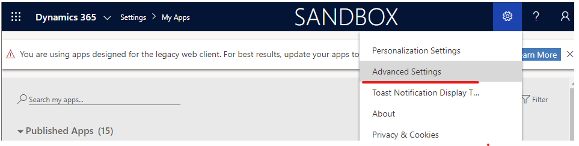
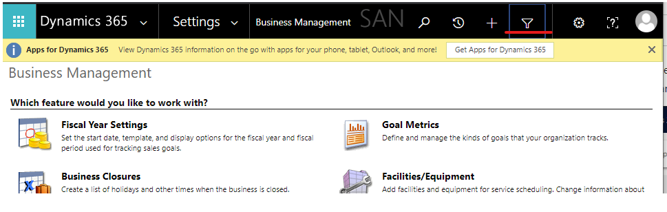
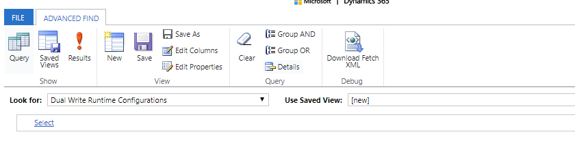
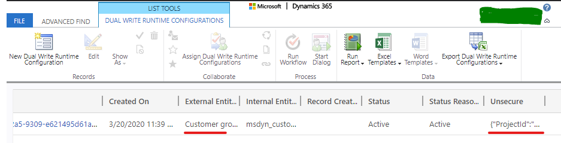
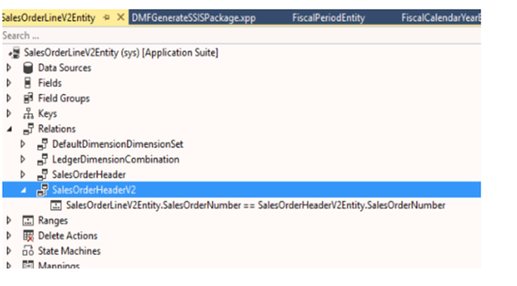

---
# required metadata

title: Troubleshoot live synchronization issues
description: This topic provides troubleshooting information that can help you fix issues with live synchronization.
author: RamaKrishnamoorthy 
ms.date: 03/16/2020
ms.topic: article
ms.prod: 
ms.technology: 

# optional metadata

ms.search.form: 
# ROBOTS: 
audience: Application User, IT Pro
# ms.devlang: 
ms.reviewer: rhaertle
# ms.tgt_pltfrm: 
ms.custom: 
ms.assetid: 
ms.search.region: global
ms.search.industry: 
ms.author: ramasri
ms.dyn365.ops.version: 
ms.search.validFrom: 2020-03-16

---

# Troubleshoot live synchronization issues

[!include [banner](../../includes/banner.md)]

[!include [rename-banner](~/includes/cc-data-platform-banner.md)]

This topic provides troubleshooting information for dual-write integration between Finance and Operations apps and Dataverse. Specifically, it provides information that can help you fix issues with live synchronization.

> [!IMPORTANT]
> Some of the issues that this topic addresses might require either the system admin role or Microsoft Azure Active Directory (Azure AD) tenant admin credentials. The section for each issue explains whether a specific role or credentials are required.

## Live synchronization throws a 403 Forbidden error when you create a row in a Finance and Operations app

You might receive the following error message when you create a row in a Finance and Operations app:

*\[{\\"error\\":{\\"code\\":\\"0x80072560\\",\\"message\\":\\"The user is not a
member of the organization.\\"}}\], The remote server returned an error: (403)
Forbidden."}}".*

To fix the issue, follow the steps in [System requirements and prerequisites](requirements-and-prerequisites.md). To complete those steps, the dual-write application users who are created in Dataverse must have the system admin role. The default owning team must also have the system admin role.

## Live synchronization for any table consistently throws a similar error when you create a row in a Finance and Operations app

**Required role to fix the issue:** System admin

You might receive an error message like the following every time that you try to save table data in a Finance and Operations app:

*Cannot save the changes to the database. Unit of Work can not commit transaction. Unable to write data to entity uoms. Writes to UnitOfMeasureEntity failed with error message Unable to sync with entity uoms.*

To fix the issue, you must make sure that the prerequisite reference data exists in both the Finance and Operations app and Dataverse. For example, if the customer that you're in the Finance and Operations app belongs to a specific customer group, make sure that the customer group exists in Dataverse.

If data exists on both sides, and you've confirmed that the issue isn't data-related, follow these steps.

a.	Open the DualWriteProjectConfigurationEntity using excel addin. An easy way to do it is to enable design mode in F&O excel addin and add the DualWriteProjectConfigurationEntity to the sheet. Refer to https://docs.microsoft.com/en-us/dynamics365/fin-ops-core/dev-itpro/office-integration/use-excel-add-in  for more info on excel addins
b.	Select the records for the dual write map/project that has the issue and delete. There will be 2 records for every dual write mapping. Publish the changes using the excel addin. PS: Publishing changes is important as that step deletes the records from the entity and underlying tables.

## Handle read or write privilege errors when you create data in a Finance and Operations app

You might receive a "Bad Request" error message that resembles the following example when you create data in a Finance and Operations app.

To fix the issue, you must assign the correct security role to the team of the mapped Dynamics 365 Sales or Dynamics 365 Customer Service business unit to enable the missing privilege.

1. In the Finance and Operations app, find the business unit that is mapped in the Data Integration connection set.

    

2. Sign in to the environment in the customer engagement app, navigate to **Setting \> Security**, and find the team of the mapped business unit.

    

3. Open the page for the team for editing, and then select **Manage roles** to open the **Manage Team Roles** dialog box.

    

4. Assign the role that has the read/write privilege for the relevant tables, and then select **OK**.

## Fix synchronization issues in an environment that has a recently changed Dataverse environment

**Required role to fix the issue:** System admin

You might receive the following error message when you create data in a Finance and Operations app:

*{"entityName":"CustCustomerV3Entity","executionStatus":2,"fieldResponses":\[\],"recordResponses":\[{"errorMessage":"**Unable
to generate payload for entity
CustCustomerV3Entity**","logDateTime":"2019-08-27T18:51:52.5843124Z","verboseError":"Payload
creation failed with error Invalid URI: The URI is
empty."}\],"isErrorCountUpdated":true}*

Here is what the error looks like in the customer engagement app:

*An unexpected error occurred from ISV code. (ErrorType = ClientError) Unexpected exception from plug-in (Execute): Microsoft.Dynamics.Integrator.DualWriteRuntime.Plugins.PostCommitPlugin: System.Exception: failed to process entity account - (A connection attempt failed because the connected party did not properly respond after a period of time, or established connection failed because connected host has failed to respond*

This error occurs when the Dataverse environment is incorrectly reset at the same time that you try to create data in the Finance and Operations app.

To fix the issue, follow these steps.

1.	Open the DualWriteProjectConfigurationEntity using excel addin. An easy way to do it is to enable design mode in F&O excel addin and add the DualWriteProjectConfigurationEntity to the sheet. Refer to https://docs.microsoft.com/en-us/dynamics365/fin-ops-core/dev-itpro/office-integration/use-excel-add-in  for more info on excel addins
2.	Select the records for the dual write map/project that has the issue and delete. There will be 2 records for every dual write mapping. Publish the changes using the excel addin. PS: Publishing changes is important as that step deletes the records from the entity and underlying tables. 

To make sure that there are no issues when the same F&O or Dataverse environments are re-linked to other environments also make sure that there are no left over dual write configurations.

Customs needs to log on to CDS and FinOps separately and follow the instructions below to do a full clean-up.

> [!IMPORTANT]
> If customer has relinked the environments, they must STOP all the entity maps before continuing with the mitigation steps 

**Dataverse**

1.	Goto Dataverse env e.g. https://*****.crm.dynamics.com/
2.	Goto Advanced Settings -> Advanced Find -> Select DualWrite Runtime Configuration -> Select the column you want view -> Click Results to view the configurations

 
 
 
 

3.  Delete all the instances

**FinOps**

1.	Open the DualWriteProjectConfigurationEntity using excel addin. An easy way to do it is to enable design mode in F&O excel addin and add the DualWriteProjectConfigurationEntity to the sheet. Refer to https://docs.microsoft.com/en-us/dynamics365/fin-ops-core/dev-itpro/office-integration/use-excel-add-in  for more info on excel addins
2.	Refresh the data and check for any remaining project configurations on the FnO environment.
3.	Select the records and delete. Publish the changes using the excel addin. PS: Publishing changes is important as that step deletes the records from the entity and underlying tables.

## Issues with live sync after doing a full database copy

After you perform a full DB copy from one system to another, you may experience errors like the one below when you try to do a database operation.
    
**Error** 
"SecureConfig Organization (???) does not match actual CRM Organization (???)"

**Cause**
The error is thrown from dual-write runtime plug-in to ensure dual-write configuration set up in one system cannot be used in another.

**Workaround**
Customer should delete all the records in msdyn_dualwriteruntimeconfig entity after DB restore. Please follow the instructions on https://docs.microsoft.com/en-us/dynamics365/fin-ops-core/dev-itpro/data-entities/dual-write/relink-environments.

## Live sync issues due to wrong filter syntax on the dual write maps

**Query Filter guidance on Finance and Operations apps for Dual write**
Eventhough the query expression on the dual-write map filter is syntactically correct per guidelines [https://docs.microsoft.com/en-us/dynamics365/fin-ops-core/fin-ops/get-started/advanced-filtering-query-options], it may not work as expected. It is because the filter expression is on an entity and not an indivisual data source of a query object. So the data from the entity sql view matters which is the underlying data model backing the entity.

**Example**

Query entity = PROJECTENTITY

Query expression = (ParentProject == "")

Expected result: Projects with no parent are filtered out. 

However, the above filter does not work since the filter translates to a sql query which looks like the following:

SELECT T1.RECID,T1.MODIFIEDDATETIME,T1.RECVERSION,T1.RECID,T1.DIMENSION,T1.LOCATION,T1.PROJECTCONTROLLER,T1.PROJECTID,T1.PROJECTMANAGER,T1.REFERENCE,T1.SALESMANAGER,T1.SCHEDULED,T1.RECVERSION#8,T1.RECVERSION#7,T1.RECVERSION#6,T1.RECVERSION#5,T1.RECVERSION#4,T1.RECVERSION#3,T1.RECVERSION#2,T1.RECID#8,T1.RECID#7,T1.RECID#6,T1.RECID#5,T1.RECID#4,T1.RECID#3,T1.RECID#2,T1.PARTITION FROM PROJECTENTITY T1 WHERE (((((((((((PARTITION=5637144576) AND (DATAAREAID=N'usmf')) AND ((PARTITION#2=5637144576) OR (PARTITION#2 IS NULL))) AND ((PARTITION#3=5637144576) OR (PARTITION#3 IS NULL))) AND ((PARTITION#4=5637144576) OR (PARTITION#4 IS NULL))) AND ((PARTITION#5=5637144576) OR (PARTITION#5 IS NULL))) AND ((PARTITION#6=5637144576) OR (PARTITION#6 IS NULL))) AND ((PARTITION#7=5637144576) OR (PARTITION#7 IS NULL))) AND ((PARTITION#8=5637144576) OR (PARTITION#8 IS NULL))) AND ((DATAAREAID#8=N'usmf') OR (DATAAREAID#8 IS NULL))) AND (PARENTPROJECT='')) ORDER BY T1.PROJECTID

Actual result: The parentProject field evaluates to null which is not the same as empty string. 

This is the reason why the query filter does not return any valid result. 

**Solution**

To circumvent the issue the entity would need additional computed column which can be added in extension model, backed by a logic to handle nulls to empty string.

SysComputedColumn::if(SysComputedColumn::isNullExpression(ParentProject), SysComputedColumn::returnLiteral(""), fieldName);

Use the filter on the new computed column instead of the default column.

**Evaluating the filter**

To evaluate the filter in a development environment, you can use following x++ code to validate the results. Following needs to be run as a standalone job in AX. This script can be used to evaluate different kinds of filters applicable for an entity before using them on dual-write maps.

var entityName = "PROJECTENTITY";

var filterExpression = '(ParentProject == "")';

Query query = new Query();

query.literals(NoYes::Yes); 

QueryBuildDataSource qbd = query.addDataSource(tablename2id(entityName));

qbd.addRange(fieldname2id(qbd.table(),identifierStr(RecVersion))).value(filterExpression);

qbd.addSelectionField(fieldname2id(qbd.table(),identifierStr(RecId)));

QueryRun qRun = new QueryRun(query);

// This provides the actual sql statement to execute

var actualSqlStatement = query.getSQLStatement();

while(qRun.next())

{

    var rec = qRun.get(tableName2Id(entityName));
    
}

The sql statement can be run against the DB to evaluate discrepancies if any from the expected result.

## Data from Finance and Operations apps does not sync to Dataverse

When you encounter issues with live sync where only a partial data is synchronized from Finance and Operations apps to Dataverse or data is not synchronized at all, then follow these steps. Note: You must make sure to fix these issues during development itself.

**Pre-requisites**

•	 Make sure your custom changes are written with in a single transaction scope. 

•	 doinsert(), doUpdate(), recordset() operations and records where skipBusinessEvents(true) is marked are not handled by business events and dual-write framework. So if your code is inside these functions, then dual-write will not be triggered.

•	  Business events must be registered for the data source which is mapped. There can be data sources which are outer join and marked as readonly in Finance and Operations apps. These data sources are not generally tracked.

•	  Changes will be triggered only if the modifications are on the mapped fields. Unmapped field modification will not trigger dual-write.

•	  Filter evaluation should provide valid result.

**Troubleshooting steps**

•	  Check field mappings on the dual-write admin page. If the field is not mapped from Finance and Operations apps to Dataverse, then that field will not be tracked. Say for example, in the following screenshot, the field "Description" is tracked from Dataverse but not from Finance and Operations apps. So any changes to that field inside Finance and Operations apps will not be tracked.

 
    
•	  Check if the data source is tracked in business events definition. From screenshot below any field from the DefaultDimensionDAVs and underlying table wont be tracked for changes.
    
 
    
•	  The mapped table fields reflect in the businesseventsdefinition table as shown below. In case you don't see the field you are looking for in the query result, then it will not be triggerd by dual-write.
    
 
  
**Here is a sample scenario of an address field update not sent from  Finance and Operations apps to Dataverse**
In Finance and Operations apps, when there is an update to the address for a contact record, the change does not sync to Dataverse, then there must not have been a record in BusinessEventsDefinition table with the combination of the table affected and the entity.

This is because smmContactpersonCDSV2Entity does not have LogisticsPostalAddress table directly as the data source. smmContactpersonCDSV2Entity has smmContactPersonV2Entity as the data source and then smmContactPersonV2Entity has LogisticsPostalAddressBaseEntity as the data source. LogisticsPostalAddress table is data source for LogisticsPostalAddressBaseEntity .
 
This can happen in certain non-standard patterns, such as cases where the table being modified in F&O isn't "obviously" linked to the entity that contains it. For example, on the smmContactPersonCDSV2Entity, the "primary address" stuff is computed based on a bunch of raw code and SQL. The DW framework does its best effort to understand how a change to an underlying table maps back to entities, which is usually sufficient. But in some cases the link is so complex we need to just tell the framework. You have to make sure you have the RecId of the related table available on the entity directly, and then add a static method to say “monitor this table for changes”.  
 
See smmContactPersonCDSV2Entity::getEntityDataSourceToFieldMapping() for such an example. CustCustomerV3entity and VendVendorV2Entity have already been altered to handle this, so you can refer these entities as well for this pattern.
 
In this example the address update on the contact does not trigger an update to Dataverse and below are the steps followed to resolve this issue:
 
Add a PrimaryPostalAddressRecId field to the smmContactPersonV2Entity in AppMU. Make it internal.

1.	Add the same field to smmContactPersonCDSV2Entity

2.	Add this method to the smmContactPersonCDSV2Entity class.

    public static container getEntityDataSourceToFieldMapping(container mapping)
    {
        mapping += [[tablestr(smmContactPersonCDSV2Entity), tablenum(LogisticsPostalAddress), fieldstr(smmContactPersonCDSV2Entity, PrimaryPostalAddressRecId)]];
 
        return mapping;
    }
 
3.	Sync DB and build the application.

4.	Stop all the dual-write maps that are created on the entity smmContactPersonCDSV2Entity.

5.	Start the map and you will see the new table (LogisticsPostalAddress in this example) you have started to track with the above code in the column 'RefTableName' for the row with refentityname 'smmContactPersonCDSV2Entity' in the BusinessEventsDefinition table.

     
## Error while creating a record where multiple records are sent from FinOps to CDS in the same batch

The customer complains that during Live-sync from F&O to CDS you get a bad request for a record that is getting created part of the current transaction.

**Cause:**
For any transaction, F&O creates data in a batch and sends it as a batch to CDS. If there are two records that are getting created as part of the same transaction and they reference each other, in that case the F&O users will see an error like this:
Unable to write data to entity aaa_fundingsources.Unable to lookup ebecsfs_contracts with values {PC000000212,c27258c0-99a0-418b-83da-7718707852d8}.Unable to lookup aaa_fundingsources with values {PC000000212,80297829-5c83-ea11-a811-000d3a6aa9f7,c27258c0-99a0-418b-83da-7718707852d8}.Writes to aaa_fundingsources failed with error message Exception message: The remote server returned an error: (400) Bad Request...

**Mitigation:**    
The customer needs to create Entity relationships within F&O to indicate the Dual-write platform that the two entities are linked and there are relationships that exist between the two records within the same transaction. Here are the details from a document that Sushant has created:

**What this feature provides?**
There are scenarios when multiple entities are modified in F&O or CE as part of a single transaction. If they are all enabled for dual write they need to be posted as a single transaction. If any one of the record fails it rolls back the entire transaction with all the records back to the pre modified state in either side. e.g. Sales order invoicing process in F&O. Invoicing involves multiple entities in a transaction. Sales order header , order line , invoice header and invoice header line. All these are part of one transaction while posting. If Dual write is enabled on all the entities then they should be committed as a single unit of work. If there is a validation failure on any of the lines then the entire transaction is rolled back on F&O and CE. How does the batching work The transaction management and entity modifications are different in CE and F&O. Following is brief explanation of how it works in either direction CE  F&O CE sends a request to F&O with a single payload which has information about the entity modifications and metadata. F&O action creates entity records and commits them as a single transaction. Failures are relayed back to CE which enables CE to rollback transaction on CE. Since entities in F&O are flattened business object abstracting the relationships, any foreign key and surrogate key relationships are resolved within entity runtime framework.

F&O modifications are sent to CE as a batch transaction which are handled as per odata specifications for batching transactions. With CE the entity relationships have to be resolved at runtime. So, in case of related entities the batch request needs some special markers to handle these relations or else the target system will throw a bad request response. e.g. A sales order header and line are created in a single transaction and are related to each other. So, the batch requests need reference from line to the header as part of payload. This marker enables the batch request to commit transaction. To identify the marker the relationships between entities have to be figured out at runtime, in the case above sales order line and header have foreign key relationship on sales order id. This sounds obvious but considering the entities in F&O are complex objects involving various sub entities, views and tables this relationship can be derived from multiple source columns and/or objects. To get this information Dual write batching depends on entity relationships explicitly defined on related entities. So if there are business process in F&O that involves multitude of entities and have to be enabled as batch mode for CE we expect the relationships to be identified and defined on the entity during the development phase.

Appendix An example of entity relationships on entity.

 
 
Many OOB entities will have these relations however scenarios which involve custom entities or customization on entities these relations may be required as part of customization. Details about Odata batching in CE are here Prerequisites F&O to be PU 32 with latest hotfixes and above.

# Troubleshoot live sync issues from FinOps to Dataverse 

## Enable Debug mode for troubleshooting F&O
In Dual write many times F&O will show up errors which are related to CDS instance. Some of the detailed messages could not be logged due to length of the response message and PII information. To enable verbose logging for the errors, use following steps

1.	For all project configurations in F&O there is a flag IsDebugMode on DualWriteProjectConfiguration entity.

2.	Open the entity in Excel addin. An easy way to do it is to enable design mode in F&O excel addin and add the DualWriteProjectConfigurationEntity to the sheet. Refer to https://docs.microsoft.com/en-us/dynamics365/fin-ops-core/dev-itpro/office-integration/use-excel-add-in  for more info on excel addins.

3.	Set the IsDebugMode to Yes on the project in question.

4.	Run the scenario.

5.	The verbose logs are available on DualWriteErrorLog table.

6.	To lookup data on table browser use the following link https://XXXaos.cloudax.dynamics.com/?mi=SysTableBrowser&tableName=  DualWriteErrorLog

7.	Update after KB 4595434 (Available for PU 37 and above) If you have this kb installed then the debug mode will capture more logs.  Detailed Error Message will capture the batch request Formatted as follows { "entityName": "UnitOfMeasureEntity", "externalEntityName": "uoms", "executionStatus": 2, "fieldResponses": [], "recordResponses": [ { "errorMessage": "Request failed with status code InternalServerError and CDS error code : Internal Server Error", "logDateTime": "2020-12-08T00:14:28.2746686Z", "verboseError": "Batch response detailed error {"Message":"ValidateClosed - Db GetCreateConnection() should be closed on End","ExceptionMessage":"ValidateClosed - Db GetCreateConnection() should be closed on End","ExceptionType":"Microsoft.Crm.CrmException","StackTrace":" at Microsoft.Crm.CrmDbConnection.ValidateClosed(Boolean raiseException)\r\n at Microsoft.Crm.LegacySqlDataAccessContextImplementation.EndRequest()\r\n at Microsoft.Crm.SqlDataAccessContext.OnEndRequest()\r\n at Microsoft.Crm.BusinessEntities.ExecutionContext.OnEndRequest()\r\n at Microsoft.Crm.Extensibility.OData.CrmODataBatchHandler.<ExecuteChangeSetAsync>d__10.MoveNext()\r\n--- End of stack trace from previous location where exception was thrown ---\r\n at System.Runtime.ExceptionServices.ExceptionDispatchInfo.Throw()\r\n at Microsoft.Crm.Extensibility.OData.CrmODataBatchHandler.<ExecuteRequestMessagesImplAsync>d__15.MoveNext()\r\n--- End of stack trace from previous location where exception was thrown ---\r\n at System.Runtime.ExceptionServices.ExceptionDispatchInfo.Throw()\r\n at System.Runtime.CompilerServices.TaskAwaiter.HandleNonSuccessAndDebuggerNotification(Task task)\r\n at Microsoft.Crm.Extensibility.OData.CrmODataBatchHandler.<>c__DisplayClass8_0.<<ExecuteRequestMessagesAsync>b__0>d.MoveNext()\r\n--- End of stack trace from previous location where exception was thrown ---\r\n at System.Runtime.ExceptionServices.ExceptionDispatchInfo.Throw()\r\n at System.Runtime.CompilerServices.TaskAwaiter.HandleNonSuccessAndDebuggerNotification(Task task)\r\n at Microsoft.Crm.Extensibility.OData.CrmODataBatchHandler.<ExecuteRequestMessagesAsync>d__8.MoveNext()\r\n--- End of stack trace from previous location where exception was thrown ---\r\n at System.Runtime.ExceptionServices.ExceptionDispatchInfo.Throw()\r\n at System.Runtime.CompilerServices.TaskAwaiter.HandleNonSuccessAndDebuggerNotification(Task task)\r\n at System.Web.OData.Batch.DefaultODataBatchHandler.<ProcessBatchAsync>d__0.MoveNext()\r\n--- End of stack trace from previous location where exception was thrown ---\r\n at System.Runtime.ExceptionServices.ExceptionDispatchInfo.Throw()\r\n at System.Runtime.CompilerServices.TaskAwaiter.HandleNonSuccessAndDebuggerNotification(Task task)\r\n at System.Web.Http.Batch.HttpBatchHandler.<SendAsync>d__0.MoveNext()","ErrorCode":"0x8004023e"} " } ], "isErrorCountUpdated": false, "dualWriteProcessingStage": 4, "debugLogTrace": [ "CDS batch request --batch_4225728f-0c74-40ae-9598-ad7bdf9240a6\r\n Content-Type: multipart/mixed; boundary=changeset_d6a69b31-8b5d-4f6f-a365-281a45f2e416\r\n\r\n --changeset_d6a69b31-8b5d-4f6f-a365-281a45f2e416\r\nContent-Type: application/http\r\nContent-Transfer-Encoding: binary\r\n\r\nPOST /api/data/v9.0/uoms?tag=https://dualwrite718b5367ceebc804aos.cloudax.dynamics.com HTTP/1.1\r\nHost: test.crm.dynamics.com \r\nContent-ID: 1\r\nContent-Type: application/json; charset=utf-8\r\n\r\n{"msdyn_symbol":"pr","msdyn_externalunitclassname":"Quantity","msdyn_decimalprecision":0,"msdyn_isbaseunit":"false","msdyn_issystemunit":"false","msdyn_systemofunits":"192350000","name":"pr","msdyn_description":"Pairs"}\r\n--changeset_d6a69b31-8b5d-4f6f-a365-281a45f2e416--\r\n\r\n --batch_4225728f-0c74-40ae-9598-ad7bdf9240a6--" ] }

verboseError: Captures the long text of the error from CRM. This can be used to get more context information while debugging. debugLogTrace : Captures the actual batch request sent to CRM along with payload.

## Error while adding addresses for a customer or contact in FinOps or Dataverse
 
Error - "Unable to write data to entity msdyn_partypostaladdresses.Writes to DirPartyPostalAddressLocationCDSEntity failed with error message Request failed with status code BadRequest and CDS error code : 0x80040265 response message: An error occurred in plugin. A record that has the attribute values Location ID already exists. The entity key Location ID Key requires that this set of attributes contains unique values. Select unique values and try again"

** Resolution:** Please make sure that the keys on the Address table is as per the attached screen shot. The key on this table prior to Finance extended solution solution version 2.2.2.50 would have been just msdyn_locationid field.
Make sure to install the dual write orchestration package version (2.2.2.60) so that it replaces the previous key created on Address table.
    
 
    
## Error while creating customer in Dataverse {"RecordError0":"Write failed for entity Customers V3 with unknown exception - Party record not found for party type 'Organization'"}
 
**Resolution:** Check if the customer account number already exist in F&O with a different party number. And then when the same customer account number is being created in CE a new party number is generated for this account, so when this record is sent to F&O this validation error is thrown since  the customer/account already exists in F&O with another party number

## Error while creating a new customer/vendor or contact in CDS may give the error similar to "Cannot update a party's type from 'DirOrganization' to 'DirPerson', a delete of the existing party followed by an insert with the new type should be performed instead."
 
**Resolution:** There is a number sequence on msdyn_party table in CDS. For example if an account is created in CDS it would create a new party say Party-001 with Party type "Organization" and send this data to F&O. Later if the CDS environment is reset or if the same F&O environment is again connected to a different CDS organization and if you are creating a new contact this time in CDS, the number sequence for msdyn_party will again start with Party-001. This time the party record will be created with Party-001 and party type a s"Person". So when this data is synced to F&O, since F&O already has Party-001 with party type 'Organization' and we see this error.
 
This issue mostly happens only in non -prod environments since users try connecting same F&O to different CDS orgs or reset CDS orgs.
 
So whenever this issue happens, make sure to change the auto number sequence for msdyn_partynumber field in msdyn_party table to a different auto number sequence.

## Performance issue on Customers or Contacts mappings
 
To improve live sync performance of Customers and contacts, customizing the below methods in CustCustomerV3Entity and smmContactPersonCDSV2Entity entities may marginally improve performance as this process helps reduce number of records in BusinessEventsDefinition table which reduces number of events raised.
 
The method "getEntityDataSourceToFieldMapping" in the entity CustCustomerV3Entity  makes sure that the electronic address or postal address update of the customer triggers business events so that the updated data will be sent to Dataverse. If you do not use say URL or fax electronic contact information and don’t need this information to dual write, comment those respective lines in the below method. Every tracked field/table added in this method adds a record in the BusinessEventsDefinition table for the combination of the tracked table (RefTableName field) and tracked entity (RefEntityName field) . 
 
 
    public static container getEntityDataSourceToFieldMapping(container mapping)
    {
        mapping += [[tablestr(DirPartyBaseEntity), tablenum(LogisticsPostalAddress), fieldstr(CustCustomerV3Entity, AddressRecordId)],
                    [identifierstr(DirPartyBaseEntity), tablenum(LogisticsElectronicAddress), fieldstr(CustCustomerV3Entity, PrimaryContactURLRecordId)],
                    [identifierstr(DirPartyBaseEntity1), tablenum(LogisticsElectronicAddress), fieldstr(CustCustomerV3Entity, PrimaryContactPhoneRecordId)],
                    [identifierstr(DirPartyBaseEntity2), tablenum(LogisticsElectronicAddress), fieldstr(CustCustomerV3Entity, PrimaryContactEmailRecordId)],
                    [identifierstr(DirPartyBaseEntity3), tablenum(LogisticsElectronicAddress), fieldstr(CustCustomerV3Entity, PrimaryContactFaxRecordId)],
                    [identifierstr(DirPartyBaseEntity4), tablenum(DirPartyLocation), fieldstr(CustCustomerV3Entity, DirPartyLocationRecordId)],
                    [identifierstr(DirPartyBaseEntity5), tablenum(LogisticsPostalAddress), fieldstr(CustCustomerV3Entity, InvoiceAddressRecordId)],
                    [identifierstr(DirPartyBaseEntity6), tablenum(LogisticsPostalAddress), fieldstr(CustCustomerV3Entity, DeliveryAddressRecordId)],
                    [identifierStr(DirPartyBaseEntity7), tablenum(DirPartyTable), fieldstr(CustCustomerV3Entity, PartyRecordId)]];
        return mapping;
    }
 
 
Similarly, we have added the method "getEntityDataSourceToFieldMapping" in the entity smmContactPersonCDSV2Entity to make sure that any electronic address or postal address update of the contact triggers business events so that the updated data will be sent to Dataverse. If you do not use say twitter or URL or linkedIn electronic contact information, comment those respective lines in the below method.
 
    public static container getEntityDataSourceToFieldMapping(container mapping)
    {
        mapping += [[tablestr(DirPartyBaseEntity), tablenum(LogisticsPostalAddress), fieldstr(smmContactPersonCDSV2Entity, PrimaryPostalAddressRecId)],
                    [identifierStr(DirPartyBaseEntity), tablenum(DirPartyTable), fieldstr(smmContactPersonCDSV2Entity, PrimaryAddressLocation)],
                    [identifierStr(DirPartyBaseEntity1), tablenum(LogisticsElectronicAddress), fieldstr(smmContactPersonCDSV2Entity, PrimaryContactEmailRecordId)],
                    [identifierStr(DirPartyBaseEntity2), tablenum(LogisticsElectronicAddress), fieldstr(smmContactPersonCDSV2Entity, PrimaryContactFaxRecordId)],
                    [identifierStr(DirPartyBaseEntity3), tablenum(LogisticsElectronicAddress), fieldstr(smmContactPersonCDSV2Entity, PrimaryContactPhoneRecordId)],
                    [identifierStr(DirPartyBaseEntity4), tablenum(LogisticsElectronicAddress), fieldstr(smmContactPersonCDSV2Entity, PrimaryContactFacebookRecordId)],
                    [identifierStr(DirPartyBaseEntity5), tablenum(LogisticsElectronicAddress), fieldstr(smmContactPersonCDSV2Entity, PrimaryContactTwitterRecordId)],
                    [identifierStr(DirPartyBaseEntity6), tablenum(LogisticsElectronicAddress), fieldstr(smmContactPersonCDSV2Entity, PrimaryContactURLRecordId)],
                    [identifierStr(DirPartyBaseEntity7), tablenum(LogisticsElectronicAddress), fieldstr(smmContactPersonCDSV2Entity, PrimaryContactLinkedInRecordId)],
                    [identifierStr(DirPartyBaseEntity8), tablenum(LogisticsElectronicAddress), fieldstr(smmContactPersonCDSV2Entity, PrimaryContactTelexRecordId)],
                    [identifierStr(DirPartyBaseEntity9), tablenum(DirPartyTable), fieldstr(smmContactPersonCDSV2Entity, PartyRecordId)]];
        return mapping;
    }
 
After the above methods are updated , Sync the DB and build the application.
    
Stop all the dual write maps that are created on the entity smmContactPersonCDSV2Entity and CustCustomerV3Entity.
    
Start the map and you will see reduced records for the entity 'smmContactPersonCDSV2Entity' and CustCustomerV3Entity in the BusinessEventsDefinition table which may marginally improve performance.

    

[!INCLUDE[footer-include](../../../../includes/footer-banner.md)]
