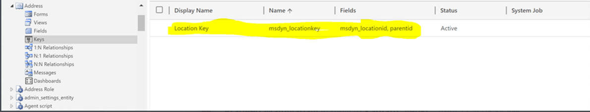

---
# required metadata

title: Troubleshoot live synchronization issues
description: This topic provides troubleshooting information that can help you fix issues with live synchronization.
author: RamaKrishnamoorthy 
ms.date: 03/16/2020
ms.topic: article
ms.prod: 
ms.technology: 

# optional metadata

ms.search.form: 
# ROBOTS: 
audience: Application User, IT Pro
# ms.devlang: 
ms.reviewer: rhaertle
# ms.tgt_pltfrm: 
ms.custom: 
ms.assetid: 
ms.search.region: global
ms.search.industry: 
ms.author: ramasri
ms.dyn365.ops.version: 
ms.search.validFrom: 2020-03-16

---

# Troubleshoot live synchronization issues

[!include [banner](../../includes/banner.md)]

[!include [rename-banner](~/includes/cc-data-platform-banner.md)]

This topic provides troubleshooting information for dual-write integration between Finance and Operations apps and Dataverse. Specifically, it provides information that can help you fix issues with live synchronization.

> [!IMPORTANT]
> Some of the issues that this topic addresses might require either the system admin role or Microsoft Azure Active Directory (Azure AD) tenant admin credentials. The section for each issue explains whether a specific role or credentials are required.

## Live synchronization throws a 403 Forbidden error when you create a row in a Finance and Operations app

You might receive the following error message when you create a row in a Finance and Operations app:

*\[{\\"error\\":{\\"code\\":\\"0x80072560\\",\\"message\\":\\"The user is not a
member of the organization.\\"}}\], The remote server returned an error: (403)
Forbidden."}}".*

To fix the issue, follow the steps in [System requirements and prerequisites](requirements-and-prerequisites.md). To complete those steps, the dual-write application users who are created in Dataverse must have the system admin role. The default owning team must also have the system admin role.

## Live synchronization for any table consistently throws a similar error when you create a row in a Finance and Operations app

**Required role to fix the issue:** System admin

You might receive an error message like the following every time that you try to save table data in a Finance and Operations app:

*Cannot save the changes to the database. Unit of Work can not commit transaction. Unable to write data to entity uoms. Writes to UnitOfMeasureEntity failed with error message Unable to sync with entity uoms.*

To fix the issue, you must make sure that the prerequisite reference data exists in both the Finance and Operations app and Dataverse. For example, if the customer that you're in the Finance and Operations app belongs to a specific customer group, make sure that the customer group exists in Dataverse.

If data exists on both sides, and you've confirmed that the issue isn't data-related, follow these steps.

1. Open the **DualWriteProjectConfigurationEntity** using the Excel addin. To use the addin, enable design mode in the Finance and Operations Excel addin and add the **DualWriteProjectConfigurationEntity** to the sheet. For more information, see [View and update entity data with Excel](../../office-integration/use-excel-add-in.md).
2. Select the records that have issues in the dual-write map and project. Delete them. There will be 2 records for every dual-write mapping.
3. Publish the changes using the Excel addin. Publishing the changes is important because it deletes the records from the entity and underlying tables.

## Handle read or write privilege errors when you create data in a Finance and Operations app

You might receive a "Bad Request" error message that resembles the following example when you create data in a Finance and Operations app.


To fix the issue, you must assign the correct security role to the team of the mapped Dynamics 365 Sales or Dynamics 365 Customer Service business unit to enable the missing privilege.

1. In the Finance and Operations app, find the business unit that is mapped in the Data Integration connection set.

    

2. Sign in to the environment in the customer engagement app, navigate to **Setting \> Security**, and find the team of the mapped business unit.

    

3. Open the page for the team for editing, and then select **Manage roles** to open the **Manage Team Roles** dialog box.

    

4. Assign the role that has the read/write privilege for the relevant tables, and then select **OK**.

## Fix synchronization issues in an environment that has a recently changed Dataverse environment

**Required role to fix the issue:** System admin

You might receive the following error message when you create data in a Finance and Operations app:

*{"entityName":"CustCustomerV3Entity","executionStatus":2,"fieldResponses":\[\],"recordResponses":\[{"errorMessage":"**Unable
to generate payload for entity
CustCustomerV3Entity**","logDateTime":"2019-08-27T18:51:52.5843124Z","verboseError":"Payload
creation failed with error Invalid URI: The URI is
empty."}\],"isErrorCountUpdated":true}*

Here is what the error looks like in the customer engagement app:

*An unexpected error occurred from ISV code. (ErrorType = ClientError) Unexpected exception from plug-in (Execute): Microsoft.Dynamics.Integrator.DualWriteRuntime.Plugins.PostCommitPlugin: System.Exception: failed to process entity account - (A connection attempt failed because the connected party did not properly respond after a period of time, or established connection failed because connected host has failed to respond.*

This error occurs when the Dataverse environment is incorrectly reset at the same time that you try to create data in the Finance and Operations app.

> [!IMPORTANT]
> If you have relinked the environments, you must stop all the entity maps before continuing with the mitigation steps.
To fix the issue, you will need to complete steps using Dataverse and the Finance and Opertions app.

1. Finance and Operations app
    1. Open the **DualWriteProjectConfigurationEntity** using the Excel addin. To use the addin, enable design mode in the Finance and Operations Excel addin and add the **DualWriteProjectConfigurationEntity** to the sheet. For more information, see [View and update entity data with Excel](../../office-integration/use-excel-add-in.md).
    2. Select the records that have issues in the dual-write map and project. Delete them. There will be 2 records for every dual-write mapping.
    3. Publish the changes using the Excel addin. Publishing the changes is important because it deletes the records from the entity and underlying tables.
    4. To prevent errors when re-linking the Finance and Operations or Dataverse environments, make sure that there are no remaining dual-write configurations.
2. Dataverse
    1. Sign in to your Dataverse environment, for example, `https://*****.crm.dynamics.com/`.
    2. Navigate to **Advanced Settings** \> **Advanced Find**.
    3. Select **DualWrite Runtime Configuration**.
    4. Select the column that you want view.
    5. Select **Results** to view the configurations.
    6.  Delete all the instances.
3. Finance and Operations app
    1. Open the **DualWriteProjectConfigurationEntity** using the Excel addin. To use the addin, enable design mode in the Finance and Operations Excel addin and add the **DualWriteProjectConfigurationEntity** to the sheet. For more information, see [View and update entity data with Excel](../../office-integration/use-excel-add-in.md).
    2. Select the records that have issues in the dual-write map and project. Delete them. There will be 2 records for every dual-write mapping.
    3. Publish the changes using the Excel addin. Publishing the changes is important because it deletes the records from the entity and underlying tables.
    4. To prevent errors when re-linking the Finance and Operations or Dataverse environments, make sure that there are no remaining dual-write configurations.

## Error with live sync after doing a full database copy

You might receive the following error after you run a full database copy from one system to another, and then you try to run a database operation.
    
*SecureConfig Organization (???) does not match actual CRM Organization (???).*

The error is thrown from dual-write runtime plug-in to ensure that the dual-write configuration set up in one system cannot be used in another.

To fix this error, delete all the records in the **msdyn_dualwriteruntimeconfig** table after you restore the database. For more information, see [Unlink and relink dual-write environments](relink-environments.md).

## Live sync issues due to incorrect query filter syntax on the dual-write maps

Even though the query expression for a dual-write map filter is syntactically correct, it might not work as expected. The filter expression is on an entity and not an individual data source of a query object. Therefore, the data from the entity SQL view matters which is the underlying data model backing the entity.

For example:

```dos
Query entity = PROJECTENTITY
Query expression = (ParentProject == "")
```

You would expect that projects with no parent are filtered out. However, the filter does not work because the filter translates to a query which looks like the following:

```sql
SELECT T1.RECID,T1.MODIFIEDDATETIME,T1.RECVERSION,T1.RECID,T1.DIMENSION,
T1.LOCATION,T1.PROJECTCONTROLLER,T1.PROJECTID,T1.PROJECTMANAGER,T1.REFERENCE,
T1.SALESMANAGER,T1.SCHEDULED,T1.RECVERSION#8,T1.RECVERSION#7,
T1.RECVERSION#6,T1.RECVERSION#5,T1.RECVERSION#4,T1.RECVERSION#3,
T1.RECVERSION#2,T1.RECID#8,T1.RECID#7,T1.RECID#6,T1.RECID#5,
T1.RECID#4,T1.RECID#3,T1.RECID#2,T1.PARTITION FROM PROJECTENTITY T1 
WHERE(((((((((((PARTITION=5637144576) AND (DATAAREAID=N'usmf')) AND 
((PARTITION#2=5637144576) OR (PARTITION#2 IS NULL))) AND 
((PARTITION#3=5637144576) OR (PARTITION#3 IS NULL))) AND 
((PARTITION#4=5637144576) OR (PARTITION#4 IS NULL))) AND 
((PARTITION#5=5637144576) OR (PARTITION#5 IS NULL))) AND 
((PARTITION#6=5637144576) OR (PARTITION#6 IS NULL))) AND 
((PARTITION#7=5637144576) OR (PARTITION#7 IS NULL))) AND 
((PARTITION#8=5637144576) OR (PARTITION#8 IS NULL))) AND 
((DATAAREAID#8=N'usmf') OR (DATAAREAID#8 IS NULL))) AND 
(PARENTPROJECT='')) 
ORDER BY T1.PROJECTID
```

The actual result is that the `parentProject` field evaluates to `null` which is not the same as the empty string. This is the reason why the query filter does not return valid results. 

To fix the issue the entity needs an additional computed column that can be added in an extension model, backed by a logic to convert `null` to the empty string.

`SysComputedColumn::if(SysComputedColumn::isNullExpression(ParentProject), SysComputedColumn::returnLiteral(""), fieldName);`

Use the filter on the new computed column instead of the default column.

To evaluate the filter in a development environment, you can use following x++ code to validate the results. Run this code as a standalone job in AX. This script can be used to evaluate different kinds of filters applicable for an entity before using them on dual-write maps. The query can be run against the database to evaluate discrepancies.

```xpp
var entityName = "PROJECTENTITY";
var filterExpression = '(ParentProject == "")';
Query query = new Query();
query.literals(NoYes::Yes); 
QueryBuildDataSource qbd = query.addDataSource(tablename2id(entityName));
qbd.addRange(fieldname2id(qbd.table(),identifierStr(RecVersion))).value(filterExpression);
qbd.addSelectionField(fieldname2id(qbd.table(),identifierStr(RecId)));
QueryRun qRun = new QueryRun(query);
// This provides the actual sql statement to execute
var actualSqlStatement = query.getSQLStatement();
while(qRun.next())
{
    var rec = qRun.get(tableName2Id(entityName));   
}
```

## Data from Finance and Operations apps does not sync to Dataverse

You might have an issue during live sync where only a partial data is synchronized from Finance and Operations apps to Dataverse or data is not synchronized at all

> [!NOTE]
> You must fix these issues during development.

Before you start to fix the issue, review the following:

+ Make sure your custom changes are written with in a single transaction scope. 
+ `doinsert()`, `doUpdate()`, `recordset()` operations and records where `skipBusinessEvents(true)` is marked are not handled by business events and the dual-write framework. If your code is inside these functions, then dual-write will not be triggered.
+ Business events must be registered for the data source which is mapped. There can be data sources which use an outer join and are marked as readonly in Finance and Operations apps. These data sources are not tracked.
+ Changes will be triggered only if the modifications are on the mapped fields. Unmapped field modifications will not trigger dual-write.
+ Make sure that filter evaluations provide a valid result.

### Troubleshooting steps

1. Check field mappings on the dual-write admin page. If the field is not mapped from Finance and Operations apps to Dataverse, then that field will not be tracked. For example, in the following screenshot, the field **Description** is tracked from Dataverse but not from Finance and Operations apps. Any changes to that field inside Finance and Operations apps will not be tracked.

    
    
2. Check if the data source is tracked in the business events definition. For example, in the following screenshot, any field from the **DefaultDimensionDAVs** table and underlying tables won't be tracked for changes. Data sources that are **OuterJoin** and readonly are not tracked.
    
    
    
3. The mapped table fields appearr in the **BUSINESSEVENTSDEFINITION** table, as shown in the following screenshot. If you don't find the field you are looking for in the query result, then it will not be triggerd by dual-write.
    
    

### Sample scenario
  
Suppose that in Finance and Operations apps, when there is an update to the address for a contact record, that the address change does not sync to Dataverse. This happens because there is no record in the **BusinessEventsDefinition** table with the combination of the table affected and the entity. Specifically, the **smmContactpersonCDSV2Entity** entity does not have the **LogisticsPostalAddress** table directly as the data source. The **smmContactpersonCDSV2Entity** entity has **smmContactPersonV2Entity** as the data source, and **smmContactPersonV2Entity** has **LogisticsPostalAddressBaseEntity** as the data source. The **LogisticsPostalAddress** table is the data source for **LogisticsPostalAddressBaseEntity**.
 
A similar situation can happen in certain non-standard patterns, such as cases where the table being modified in Finance and Operations apps isn't obviously linked to the entity that contains it. For example, on the **smmContactPersonCDSV2Entity**, the primary address data is computed. The dual-write framework attempts understand how a change to an underlying table maps back to entities, which is usually sufficient. In some cases the link is so complex, that you need to be specific. You have to make sure you have the **RecId** of the related table available on the entity directly, and then add a static method monitor the table for changes.  
 
For an example, review the **smmContactPersonCDSV2Entity::getEntityDataSourceToFieldMapping()** method. **CustCustomerV3entity** and **VendVendorV2Entity** have modified to handle this situation.
 
To fix this error, follow these steps.
 
1. Add a **PrimaryPostalAddressRecId** field to the **smmContactPersonV2Entity** in AppMU. Make it internal.

    

2.	Add the same field to **smmContactPersonCDSV2Entity**.

    

3.	Add this method to the smmContactPersonCDSV2Entity class.

    ```xpp
    public static container getEntityDataSourceToFieldMapping(container mapping)
    {
        mapping += [[tablestr(smmContactPersonCDSV2Entity), tablenum(LogisticsPostalAddress), fieldstr(smmContactPersonCDSV2Entity, PrimaryPostalAddressRecId)]];
 
        return mapping;
    }
    ```

4.	Sync the database and build the application.

5.	Stop all the dual-write maps that are created on the **smmContactPersonCDSV2Entity** entity.

6.	Start the map and you will see the new table (**LogisticsPostalAddress** in this example) you have started to track using the column **RefTableName** for the row with **refentityname** equal to **smmContactPersonCDSV2Entity** in the **BusinessEventsDefinition** table.

## Error while creating a record where multiple records are sent from a Finance and Operations app to Dataverse in the same batch

For any transaction, the Finance and Operations app creates data in a batch and sends it as a batch to Dataverse. If two records are created as part of the same transaction and they reference each other, then may receive an error similar to the following in the Finance and Operations app:

*Unable to write data to entity aaa_fundingsources. Unable to lookup ebecsfs_contracts with values {PC000000212,c27258c0-99a0-418b-83da-7718707852d8}. Unable to lookup aaa_fundingsources with values {PC000000212,80297829-5c83-ea11-a811-000d3a6aa9f7,c27258c0-99a0-418b-83da-7718707852d8}. Writes to aaa_fundingsources failed with error message Exception message: The remote server returned an error: (400) Bad Request.*

To fix it, you need to create entity relationships within the Finance and Operations app to indicate the two entities are related to each other and the related records are handled within the same transaction. 


## Enable Debug mode for troubleshooting Finance and Operations apps
In Dual write many times F&O will show up errors which are related to CDS instance. Some of the detailed messages could not be logged due to length of the response message and PII information. To enable verbose logging for the errors, use following steps

1.	For all project configurations in F&O there is a flag IsDebugMode on DualWriteProjectConfiguration entity.

2.	Open the entity in Excel addin. An easy way to do it is to enable design mode in F&O excel addin and add the DualWriteProjectConfigurationEntity to the sheet. Refer to https://docs.microsoft.com/en-us/dynamics365/fin-ops-core/dev-itpro/office-integration/use-excel-add-in  for more info on excel addins.

3.	Set the IsDebugMode to Yes on the project in question.

4.	Run the scenario.

5.	The verbose logs are available on DualWriteErrorLog table.

6.	To lookup data on table browser use the following link https://XXXaos.cloudax.dynamics.com/?mi=SysTableBrowser&tableName=DualWriteErrorLog

7.	Update to [KB 4595434 (Available for PU 37 and above)] (https://fix.lcs.dynamics.com/Issue/Details?kb=4595434&bugId=527820&dbType=3&qc=c29ce15a80e6b3b4c01a722d9bdae1d7e71aa3662a044cfd0b765f736cfa98e9) as it allows debug mode to capture more logs. 

    Detailed Error Message will capture the batch request format 

    verboseError: Captures the long text of the error from CRM. This can be used to get more context information while debugging. 
    
    debugLogTrace : Captures the actual batch request sent to CRM along with payload.


## Error while adding addresses for a customer or contact in Finance and Operations apps or Dataverse
 
Error - "Unable to write data to entity msdyn_partypostaladdresses.Writes to DirPartyPostalAddressLocationCDSEntity failed with error message Request failed with status code BadRequest and CDS error code : 0x80040265 response message: An error occurred in plugin. A record that has the attribute values Location ID already exists. The entity key Location ID Key requires that this set of attributes contains unique values. Select unique values and try again"

To fix it, please make sure that the keys on the Address table is as per the attached screen shot. The key on this table prior to Finance extended solution solution version 2.2.2.50 would have been just msdyn_locationid field.
Make sure to install the dual write orchestration package version (2.2.2.60) so that it replaces the previous key created on Address table.
    
 
    
## Error while creating customer in Dataverse 

Error - {"RecordError0":"Write failed for entity Customers V3 with unknown exception - Party record not found for party type 'Organization'"}

When a customer is created in Dataverse, a new party number gets generated. When this customer record along with party synchronizes to Finance and Operatios apps and there is already a customer record with a different party number, this error is thrown. To fix it, make sure to find the customer through party lookup and if none exist then create a new customer record. Otherwise, use the exisitng party to create the new customer record. 


## Error while creating a new customer/vendor or contact in CDS may give the error similar to "Cannot update a party's type from 'DirOrganization' to 'DirPerson', a delete of the existing party followed by an insert with the new type should be performed instead."
 
**Resolution:** There is a number sequence on msdyn_party table in CDS. For example if an account is created in CDS it would create a new party say Party-001 with Party type "Organization" and send this data to F&O. Later if the CDS environment is reset or if the same F&O environment is again connected to a different CDS organization and if you are creating a new contact this time in CDS, the number sequence for msdyn_party will again start with Party-001. This time the party record will be created with Party-001 and party type a s"Person". So when this data is synced to F&O, since F&O already has Party-001 with party type 'Organization' and we see this error.
 
This issue mostly happens only in non -prod environments since users try connecting same F&O to different CDS orgs or reset CDS orgs.
 
So whenever this issue happens, make sure to change the auto number sequence for msdyn_partynumber field in msdyn_party table to a different auto number sequence.

## Performance issue on Customers or Contacts mappings
 
To improve live sync performance of Customers and contacts, customizing the below methods in CustCustomerV3Entity and smmContactPersonCDSV2Entity entities may marginally improve performance as this process helps reduce number of records in BusinessEventsDefinition table which reduces number of events raised.
 
The method "getEntityDataSourceToFieldMapping" in the entity CustCustomerV3Entity  makes sure that the electronic address or postal address update of the customer triggers business events so that the updated data will be sent to Dataverse. If you do not use say URL or fax electronic contact information and don’t need this information to dual write, comment those respective lines in the below method. Every tracked field/table added in this method adds a record in the BusinessEventsDefinition table for the combination of the tracked table (RefTableName field) and tracked entity (RefEntityName field) . 
 
```xpp 
public static container getEntityDataSourceToFieldMapping(container mapping)
{
    mapping += [
        [tablestr(DirPartyBaseEntity), tablenum(LogisticsPostalAddress), fieldstr(CustCustomerV3Entity, AddressRecordId)],
        [identifierstr(DirPartyBaseEntity), tablenum(LogisticsElectronicAddress), fieldstr(CustCustomerV3Entity, PrimaryContactURLRecordId)],
        [identifierstr(DirPartyBaseEntity1), tablenum(LogisticsElectronicAddress), fieldstr(CustCustomerV3Entity, PrimaryContactPhoneRecordId)],
        [identifierstr(DirPartyBaseEntity2), tablenum(LogisticsElectronicAddress), fieldstr(CustCustomerV3Entity, PrimaryContactEmailRecordId)],
        [identifierstr(DirPartyBaseEntity3), tablenum(LogisticsElectronicAddress), fieldstr(CustCustomerV3Entity, PrimaryContactFaxRecordId)],
        [identifierstr(DirPartyBaseEntity4), tablenum(DirPartyLocation), fieldstr(CustCustomerV3Entity, DirPartyLocationRecordId)],
        [identifierstr(DirPartyBaseEntity5), tablenum(LogisticsPostalAddress), fieldstr(CustCustomerV3Entity, InvoiceAddressRecordId)],
        [identifierstr(DirPartyBaseEntity6), tablenum(LogisticsPostalAddress), fieldstr(CustCustomerV3Entity, DeliveryAddressRecordId)],
        [identifierStr(DirPartyBaseEntity7), tablenum(DirPartyTable), fieldstr(CustCustomerV3Entity, PartyRecordId)]];
    return mapping;
}
 ```
 
Similarly, we have added the method "getEntityDataSourceToFieldMapping" in the entity smmContactPersonCDSV2Entity to make sure that any electronic address or postal address update of the contact triggers business events so that the updated data will be sent to Dataverse. If you do not use say twitter or URL or linkedIn electronic contact information, comment those respective lines in the below method.
 
```xpp
public static container getEntityDataSourceToFieldMapping(container mapping)
{
    mapping += [
        [tablestr(DirPartyBaseEntity), tablenum(LogisticsPostalAddress), fieldstr(smmContactPersonCDSV2Entity, PrimaryPostalAddressRecId)],
        [identifierStr(DirPartyBaseEntity), tablenum(DirPartyTable), fieldstr(smmContactPersonCDSV2Entity, PrimaryAddressLocation)],
        [identifierStr(DirPartyBaseEntity1), tablenum(LogisticsElectronicAddress), fieldstr(smmContactPersonCDSV2Entity, PrimaryContactEmailRecordId)],
        [identifierStr(DirPartyBaseEntity2), tablenum(LogisticsElectronicAddress), fieldstr(smmContactPersonCDSV2Entity, PrimaryContactFaxRecordId)],
        [identifierStr(DirPartyBaseEntity3), tablenum(LogisticsElectronicAddress), fieldstr(smmContactPersonCDSV2Entity, PrimaryContactPhoneRecordId)],
        [identifierStr(DirPartyBaseEntity4), tablenum(LogisticsElectronicAddress), fieldstr(smmContactPersonCDSV2Entity, PrimaryContactFacebookRecordId)],
        [identifierStr(DirPartyBaseEntity5), tablenum(LogisticsElectronicAddress), fieldstr(smmContactPersonCDSV2Entity, PrimaryContactTwitterRecordId)],
        [identifierStr(DirPartyBaseEntity6), tablenum(LogisticsElectronicAddress), fieldstr(smmContactPersonCDSV2Entity, PrimaryContactURLRecordId)],
        [identifierStr(DirPartyBaseEntity7), tablenum(LogisticsElectronicAddress), fieldstr(smmContactPersonCDSV2Entity, PrimaryContactLinkedInRecordId)],
        [identifierStr(DirPartyBaseEntity8), tablenum(LogisticsElectronicAddress), fieldstr(smmContactPersonCDSV2Entity, PrimaryContactTelexRecordId)],
        [identifierStr(DirPartyBaseEntity9), tablenum(DirPartyTable), fieldstr(smmContactPersonCDSV2Entity, PartyRecordId)]];
    return mapping;
}
```
 
After the above methods are updated , Sync the DB and build the application.
    
Stop all the dual write maps that are created on the entity smmContactPersonCDSV2Entity and CustCustomerV3Entity.
    
Start the map and you will see reduced records for the entity 'smmContactPersonCDSV2Entity' and CustCustomerV3Entity in the BusinessEventsDefinition table which may marginally improve performance.

    


[!INCLUDE[footer-include](../../../../includes/footer-banner.md)]
