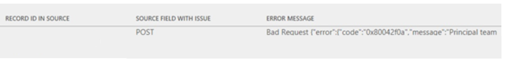
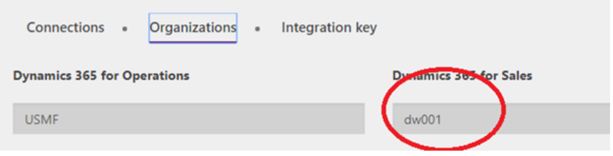
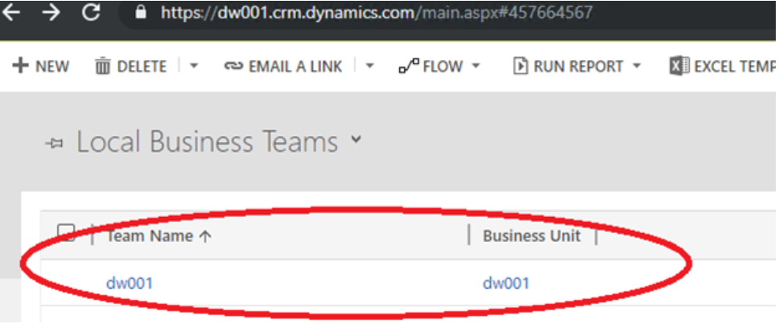
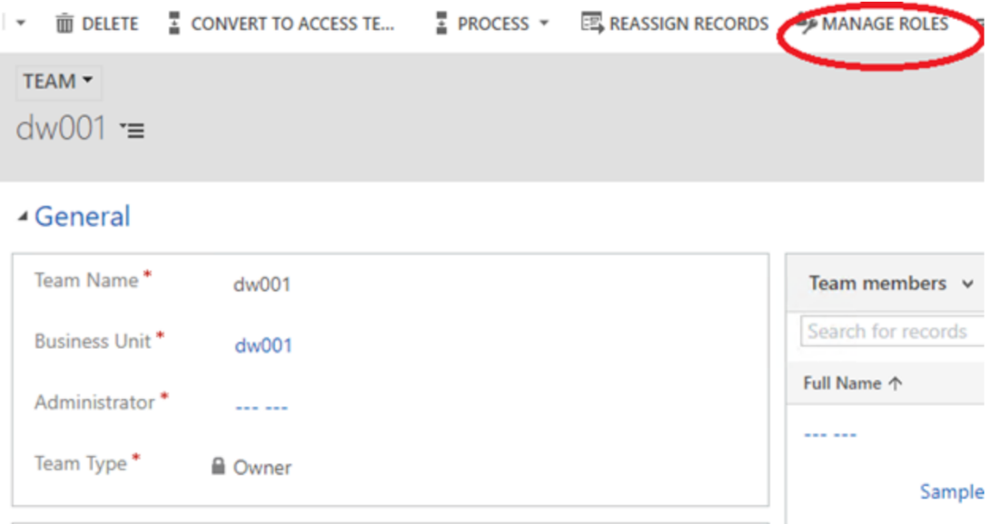
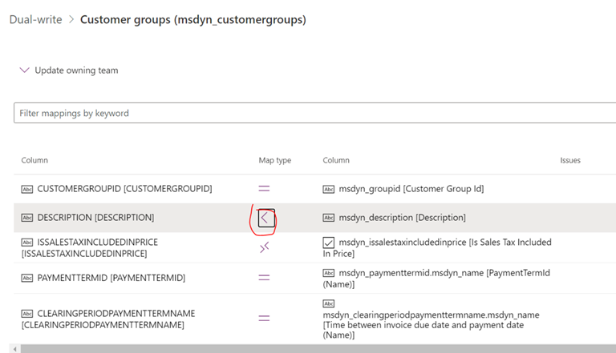
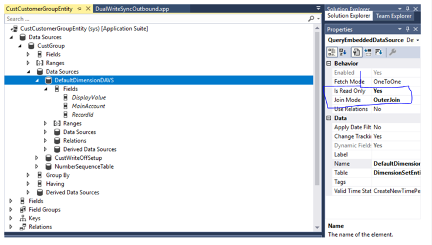
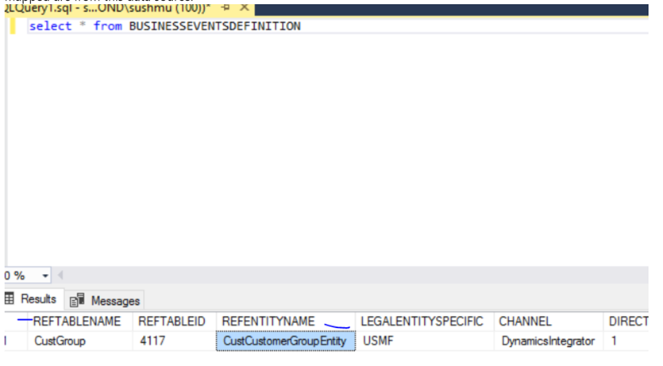
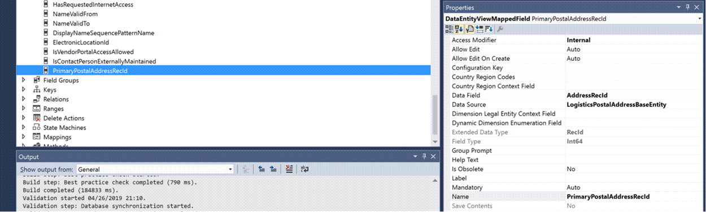
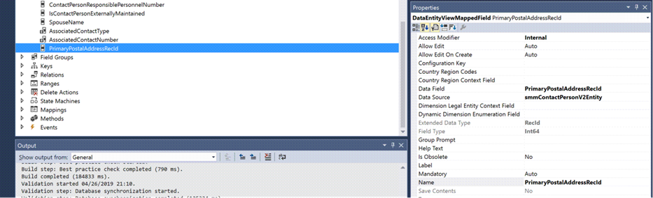

# Troubleshoot live synchronization issues

[!include [banner](../../includes/banner.md)]


This article provides troubleshooting information for dual-write integration between finance and operations apps and Microsoft Dataverse. Specifically, it provides information that can help you fix issues with live synchronization.

> [!IMPORTANT]
> Some of the issues that this article addresses might require either the system admin role or Azure Active Directory (Azure AD) tenant admin credentials. Each section explains whether a specific role or specific credentials are required.

## Live synchronization shows an error when you create a row

You might receive the following error message when you create a row in a finance and operations app:

*\[{\\"error\\":{\\"code\\":\\"0x80072560\\",\\"message\\":\\"The user is not a member of the organization.\\"}}\], The remote server returned an error: (403) Forbidden."}}".*

To fix the issue, follow the steps in [System requirements and prerequisites](requirements-and-prerequisites.md). To complete those steps, dual-write application users who were created in Dataverse must have the system admin role. The default owning team must also have the system admin role.

## Live synchronization shows an error when you try to save table data

**Required role to fix the issue:** System admin

You might receive the following error message when you try to save table data in a finance and operations app:

*Cannot save the changes to the database. Unit of Work can not commit transaction. Unable to write data to entity uoms. Writes to UnitOfMeasureEntity failed with error message Unable to sync with entity uoms.*

To fix the issue, make sure that prerequisite reference data exists in both the finance and operations app and Dataverse. For example, if a customer record belongs to a specific customer group, make sure that the customer group record exists in Dataverse.

If data exists in both places, and you've confirmed that the issue isn't data related, follow these steps.

1. Open the **DualWriteProjectConfigurationEntity** entity by using the Excel add-in. To use the add-in, enable design mode in the finance and operations Excel add-in, and add **DualWriteProjectConfigurationEntity** to a worksheet. For more information, see [View and update entity data with Excel](../../office-integration/use-excel-add-in.md).
2. Select and delete the records that have issues in the dual-write map and project. There will be two records for every dual-write mapping.
3. Publish the changes by using the Excel add-in. This step is important because it deletes the records from the entity and underlying tables.

## Handle read or write privilege errors when you create data in a finance and operations app

You might receive a "Bad Request" error message when you create data in a finance and operations app.



To fix the issue, you must enable the missing privilege by assigning the correct security role to the team of mapped Dynamics 365 Sales or Dynamics 365 Customer Service business units.

1. In the finance and operations app, find the business unit that is mapped in the Data Integration connection set.

    

2. In the customer engagement app, sign in to the environment, go to **Setting \> Security**, and find the team of the mapped business unit.

    

3. Open the page for the team for editing, and then select **Manage roles**.

    

4. In the **Manage Team Roles** dialog box, assign the role that has the read/write privilege for the relevant tables, and then select **OK**.

## Fix synchronization issues in an environment that has a recently changed Dataverse environment

**Required role to fix the issue:** System admin

You might receive the following error message when you create data in a finance and operations app:

*{"entityName":"CustCustomerV3Entity","executionStatus":2,"fieldResponses":\[\],"recordResponses":\[{"errorMessage":"**Unable to generate payload for entity CustCustomerV3Entity**","logDateTime":"2019-08-27T18:51:52.5843124Z","verboseError":"Payload creation failed with error Invalid URI: The URI is empty."}\],"isErrorCountUpdated":true}*

Here is the error message in the customer engagement app:

> An unexpected error occurred from ISV code. (ErrorType = ClientError) Unexpected exception from plug-in (Execute): Microsoft.Dynamics.Integrator.DualWriteRuntime.Plugins.PostCommitPlugin: System.Exception: failed to process entity account - (A connection attempt failed because the connected party did not properly respond after a period of time, or established connection failed because connected host has failed to respond.

This error occurs if the Dataverse environment is incorrectly reset when you try to create data in the finance and operations app.

> [!IMPORTANT]
> If you've relinked the environments, you must stop all the entity maps before you continue with the mitigation steps.

To fix the issue, you must complete steps in both Dataverse and the finance and operations app.

1. In the finance and operations app, follow these steps:

    1. Open the **DualWriteProjectConfigurationEntity** entity by using the Excel add-in. To use the add-in, enable design mode in the finance and operations Excel add-in, and add **DualWriteProjectConfigurationEntity** to a worksheet. For more information, see [View and update entity data with Excel](../../office-integration/use-excel-add-in.md).
    2. Select and delete the records that have issues in the dual-write map and project. There will be two records for every dual-write mapping.
    3. Publish the changes by using the Excel add-in. This step is important because it deletes the records from the entity and underlying tables.
    4. To help prevent errors when you relink the finance and operations or Dataverse environments, make sure that no dual-write configurations remain.

2. In Dataverse, follow these steps:

    1. Sign in to your Dataverse environment (for example, `https://*****.crm.dynamics.com/`).
    2. Go to **Advanced Settings** \> **Advanced Find**.
    3. Select **DualWrite Runtime Configuration**.
    4. Select the column to view.
    5. Select **Results** to view the configurations.
    6. Delete all the instances.

3. In the finance and operations app, follow these steps:

    1. Open the **DualWriteProjectConfigurationEntity** entity by using the Excel add-in. To use the add-in, enable design mode in the finance and operations Excel add-in, and add **DualWriteProjectConfigurationEntity** to a worksheet. For more information, see [View and update entity data with Excel](../../office-integration/use-excel-add-in.md).
    2. Select and delete the records that have issues in the dual-write map and project. There will be two records for every dual-write mapping.
    3. Publish the changes by using the Excel add-in. This step is important because it deletes the records from the entity and underlying tables.
    4. To help prevent errors when you relink the finance and operations or Dataverse environments, make sure that no dual-write configurations remain.

## Live synchronization error after you do a full database copy

You might receive the following error message after you run a full database copy from one system to another and then try to run a database operation:

*SecureConfig Organization (???) does not match actual CRM Organization (???).*

The error message is shown from the dual-write runtime plug-in to ensure that the dual-write configuration that is set up in one system can't be used in another system.

To fix the issue, delete all the records in the **msdyn_dualwriteruntimeconfig** table after you restore the database. For more information, see [Unlink and relink dual-write environments](relink-environments.md).

## Live synchronization issues that are caused by incorrect query filter syntax on the dual-write maps

Even though the query expression for a dual-write map filter is syntactically correct, it might not work as expected. The filter expression is on an entity, not on an individual data source of a query object. Therefore, the SQL query that is generated doesn't return the expected results.

Here is an example.

```dos
Query entity = PROJECTENTITY
Query expression = (ParentProject == "")
```

You might expect projects that have no parent to be filtered out. However, the filter doesn't work because it's translated to a query that resembles the following example.

```sql
SELECT T1.RECID,T1.MODIFIEDDATETIME,T1.RECVERSION,T1.RECID,T1.DIMENSION,
T1.LOCATION,T1.PROJECTCONTROLLER,T1.PROJECTID,T1.PROJECTMANAGER,T1.REFERENCE,
T1.SALESMANAGER,T1.SCHEDULED,T1.RECVERSION#8,T1.RECVERSION#7,
T1.RECVERSION#6,T1.RECVERSION#5,T1.RECVERSION#4,T1.RECVERSION#3,
T1.RECVERSION#2,T1.RECID#8,T1.RECID#7,T1.RECID#6,T1.RECID#5,
T1.RECID#4,T1.RECID#3,T1.RECID#2,T1.PARTITION FROM PROJECTENTITY T1 
WHERE(((((((((((PARTITION=5637144576) AND (DATAAREAID=N'usmf')) AND 
((PARTITION#2=5637144576) OR (PARTITION#2 IS NULL))) AND 
((PARTITION#3=5637144576) OR (PARTITION#3 IS NULL))) AND 
((PARTITION#4=5637144576) OR (PARTITION#4 IS NULL))) AND 
((PARTITION#5=5637144576) OR (PARTITION#5 IS NULL))) AND 
((PARTITION#6=5637144576) OR (PARTITION#6 IS NULL))) AND 
((PARTITION#7=5637144576) OR (PARTITION#7 IS NULL))) AND 
((PARTITION#8=5637144576) OR (PARTITION#8 IS NULL))) AND 
((DATAAREAID#8=N'usmf') OR (DATAAREAID#8 IS NULL))) AND 
(PARENTPROJECT='')) 
ORDER BY T1.PROJECTID
```

The actual result is that the `parentProject` field is evaluated to `null`. However, `null` isn't the same as the empty string. Because of this mismatch, the query filter doesn't return valid results.

To fix the issue, follow these steps.

1. Add a computed column that can be added in an extension model, and that is backed by logic that converts `null` to the empty string.

    ```dos
    SysComputedColumn::if(SysComputedColumn::isNullExpression(ParentProject), SysComputedColumn::returnLiteral(""), fieldName);
    ```

2. Use the filter on the new computed column instead of the default column.

To evaluate the filter in a development environment, you can use following X++ code to validate the results. Run this code as a standalone program. You can use it to evaluate different kinds of filters that are applicable for an entity before you use those filters on dual-write maps. The query can be run against the database to evaluate discrepancies.

```xpp
var entityName = "PROJECTENTITY";
var filterExpression = '(ParentProject == "")';
Query query = new Query();
query.literals(NoYes::Yes); 
QueryBuildDataSource qbd = query.addDataSource(tablename2id(entityName));
qbd.addRange(fieldname2id(qbd.table(),identifierStr(RecVersion))).value(filterExpression);
qbd.addSelectionField(fieldname2id(qbd.table(),identifierStr(RecId)));
QueryRun qRun = new QueryRun(query);
// This provides the actual sql statement to execute
var actualSqlStatement = query.getSQLStatement();
while(qRun.next())
{
    var rec = qRun.get(tableName2Id(entityName));
}
```

## Data from finance and operations apps isn't synced to Dataverse

During live synchronization, you might encounter an issue where only part of the data is synced from finance and operations apps to Dataverse, or data isn't synced at all.

> [!NOTE]
> You must fix this issue during development.

Before you start to fix the issue, review the following prerequisites:

+ Make sure that your custom changes are written in a single transaction scope.
+ Business events and the dual-write framework don't handle `doinsert()`, `doUpdate()`, and `recordset()` operations, or records where `skipBusinessEvents(true)` is marked. If your code is inside these functions, dual-write won't be triggered.
+ Business events must be registered for the data source that is mapped. Some data sources might use an outer join and might be marked as read only in finance and operations apps. These data sources aren't tracked.
+ Changes will be triggered only if the modifications are on the mapped fields. Unmapped field modifications won't trigger dual-write.
+ Make sure that filter evaluations provide a valid result.

### Troubleshooting steps

1. Review field mappings on the dual-write admin page. If a field isn't mapped from finance and operations apps to Dataverse, it won't be tracked. For example, in the following illustration, the **Description**  field is tracked from Dataverse, but not from finance and operations apps. No changes to that field inside finance and operations apps will be tracked.

    

2. Determine whether the data source is tracked in the business events definition. For example, in the following illustration, no field from the **DefaultDimensionDAVs** table and underlying tables will be tracked for changes. Data sources that use an outer join and that are marked as read only aren't tracked.

    

3. Determine whether the mapped table fields appear in the **BUSINESSEVENTSDEFINITION** table, as shown in the following illustration. If you don't find the field that you're looking for in the query result, it won't be triggered by dual-write.

    

### Sample scenario

In finance and operations apps, there is an update to the address for a contact record, but the address change isn't synced to Dataverse. This scenario occurs because no record in the **BusinessEventsDefinition** table has the combination of the affected table and the entity. Specifically, the **LogisticsPostalAddress** table isn't the direct data source for the **smmContactpersonCDSV2Entity** entity. The **smmContactpersonCDSV2Entity** entity has **smmContactPersonV2Entity** as the data source, and **smmContactPersonV2Entity**, in turn, has **LogisticsPostalAddressBaseEntity** as the data source. The **LogisticsPostalAddress** table is the data source for **LogisticsPostalAddressBaseEntity**.

A similar situation can occur in some non-standard patterns, such as cases where the table that is being modified in finance and operations apps isn't obviously linked to the entity that contains it. For example, the primary address data is computed on the **smmContactPersonCDSV2Entity** entity. The dual-write framework tries to determine how a change to an underlying table is mapped back to entities. Usually, this approach is sufficient. However, in some cases, the link is so complex that you must be specific. You must make sure that the **RecId** of the related table is directly available on the entity. Then add a static method to monitor the table for changes.

For an example, review the **smmContactPersonCDSV2Entity::getEntityDataSourceToFieldMapping()** method. **CustCustomerV3entity** and **VendVendorV2Entity** have been modified to handle this situation.

To fix the issue, follow these steps.

1. Add a **PrimaryPostalAddressRecId** field to the **smmContactPersonV2Entity** entity. Make it internal.

    

2. Add the same field to the **smmContactPersonCDSV2Entity** entity.

    

3. Add the following method to the **smmContactPersonCDSV2Entity** class.

    ```xpp
    public static container getEntityDataSourceToFieldMapping(container mapping)
    {
        mapping += [[tablestr(smmContactPersonCDSV2Entity), tablenum(LogisticsPostalAddress), fieldstr(smmContactPersonCDSV2Entity, PrimaryPostalAddressRecId)]];
        return mapping;
    }
    ```

4. Sync the database, and build the application.
5. Stop all the dual-write maps that are created on the **smmContactPersonCDSV2Entity** entity.
6. Start the map. You should see the new table (**LogisticsPostalAddress** in this example) that you've started to track by using the **RefTableName** column for the row where the **refentityname** value equals **smmContactPersonCDSV2Entity** in the **BusinessEventsDefinition** table.

## Error when you create a record where multiple records are sent from a finance and operations app to Dataverse in the same batch

For any transaction, a finance and operations app creates data in a batch and sends it as a batch to Dataverse. If two records are created as part of the same transaction, and they reference each other, you might receive an error message that resembles the following example in the finance and operations app:

*Unable to write data to entity aaa_fundingsources. Unable to lookup ebecsfs_contracts with values {PC00...}. Unable to lookup aaa_fundingsources with values {PC00...}. Writes to aaa_fundingsources failed with error message Exception message: The remote server returned an error: (400) Bad Request.*

To fix the issue, create entity relationships in the finance and operations app to indicate that the two entities are related to each other, and that the related records are handled in the same transaction.

## Enable verbose logging of error messages

In a finance and operations app, you might encounter errors that are related to the Dataverse environment. The error message might not contain the full text of the message or other relevant data. To get more information, you can enable verbose logging by setting the **IsDebugMode** flag that is present on the **DualWriteProjectConfigurationEntity** entity in all project configurations in finance and operations apps.

1. Open the **DualWriteProjectConfigurationEntity** entity by using the Excel add-in. To use the add-in, enable design mode in the finance and operations Excel add-in, and add **DualWriteProjectConfigurationEntity** to a worksheet. For more information, see [View and update entity data with Excel](../../office-integration/use-excel-add-in.md).
2. Set the **IsDebugMode** flag to **Yes** on the project.
3. Run the scenario.
4. The verbose logs are available in the **DualWriteErrorLog** table. To look up data by using the table browser, use the following URL: `https://XXXaos.cloudax.dynamics.com/?mi=SysTableBrowser&tableName=DualWriteErrorLog`.
5. To capture more logs in debug mode, install the update in [KB 4595434 (Fix for blank values being propagated in Dual write live sync)](https://fix.lcs.dynamics.com/Issue/Details?kb=4595434&bugId=527820&dbType=3&qc=c29ce15a80e6b3b4c01a722d9bdae1d7e71aa3662a044cfd0b765f736cfa98e9).

## Error when you add an address for a customer or contact

You might receive the following error message when you try to add an address for a customer or contact in finance and operations apps or Dataverse:

*Unable to write data to entity msdyn_partypostaladdresses.Writes to DirPartyPostalAddressLocationCDSEntity failed with error message Request failed with status code BadRequest and CDS error code : 0x80040265 response message: An error occurred in plugin. A record that has the attribute values Location ID already exists. The entity key Location ID Key requires that this set of attributes contains unique values. Select unique values and try again.*

To fix the issue, install the dual-write orchestration package version (2.2.2.60), so that the keys on the **Address** table are defined as shown in the following table.

| Property | Value |
|---|---|
| Display Name | **Location Key** |
| Name | **msdyn_locationkey** |
| Fields | **msdyn_locationid**, **parentid** |
| Status | **Active** |
| System job | Blank |

## Error when you add a customer in Dataverse

You might receive the following error message when you try to add a customer in Dataverse:

*"RecordError0":"Write failed for entity Customers V3 with unknown exception - Party record not found for party type 'Organization'"}.*

When a customer is created in Dataverse, a new party number is generated. The error message is shown when the customer record, together with the party, is synced to finance and operations apps, but there is already a customer record that has a different party number.

To fix the issue, find the customer through party lookup. If the customer doesn't exist, create a new customer record. If the customer does exist, use the existing party to create the new customer record.

## Error when you create a new customer, vendor, or contact in Dataverse

You might receive the following error message when you try to create a new customer, vendor, or contact in Dataverse:

*Cannot update a party's type from 'DirOrganization' to 'DirPerson', a delete of the existing party followed by an insert with the new type should be performed instead.*

In Dataverse, there is a number sequence on the **msdyn_party** table. When an account is created in Dataverse, a new party is created (for example **Party-001** of the **Organization** type). This data is sent to the finance and operations app. If the Dataverse environment is reset, or the finance and operations environment is linked to a different Dataverse environment, and then a new contact record is created in Dataverse, a new party value that starts with **Party-001** is created. This time, the party record that is created will be **Party-001** of the **Person** type. When this data is synced, finance and operations apps show the preceding error message, because party record **Party-001** of the **Organization** type already exists.

To fix the issue, change the automatic number sequence for the **msdyn_partynumber** field of the **msdyn_party** table in Dataverse to a different automatic number sequence.

## Performance issue with customer or contact mappings

You might be able to marginally improve the performance of live synchronization for customers and contacts by customizing the **getEntityDataSourceToFieldMapping** method (in the **CustCustomerV3Entity** entity) method and the **getEntityDataSourceToFieldMapping** method (in the **smmContactPersonCDSV2Entity** entity). These customizations reduce the number of records in the **BusinessEventsDefinition** table. This reduction in the number of records, in turn, reduces the number of events that are raised.

The **getEntityDataSourceToFieldMapping** method in the **CustCustomerV3Entity** entity makes sure that an update of the customer's electronic address or postal address triggers business events, so that the updated data will be sent to Dataverse. If you don't use all the fields and don't need the information in dual-write, comment out the appropriate lines in the method. Every tracked field and table that is added in this method adds a record in the **BusinessEventsDefinition** table for the combination of the tracked table and tracked entity.

```xpp
public static container getEntityDataSourceToFieldMapping(container mapping)
{
    mapping += [
        [tablestr(DirPartyBaseEntity), tablenum(LogisticsPostalAddress), fieldstr(CustCustomerV3Entity, AddressRecordId)],
        [identifierstr(DirPartyBaseEntity), tablenum(LogisticsElectronicAddress), fieldstr(CustCustomerV3Entity, PrimaryContactURLRecordId)],
        [identifierstr(DirPartyBaseEntity1), tablenum(LogisticsElectronicAddress), fieldstr(CustCustomerV3Entity, PrimaryContactPhoneRecordId)],
        [identifierstr(DirPartyBaseEntity2), tablenum(LogisticsElectronicAddress), fieldstr(CustCustomerV3Entity, PrimaryContactEmailRecordId)],
        [identifierstr(DirPartyBaseEntity3), tablenum(LogisticsElectronicAddress), fieldstr(CustCustomerV3Entity, PrimaryContactFaxRecordId)],
        [identifierstr(DirPartyBaseEntity4), tablenum(DirPartyLocation), fieldstr(CustCustomerV3Entity, DirPartyLocationRecordId)],
        [identifierstr(DirPartyBaseEntity5), tablenum(LogisticsPostalAddress), fieldstr(CustCustomerV3Entity, InvoiceAddressRecordId)],
        [identifierstr(DirPartyBaseEntity6), tablenum(LogisticsPostalAddress), fieldstr(CustCustomerV3Entity, DeliveryAddressRecordId)],
        [identifierStr(DirPartyBaseEntity7), tablenum(DirPartyTable), fieldstr(CustCustomerV3Entity, PartyRecordId)]];
    return mapping;
}
```

In a similar manner, the **getEntityDataSourceToFieldMapping** method in the **smmContactPersonCDSV2Entity** entity makes sure that any update of the contact's electronic address or postal address triggers business events, so that the updated data will be sent to Dataverse. In the method, you can comment out the lines for any fields that you don't use.

```xpp
public static container getEntityDataSourceToFieldMapping(container mapping)
{
    mapping += [
        [tablestr(DirPartyBaseEntity), tablenum(LogisticsPostalAddress), fieldstr(smmContactPersonCDSV2Entity, PrimaryPostalAddressRecId)],
        [identifierStr(DirPartyBaseEntity), tablenum(DirPartyTable), fieldstr(smmContactPersonCDSV2Entity, PrimaryAddressLocation)],
        [identifierStr(DirPartyBaseEntity1), tablenum(LogisticsElectronicAddress), fieldstr(smmContactPersonCDSV2Entity, PrimaryContactEmailRecordId)],
        [identifierStr(DirPartyBaseEntity2), tablenum(LogisticsElectronicAddress), fieldstr(smmContactPersonCDSV2Entity, PrimaryContactFaxRecordId)],
        [identifierStr(DirPartyBaseEntity3), tablenum(LogisticsElectronicAddress), fieldstr(smmContactPersonCDSV2Entity, PrimaryContactPhoneRecordId)],
        [identifierStr(DirPartyBaseEntity4), tablenum(LogisticsElectronicAddress), fieldstr(smmContactPersonCDSV2Entity, PrimaryContactFacebookRecordId)],
        [identifierStr(DirPartyBaseEntity5), tablenum(LogisticsElectronicAddress), fieldstr(smmContactPersonCDSV2Entity, PrimaryContactTwitterRecordId)],
        [identifierStr(DirPartyBaseEntity6), tablenum(LogisticsElectronicAddress), fieldstr(smmContactPersonCDSV2Entity, PrimaryContactURLRecordId)],
        [identifierStr(DirPartyBaseEntity7), tablenum(LogisticsElectronicAddress), fieldstr(smmContactPersonCDSV2Entity, PrimaryContactLinkedInRecordId)],
        [identifierStr(DirPartyBaseEntity8), tablenum(LogisticsElectronicAddress), fieldstr(smmContactPersonCDSV2Entity, PrimaryContactTelexRecordId)],
        [identifierStr(DirPartyBaseEntity9), tablenum(DirPartyTable), fieldstr(smmContactPersonCDSV2Entity, PartyRecordId)]];
    return mapping;
}
```

After you update the methods, follow these steps.

1. Sync the database, and build the application.
2. Stop all the dual-write maps on the **smmContactPersonCDSV2Entity** and **CustCustomerV3Entity** entities.
3. Start the maps. You should see fewer records in the **smmContactPersonCDSV2Entity** and **CustCustomerV3Entity** entities and the **BusinessEventsDefinition** table, and performance might marginally improve.

## Live sync fails when configuration keys for the entity are disabled

**Required role to fix the issue:** System admin

The live sync for a table mapping may fail if configuration keys associated with fields on the entity are disabled. For example, the `Customers V3` entity may fail to sync if the Retail configuration key is disabled. The `Customers V3` entity includes fields from the `RetailCustTable`, which must have the Retail configuration key enabled to enable the fields, making them available for the entity. All configuration keys for fields included in an entity must be enabled for the entity to be available for dual-write live sync operations.

To resolve this issue: 
- The system administrator can enable the configuration keys for all fields on the entity, or
- Create a new entity that includes only fields covered by enabled configuration keys, and create a new dual-write map for the new data entity.

See [Configuration keys and data entities](../config-key-entities) for more information on enabling configuration keys and how they affect data entities.


[!INCLUDE[footer-include](../../../../includes/footer-banner.md)]

