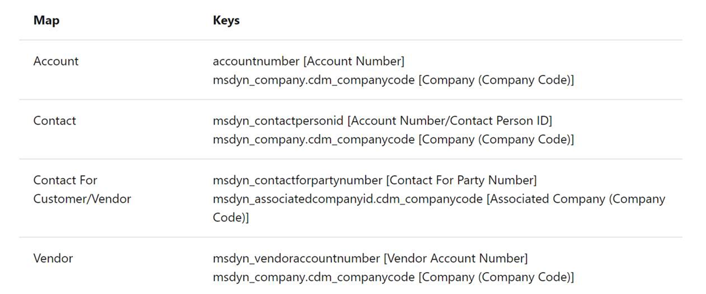
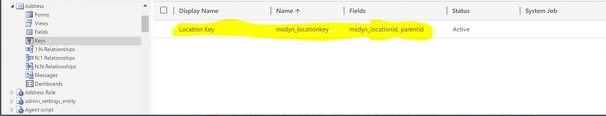
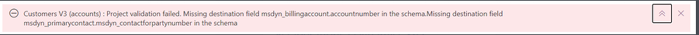
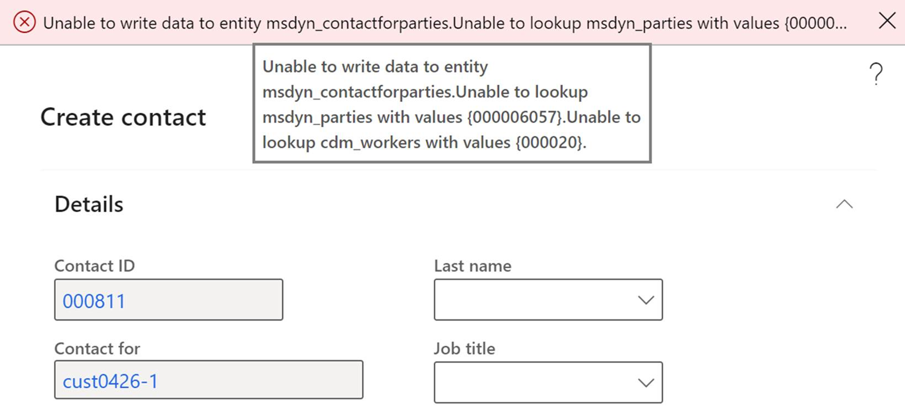
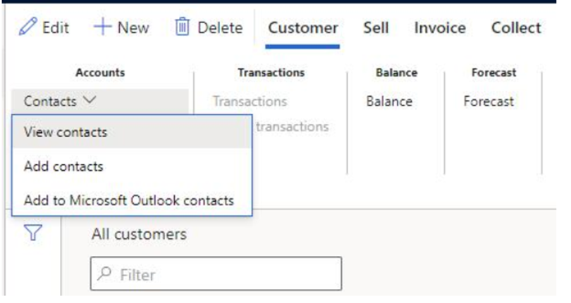

---

# required metadata

title: Troubleshoot Party and Global Address Book problems
description: This topic covers troubleshooting steps for problems around dual-write party and global address book functions.
author: RamaKrishnamoorthy
ms.date: 07/30/2021
ms.topic: article
ms.prod: 
ms.technology: 

# optional metadata

# ms.search.form: 
# ROBOTS: 
audience: Developer
# ms.devlang: 
ms.reviewer: rhaertle
# ms.tgt_pltfrm: 
ms.custom: 21311
ms.assetid: 
ms.search.region: Global
# ms.search.industry: 
ms.author: ramasri
ms.search.validFrom: 2020-01-14
ms.dyn365.ops.version: AX 7.0.0

---

# Troubleshoot Party and Global Address Book issues

[!include [banner](../../includes/banner.md)]

Before you start using Party and Global address book functionality, ensure following 2 things:
 
1.	Integration keys are set correctly. 

  
2.	Correct map versions are applied as instructed under https://docs.microsoft.com/en-us/dynamics365/fin-ops-core/dev-itpro/data-entities/dual-write/party-gab#setup.
  
  
## Error related to Location ID key

While trying to add an address to an account or contact in Finance and Operations apps or Dataverse can give the following error.
 
"Unable to write data to entity msdyn_partypostaladdresses.Writes to DirPartyPostalAddressLocationCDSEntity failed with error message Request failed with status code BadRequest and CDS error code : 0x80040265 response message: An error occurred in plugin. A record that has the attribute values Location ID already exists. The entity key Location ID Key requires that this set of attributes contains unique values. Select unique values and try again"

**Resolution:** Make sure that the key on the Address table is set as shown below. 
  
   
  
Without the Party and GAB solution, the key on this table is set to msdyn_locationid field. Make sure to install the dual write orchestration package version (2.2.2.60 or beyond) so that it replaces the previous key created on Address table.
  
  
## Error with message “Missing destination field ..” while trying to run Customers or Vendors or Contacts V2 maps
    

      
**Resolution:** Since there are multiple keys defined on the entity involving the field msdyn_company in Dataverse, the dual write platform cannot determine the key to be used as integration key and hence randomly assigns one of the entity keys as integration key for these entities. So, update the integration keys manually as mentioned under step 8 of https://docs.microsoft.com/en-us/dynamics365/fin-ops-core/dev-itpro/data-entities/dual-write/party-gab#setup page and refresh the table mappings to get rid of the missing destination field error.
      
      
## Party ID is different in Finance and Operations apps and Dataverse for the customers or vendors or Contacts

**Resolution:** Make sure to use the latest version of maps as instructed under step 7 of https://docs.microsoft.com/en-us/dynamics365/fin-ops-core/dev-itpro/data-entities/dual-write/party-gab#setup page.
      
      
## Issues with upgrading Party and Global Address book solutions from 2.4.0155 to later versions
 
**Resolution:** The Party and GAB functionality was part of the Dual write orchestration package when this was released for preview during Jan/Feb 2021 time frame.  However, based on feedback and making sure we remain compatible and non-intrusive for customers who do not wish to uptake GAB part of default package, we separated them from it and released it (GA) as a separate Appsource package. This way it it’s optional/opt-in for customers without overloading their existing systems. In case you are using the preview version (say version 2.4.0.155 or any) of the dual-write orchestration package that contains Party and GAB functionality then you need to uninstall the dual write orchestration solutions or reset the Dataverse environment and get the latest packages from Appsource.
Note: The Party and Global Address Book Appsource package contains the following 4 solutions. 

•	Party - Includes all the new party and postal address/electronic address related schema. 

•	Dynamics365GABExtended - Includes all code and schema changes to support Accounts, Vendors, Contacts and Contact for party functionality. (This got separated from the Dynamics365FinanceExtended and Dynamics365SupplyChainExtended solutions.)

•	Dynamics365GABDualWriteEntityMaps - Includes all the dual write mapping changes required for GAB functionality.

•	Dynamics365GABParty_Anchor

      
## In Finance and Operations apps, when you try to create a new contact from the View Contact form, the action fails with an error. 
 

**Resolution:** This is a known error. Users can create a contact record using the **Add Contact** form as a work around.
  

        
## Error "Unable to write data to entity msdyn_contactforparties.Writes to smmContactPersonV2Entity failed with error message Request failed with status code BadRequest and CDS error code : 0x0 response message: An error occurred while validating input parameters: Microsoft.OData.ODataException: Cannot convert the literal '' to the expected type 'Edm.Int32'."

Turns out the default mapping for native language field in the Contacts V2 map contains a space. This issue is seen only when you try to update a contact in Finance and Operations apps that originated in Dataverse. 
 
**Resolution:** This issue is fixed in Party and Global Address book solutions with version 3.0.0.26. Make sure to install the latest solution from appsource.
        
        
## Creating a new customer/vendor or contact in Dataverse may result in the error "Cannot update a party's type from 'DirOrganization' to 'DirPerson', a delete of the existing party followed by an insert with the new type should be performed instead."

**Resolution:** This issue mostly happens only in non-production environments since users try connecting same Finance and Operations apps to different Dataverse organizations or reset the existing Dataverse organizations. It is due to number sequence for Party ID on msdyn_party table in Dataverse. For example if an account is created in Dataverse it would create a new party say Party-001 with Party type "Organization" and send this data to Finance and Operations apps. Later if the Dataverse environment is reset or if the same Finance and Operations apps environment is again connected to a different Dataverse organization and the users are creating a new contact this time in Dataverse, the number sequence for msdyn_party will again start with Party-001. So, this time the party record will be created with Party-001 and party type as "Person". So when this data is synced to Finance and Operations apps, since Finance and Operations apps already has Party-001 with party type 'Organization' we see this error.
 
When ever this issue happens, make sure to change the auto number sequence for msdyn_partynumber field in msdyn_party table to a different auto number sequence.

        
## Error during initial sync of party postal addresses and party electronic addresses    
        
 We have a range added on DirPartyCDSEntity in Finance and Operations apps to filter only parties of type ‘Person’ and ‘Organization’. As a result of this the initial sync of CDS Parties – msdyn_parties mapping will not sync parties of other types like ‘Legal Entity’, ‘Operating Unit’ etc. So, when the initial sync runs for CDS Party postal addresses (msdyn_partypostaladdresses) or Party Contacts V3 (msdyn_partyelectronicaddresses) you may see errors like the Party number could not found in Dataverse.

We are currently working on a fix to remove the party type range on the Finance and Operations apps entity so that parties of all types synchronize to Dataverse successfully.

