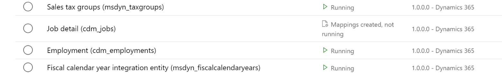
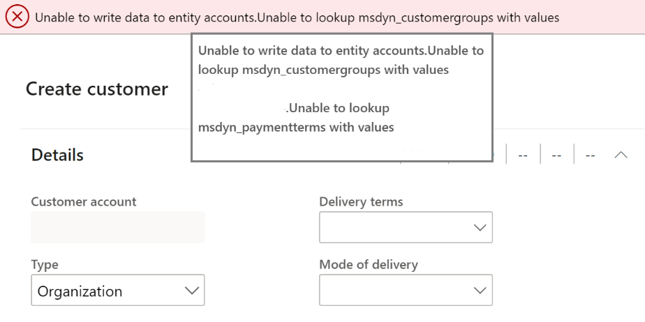
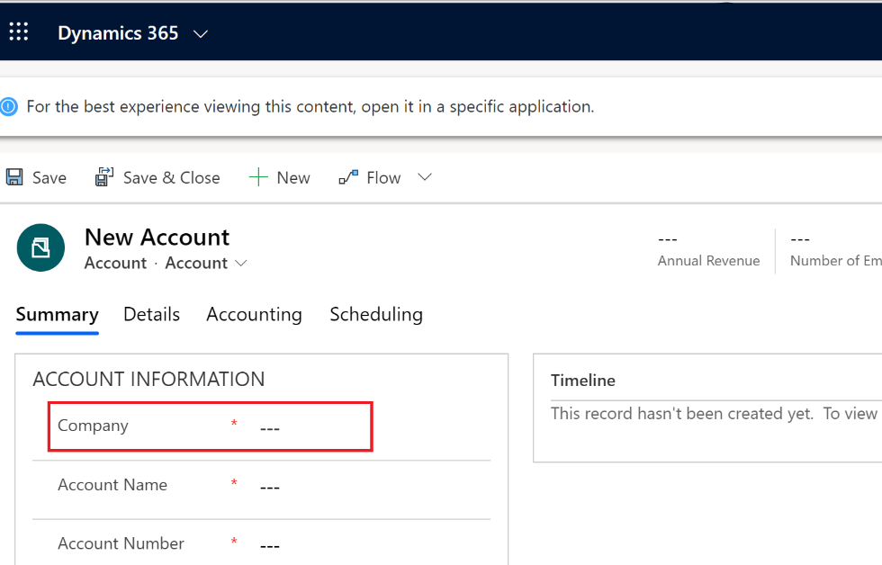

# Verify dual-write configuration in finance and operations apps and Dataverse

[!include [banner](../../includes/banner.md)]

This article provides troubleshooting information for dual-write integration between finance and operations apps and Dataverse. Specifically, it explains how you can determine whether dual-write is configured in finance and operations apps and in Dataverse.

## Verify that dual-write is configured in a finance and operations app

To determine whether the errors that you see when you try to save rows for update come from dual-write, first verify that dual-write is configured.

+ If you have admin privileges in the finance and operations app, go to **Workspaces \> Data management**, and select the **Dual-write** tile. If the details of the linked environments and the list of table maps that are running are shown, dual-write is configured.

    

+ If you don't have admin privileges, you will receive an error message, *Unable to write data to entity \<entity name\>*. In the example in the following illustration, you can't create a customer row in the finance and operations app, because dual-write is configured, but the customer group and payment terms reference data don't exist in Dataverse.

    

For information about how to fix issues when you create data in finance and operations apps, see [Troubleshoot live synchronization issues](dual-write-troubleshooting-live-sync.md).

## Verify that dual-write is configured in Dataverse

When you create data, if you see the **Company** column on pages in Dataverse, dual-write is configured.

For information about how to fix issues when you create data in Dataverse, see [Troubleshoot live synchronization issues](dual-write-troubleshooting-live-sync.md).

For information about how to view error details if you encounter any errors while you create data in Dataverse, see [Enable and view the plug-in trace log in Dataverse to view error details](dual-write-troubleshooting.md#enable-view-trace).

[!INCLUDE[footer-include](../../../../includes/footer-banner.md)]
