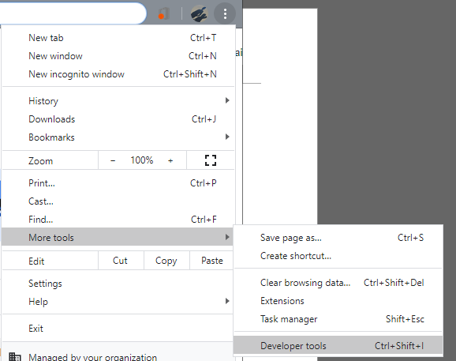
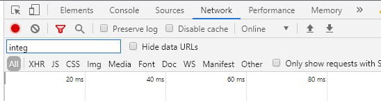
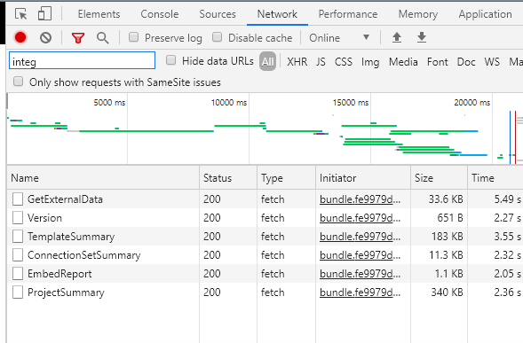
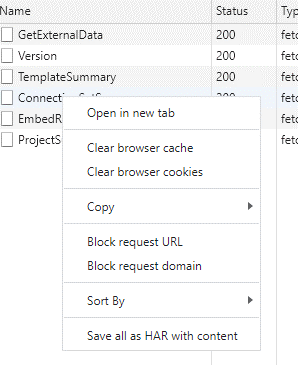
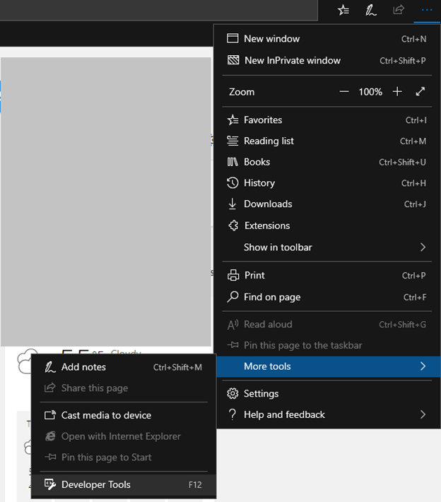
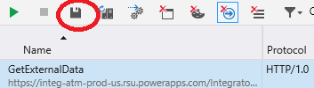

---
# required metadata

title: General troubleshooting
description: This topic provides general troubleshooting information for dual-write integration between Finance and Operations apps and Dataverse.
author: RamaKrishnamoorthy 
ms.date: 03/16/2020
ms.topic: article
ms.prod: 
ms.technology: 

# optional metadata

ms.search.form: 
# ROBOTS: 
audience: Application User, IT Pro
# ms.devlang: 
ms.reviewer: rhaertle
# ms.tgt_pltfrm: 
ms.custom: 
ms.assetid: 
ms.search.region: global
ms.search.industry: 
ms.author: ramasri
ms.dyn365.ops.version: 
ms.search.validFrom: 2020-03-16

---

# General troubleshooting

[!include [banner](../../includes/banner.md)]

[!include [rename-banner](~/includes/cc-data-platform-banner.md)]

This topic provides general troubleshooting information for dual-write integration between Finance and Operations apps and Dataverse.

> [!IMPORTANT]
> Some of the issues that this topic addresses might require either the system admin role or Microsoft Azure Active Directory (Azure AD) tenant admin credentials. The section for each issue explains whether a specific role or credentials are required.

## Enable and view the plug-in trace log in Dataverse to view error details

**Required role to turn on the trace log and view errors:** System admin

To turn on the trace log, follow these steps.

1. Sign in to the customer engagement app, open the **Settings** page, and then, under **System**, select **Administration**.
2. On the **Administration** page, select **System Settings**.
3. On the **Customization** tab, in the **Plug-in and custom workflow activity tracing** column, select **All** to enable the plug-in trace log. If you want to log trace logs only when exceptions occur, you can select **Exception** instead.

To view the trace log, follow these steps.

1. Sign in to the customer engagement app, open the **Settings** page, and then, under **Customization**, select **Plug-in Trace Log**.
2. Find the trace logs where the **Type Name** column is set to **Microsoft.Dynamics.Integrator.DualWriteRuntime.Plugins.PreCommmitPlugin**.
3. Double-click an item to view the full log, and then, on the **Execution** FastTab, review the **Message Block** text.

## Enable debug mode to troubleshoot live synchronization issues in Finance and Operations apps

**Required role to view the errors:** System admin
Dual-write errors that originate in Dataverse can appear in the Finance and Operations app. In some cases, the full text of the error message isn't available because the message is too long or contains personally identifying information (PII). You can turn on verbose logging for errors by following these steps.

1.	For all project configurations in Finance and Operations app there is a flag IsDebugMode on DualWriteProjectConfiguration entity.
2.	Open the entity in Excel addin. An easy way to do it is to enable design mode in Finance and Operations app excel addin and add the DualWriteProjectConfigurationEntity to the sheet. Refer to https://docs.microsoft.com/en-us/dynamics365/fin-ops-core/dev-itpro/office-integration/use-excel-add-in  for more info on excel addins.
3.	Set the IsDebugMode to Yes on the project in question.
4.	Run the scenario that is generating errors.
5.	The verbose logs are available on DualWriteErrorLog table.
6.	To lookup data on table browser use the following link https://XXXaos.cloudax.dynamics.com/?mi=SysTableBrowser&tableName=DualWriteErrorLog  (replace XXX as appropriate):
7.	Update after KB 4595434 (available for PU 37 and above) If you have this kb installed then the debug mode will capture more logs.  Detailed Error Message will capture the batch request Formatted as follows { "entityName": "UnitOfMeasureEntity", "externalEntityName": "uoms", "executionStatus": 2, "fieldResponses": [], "recordResponses": [ { "errorMessage": "Request failed with status code InternalServerError and CDS error code : Internal Server Error", "logDateTime": "2020-12-08T00:14:28.2746686Z", "verboseError": "Batch response detailed error {"Message":"ValidateClosed - Db GetCreateConnection() should be closed on End","ExceptionMessage":"ValidateClosed - Db GetCreateConnection() should be closed on End","ExceptionType":"Microsoft.Crm.CrmException","StackTrace":" at Microsoft.Crm.CrmDbConnection.ValidateClosed(Boolean raiseException)\r\n at Microsoft.Crm.LegacySqlDataAccessContextImplementation.EndRequest()\r\n at Microsoft.Crm.SqlDataAccessContext.OnEndRequest()\r\n at Microsoft.Crm.BusinessEntities.ExecutionContext.OnEndRequest()\r\n at Microsoft.Crm.Extensibility.OData.CrmODataBatchHandler.<ExecuteChangeSetAsync>d__10.MoveNext()\r\n--- End of stack trace from previous location where exception was thrown ---\r\n at System.Runtime.ExceptionServices.ExceptionDispatchInfo.Throw()\r\n at Microsoft.Crm.Extensibility.OData.CrmODataBatchHandler.<ExecuteRequestMessagesImplAsync>d__15.MoveNext()\r\n--- End of stack trace from previous location where exception was thrown ---\r\n at System.Runtime.ExceptionServices.ExceptionDispatchInfo.Throw()\r\n at System.Runtime.CompilerServices.TaskAwaiter.HandleNonSuccessAndDebuggerNotification(Task task)\r\n at Microsoft.Crm.Extensibility.OData.CrmODataBatchHandler.<>c__DisplayClass8_0.<<ExecuteRequestMessagesAsync>b__0>d.MoveNext()\r\n--- End of stack trace from previous location where exception was thrown ---\r\n at System.Runtime.ExceptionServices.ExceptionDispatchInfo.Throw()\r\n at System.Runtime.CompilerServices.TaskAwaiter.HandleNonSuccessAndDebuggerNotification(Task task)\r\n at Microsoft.Crm.Extensibility.OData.CrmODataBatchHandler.<ExecuteRequestMessagesAsync>d__8.MoveNext()\r\n--- End of stack trace from previous location where exception was thrown ---\r\n at System.Runtime.ExceptionServices.ExceptionDispatchInfo.Throw()\r\n at System.Runtime.CompilerServices.TaskAwaiter.HandleNonSuccessAndDebuggerNotification(Task task)\r\n at System.Web.OData.Batch.DefaultODataBatchHandler.<ProcessBatchAsync>d__0.MoveNext()\r\n--- End of stack trace from previous location where exception was thrown ---\r\n at System.Runtime.ExceptionServices.ExceptionDispatchInfo.Throw()\r\n at System.Runtime.CompilerServices.TaskAwaiter.HandleNonSuccessAndDebuggerNotification(Task task)\r\n at System.Web.Http.Batch.HttpBatchHandler.<SendAsync>d__0.MoveNext()","ErrorCode":"0x8004023e"} " } ], "isErrorCountUpdated": false, "dualWriteProcessingStage": 4, "debugLogTrace": [ "CDS batch request --batch_4225728f-0c74-40ae-9598-ad7bdf9240a6\r\n Content-Type: multipart/mixed; boundary=changeset_d6a69b31-8b5d-4f6f-a365-281a45f2e416\r\n\r\n --changeset_d6a69b31-8b5d-4f6f-a365-281a45f2e416\r\nContent-Type: application/http\r\nContent-Transfer-Encoding: binary\r\n\r\nPOST /api/data/v9.0/uoms?tag=https://dualwrite718b5367ceebc804aos.cloudax.dynamics.com HTTP/1.1\r\nHost: test.crm.dynamics.com \r\nContent-ID: 1\r\nContent-Type: application/json; charset=utf-8\r\n\r\n{"msdyn_symbol":"pr","msdyn_externalunitclassname":"Quantity","msdyn_decimalprecision":0,"msdyn_isbaseunit":"false","msdyn_issystemunit":"false","msdyn_systemofunits":"192350000","name":"pr","msdyn_description":"Pairs"}\r\n--changeset_d6a69b31-8b5d-4f6f-a365-281a45f2e416--\r\n\r\n --batch_4225728f-0c74-40ae-9598-ad7bdf9240a6--" ] }
verboseError: Captures the long text of the error from CRM. This can be used to get more context information while debugging. debugLogTrace : Captures the actual batch request sent to CRM along with payload.

## Check synchronization errors on the virtual machine for the Finance and Operations app

**Required role to view the errors:** System administrator

1. Sign in to Microsoft Dynamics Lifecycle Services (LCS).
2. Open the LCS project that you chose to do the dual-write testing for.
3. Select the **Cloud-hosted environments** tile.
4. Use Remote Desktop to sign in to the virtual machine (VM) for the Finance and Operations app. Use the local account that is shown in LCS.
5. Open Event viewer.
6. Select **Applications and Services Logs \> Microsoft \> Dynamics \> AX-DualWriteSync \> Operational**.
7. Review the list of recent errors.

## Unlink and link another Dataverse environment from a Finance and Operations app

**Required role to unlink the environment:** System administrator for either Finance and Operations app or Dataverse.

1. Sign in to the Finance and Operations app.
2. Go to **Workspaces \> Data management**, and select the **Dual Write** tile.
3. Select all running mappings, and then select **Stop**.
4. Select **Unlink environment**.
5. Select **Yes** to confirm the operation.

You can now link a new environment.

## Unable to view the sales order line Information form 

When you create a sales order in Dynamics 365 Sales, clicking on **+ Add products** might redirect you to the Dynamics 365 Project Operations order line form. There is no way from that form to view the sales order line **Information** form. The option for **Information** does not appear in the dropdown below **New Order Line**. This happens because Project Operations has been installed in your environment.

To re-enable the **Information** form option, follow these steps:
1. Navigate to the **Order Line** table.
2. Find the **Information** form under the forms node. 
3. Select the **Information** form and click **Enable security roles**. 
4. Change the security setting to **Display to everyone**.

## How to enable and save network trace so that traces can be attached to support tickets?
    
The Microsoft dual write product team would need to see the network traces to troubleshoot some of the dual write related issues. Follow the below steps to get the traces so that these can be attached to support tickets.
    
### Chrome
    
1.	In the opened tab, press [F12] or choose [Developer tools] to open the develop tools.
    
    
    
2. Switch to [network] tab and type [integ] in the filter text box
            
          
                
3.	Continue with the repro and observe the requests being logged in the [network] tab
                   
                             
                     
4.	 Right click on any one of the entries and select [Save all as a HAR with content]
     
     
                                
### Microsoft Edge
    
1.	In the opened tab, press [F12] or choose [developer tools] to open browser’s developer tools.
                                  
     
       
2.	Switch to [network] tab and continue with the repro
        
3.	Click [save] button to export as HAR
    
                                           
    

    
    

[!INCLUDE[footer-include](../../../../includes/footer-banner.md)]
