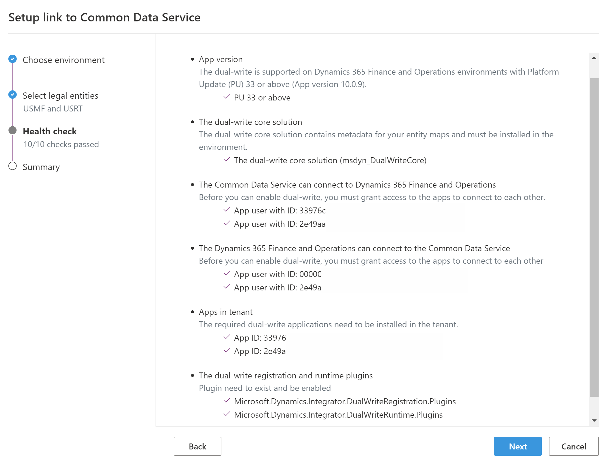
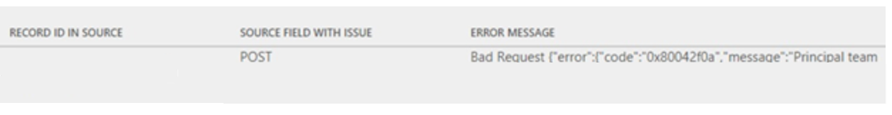
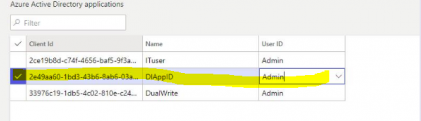

---
# required metadata

title: Troubleshooting guide for dual-write
description: This topic provides troubleshooting information for dual-write integration between Finance and Operations apps and Common Data Service.
author: RamaKrishnamoorthy 
manager: AnnBe
ms.date: 03/16/2020
ms.topic: article
ms.prod: 
ms.service: dynamics-ax-applications
ms.technology: 

# optional metadata

ms.search.form: 
# ROBOTS: 
audience: Application User, IT Pro
# ms.devlang: 
ms.reviewer: rhaertle
ms.search.scope: Core, Operations
# ms.tgt_pltfrm: 
ms.custom: 
ms.assetid: 
ms.search.region: global
ms.search.industry: 
ms.author: ramasri
ms.dyn365.ops.version: 
ms.search.validFrom: 2020-03-16

---

# Troubleshooting guide for dual-write

[!include [banner](../../includes/banner.md)]

[!include [preview-banner](../../includes/preview-banner.md)]

This topic provides troubleshooting information for dual-write integration between Finance and Operations apps and Common Data Service.

> [!IMPORTANT]
> Many of the issues that this topic addresses require either the system admin role or Microsoft Azure Active Directory (Azure AD) tenant admin credentials. The section for each of these issues explains the role or credentials that are required.

## Validate whether dual-write is configured in a Finance and Operations app

To determine whether the errors that you see when you try to save records for update come from dual-write, first verify that dual-write is configured.

+ If you have admin privileges in the Finance and Operations app, go to **Workspaces \> Data management**, and select the **Dual Write** tile. If the details of the linked environments and the list of entity maps that are running are shown, dual-write is configured.

    

+ If you don't have admin privileges, you will receive an error message. In the example in the following illustration, you can't create a customer record in the Finance and Operations app, because dual-write is configured, but the customer group and payment terms reference data don't exist in Common Data Service.

    

For information about how to fix issues when you create data in Finance and Operations apps, see the [Live synchronization issues](#live-synchronization-issues) section.

## Validate whether dual-write is configured in Common Data Service

When you create data, if you see the **Company** field on pages in Common Data Service, dual-write is configured.


For information about how to fix issues when you create data in Common Data Service, see the [Live synchronization issues](#live-synchronization-issues) section.

For information about how to view error details if you encounter any errors while you create data in Common Data Service, see the [Enable and view the plug-in trace log in Common Data Service to view error details](#enable-and-view-the-plug-in-trace-log-in-common-data-service-to-view-error-details) section.

## Issues during initial setup

### You can't link a Finance and Operations app to Common Data Service

**Required credentials to set up dual-write:** Azure AD tenant admin

Errors on the **Setup link to Common Data Service** page are usually caused by incomplete setup or permissions issues. Make sure that the whole health check passes on the **Setup link to Common Data Service** page, as shown in the following illustration. You can't link dual-write unless the whole health check passes.



You must have Azure AD tenant admin credentials to link the Finance and Operations and Common Data Service environments. After you link the environments, users can sign in by using their account credentials and update an existing entity map.

### Error when you open the Link to Common Data Service page

**Required credentials to fix the issue:** Azure AD tenant admin

You might receive the following error message when you open the **Link to Common Data Service** page in a Finance and Operations app:

*Response status code does not indicate success: 404 (Not Found).*


This error occurs when the consent step hasn't been completed. To validate whether the consent step has been completed, sign in to portal.Azure.com by using the Azure AD tenant admin account, and see whether the third-party app that has the ID **33976c19-1db5-4c02-810e-c243db79efde** appears in the Azure AD **Enterprise applications** list. If it does not, then you must provide app consent.

To provide app consent, follow these steps.

1. Open the following URL by using your admin credentials. You should be prompted for consent.

    <https://login.microsoftonline.com/common/oauth2/authorize?client_id=33976c19-1db5-4c02-810e-c243db79efde&response_type=code&prompt=admin_consent>

2. Select **Accept** to indicate that you're giving your consent to install the app that has the ID **33976c19-1db5-4c02-810e-c243db79efde** in your tenant.

    > [!TIP]
    > This app is required to link Common Data Service and Finance and Operations apps. If you have trouble with this step, open your browser in incognito mode (in Google Chrome) or InPrivate mode (in Microsoft Edge).

### Validate whether company data and dual-write teams are set up correctly during linking

To ensure that dual-write works correctly, the companies that you select during configuration are created in the Common Data Service environment. By default, these companies are read-only, and the **IsDualWriteEnable** property is set to **True**. In addition, the default owning business unit owner and team are created and include the company name. Before you enable the maps, verify that the default team owner is specified. To find the **Companies (CDM_Company)** entity, follow these steps.

1. In the model-driven app in Dynamics 365, select the filter in the upper-right corner.
2. In the drop-down list, select **Company**.
3. Select **Run** to see the results.
4. Select the company that was linked when you configured dual-write.
5. Verify that the **Default owning team** field has a value. In the following illustration, the **Default owning team** field is set to **USMF Dual Write**.

    

### Find the limit on the number of legal entities or companies that can be linked for dual-write

You might receive the following error message when you try to enable maps:

*Dual write failure - Plugin registration failed: \[(Unable to get partition map
for project
DWM-1ae35e60-4bc2-4905-88ea-69efd3b29260-7f12cb89-1550-42e2-858e-4761fc1443ea.
Error Exceeds the maximum partitions allowed for mapping
DWM-1ae35e60-4bc2-4905-88ea-69efd3b29260-7f12cb89-1550-42e2-858e-4761fc1443ea)\],
One or more errors occurred.*

The current limit when you link the environments is approximately 40 legal entities. This error occurs if you try to enable maps, and more than 40 legal entities are linked between the environments.

## Dual-write module issues in Finance and Operations apps

### You can't load the Dual-write module in a Finance and Operations app

If you can't open the **Dual-write** page by selecting the **Dual Write** tile in the **Data management** workspace, the data integration service is probably down. Create a support ticket to request a restart of the data integration service.

### Error when you try to create a new entity mapping

**Required credentials to fix the issue:** Azure AD tenant admin

You might receive the following error message when you try to configure a new entity for dual-write:

*Response status code does not indicate success: 401 (Unauthorized)*


This error occurs because only an Azure AD tenant admin can add a new entity mapping.

To fix the issue, sign in to the Finance and Operations app as an Azure AD admin tenant. You must also go to web.PowerApps.com and revalidate your connection.

### Error when you open the dual-write UI

You might receive the following error message when you try to access dual-write from the **Data management** workspace:

*`login.microsoftonline.com` refused to connect.*


To fix the issue, sign in by using an InPrivate window in Microsoft Edge, an incognito window in Chromium, or an incognito window in Chrome. You must also unblock or clear third-party cookies.

### Error when you link the environment for dual-write or add a new entity mapping

**Required credentials to fix the issue:** Azure AD tenant admin

You might encounter the following error when linking or creating maps:

*\[Forbidden\],
\[{"status":403,"source":"`https://unitedstates-002.token.azure-apim.net:443/tokens/unitedstates-002/dynamicsax/f2295c0a-8742-4c24-982e-979454b69d59/exchange`","message":"Error
from token exchange: User
0648bd87-a849-4125-8e64-fa1d7202df30\@62b279ed-6474-4b63-99b6-42ce18678555 is
not allowed to access connection
unitedstates-002/dynamicsax/f2295c0a-8742-4c24-982e-979454b69d59"}\], The remote
server returned an error: (403) Forbidden. Session ID:
4bf3fc02-f6df-4aab-8068-ee14decc3a86 Root Activity ID:
8b9ff043-a0d6-4994-bf40-cb5078026890*


This error can occur if you don't have sufficient permissions to link dual-write or create maps. You must use an Azure AD tenant admin account to link environments and add new entity mappings. However, after setup, you can use a non-admin account to monitor status and edit the mappings.

### Error when you stop the entity mapping

You might receive the following error message when you try to stop the entity mappings:

*\[Forbidden\], \[{"status":403,"source":"","message":"Error from token exchange:
User is not allowed to access connection
dynamicscrmonline/xxxxxx-xxxx-xxxx-xxxxxxxx"}\], The remote server returned an
error: (403) Forbidden.*

This error occurs when the linked Common Data Service environment isn't available.

To fix the issue, create a ticket for the Data Integration team. Attach the network trace so that the Data Integration team can mark the maps as **Not running** in the back end.

## Live synchronization issues

### Live synchronization throws a 403 Forbidden error when you create a record in a Finance and Operations app

You might receive the following error message when you create a record in a Finance and Operations app:

*\[{\\"error\\":{\\"code\\":\\"0x80072560\\",\\"message\\":\\"The user is not a
member of the organization.\\"}}\], The remote server returned an error: (403)
Forbidden."}}".*

To fix the issue, follow the steps in [Prerequisites for enabling dual-write](). To complete those steps, the dual-write application users who are created in Common Data Service must have the system admin role. The default owning team must also have the system admin role.

### Live synchronization for any entity consistently throws a similar error when you create a record in a Finance and Operations app

**Required role to fix the issue:** System admin

You might receive the following error message every time that you try to save entity data in a Finance and Operations app:

*Cannot save the changes to the database. Unit of Work can not commit transaction. Unable to write data to entity uoms. Writes to UnitOfMeasureEntity failed with error message Unable to sync with entity uoms.*

To fix the issue, you must make sure that the prerequisite reference data exists in both the Finance and Operations app and Common Data Service. For example, if the customer that you're in the Finance and Operations app belongs to a specific customer group, make sure that the customer group exists in Common Data Service.

If data exists on both sides, and you've confirmed that the issue isn't data-related, follow these steps.

1. Stop the related entity.
2. Sign in to the Finance and Operations app, and make sure that records for the failing entity exist in the DualWriteProjectConfiguration and DualWriteProjectFieldConfiguration tables. For example, here is what the query looks like if the **Customers** entity is failing.

    ```sql
    Select projectname, externalenvironmentURL ,\* 
    from DUALWRITEPROJECTCONFIGURATION 
    where INTERNALENTITYNAME = 'Customers V3' and
        EXTERNALENTITYNAME = 'accounts' 
    ```

3. If there are records for the failing entity even after you stop the entity mapping, delete the records that are related to the failing entity. Make a note of the **projectname** column in the DualWriteProjectConfiguration table, and fetch the record in the DualWriteProjectFieldConfiguration table by using the project name to delete the record.
4. Start the entity mapping. Validate whether the data is synced without any issues.

### Handle read or write privilege errors when you create data in a Finance and Operations app

You might receive a "Bad Request" error message that resembles the following example when you create data in a Finance and Operations app.



To fix the issue, you must assign the correct security role to the team of the mapped Dynamics 365 Sales or Dynamics 365 Customer Service business unit to enable the missing privilege.

1. In the Finance and Operations app, find the business unit that is mapped in the Data Integration connection set.

    

2. Sign in to the environment in the model-driven app in Dynamics 365, and then, on the [Setting…Security]() page, find the team of the mapped business unit.

    

3. Open the page for the team for editing, and then select **Manage roles** to open the **Manage Team Roles** dialog box.

    

4. Assign the role that has the read/write privilege for the relevant entities, and then select **OK**.

### Fix synchronization issues in an environment that has a recently changed Common Data Service environment

**Required role to fix the issue:** System admin

You might receive the following error message when you create data in a Finance and Operations app:

*{"entityName":"CustCustomerV3Entity","executionStatus":2,"fieldResponses":\[\],"recordResponses":\[{"errorMessage":"**Unable
to generate payload for entity
CustCustomerV3Entity**","logDateTime":"2019-08-27T18:51:52.5843124Z","verboseError":"Payload
creation failed with error Invalid URI: The URI is
empty."}\],"isErrorCountUpdated":true}*

Here is what the error looks like in the model-driven app in Dynamics 365:

*An unexpected error occurred from ISV code. (ErrorType = ClientError) Unexpected exception from plug-in (Execute): Microsoft.Dynamics.Integrator.CrmPlugins.Plugin: System.Exception: failed to process entity account - (A connection attempt failed because the connected party did not properly respond after a period of time, or established connection failed because connected host has failed to respond*

This error occurs when the Common Data Service environment is incorrectly reset at the same time that you try to create data in the Finance and Operations app.

To fix the issue, follow these steps.

1. Sign in to the Finance and Operations virtual machine (VM), open SQL Server Management Studio (SSMS), and look for records in the DUALWRITEPROJECTCONFIGURATIONENTITY table where **internalentityname** equals **Customers V3** and **externalentityname** equals **accounts**. Here is what the query looks like.

    ```sql
    select projectname, externalenvironmentURL ,\* 
    from DUALWRITEPROJECTCONFIGURATION 
    where INTERNALENTITYNAME = 'Customers V3' and EXTERNALENTITYNAME = 'accounts'
    ```

2. Use the project name from the results of the previous query to run the following query.

    ```sql
    select \* 
    from DUALWRITEPROJECTFIELDCONFIGURATION 
    where projectname = <project name from previous query>
    ```

3. Make sure that the **externalenvironmentURL** column has the correct Common Data Service or app URL. Delete any duplicate records that point to the wrong Common Data Service URL. Delete the corresponding records in the DUALWRITEPROJECTFIELDCONFIGURATION and DUALWRITEPROJECTCONFIGURATION tables.
4. Stop the entity mapping, and then restart it

## Issues during the initial synchronization

### Check for initial synchronization errors in a Finance and Operations app

After you enable the mapping templates, the status of the maps should be **Running**. If the status is **Not running**, errors occurred during initial synchronization. To view the errors, select the **Initial sync details** tab on the **Dual-write** page.


### You can't complete initial synchronization: 400 Bad Request

**Required role to fix the issue:** System admin

You might receive the following error message when you try to run the mapping and initial synchronization:

*The remote server returned an error: (400) Bad Request.), AX export encountered an error*

Here is an example of the full error message.

```console
Dual write Initial Sync completed with status: Error. Following are the details:
Executed leg: From AX Financial dimensions to CRM msdyn_dimensionattributes
with exported records count: 0, ImportRecordsErrorCount: 0,
ImportRecordsInsertedCount: 0 and ImportRecordsUpdatedCount: 0
ErrorsDetails:
Dual write Initial sync failed
Message: ([Bad Request], The remote server returned an error: (400) Bad Request.), AX export encountered an error
Stacktrace: at
Microsoft.Dynamics.Integrator.QueryGenerator.AxClient.\<ExportAxPackage\>d__16.MoveNext()
in X:\\bt\\1024532\\repo\\src\\Core\\QueryGenerator\\AxClient.cs:line 265
\--- End of stack trace from previous location where exception was thrown ---
at System.Runtime.ExceptionServices.ExceptionDispatchInfo.Throw()
at System.Runtime.CompilerServices.TaskAwaiter.HandleNonSuccessAndDebuggerNotification(Task task)
at Microsoft.D365.ServicePlatform.Context.ServiceContext.Activity.\<ExecuteAsync\>d__11\`2.MoveNext()
\--- End of stack trace from previous location where exception was thrown ---
```

If this error occurs consistently, and you can't complete the initial synchronization, follow these steps to fix the issue.

1. Sign in to the VM for the Finance and Operations app.
2. Open Microsoft Management Console. 
3. In the **Services** pane, make sure that the Microsoft Dynamics 365 Data import export framework service is running. Restart it if it has been stopped, because the initial synchronization requires it.

### Initial synchronization error: 403 Forbidden

You might receive the following error message during initial synchronization:

*(\[Forbidden\], The remote server
returned an error: (403) Forbidden.), AX export encountered an error*

To fix the issue, follow these steps.

1. Sign in to the Finance and Operations app.
2. On the **Azure Active Directory applications** page, delete the **DtAppID** client, and then add it again.



### Self-reference failures during initial synchronization

You might receive an error message that resembles the following example if any of your mappings have self-references:

*On the Vendors V2, the following error: Record Id: new record, ErrorMessage:
Couldn't resolve the guid for the field:
msdyn\_invoicevendoraccountnumber.msdyn\_vendoraccountnumber. The lookup value was
not found: CN-001. Try this URL(s) to check if the reference data exists:
`https://sampleorg.crm.dynamics.com/api/data/v9.0/msdyn_vendors?$select=msdyn_vendoraccountnumber,msdyn_vendorid&$filter=msdyn_vendoraccountnumber`
eq 'CN-001'*

This type of error occurs during initial synchronization of mappings that have self-references. In the preceding example, the field invoice account references the vendor entity.

To fix the issue, you might have to run the mapping two times before the initial synchronization is successful.

For more specific steps for the initial synchronization of entity mappings, see the [Initial sync related and other known issues](#initial-sync-related-and-other-known-issues) section.

## Issues related to solution awareness

### Error on the Dual-write page

On the **Dual-write** page, you might receive an error message that resembles the following example:

*The entity with a name 'msdyn\_dualwriteentitymap' with namemapping='Logical' was not found in the MetadataCache.*


To fix the issue, make sure that the dual-write core solution is installed in Common Data Service. The dual-write core solution is a prerequisite for solution awareness.

## Issues related to upgrades of Finance and Operations apps

**Required role to fix the issue:** System admin

### Database synchronization errors

You might receive an error message that resembles the following example when you try to use the **DualWriteProjectConfiguration** entity to update a Finance and Operations app to Platform update 30.

```console
Infolog diagnostic message: 'Cannot select a record in Dual write project sync (DualWriteProjectConfiguration). The SQL database has issued an error.' on category 'Error'. 10/28/2019 15:18:20: Infolog diagnostic message: 'Object Server Database Synchronizer: ' on category 'Error'. 10/28/2019 15:18:20: Infolog diagnostic message: '[Microsoft][ODBC Driver 17 for SQL Server][SQL Server]Invalid column name 'ISDELETE'.' on category 'Error'. 10/28/2019 15:18:20: Infolog diagnostic message: 'SELECT T1.PROJECTNAME,T1.EXTERNALENTITYNAME,T1.INTERNALENTITYNAME,T1.EXTERNALENVIRONMENTURL,T1.STATUS,T1.ENABLEBATCHLOOKUP,T1.PARTITIONMAP,T1.QUERYFILTEREXPRESSION,T1.INTEGRATIONKEY,T1.ISDELETE,T1.ISDEBUGMODE,T1.RECVERSION,T1.PARTITION,T1.RECID FROM DUALWRITEPROJECTCONFIGURATION T1 WHERE (PARTITION=5637144576)' on category 'Error'. 10/28/2019 15:18:20: Infolog diagnostic message: 'session 1043 (Admin)' on category 'Error'. 10/28/2019 15:18:20: Infolog diagnostic message: 'Stack trace: Call to TTSCOMMIT without first calling TTSBEGIN.' on category 'Error'.
10/28/2019 15:18:20: Application configuration sync failed.
Microsoft.Dynamics.AX.Framework.Database.TableSyncException: Custom action threw exception(s), please investigate before synchronizing again: 'InfoException:Stack trace: Call to TTSCOMMIT without first calling TTSBEGIN."
```

To fix the issue, follow these steps.

1. Sign in to the VM for the Finance and Operations app.
2. Open Visual Studio as an admin, and open the Application Object Tree (AOT).
3. Search for **DualWriteProjectConfiguration**.
4. In the AOT, right-click **DualWriteProjectConfiguration**, and select **Add to new project**. Select **OK** to create the new project that uses default options.
5. In Solution Explorer, right-click **Project properties**, and set **Synchronize Database on Build** to **True**.
6. Build the project, and confirm that the build is successful.
7. On the **Dynamics 365** menu, select **Synchronize database**.
8. Select **Synchronize** to do a full database synchronization.
9. After the full database synchronization is successful, rerun the database synchronization step in Microsoft Dynamics Lifecycle Services (LCS)/manual upgrade scripts as applicable, so that you can proceed with the update.

### Missing entity fields issue on maps

**Required role to fix the issue:** System admin

On the **Dual-write** page, you might receive an error message that resembles the following example:

*Missing source field PRODUCTNAME in the schema.*


To fix the issue, first follow these steps to make sure that the fields are in the entity.

1. Sign in to the VM for the Finance and Operations app.
2. Go to **Workspaces \> Data management**, select the **Framework parameters** tile, and then, on the **Entity settings** tab, select **Refresh entity list** to refresh the entities.

    

3. Go to **Workspaces \> Data management**, select the **Data entities** tab, and make sure that the entity is listed.

    If the entity isn't listed, sign in to the VM for the Finance and Operations app, and make sure the entity is available.

4. Open the **Entity mapping** page from the **Dual-write** page in the Finance and Operations app.
5. Select **Refresh entity list** to automatically fill the fields in the entity mappings.

If the issue still isn't fixed, follow these steps.

> [!IMPORTANT]
> These steps guide you through the process of deleting an entity and then adding it again. To avoid issues, be sure to follow the steps exactly.

1. In the Finance and Operations app, go to **Workspaces \> Data management**, and select the **Data entities** tile.
2. Find the entity that is missing the field. Make a note of the target entity, staging table, entity name, and other column values.
3. If any of your processing groups depend on this entity, take appropriate action for the processing groups before you delete the entity.
4. Delete the entity that is missing the field.
5. Select **New**, and add the entity back. Specify the values that you made a note of in step 2.
6. Open the **Entity mapping** page from the **Dual-write** page in the Finance and Operations app.
7. Select **Refresh entity list** to automatically fill the fields in the entity mappings.

## General troubleshooting

### When you try to install the dual-write package by using package deployer, no available solutions are shown

Some versions of the package deployer tool are incompatible with the dual-write solution package. To successfully install the package, be sure to use [version 9.1.0.20](https://www.nuget.org/packages/Microsoft.CrmSdk.XrmTooling.PackageDeployment.Wpf/9.1.0.20) or later of the package deployer tool.

After you install the package deployer tool, install the solution package by following these steps.

1. Download the latest solution package file from Yammer.com. After the package zip file is downloaded, right-click it, and select **Properties**. Select the **Unblock** check box, and then select **Apply**. If you don't see the **Unblock** check box, the zip file is already unblocked, and you can skip this step.

    

2. Extract the package zip file, and copy all the files in the **Dynamics365FinanceAndOperationsCommon.PackageDeployer.2.0.438** folder.

    

3. Paste all the copied files into the **Tools** folder of the package deployer tool. 
4. Run **PackageDeployer.exe** to select the Common Data Service environment and install the solutions.

    

### Enable and view the plug-in trace log in Common Data Service to view error details

**Required role to turn on trace and view errors:** System admin

To turn on the trace log, follow these steps.

1. Sign in to the Finance and Operations app, open the **Settings** page, and then, under **System**, select **Administration**.

    

2. On the **Administration** page, select **System Settings**.

    

3. On the **Customization** tab, in the **Plug-in and custom workflow activity tracing** field, select **All** to enable the plug-in trace log. If you want to log trace logs only when exceptions occur, you can select **Exception** instead.

    

To view the trace log, follow these steps.

1. Sign in to the Finance and Operations app, open the **Settings** page, and then, under **Customization**, select **Plug-in Trace Log**.

    

2. Find the trace logs where the **Type Name** field is set to **Microsoft.Dynamics.Integrator.CrmPlugins.Plugin**.

    

3. Double-click an item to view the full log, and then, on the **Execution** FastTab, review the **Message Block** text.

    

### Enable debug mode to troubleshoot live synchronization issues in Finance and Operations apps

**Required role to view the errors:** System admin

Dual-write errors that originate in Common Data Service can appear in the Finance and Operations app. In some cases, the full text of the error message isn't available because the message is too long or contains personally identifying information (PII). You can turn on verbose logging for errors by following these steps.

1. All project configurations in Finance and Operations apps have an **IsDebugMode** property in the **DualWriteProjectConfiguration** entity. Open the **DualWriteProjectConfiguration** entity by using the Excel add-in.

    > [!TIP]
    > An easy way to open the entity is to turn on **Design** mode in the Excel add-in and then add **DualWriteProjectConfigurationEntity** to the worksheet. For more information, see [Open entity data in Excel and update it by using the Excel add-in](../../office-integration/use-excel-add-in.md).

2. Set the **IsDebugMode** property to **Yes** for the project.
3. Run the scenario that is generating errors.
4. The verbose logs are available in the DualWriteErrorLog table. To look up data in the table browser, use the following URL (replace **XXX** as appropriate):

    `https://XXXaos.cloudax.dynamics.com/?mi=SysTableBrowser&tableName=>DualWriteErrorLog`

### Check synchronization errors in the VM for the Finance and Operations app

**Required role to view the errors:** System admin

1. Sign in to LCS.
2. Open the LCS project that you chose to do the dual-write testing for.
3. Select the **Cloud-hosted environments** tile.
4. Use Remote Desktop to sign in to the VM for the Finance and Operations app. Use the local account that is shown in LCS.
5. Open Event viewer.
6. Select **Applications and Services Logs \> Microsoft \> Dynamics \> AX-DualWriteSync \> Operational**.
7. Review the list of recent errors.

### Unlink and link another Common Data Service environment from a Finance and Operations app

**Required credentials to unlink the environment:** Azure AD tenant admin

1. Sign in to the Finance and Operations app.
2. Go to **Workspaces \> Data management**, and select the **Dual Write** tile.
3. Select all running mappings, and then select **Stop**.
4. Select **Unlink environment**.
5. Select **Yes** to confirm the operation.

You can now link a new environment.
