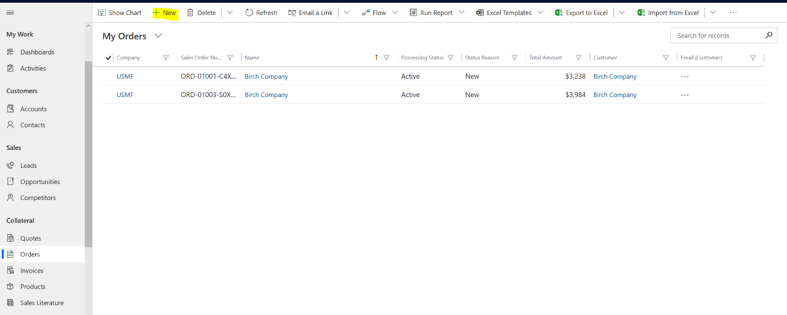
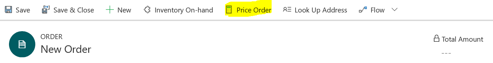
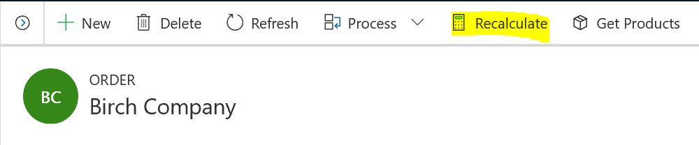
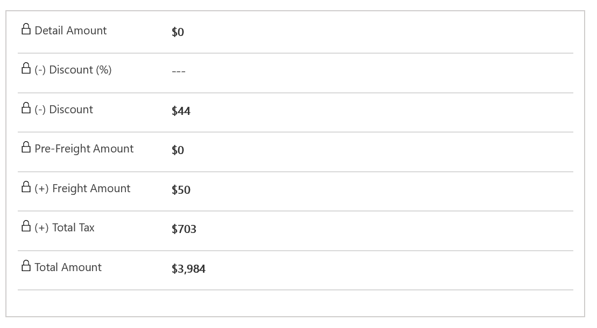
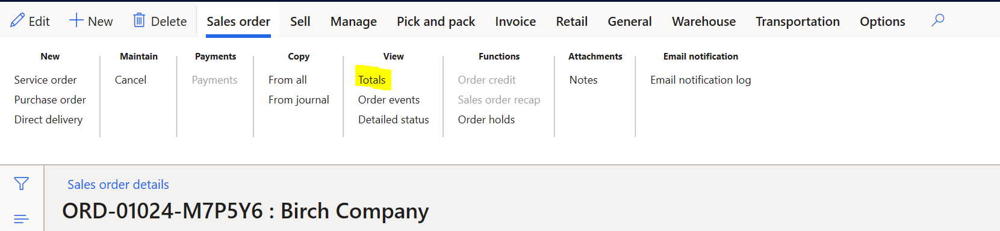
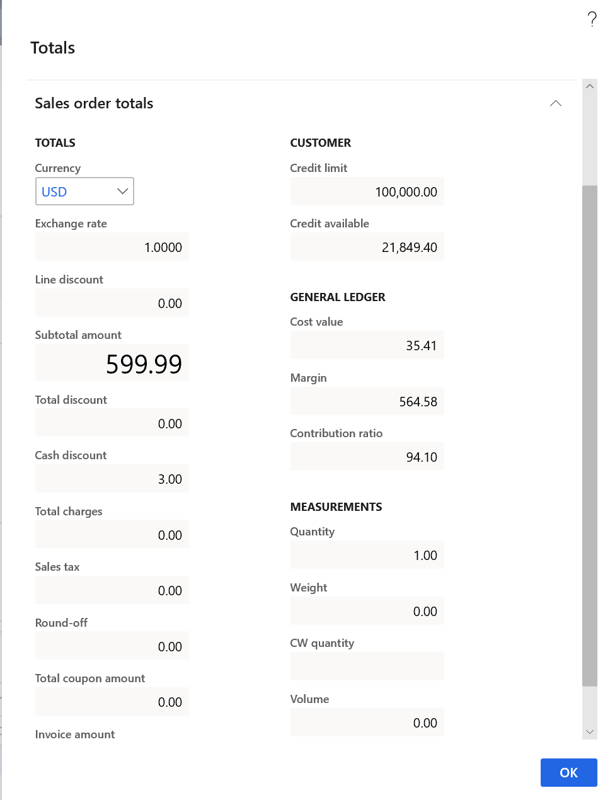
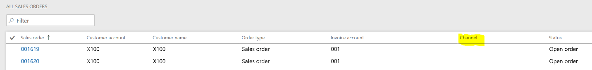

# Experience Dynamics 365 supply chain management price engine on-demand

This topic discusses how to use the Dual-Write Pricing functionality when
creating a sales quote or sales orders in Dynamics 365 for Sales.

Dynamics 365 for Sales does not have the amount of functionality and business
logic around pricing and trade agreements that Dynamics 365 for Supply Chain
Management has. The pricing functionality allows Dual-Write users to leverage
the rich functionality and setup in Supply Chain Management around pricing and
surface that in Sales.

### Using the Functionality

To use the functionality, go to your **Dynamics 365 Sales** environment and
navigate to **Sales \> Orders.**

-   Create a new order (or an existing order)

    

-   Add a new order line

-   In the top menu you will see a button that is labeled ‘**Price Order’** (the
    button will say ‘**Recalculate**’ for existing orders). Press this button

>   *New Order:*

*Existing Order:*

Once you press the button you will notice that all the following fields will get
populated:

-   Detail Amount

-   Discount %

-   Discount

-   Pre-Freight Amount

-   Freight Amount

-   Total Tax

-   Total Amount

### How it Works

When the ‘**Price Order**’ button is pressed it Sales it invokes the
‘**Totals**’ function in the **Sales Order \> View** tab in Supply Chain
Management for the associated Sales Order in Supply Chain Management. The values
in the Sales order total are used to populate the corresponding fields in Sales.

When the Sales Order Total is calculated in Supply Chain Management it goes
through the existing trade and sales agreements for the customer and products at
and calculated the Total values. When the ‘**Price Order’** button is invoked
all the setup done in Supply Chain Management automatically reflects in Sales.

### Limitations

When the fields get populated in Sales the following setup is not taken into
consideration:

-   Any setup regarding Charges and Charges allocation in Supply Chain
    Management is not replicated in Sales

-   Pricing does not take into consideration special Retail Pricing that is
    specified in the **Retail Channel** field in Supply Chain Management sales
    order line form

    

-   Discounts that are defined in the Trade Allowance Management section of
    Supply Chain Management are not considered.
