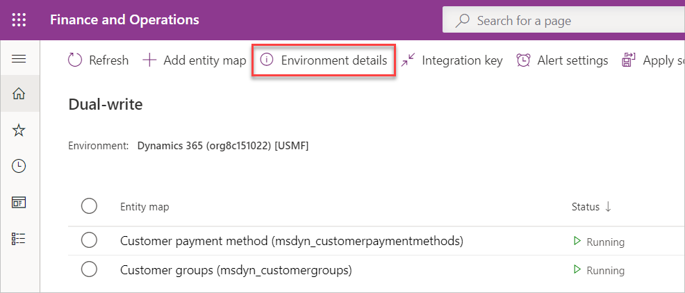
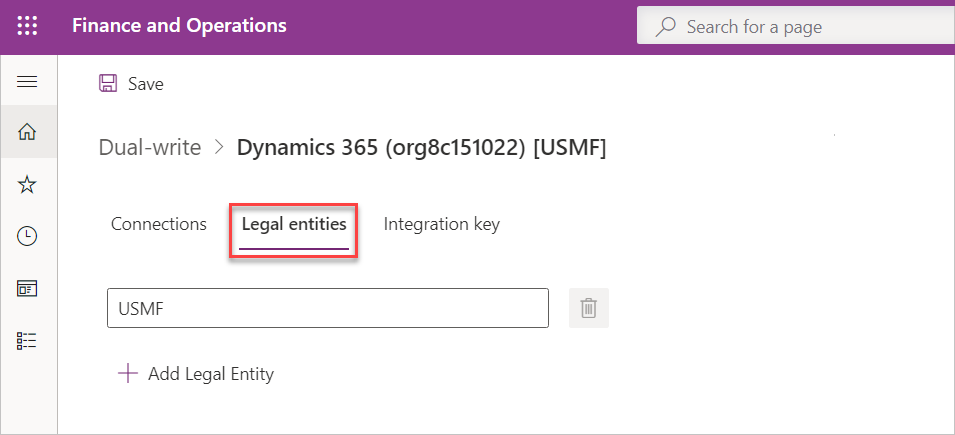
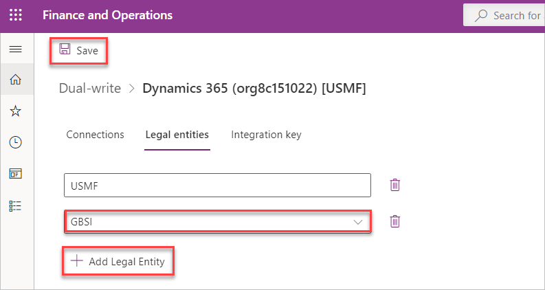
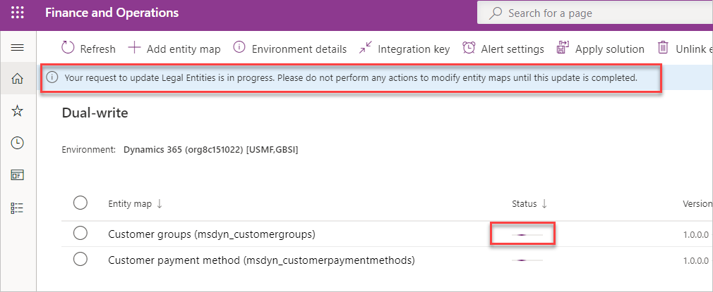
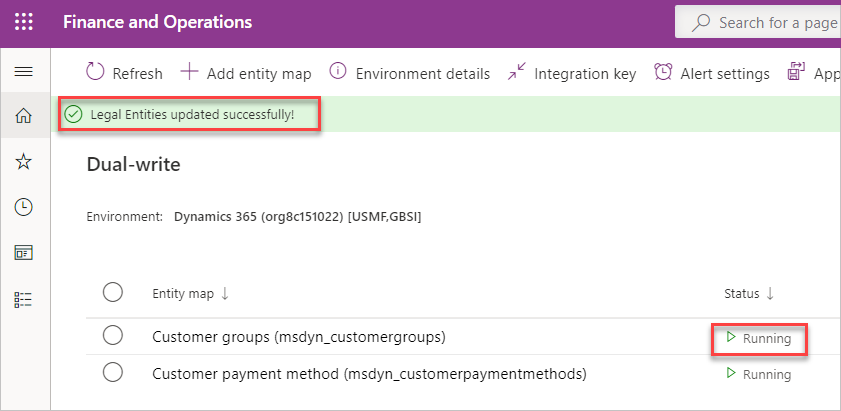

# Edit a legal entity after dual-write setup 

[!include [banner](../../includes/banner.md)]

The dual-write wizard enables you to add or remove a company or legal entity after dual-write has been set up. You can do this without having to unlink and relink your dual-write environment. 

The wizard enables you to link your finance and operations apps to Dataverse environments. As part of this wizard, you also can select one or more companies or legal entities. The company or legal entity list doesn’t remain static and is constantly changing. This is because you may need to add new companies, especially as part of a phased rollout or acquisitions. Until now, you were unable to add a company or legal entity without system down-time, which required you to unlink and relink your environment. All of this can be expensive, especially because of pre-existing data. With this feature, you can add a company in a live environment without the need to unlink your existing dual-write environment.

## Add a company or legal entity after dual-write has been set up 

Follow these steps to add a company or legal entity after dual-write has been set up.

1. On the **Dual-write table map** list page, select the **Environment details** button.

   

1. On the **Legal entities** tab, you see the company that you selected as part of the dual-write wizard to link environments. In this example, the company is USMF.

   

1. To add one or more companies to dual-write, select **Add legal entity**. For example, GBSI.

   

1. Determine if you want to skip initial writes for the legal entities you have added to the list by selecting or unselecting **Skip initial writes for newly added legal entities**.
1. Select **Save**.

   When you select **Save** the legal entities update. If the **Skip initial writes for newly added legal entities** option isn't selected, the table maps that are currently running or paused go through the initial write process by copying pre-existing data. Until the process completes, we recommend that you don't perform any actions to modify your table maps. 

   > [!NOTE]
   > Initial writes are supported for up to 40 legal entities. If the total number of legal entities in the list is greater than 40, initial writes aren't processed for the newly added legal entities.

   

   >[!NOTE]
   > This operation may fail if either of the following conditions are true: 
   >
   > * You add or remove a new company when one or more table maps is already in the Initial writes state. This the process where the system is copying pre-existing data. 
   >
   > * You remove a company when one or more table maps is in the Paused state. 

1. After the process is complete, a banner displays informing you that the legal entities have been updated successfully. You can now resume updates to your table maps. 

   

[!INCLUDE[footer-include](../../../../includes/footer-banner.md)]
