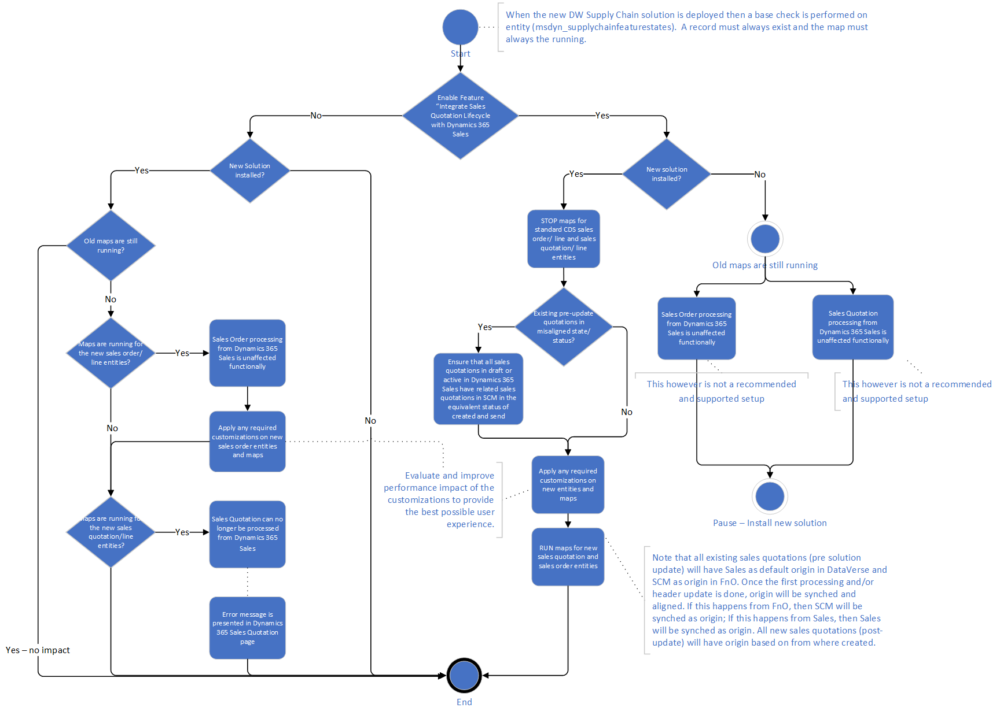

# How to enable Add efficiency in Quote to Cash with Dynamics 365 Sales 
[!include [banner](../../includes/banner.md)]

The new features introduced in Dynamics 365 Supply Chain Management with Add efficiency in Quote to Cash with Dynamics 365 Sales will only take effect with dual write supply chain  solution  XX.XX.XX. When updating to the new Dual-write Supply chain solution, the update can be disruptive if not done in the proper sequence.  

Below is the recommended and supported sequence of update steps to support that the update and uptake is as least disruptive as possible. 
## Steps
Once the new dual write supply chain solution has been installed and associated with a supply chain management instance version 10.0.32 or later, then perform the following steps in sequence. 

**Note**
New dual write supply chain solution is not compatible with the supply chain management instances version 10.0.31 or older.

### Step #1 Apply entity maps solution
In the Dual-write mapping page click Apply solution to import new entity maps. Mapping solution which contains new maps is called "Dynamics 365 Supply Chain Management extended entity maps". When the mapping solution is imported, the page will notify a user that the solution has been applied successfully.

### Step #2 Enable new entity map for feature status 
Run new entity map with initial sync enabled where Finance and Operations apps is selected as Master for initial sync:
Dynamics 365 Sales feature management states
Impact of step #2: 
Status of features in Dynamics 365 SCM is exposed to Dataverse and will be consumed by business logic executed in Dynamics 365 Sales. If the feature Integrate Sales Quotation lifecycle with Dynamics 365 Sales is enabled, user interaction for a sales quotation in both Dynamics 365 Sales and SCM will be impacted. The nature of the impact  will depend on ownership of the sales quotation. Exposing feature statuses to Dataverse ensures feature status consistency between the two applications. 
Sales Order status mapping changes will be in effect (learn more link).

**Note** This step #2 is mandatory. Initial sync is mandatory and this map must always be running to correctly provide the Supply Chain management feature state to Sales. 

### Step #3 Enable new entity maps for sales orders 
Stop entity maps: 
CDS Sales order headers (salesorders) 
CDS Sales order lines (salesorderdetails) 
Run new entity maps: 
Dynamics 365 Sales order headers (salesorders) 
Dynamics 365 Sales order lines (salesorderdetails) 
Impact of step #2: Sales Order status mapping changes will be effective (learn more link). 

**Note** General Recommendation: When deploying the new dual write solution for SCM it is recommended that you complete both step #2 and step #3, irrespective of up taking the sales quotation lifecycle integration capabilities. 

At this point in time you have neither enabled feature Integrate Sales Quotation lifecycle with Dynamics 365 Sales in Dynamics 365 SCM nor are the new table maps for Dynamics 365 Sales quotation header and lines running. CDS Sales quotation header and lines table maps are still running. The behaviour of the sales quotation flow between Dynamics 365 Sales and Dynamics 365 SCM is at this point in time unaffected. 
When you decide to enable the feature Integrate Sales Quotation lifecycle with Dynamics 365 Sales in Supply Chain management, enable the feature in the following sequence: 
**Note** It is recommended to complete (Win or Cancel) any existing sales quotations in progress, and then recreate them if needed, after the feature has been enabled for a clean feature cutover. 

### Step #4 Enable new entity maps for sales quotations
Stop entity maps: 
CDS Sales quotation header (quotes) 
CDS Sales quotation lines (quotedetails) 
Run new entity maps: 
Dynamics 365 Sales quotation header (quotes) 
Dynamics 365 Sales quotation lines (quotedetails) 

### Step #5 Enable feature:
Enable feature Integrate Sales Quotation lifecycle with Dynamics 365 Sales in Dynamics 365 Supply Chain Management Feature Management

You have now enabled the feature Integrate Sales Quotation lifecycle with Dynamics 365 Sales. New sales quotations will fully align with the behaviour described in Learn more. 
**Note** All sales quotations created prior to the feature being enabled, will have Dynamics 365 Sales as default origin in Dataverse while the same sales quotations have Supply Chain Management as default origin In Dynamics 365 SCM. This immediate misalignment of origin and resulting ownership, will align upon the first sales quotation header synchronization. Once the first synchronization of a sales quotation header update is done, then the origin value will be aligned. If the first post-uptake synchronization is invoked from an update in Dynamics 365 SCM, then Supply Chain Management will be synched as origin; If the first post-uptake synchronization is invoked from an update in Dynamics 365 Sales, then Dynamics 365 Sales will be synced as origin. 

## Configurations not supported for feature Integrate Sales Quotation lifecycle with Dynamics 365 Sales

The following are examples of not supported configurations. The list is not exhaustive, but presents the main not supported configurations: 
•	Initial sync has not been run for table map Dynamics 365 Sales feature management states
•	Feature Integrate Sales Quotation lifecycle with Dynamics 365 Sales is enabled and CDS Sales quotation header and CDS Sales quotation lines maps are running
•	Dynamics 365 Sales quotation headers and Dynamics 365 Sales quotation lines maps are running and Feature Integrate Sales Quotation lifecycle with Dynamics 365 Sales is disabled

## Impact on running with unsupported configuration

If you run with an unsupported configuration, you risk of not being able to create and process any sales quotations from Dynamics 365 Sales or Dynamics 365 SCM. To enable the creation and processing of sales quotations, you must correct the configuration. 
Following is a high level flowchart illustration illustration of various uptake permutations and the outcomes. Please note that the flowchart illustration is high level  and as such not exhaustive. It should be used as an overview only.  

## Troubleshooting
If the sales quotation lifecycle flow does not yield the expected results for newly created sales quotation and the feature Integrate Sales Quotation lifecycle with Dynamics 365 Sales is enabled, do the following: 
Do Initial Sync (from FnO) for table map:
Dynamics 365 Sales feature management states (msdyn_supplychainfeaturestates)
Check that following maps are running:
Dynamics 365 Sales order headers (salesorders) Replaces CDS Sales order headers (salesorders)
Dynamics 365 Sales order lines (salesorderdetails) Replaces CDS Sales order lines (salesorderdetails)
Dynamics 365 Sales quotation header (quotes) Replaces CDS Sales quotation header (quotes)
Dynamics 365 Sales quotation lines (quotedetails) Replaces CDS Sales quotation lines (quotedetails)
Check that these table maps have been stopped: 
CDS Sales order headers (salesorders)
CDS Sales order lines (salesorderdetails)
CDS Sales quotation header (quotes)
CDS Sales quotation lines (quotedetails)
