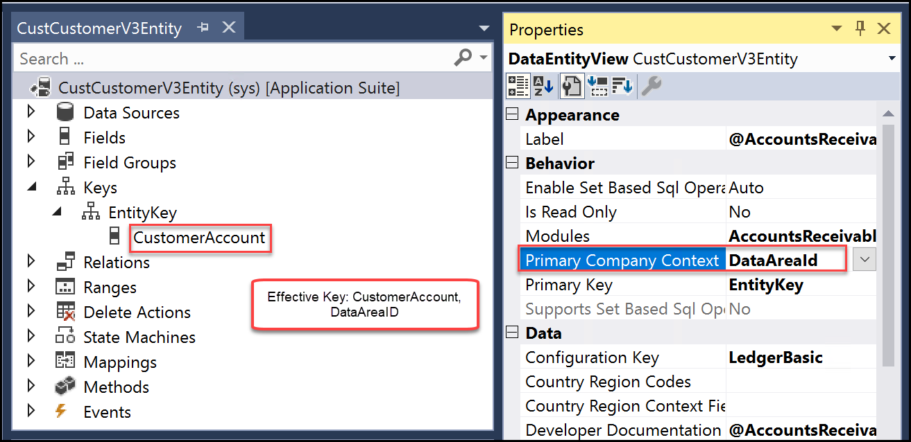

---

title: "Enable entity map for dual-write"
description: Describes how the entity map works for dual-write.
author: sabinn-msft

ms.technology: 
ms.topic: conceptual
ms.date: 03/20/2020
ms.author: v-douklo

LocalizationGroup: 
---

# Enable entity map for dual-write

[!include [banner](../../includes/banner.md)]

[!include [banner](../../includes/preview-banner.md)]

When you enable an entity map for dual-write, it starts from the Not Running stage. The entity map then goes through the initialization phase where it does an initial write by copying pre-existing data on entities on both sides. Finally, the entity map marks the status as Running, when the entity is completely enabled.

<kbd>

From the Run state, you can stop or pause an entity wherein all changes are queued until you resume. Upon resuming, the entity goes through catch-up mode when all the queued changes are played back.

The following figure illustrates an example of pausing an entity.

<kbd>

|Status |Description |Available actions |
| --- | --- | --- |
|Not running |Every entity begins from the "Not Running" status. Before enabling an entity for dual-write, it's in the "Not Running" status. |Run |
|Initializing |Initial write. |N/A |
|Running |Entity is enabled for dual-write. |Stop, Pause |
|Paused |Entity is in paused state and all new requests are queued. |Run |
|Resuming |Catch-up on queued records from when entity was paused. |N/A |
| | | |

In the initializing phase, if you have preexisting data, the data is copied as part of the initial write phase.

<kbd>

Entities have several dependent entities. For example, Customers-Contacts have "customer groups" and "currencies" as dependent entities. 

<kbd>

Since these are relational apps with relational data, if you don't enable the dependent entities, you may run into errors down the line. To prevent these errors, before we enable the entity map, we provide you with a list of related entities that we recommend you enable.

## Example of enabling Customers V3&mdash;Contacts entity map 

When you select an entity map (for example, Customers V3&mdash;Contacts) and select **Run** (in top menu), before the entity map is enabled, you're provided with a list of all the dependent entities. You can enable **Show related entity map(s)** to show all of the related entity maps. By selecting **Run**, you can enable the Customers V3&mdash;Contacts entity map and all its related entities.

>[!Note]
>This also applies when you Pause an entity, wherein you get the option to pause all the related entities as well.

<kbd>

You can further customize this by specifying a different master (default is Common Data Service) for resolving conflicts. In cases where you don't want to copy pre-existing data, skip the initial sync by unchecking the **Initial Sync** checkbox or remove one or more of the related entities by unchecking them. You can also drag and drop the entity maps to change the order in which they would sync.

Once you've made your selections and select **Run**, the entity map and all its related entities go through the initial write phase. You'll be redirected to the entity map list page. In case you run into errors, you can view the error details under the **Initial sync details** tab. This tab provides all the detailed errors while copying pre-existing data. Once you fix the underlying errors, you can choose to rerun the execution and monitor the outcome. Instead, if you choose to no longer sync the pre-existing data or you run into recurring issues because of underlying data, you can choose to skip initial writes and turn on live writes by selecting **Skip initial sync** in the top menu.

<kbd>
    
## Criteria for linking entities

To enable dual-write entity maps, you must define an alternative key in the Common Data Service. The alternative key value in Common Data Service must match the key defined in the Finance and Operations app.

For example, in a Finance and Operations app, **CustomerAccount** is the key for the Account entity.

<kbd>

In the Common Data Service, **accountnumber** is also defined as the key for the Account entity. 

<kbd>

In addition, you can see that **accountnumber** is mapped to **CustomerAccount** in the Customers V3 entity map.

<kbd>

## Next steps

[Customizing entity and field mappings](customizing-mappings.md)

