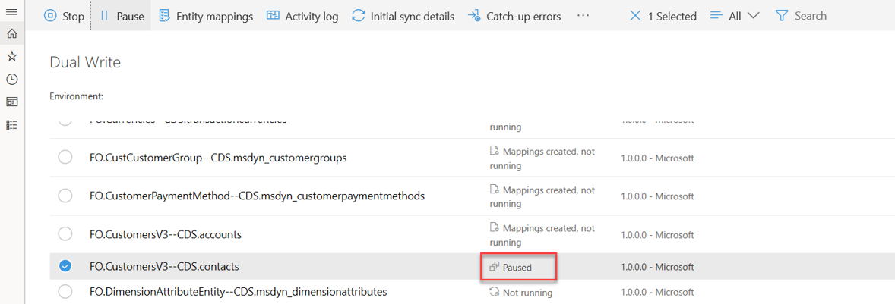
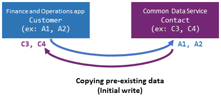
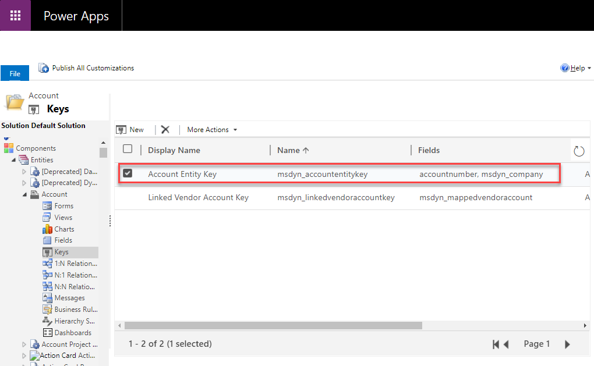

---

title: Enable entity maps for dual-write
description: This topic describes how the entity maps work for dual-write.
author: sabinn-msft
manager: AnnBe
ms.date: 03/20/2020
ms.topic: article
ms.prod: 
ms.service: dynamics-ax-applications
ms.technology: 

# optional metadata

ms.search.form: 
# ROBOTS: 
audience: Developer
# ms.devlang: 
ms.reviewer: v-douklo
ms.search.scope: Operations
# ms.tgt_pltfrm: 
ms.custom:
ms.assetid: 
ms.search.region: Global
# ms.search.industry: 
ms.author: sabinn
ms.search.validFrom: 2020-03-20
ms.dyn365.ops.version: AX 7.0.0
---

# Enable entity maps for dual-write

[!include [banner](../../includes/banner.md)]

When you enable an entity map for dual-write, it begins at the **Not running** status. The entity map then goes through an initialization phase, where it does an initial write by copying pre-existing data on entities on both sides. Finally, when the entity is completely enabled, the entity map sets the status to **Running**.

While the status is **Running**, you can pause an entity. All changes are then queued until you resume. When you resume, the entity goes into "catch-up mode," where all the queued changes are played back.

The following illustration show an example of an entity that is paused.

| Status | Description | Available actions |
|---|---|---|
| Not running | The entity has not yet been enabled for dual-write. Every entity begins at the **Not running** status. | Run |
| Initializing | The initial write is occurring. | None |
| Running | The entity has been enabled for dual-write. | Stop, Pause |
| Paused | The entity is in a paused state, and all new requests are queued. | Run |
| Resuming | The entity is catching up on records that were queued while the entity was paused. | None |

During the initialization phase, any pre-existing data that you have is copied as part of the initial write phase.

Entities have several dependent entities. For example, Customer-Contact entities have customer groups and currencies as dependent entities.

Because these are relational apps that have relational data, if you don't enable the dependent entities, you might encounter errors later. To help prevent these errors, before you enable an entity map, you're provided with a list of the related entities that we recommend that you enable.

## Example: Enabling the Customers V3—Contacts entity map

When you select an entity map (for example, **Customers V3—Contacts**) and select **Run**, a dialog box appears before the entity map is enabled. This dialog box lists all the dependent entities. You can select the **Show related entity map(s)** option to show all the related entity maps. To enable the selected entity map and all its related entities, select **Run** in the dialog box.

> [!NOTE]
> The behavior is similar when you pause an entity. In that case, you have the option to pause all the related entities too.

You can further customize this by specifying a different master that should be used to resolve conflicts. (By default, Common Data Service is used.) If you don't want to copy pre-existing data, skip the initial synchronization by clearing the **Initial Sync** check box. Alternatively, remove one or more of the related entities by canceling the selection of them. You can also drag the entity maps to change the order that they will be synced in.

After you've finished making your selections in the dialog box, and you select **Run**, the entity map and all its related entities go through the initial write phase. You're redirected to the entity map list page. If any errors occur, you can view the details on the **Initial sync details** tab. This tab provides details about all the errors that occur while pre-existing data is being copied. After you fix the underlying errors, you can rerun the execution and monitor the outcome. Alternatively, if you no longer want to sync the pre-existing data, or if you experience recurring issues because of underlying data, you can skip the initial write phase. Instead, you can turn on live writes by selecting **Skip initial sync**.

## Criteria for linking entities

To enable entity maps for dual-write, you must define an alternative key in Common Data Service. The value of the alternative key in Common Data Service must match the key that is defined in the Finance and Operations app.

For example, in a Finance and Operations app, **CustomerAccount** is the key for the Account entity.

In Common Data Service, **accountnumber** is defined as the key for the Account entity.

In the Customers V3 entity map, you can see that **accountnumber** is mapped to **CustomerAccount**.

## Next steps

[Customize entity and field mappings](customizing-mappings.md)
