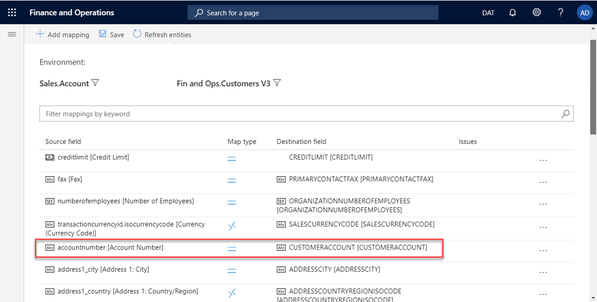

# Enable table maps for dual-write

[!include [banner](../../includes/banner.md)]

When you enable a table map for dual-write, it begins at the **Not running** status. The table map then goes through an initialization phase, where it does an initial write by copying pre-existing data on tables on both sides. Finally, when the table is completely enabled, the table map sets the status to **Running**.

While the status is **Running**, you can pause a table. All changes are then queued until you resume. When you resume, the table goes into "catch-up mode," where all the queued changes are played back.

The following illustration shows an example of a table that is paused.

| Status | Description | Available actions |
|---|---|---|
| Not running | The table has not yet been enabled for dual-write. Every table begins at the **Not running** status. | Run |
| Initializing | The initial write is occurring. | None |
| Running | The table has been enabled for dual-write. | Stop, Pause |
| Paused | The table is in a paused state, and all new requests are queued. | Run |
| Resuming | The table is catching up on rows that were queued while the table was paused. | None |

During the initialization phase, any pre-existing data that you have is copied as part of the initial write phase.

Entities have several dependent tables. For example, Customer-Contact tables have customer groups and currencies as dependent tables.

Because these are relational apps that have relational data, if you don't enable the dependent tables, you might encounter errors later. To help prevent these errors, before you enable a table map, you're provided with a list of the related tables that we recommend that you enable.

## Example: Enabling the Customers V3—Contacts table map

When you select a table map (for example, **Customers V3—Contacts**) and select **Run**, a dialog box appears before the table map is enabled. This dialog box lists all the dependent tables. You can select the **Show related table map(s)** option to show all the related table maps. To enable the selected table map and all its related tables, select **Run** in the dialog box.

> [!NOTE]
> The behavior is similar when you pause a table. In that case, you have the option to pause all the related tables too.

You can further customize this by specifying a different master that should be used to resolve conflicts. (By default, Dataverse is used.) If you don't want to copy pre-existing data, skip the initial synchronization by clearing the **Initial Sync** check box. Alternatively, remove one or more of the related tables by canceling the selection of them. You can also drag the table maps to change the order that they will be synced in.

After you've finished making your selections in the dialog box, and you select **Run**, the table map and all its related tables go through the initial write phase. You're redirected to the table map list page. If any errors occur, you can view the details on the **Initial sync details** tab. This tab provides details about all the errors that occur while pre-existing data is being copied. After you fix the underlying errors, you can rerun the execution and monitor the outcome. Alternatively, if you no longer want to sync the pre-existing data, or if you experience recurring issues because of underlying data, you can skip the initial write phase. Instead, you can turn on live writes by selecting **Skip initial sync**.

## Criteria for linking tables

To enable table maps for dual-write, you must define an alternative key in Dataverse. The value of the alternative key in Dataverse must match the key that is defined in the Finance and Operations app.

For example, in a Finance and Operations app, **CustomerAccount** is the key for the Account table.

In Dataverse, **accountnumber** is defined as the key for the Account table.

In the Customers V3 table map, you can see that **accountnumber** is mapped to **CustomerAccount**.

## Next steps

[Customize table and column mappings](customizing-mappings.md)

[!INCLUDE[footer-include](../../../../includes/footer-banner.md)]