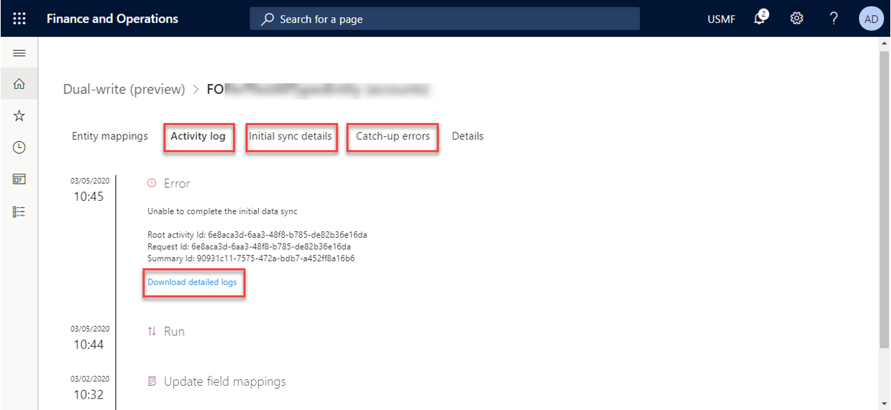
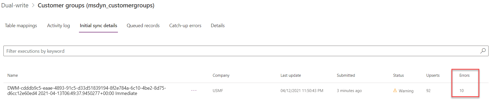
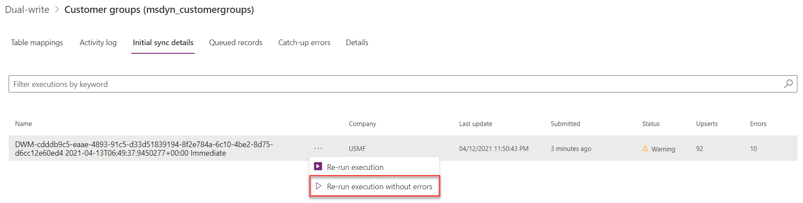
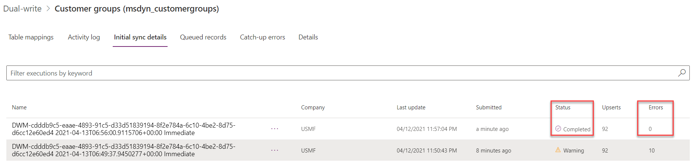
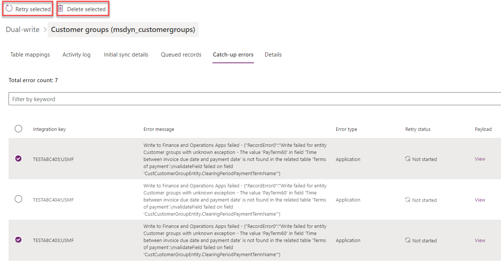
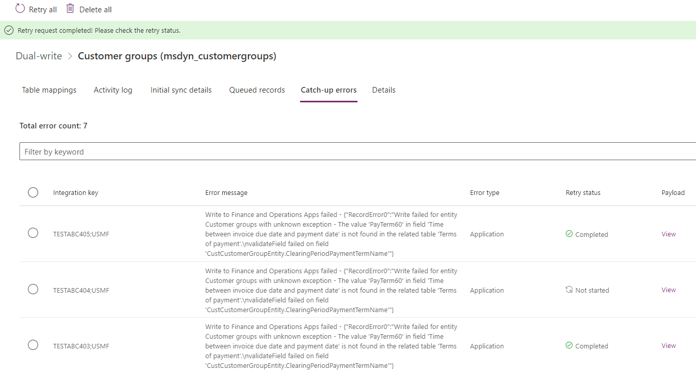
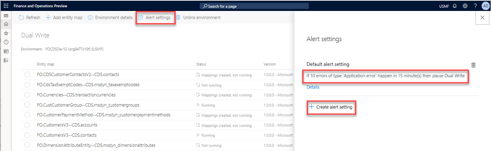
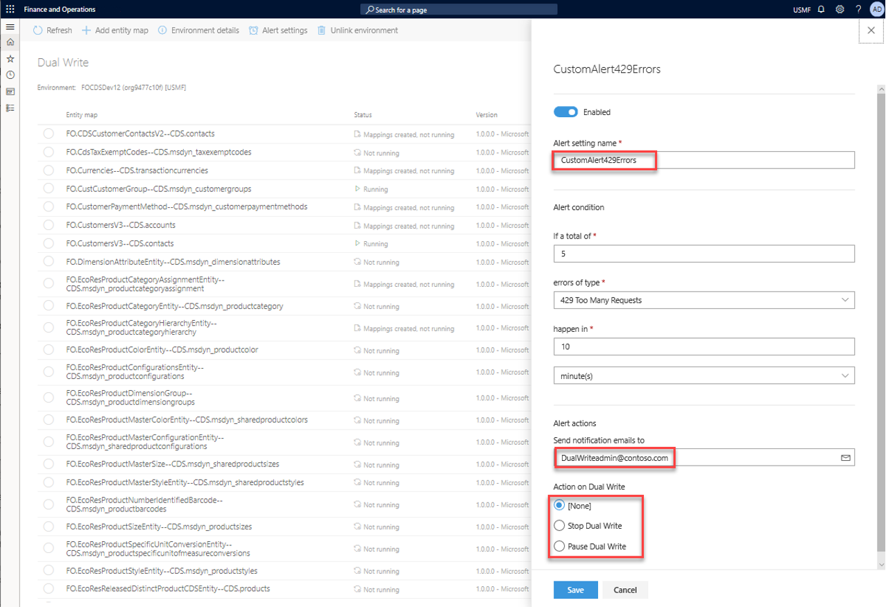

# Error management and alert notifications

[!include [banner](../../includes/banner.md)]

Microsoft has invested lots of time and effort into making dual-write resilient to errors. However, if you encounter an issue while or after you enable table maps for dual-write, you can select specific table maps to get a consolidated view of all the activities and errors for them. This consolidated view includes error logs. The goal is to help you during troubleshooting by providing a single view of the activities for a table map.

## Consolidated error management

The activity log provides a chronological list of events that a specific table map goes through from the **Not Running** status to the **Running** status. For example, the list can include mappings that are created, updates of column mappings, and mappings that are run. Additionally, if errors occur, you can download the logs to get the next level of details.

## Re-running execution for Initial sync

If you encounter issues while you copy pre-existing data between finance and operations apps and Dataverse, the **Initial sync details** tab provides a count of the errors. 

Clicking on the individual project will show you the direction in which the sync failed (finance and operations app to Dataverse or vice-versa) and details of why it failed. You can choose to fix the underlying issues and then select **Re-run execution** which retries the entire execution, along with the records that failed or errored out in the last sync. Once this completes, initial sync is completed and the table returns to the **Running** state. There may be cases where you want to ignore the errors and add new incremental data. In these cases, you can select **Rerun execution without errors**, which lets you add new data and not retry the errored records. 

Once it is done, the status is marked **Completed** and then you can change the table to the **Running** state. 

## Catch-up errors from pausing a table map

When you [resume a table map after pausing](pause-for-maintenance.md), some records might error out and fail to write due to various reasons including business validations on destination app. In these cases, the records will continue to remain in the queue and can be viewed under the **Catch-up errors** tab.

The detailed Error message will help you fix the underlying issue after which you could **Retry selected** records or **Retry All** records. Once the retry is successful, **Retry status** will be marked as **Completed**.

> [!NOTE]
> Errored records will be available in the queue for one day, after which time they will by purged. In some cases, you may no longer need these records and they can be deleted from the queue.

## Alert notifications

As an admin, you can create one or more alert settings to handle cases of planned or unplanned maintenance. For example, you can set up the dual-write system to notify you by email if a specific error threshold is reached because of, for example, network errors. The dual-write system can also take action on your behalf. For example, it can pause or stop dual-write.

The following illustration shows an example where dual-write will be paused if 10 errors of the **Application error** type occur within 15 minutes.

By selecting **Create alert settings**, you can create more alerts. You can also select whether notifications should be sent to an individual or a group, and whether the dual-write system should take any action on your behalf. To send alerts to a group, enter the values separated by commas, for example, "id1@contoso.com, id2@contoso.com".

> [!NOTE]
> In order for your alerts to take effect, you need to restart your table maps

This feature is especially useful if there is unplanned maintenance. For example, one of the apps becomes unavailable and, based on your defined thresholds, dual-write goes into a paused state where all new requests are queued (that is, they aren't lost). After you fix the underlying issue, and both apps are running smoothly, you can resume from the paused state. The updates will then be read back from the queue and written to the recovered app.

## Next steps

[Application lifecycle management](app-lifecycle-management.md)

[!INCLUDE[footer-include](../../../../includes/footer-banner.md)]
