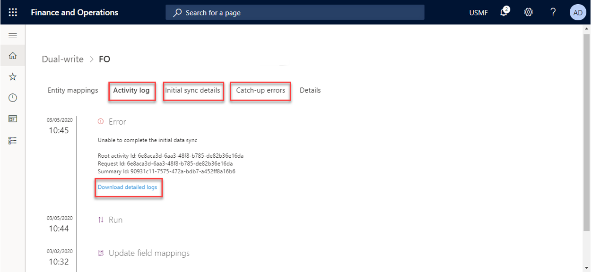
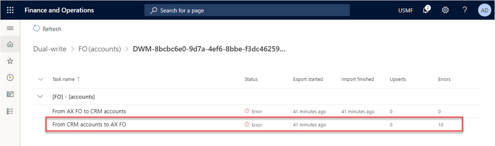

---

title: "Error management and alert notifications"
description: Describes how to use the error logs and alert notifications to aid you in troubleshooting.
author: sabinn-msft

ms.technology: 
ms.topic: conceptual
ms.date: 03/13/2020
ms.author: v-douklo

LocalizationGroup: 
---

# Error management and alert notifications

[!include [banner](../../includes/banner.md)]

[!include [banner](../../includes/preview-banner.md)]

A lot of investment has been made in making dual-write resilient to errors. However, in the event you run into an issue during or after enabling entity maps for Dual Write, you can select specific entity maps for a consolidated view of all the activities and errors for that map, including error logs. Our goal is to provide you a single view of activities on an entity map that will aid you during your troubleshooting.

## Consolidated error management

The activity log provides a chronological list of events that a given entity map goes through from a Not Running state to Running. For example, the list can include Mappings created, Update field mappings, Run, and so on. Additionally, in cases of error you can download the logs to get the next level of details.

In cases where you run into issues while copying pre-existing data between the two apps, the **Initial sync details** tab provides you with the count of errors. It also includes the ability to rerun the execution after fixing the underlying errors.

You can further drill down to view the sync direction that errored out, which helps you narrow down the scope for troubleshooting.

Similarly, the **Catch-up errors** tab aids you in troubleshooting issues when you're resuming from a paused state.

## Alert notifications

In case of planned or unplanned maintenance, as an admin you can create one or more Alert settings. For example, if a certain error threshold is reached, say due to network errors, you can have the dual-write system notify you through email. The dual-write system can also take an action (such as Pause or Stop Dual Write) on your behalf.

The following figure demonstrates a case where you want dual-write to be paused if 10 errors of type "Application error" happen in 15 minutes.

By selecting **Create alert settings**, you can create more alerts. You can also choose to send notifications to an individual or group and take an action on your behalf.

This feature is particularly useful if there is unplanned maintenance. If one of the apps is unavailable and based on your defined thresholds, Dual Write goes into a Paused state, where all new requests are queued (not lost). Once you fix the underlying issue and both apps are running smoothly, you can resume from the paused state and the updates are read back from the queue and written to the recovered app. 

## Next steps

[Application lifecycle management](app-lifecycle-management.md)

