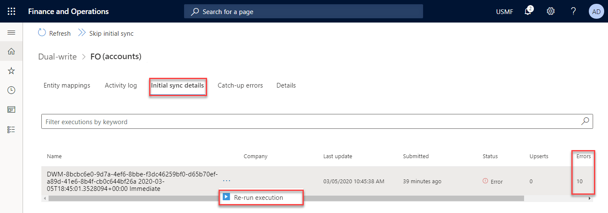
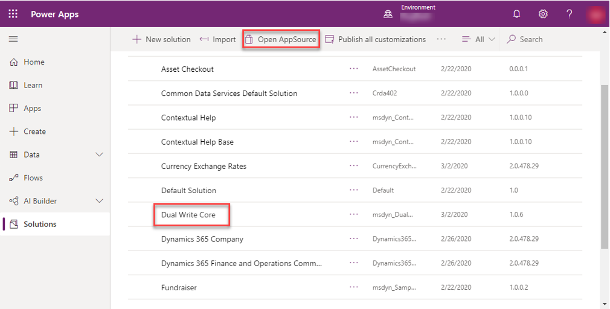
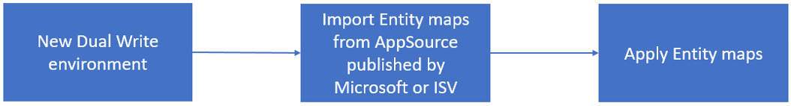
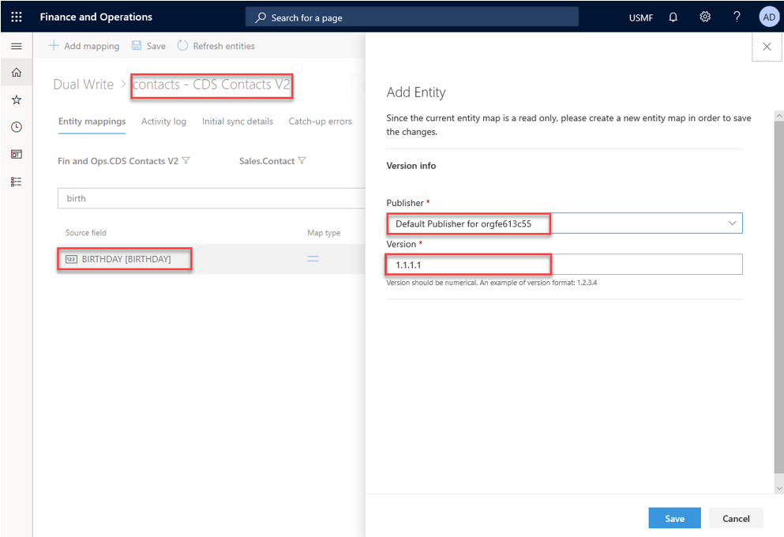
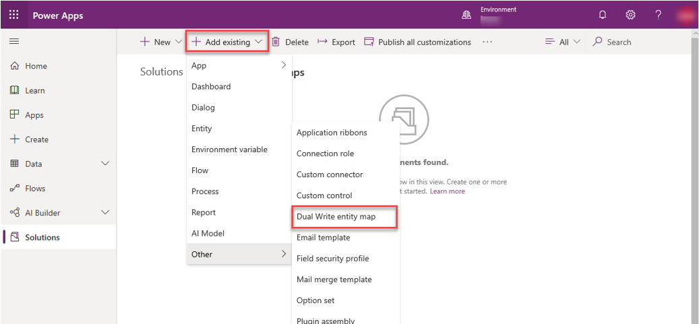
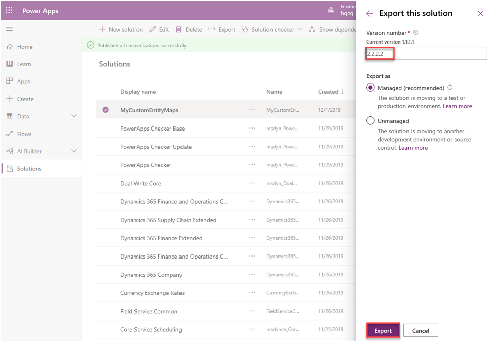
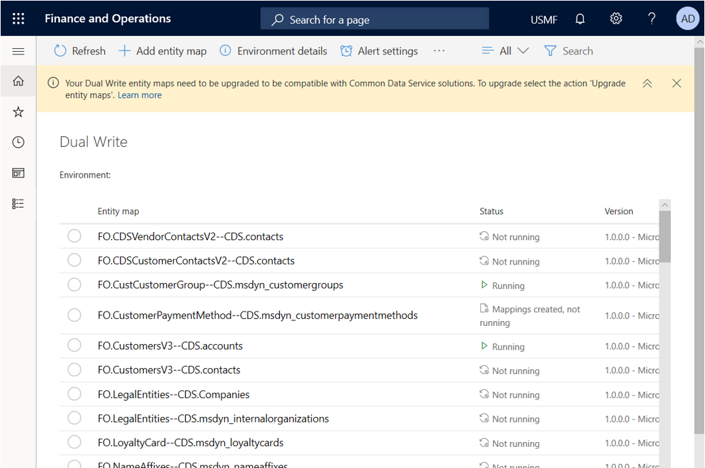

---

title: "Error management and alert notifications"
description: Describes the .
author: sabinn-msft

ms.technology: 
ms.topic: conceptual
ms.date: 03/13/2020
ms.author: v-douklo

LocalizationGroup: 
---

# Error management and alert notifications

While we have made a lot of investments in making dual-write resilient to errors, in the event you run into an issue during or after enabling entity maps for Dual Write, you can click on the entity maps for a consolidated view of all the activities and errors for that entity map, including error logs. Our goal is to provide you a single view of activities on an entity map which would aid you during your troubleshooting.

## Consolidated error management

Activity log provides a chronological list of events that a given entity map goes through from a Not Running state to Running ex: Mappings created, Update field mappings, Run, etc. Additionally, in cases of error you can download the logs to get the next level of details.

In cases where you run into issues while copying pre-existing data between the two apps, the Initial sync details tab provide you with the count of errors with an ability to re-run the execution after fixing the underlying errors 

You can further drill down to view the sync direction that errored out which helps you narrow down the scope for troubleshooting

Similarly, the Catch-up errors tab aids you in troubleshooting issues when you are resuming from a paused state.

## Alert notifications

In case of planned or unplanned maintenance, as an admin, you can create one or more Alert settings such that if a certain error threshold is reached, say due to network errors, you have the Dual Write system notify you via email or take an action (Pause or Stop Dual Write) on your behalf.

Example&mdash;in this case you want Dual Write to be Paused if 10 errors of type "Application error" happen in 15minutes

By clicking Create alert settings, you can create more alerts and choose to send notifications to an individual or group and take an action on your behalf

This is particularly useful in case of unplanned maintenance when one of the apps is unavailable and based on your defined thresholds, Dual Write goes into a Paused state wherein all new requests are queued (not lost). Once you fix the underlying issue and both apps are running smoothly, you can resume from the paused state and the updates are read back from the queue and written to the recovered app. 

## Next steps

[Application lifecycle management](app-lifecycle-management.md)

## Application Lifecycle Management

Making Dual Write Solution Aware enables basic ALM (Application lifecycle management) abilities such as transportation and backup/restore of Dual Write entity maps across environments. This also enables scenarios wherein you can get a solution from AppSource published by Microsoft or from an independent software vendor (ISV).

### What is a Dual Write Solution?

A Dual Write Solution can contain one or more Dual Write entity maps that can be imported into your environment (via Solutions in PowerApps Maker portal) and exported (as a package) to other environments. You can import entity maps published by Microsoft or ISV from AppSource, modify these entity maps in your test environment, test it and when ready, export it to your prod environment. Additionally, you can also publish your solution to others via AppSource.

>[!Note]
>There two types of solutions; There are managed and unmanaged solutions. 

A managed solution cannot be modified and can be uninstalled after it is imported. When you import an unmanaged solution, you add all the components of that solution into your environment. When you import an unmanaged solution that contains components that you have already customized, your customizations will be overwritten by the customizations in the imported unmanaged solution. 

For more details on Solutions, please review the following guidance: [https://docs.microsoft.com/powerapps/maker/common-data-service/solutions-overview](https://docs.microsoft.com/powerapps/maker/common-data-service/solutions-overview)

### How-to install the dual-write core solution

The dual-write core solution contains metadata for your entity maps and is required to be installed in your environments.

Steps to install the dual-write core solution:

* In the maker PowerApps portal, navigate to Solutions (left hand pane), Open AppSource and search for the solution named dual-write core and follow the prompts to import the solution. 

    

### How-to install the dual-write entity maps solution

* Like the instructions of installing the dual-write core package, in the maker PowerApps portal, navigate to Solutions (left hand pane), open AppSource and search for the solution named Common Data Service Add-in for Finance and Operations package and follow the prompts to import the solution.

* On the dual-write UI in Dynamics 365 Finance and Operations click "Apply Solution" in the top menu of the dual write page to apply the entity maps that you just downloaded and installed. Once you apply the solution, you will see the default entity maps published

    

That's it&mdash;you successfully imported and applied a Microsoft published Dual Write entity map solution to your environment

### Importing entity maps via a Dual Write solution and applying to your environment [New environments]

In this section, we will learn how to import entity maps from AppSource and apply to your environment.

	
1. Import the dual-write core solution

    * Start with a new Dual Write environment (new D365 FO and CDS environment)

    * Follow the instructions per #2 above to import the dual-write core solution from AppSource from the Power Apps maker portal 

    * Once imported, verify that you see the dual-write core solution listed under Solutions

2. Import the MS or ISV entity maps solution

    * Import the ISV or Microsoft published entity map solution&mdash;follow the instructions per #3 to download and install the entity maps from ISV or MS via AppSource form the Power Apps maker portal

    * Once imported, verify that you see the entity map solution listed under Solutions

3. Apply the Dual Write entity map Solution in your D365 Finance and Operations environment

    * Follow the instructions per #3 above to apply the solution you downloaded from the dual-write page by clicking on Apply Solutions

### Updating entity maps and exporting them as a solution to other environments

In this section, you will learn how to export your customized entity maps as a solution, use it as a backup and move these artifacts across environments and/or publish to AppSource

1. Customize your entity maps by modifying existing entity maps and adding new entity map

    * Start by customizing the mappings for the default entity map (that you just installed via a solution) by clicking on the Entity mappings tab. Similarly, you can add a new entity map by clicking on the Add Entity button. In both cases, when you save the entity map, you will be prompted to specify the Publisher and the Version number

       Example: Adding a new "birthday" field to contacts-CDS Contacts V2 entity map and choosing default publisher

       

       >[!Note]
       >When you create a new solution, later in the steps below, with these modified entity maps, you will need to specify the same publisher

       Example: Adding a new entity map Address books

       

    * Confirm the entity maps you just modified and added. Make sure to enable and test them to ensure they are working as expected.

       

2. Create a new Dual Write Solution and add your components (customized entity maps)

    * Now that you have customized your mappings and added new mappings, next step is to create a new Dual Write Solution and add these entity maps to the solution

       Go to the PowerApps Maker portal and create a New solution under Solutions. Make sure to choose the same publisher as in prior steps

       

    * After you hit Create, the new solution will show up in the Solutions list page

       

    * Adding your components (entity maps) to a Solution

      Now that you have created your Dual Write solution, you want to add the customized entity maps that created in prior steps. To do this, click on the solution you just created and Add existing Dual Write entity map

      

    * From the list, select the customized entity maps and Add it to the solution. The new solution you created MyCustomeEntityMaps should now have your customized entities

      

With this step, you just customized your entities and put them into a solution

3. Exporting and publishing your solution

    * Once you run the Solution checker and make sure there are no issues, Export the solution you just created and Publish the changes before hitting Next

       

    * Update the version number and choose to export as a managed (recommended) or unmanaged solution

       

    * After you hit export, the solution, with all its components is exported to a .zip file 

       
	
    That's it&mdash;you just customized your entities, added them to a new solution and created a solution file that can now be imported and applied to other environments (useful to move entity maps between test and prod environments). Similarly, you could create a backup of all your entity maps by adding them to a solution and exporting the solution as a package which can then be imported to restore the entity maps into to any environment.

    Follow the steps in this article to publish this package to AppSource: [https://docs.microsoft.com/powerapps/developer/common-data-service/publish-app-appsource](https://docs.microsoft.com/powerapps/developer/common-data-service/publish-app-appsource)

4. Test your exported solution package by importing and applying into another environment

    * First import the package to a new environment

      

    * Apply the solution you just imported on your environment 

      

    * Check to see the two customized entity maps are listed on the Dual Write entity maps list page  

      

    * Checking to make sure the customizations, from prior steps are preserved 

      

5. How to use the Entity map version

There could be situations wherein a solution could contain different implementations of an entity map&mdash;Example: The contacts&mdash;CDS Contacts -V2 entity map version could have a different publisher or a newer version. Using the Entity Map version button, you could select which entity map to use for your environment

 
### How to upgrade existing Dual Write environments for Solution Awareness [Existing environments]

1. Import the dual-write core solution

    * Follow the instructions per #2 above to import the dual-write core solution from AppSource from the Power Apps maker portal 

    * Once imported, verify that you see the dual-write core solution listed under Solutions

2. Upgrade entity maps

    * Once you whitelist your tenant, you would see a notification prompting you to upgrade

      

    * Click on Upgrade entity maps from top menu

      

    * You will receive a notification once the upgrade completes (takes a few minutes)

## Next steps

[Application lifecycle management](application-lifecycle-management.md)

