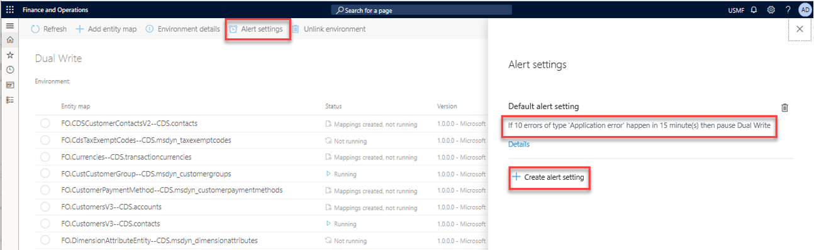
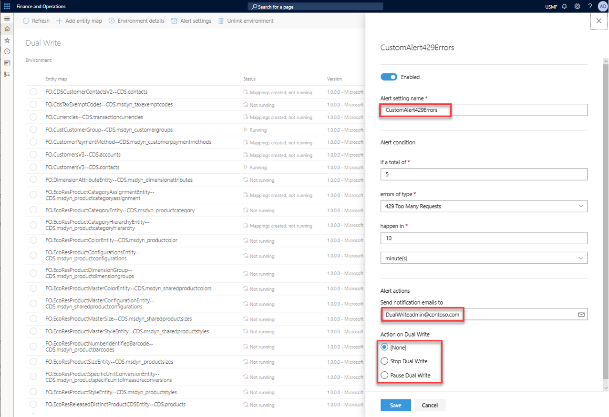

---

title: Error management and alert notifications
description: This topic explains error logs and alert notifications that can help you troubleshoot issues.
author: sabinn-msft

ms.technology: 
ms.topic: conceptual
ms.date: 03/20/2020
ms.author: v-douklo

LocalizationGroup: 
---

# Error management and alert notifications

[!include [banner](../../includes/banner.md)]

Microsoft has invested lots of time and effort into making dual-write resilient to errors. However, if you encounter an issue while or after you enable entity maps for dual-write, you can select specific entity maps to get a consolidated view of all the activities and errors for them. This consolidated view includes error logs. The goal is to help you during troubleshooting by providing a single view of the activities for an entity map.

## Consolidated error management

The activity log provides a chronological list of events that a specific entity map goes through from the **Not Running** status to the **Running** status. For example, the list can include mappings that are created, updates of field mappings, and mappings that are run. Additionally, if errors occur, you can download the logs to get the next level of details.

If you encounter issues while you copy pre-existing data between Finance and Operations apps and Common Data Service, the **Initial sync details** tab provides a count of the errors. It also lets you rerun the execution after you fix the underlying errors.

You can drill down further to view the synchronization direction where the error occurred. This information can help you narrow down the scope for troubleshooting.

In a similar way, the **Catch-up errors** tab can help you troubleshoot issues when you resume from a paused state.

## Alert notifications

As an admin, you can create one or more alert settings to handle cases of planned or unplanned maintenance. For example, you can set up the dual-write system to notify you by email if a specific error threshold is reached because of, for example, network errors. The dual-write system can also take action on your behalf. For example, it can pause or stop dual-write.

The following illustration shows an example where dual-write will be paused if 10 errors of the **Application error** type occur within 15 minutes.

By selecting **Create alert settings**, you can create more alerts. You can also select whether notifications should be sent to an individual or a group, and whether the dual-write system should take any action on your behalf.

This feature is especially useful if there is unplanned maintenance. For example, one of the apps becomes unavailable and, based on your defined thresholds, dual-write goes into a paused state where all new requests are queued (that is, they aren't lost). After you fix the underlying issue, and both apps are running smoothly, you can resume from the paused state. The updates will then be read back from the queue and written to the recovered app.

## Next steps

[Application lifecycle management](app-lifecycle-management.md)
