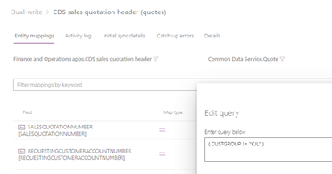

---
# required metadata

title: Filtering of intercompany orders to avoid synchronizing Orders and OrderLines
description: 
author:  Negudava
manager: 
ms.date: 11/09/2020
ms.topic: article
ms.prod: 
ms.service: dynamics-ax-applications
ms.technology: 

# optional metadata

ms.search.form: 
# ROBOTS: 
audience: Application User, IT Pro
# ms.devlang: 
ms.reviewer: rhaertle
ms.search.scope: Core, Operations
# ms.tgt_pltfrm: 
ms.custom: 
ms.assetid: 
ms.search.region: global
ms.search.industry: 
ms.author: 
ms.dyn365.ops.version: 
ms.search.validFrom: 2019-09-20

---

# Filtering of intercompany orders to avoid synchronizing Orders and OrderLines
 
[!include [banner](../../includes/banner.md)]
Issue:

To facilitate the filtering of intercompany orders to avoid synchronizing Orders and OrderLines. The Intercompany Accounts do not synchronize  if the accounts are linked to the legal entities in the different FO companies. This is because the accounts have a PartyType=LegalEntity reference which is not handled by the mappings. Then Either the Customer account or the sales header fails to synchronize which causes downstream dependency failures. This can be resolved by manually creating the missing Account records in CE, but in some scenarios, the intercompany order details are not necessary in CE at all.

Solution:

Each of the Standard CDS entities were extended with references to intercompany and the DualWrite Maps were modified to refer to the additional fields in the filters. The result is that the intercompany orders are no longer synchronized. This avoids unnecessary data in the CRM system.

Add “Intercompany Order” reference to "CDS Sales Order Headers" Is only populated on Intercompany orders. Field "InterCompanyOrder" available in "SalesTable"

 
Add “IntercompanyInventTransId” reference to "CDS Sales Order Lines".  Is only populated on Intercompany orders. Field "InterCompanyInventTransID" avilable in table "SalesLine"

The Sales Invoice Header V2 and Sales Invoice Lines V2 are extended the same method as the CDS entities.

Quotations do not have an intercompany relationship. However, in the event that someone ends up creating a quote to one of our intercompany Customers, you can put all of these customers in one Customer Group.  Header and lines can be extended to add the customer group field and filter to not include this group.
 
 
 
 
 
     

