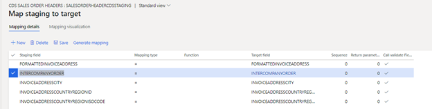
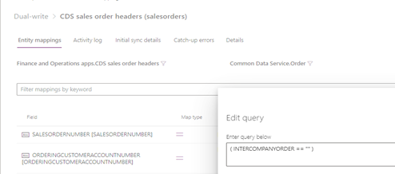
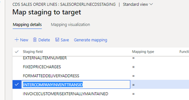
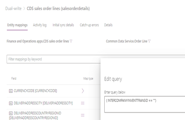
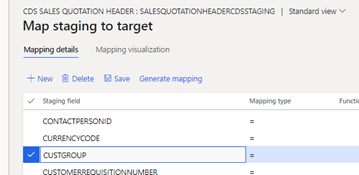
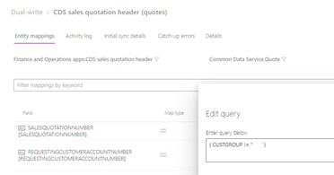

---
# required metadata

title: Filter intercompany Orders to avoid synchronizing Orders and OrderLines
description: 
author:  negudava
manager: tfehr
ms.date: 11/09/2020
ms.topic: article
ms.prod: 
ms.service: dynamics-ax-applications
ms.technology: 

# optional metadata

ms.search.form: 
# ROBOTS: 
audience: Application User, IT Pro
# ms.devlang: 
ms.reviewer: rhaertle
ms.search.scope: Core, Operations
# ms.tgt_pltfrm: 
ms.custom: 
ms.assetid: 
ms.search.region: global
ms.search.industry: 
ms.author: negudava
ms.dyn365.ops.version: 
ms.search.validFrom: 2019-09-20

---

# Filter intercompany Orders to avoid synchronizing Orders and OrderLines

[!include [banner](../../includes/banner.md)]

You can filter the intercompany orders to avoid synchronizing the **Orders** and **OrderLines** entities. The intercompany accounts do not synchronize if the accounts are linked to the legal entities in the different companies in the Finance and Operations apps. This is because the accounts have a `PartyType=LegalEntity` reference that is not handled by the mappings. Then either the **Customer account** or the **sales header** fails to synchronize, causing downstream dependency failures. You can resolve this by manually creating the missing **Account** records in the customer engagement app, but in some scenarios, the intercompany order details are not necessary in customer engagement app.

Each of the standard Common Data Service entities is extended with references to intercompany, and the dual-write maps are modified to refer to the additional fields in the filters. The result is that the intercompany orders are no longer synchronized. This avoids unnecessary data in the customer engagement app.

Add “Intercompany Order” reference to "CDS Sales Order Headers" Is only populated on Intercompany orders. Field "InterCompanyOrder" available in "SalesTable"

Add “IntercompanyInventTransId” reference to "CDS Sales Order Lines".  Is only populated on Intercompany orders. Field "InterCompanyInventTransID" available in table "SalesLine"

The Sales Invoice Header V2 and Sales Invoice Lines V2 are extended the same method as the CDS entities.

Quotations do not have an intercompany relationship. However, in the event that someone ends up creating a quote to one of our intercompany Customers, you can put all of these customers in one Customer Group.  Header and lines can be extended to add the customer group field and filter to not include this group.

