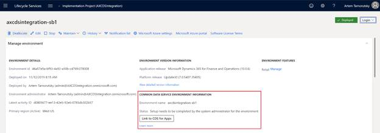

---
# required metadata

title: Dual-write setup from Lifecycle Services
description:
author: RamaKrishnamoorthy
manager: AnnBe
ms.date: 01/06/2020
ms.topic: article
ms.prod: 
ms.service: dynamics-ax-applications
ms.technology: 

# optional metadata

ms.search.form: 
# ROBOTS: 
audience: Application User, IT Pro
# ms.devlang: 
ms.reviewer: rhaertle
ms.search.scope: Core, Operations
# ms.tgt_pltfrm: 
ms.custom: 
ms.assetid: 
ms.search.region: global
ms.search.industry: 
ms.author: ramasri
ms.dyn365.ops.version: 
ms.search.validFrom: 2020-01-06

---

# Dual-write setup from Lifecycle Services

[!include [banner](../../includes/banner.md)]

[!include [banner](../../includes/preview-banner.md)]

This topic explains how to set up the dual-write connection between a new Finance and Operations environment and a new Common Data Service environment from Microsoft Dynamics Lifecycle Services (LCS).

## Prerequisites

- The user should be from the customer's tenant.
- The user should be an administrator on both Finance and Operations and Common Data Service environments.

## Steps

Perform the following steps to complete the dual-write connection setup:
1. Navigate to your project in Lifecycle Services.
2. Click on **Configure** to deploy a new environment.
3. Select the version. 
4. Select the topology. If only one is available, it is selected automatically.
5. Complete the tasks in the **Deployment Wizard**. 
6. If your tenant has a Common Data Service environment already provisioned, then you will have the option to select that environment in this tab. 
    1. Select the **Common Data Service** tab.
    2. Toggle the **Configure CDS** button **ON**.
    3. Select the **environment** from the drop-down that you want to integrate your Finance and Operations data. The drop-down has the environments where the active user has admin privileges.
    4. Check the **Agree** box if you agree to the terms and conditions.
    
        
        
7. If your tenant does not have a Common Data Service environment, a new one will be provisioned.
    1. Select the **Common Data Service** tab.
    2. Toggle the **Configure CDS** button **ON**.
    3. Enter a **Name** for the Common Data Service environment.
    4. Select a **Region** to deploy the environment.
    5. Select the default **Language** and **Currency** for this environment. **Note:** The set values of **Language** and **Currency** cannot be changed later.
    6. Check the **Agree** box if you agree to the terms and conditions.
    
        
        
8. Complete the tasks in the **deployment wizard**. 

9. Navigate to the environment details page, when the environment is in **Deployed** state.
10. The Common Data Service environment information section will show the names of the linked Common Data Service environment and the Finance and Operations environment.

    
    
11. To complete the link, the administrator of the Finance and Operations environment will need to go to LCS and click on the **Link to CDS for Apps** button. The Environment Details page lists the administrator's contact information.
12. When the linking is complete, you will see the status updated to **Environment linking successfully completed**.
13. To navigate to the data integration workspace in Finance and Operations environment and control the templates that you want to enable or disable, click on the **Link to CDS for Apps** button.    

    
    
**Note:** Unlinking is not supported through Lifecycle services. If you want to unlink an environment, you can navigate to the Data Integration workspace in Finance and Operations environment and click on the **Unlink** button on the toolbar to break the integration.

