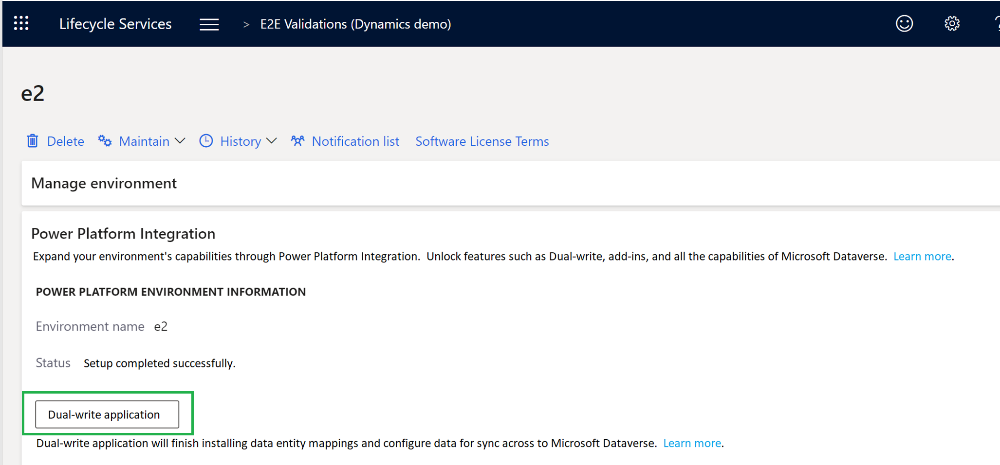

<!--TODO  Move this page under Power Platform configuration -->

# Dual-write setup from Lifecycle Services

[!include [banner](../../includes/banner.md)]

This article explains how to enable dual-write from Microsoft Dynamics Lifecycle Services (LCS).

## Prerequisites

Customers must complete the Power Platform integration as described in the following topics:

- If you don't yet use Microsoft Power Platform and want to expand your finance and operations environments by adding platform capabilities, see [Connect finance and operations apps with a new Microsoft Dataverse instance](../../power-platform/environment-lifecycle-connect-finops-new-dv.md).
- If you already have Dataverse and Power Platform environments, and want to connect them to finance and operations environments, see [Connect finance and operations apps with an existing Microsoft Dataverse instance](../../power-platform/environment-lifecycle-connect-finops-existing-dv.md).

## Set up dual-write for new or existing Dataverse environments

Follow these steps to set up dual-write from LCS **Environment Details** page:

1. On the **Environment Details** page, expand the **Power Platform Integration** section.

2. Select the **Dual-write application** button.

    

3. Review the terms and conditions, and then select **Configure**.

4. Select **OK** to continue.

5. You can monitor the progress by periodically refreshing the environment details page. Setup typically takes 30 minutes or less.  

6. When the setup is complete, a message will inform you if the process was successful or if there was a failure. If the setup failed, then a related error message is displayed. You must fix any errors before moving to the next step.

7. Select **Link to Power Platform environment** to create a link between Dataverse and the current environment's databases. This typically takes less than 5 minutes.

    :::image type="content" source="media/powerplat_integration_step3.png" alt-text="Link to Power Platform environment.":::

8. When the linking is complete, a hyperlink is displayed. Use the link to sign in to the dual-write administration area in the finance and operations environment. From there, you can set up entity mappings.

## Linking mismatch

It is possible that your dual-write environment is linked to a Dataverse instance while LCS is not set up for Power Platform integration. This linking mismatch can cause unexpected behavior. It is recommended that LCS environment details match what you are connected to in dual-write so that the same connection can be used by business events, virtual tables, and add-ins.

If your environment has a linking mismatch, LCS shows a warning that resembles the following example on your environment details page: "Microsoft has detected that your environment is linked via Dual-write to a different destination than specified in Power Platform Integration, which is not recommended."

:::image type="content" source="media/powerplat_integration_mismatchLink.png" alt-text="Power Platform integration link mismatched.":::

If you receive this warning, try one of the following solutions:

- If your LCS environment has never been set up for Power Platform integration, you can connect to the Dataverse instance that is configured in dual-write by following the instructions in this article.
- If your LCS environment is already set up for Power Platform integration, you should reset your dual-write connection to the one specified by LCS using the [Reset dual-write connections](/dynamics365/fin-ops-core/dev-itpro/data-entities/dual-write/reset).

In the past a manual support ticket option was available, but that was before option 1 above existed.  Microsoft no longer supports manual relinking requests via Support tickets.

[!INCLUDE[footer-include](../../../../includes/footer-banner.md)]

