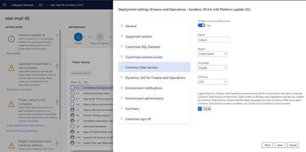
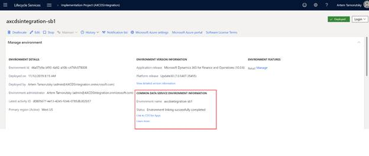

---
# required metadata

title: Dual-write setup from Lifecycle Services
description:
author: RamaKrishnamoorthy
manager: AnnBe
ms.date: 01/06/2020
ms.topic: article
ms.prod: 
ms.service: dynamics-ax-applications
ms.technology: 

# optional metadata

ms.search.form: 
# ROBOTS: 
audience: Application User, IT Pro
# ms.devlang: 
ms.reviewer: rhaertle
ms.search.scope: Core, Operations
# ms.tgt_pltfrm: 
ms.custom: 
ms.assetid: 
ms.search.region: global
ms.search.industry: 
ms.author: ramasri
ms.dyn365.ops.version: 
ms.search.validFrom: 2020-01-06

---

# Dual-write setup from Lifecycle Services

[!include [banner](../../includes/banner.md)]

[!include [banner](../../includes/preview-banner.md)]

This topic explains how to set up a dual-write connection between a new Finance and Operations environment and a new Common Data Service environment from Microsoft Dynamics Lifecycle Services (LCS).

## Prerequisites

Setting up a dual-write connection is an adminstrator's task.

+ You must be have access to the tenant.
+ You must be an administrator on both Finance and Operations and Common Data Service environments.

## Steps

Perform the following steps to complete the dual-write connection setup:
1. Navigate to your project in Lifecycle Services.
2. Click on **Configure** to deploy a new environment.
3. Select the version. 
4. Select the topology. If only one is available, it is selected automatically.
5. Complete the tasks in the **Deployment Wizard**. 
6. If your tenant has a Common Data Service environment already provisioned, then you will have the option to select that environment in this tab. 
    1. Select the **Common Data Service** tab.
    2. Toggle the **Configure CDS** button **ON**.
    3. Select the environment from the drop-down that you want to integrate with your Finance and Operations data. The drop-down has the environments where you have admin privileges.
    4. Check the **Agree** box if you agree to the terms and conditions.
    
        
        
7. If your tenant does not have a Common Data Service environment, a new one will be provisioned.
    1. Select the **Common Data Service** tab.
    2. Toggle the **Configure CDS** button **ON**.
    3. Enter a name for the Common Data Service environment.
    4. Select a region to deploy the environment.
    5. Select the default language and currency for this environment. **Note:** You cannot change the language and currency later.
    6. Check the **Agree** box if you agree to the terms and conditions.
    
        
        
8. Complete the tasks in the **Deployment Wizard**. 
9. After the environment is in **Deployed** state, navigate to the **Environment Details** page, 
10. The Common Data Service environment information section will show the names of the Common Data Service and Finance and Operations environments that are linked.

    
    
11. To complete the link, an administrator of the Finance and Operations environment must log in to LCS and click the **Link to CDS for Apps** button. The **Environment Details** page lists the administrator's contact information.
12. After the link is complete, the status updates to **Environment linking successfully completed**.
13. To navigate to the data integration workspace in Finance and Operations environment and control the templates that you want to enable or disable, click on the **Link to CDS for Apps** button.    

    

> [!NOTE]
> You cannot unlink environments by using Lifecycle services. If you want to unlink an environment, navigate to the **Data Integration** workspace in the Finance and Operations environment and click the **Unlink** button on the toolbar.

