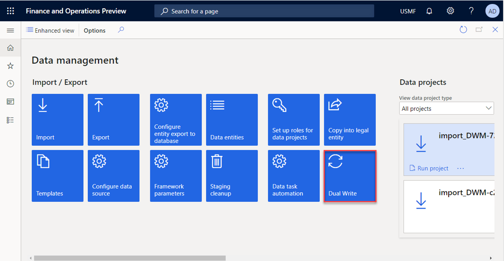
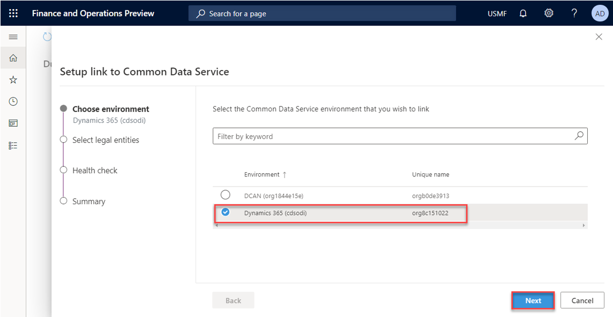
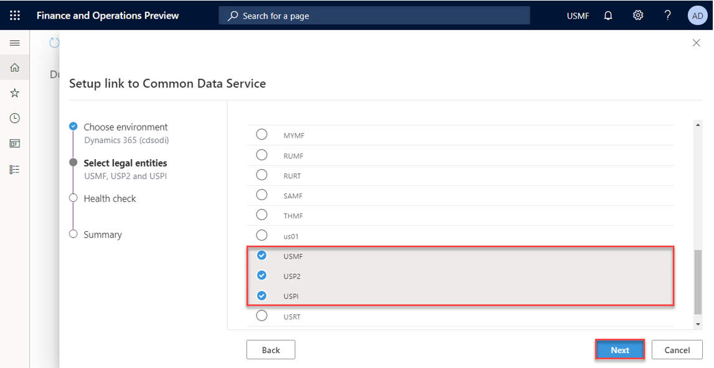
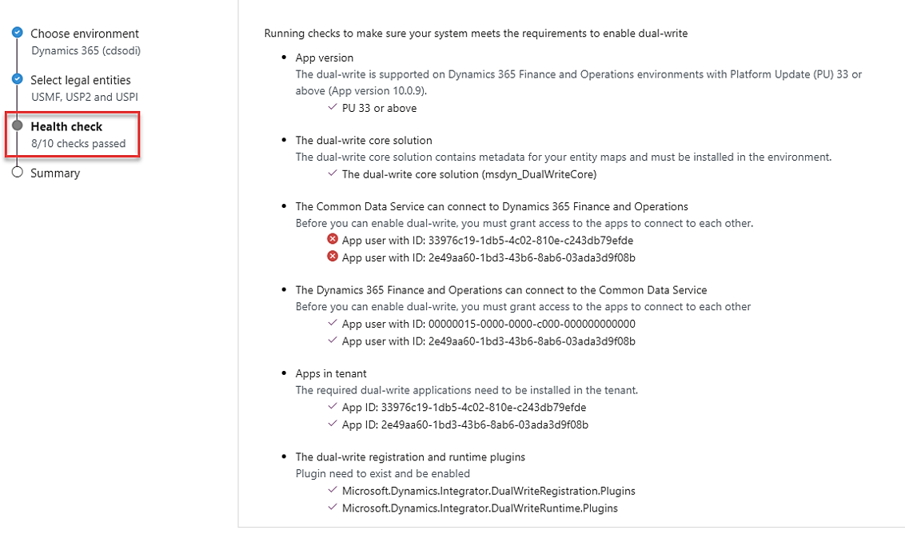
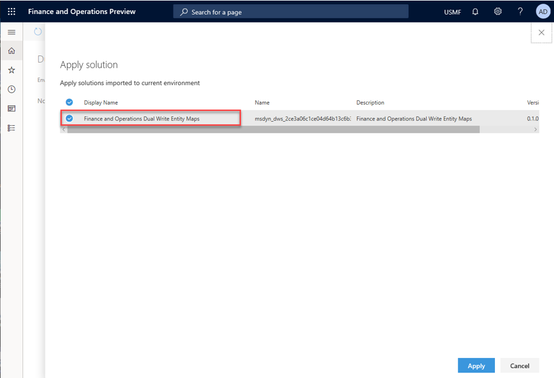

<!--TODO  Remove this page -->

# Use the dual-write wizard to link your environments

[!include [banner](../../includes/banner.md)]

1. Sign in to the finance and operations app environment that you want to link to your Dataverse environment.
2. Go to **Workspaces \> Data management**, and select the **Dual Write** tile.

    

> [!NOTE]
> If you are unable to access the finance and operations app and need to make changes to your environments you can also use this link to the [Data Integration Admin Portal](https://nam06.safelinks.protection.outlook.com/?url=https%3A%2F%2Ftip.dataintegrator.trafficmanager.net%2FdualWrite%3Faxenv%3Ddxxxxxxxxx.cloudax.dynamics.com&data=04%7C01%7Csushmu%40microsoft.com%7C63cee32877c141d7c55108d96c9d49ba%7C72f988bf86f141af91ab2d7cd011db47%7C1%7C0%7C637660245076784515%7CUnknown%7CTWFpbGZsb3d8eyJWIjoiMC4wLjAwMDAiLCJQIjoiV2luMzIiLCJBTiI6Ik1haWwiLCJXVCI6Mn0%3D%7C1000&sdata=71dmOTyAgXpSHrwx4OVahwoFJLclbIsAW2DIVwZFUhk%3D&reserved=0) to go directly to the administration page.
> 
3. Select **New link to environment** to open the **Setup link to Dataverse** wizard.
4. The **Choose environment** page lists all the Dataverse environments where the signed-in user is an environment admin. Select the Dataverse environment to link to, and then select **Next**.

    

5. Select your legal entities, and then select **Next**.

    

    A health check is run to verify that your system meets the requirements for enabling dual-write. The health check also verifies that all the prerequisites have been completed. If any health check test fails, make that you've completed all the prerequisites before you move on to the next step.

    In the following example, the test about whether access was granted to connect the apps failed. In this case, you must first grant access to connect the apps by the creating the appropriate application IDs. You must then rerun the wizard.

    

6. Review the summary, privacy notice, and consent, and then select **Create**.

You've now linked your finance and operations app to the Dataverse environment. 

> [!NOTE]
> If you don't see your table maps, or if you see a blank page, be sure to **Apply** the Dual-write application orchestration solution that you installed as part of the system requirements and prerequisities.

7. Apply the dual-write application orchestration solution.

    In the finance and operations app, on the **Dual-write** page, select **Apply Solution** to apply the table maps that you just downloaded and installed. After you apply the solution, you should see that the default table maps are published.

     

You've now successfully imported and applied a Microsoft-published dual-write table map solution to your environment.

## Next steps

[Enable table maps for dual-write](enable-entity-map.md)

[!INCLUDE[footer-include](../../../../includes/footer-banner.md)]

