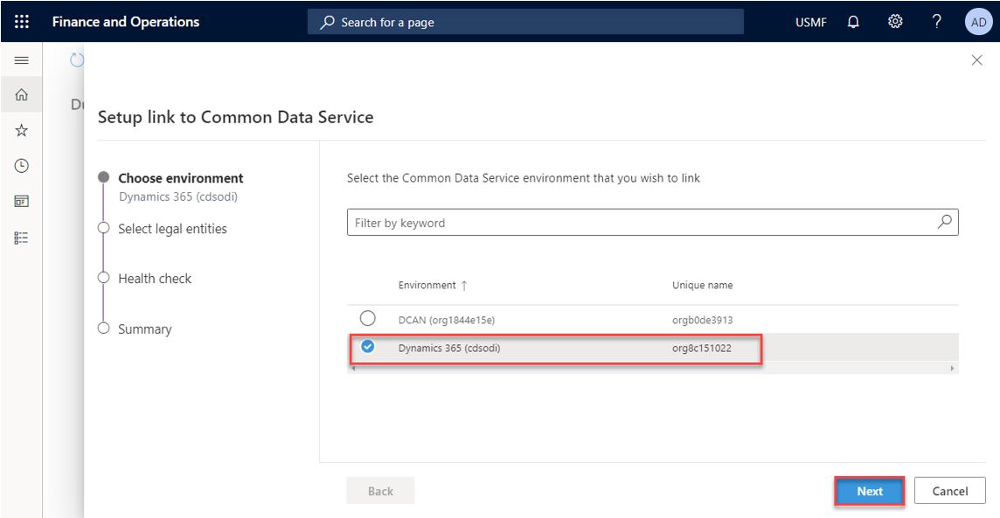

---

title: Use the dual-write wizard to link your environments
description: This topic explains how to use the dual-write wizard to link a Finance and Operations app environment to your Common Data Service environment.
author: sabinn-msft

ms.technology: 
ms.topic: conceptual
ms.date: 03/20/2020
ms.author: v-douklo

LocalizationGroup: 
---

# Use the dual-write wizard to link your environments

[!include [banner](../../includes/banner.md)]

[!include [banner](../../includes/preview-banner.md)]

1. Sign in to the Finance and Operations app environment that you want to link to your Common Data Service environment.
2. Go to **Workspaces \> Data management**, and select the **Dual Write** tile.

    

3. Select **New link to environment** to open the **Setup link to Common Data Service** wizard.
4. The **Choose environment** page lists all the Common Data Service environments where the signed-in user is an environment admin. Select the Common Data Service environment to link to, and then select **Next**.

    

5. Select your legal entities, and then select **Next**.

    

    A health check is run to verify that your system meets the requirements for enabling dual-write. The health check also verifies that all the prerequisites have been completed. If any health check test fails, make that you've completed all the prerequisites before you move on to the next step.

    In the following example, the test about whether access was granted to connect the apps failed. In this case, you must first grant access to connect the apps by the creating the appropriate application IDs. You must then rerun the wizard.

    

6. Review the summary, privacy notice, and consent, and then select **Create**.

You've now linked your Finance and Operations app to the Common Data Service environment. The next step is to enable entity maps for dual-write.

> [!NOTE]
> If you don't see your entity maps, or if you see a blank page, be sure to install the entity map solution for the Finance and Operations app.

## Next steps

[Enable entity maps for dual-write](enable-entity-map.md)
