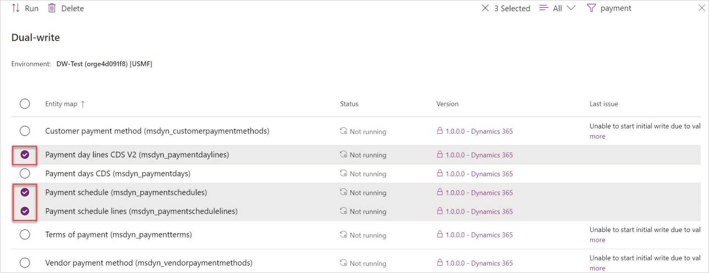

# Manage multiple table maps

[!include [banner](../../includes/banner.md)]

This article describes how to select multiple table maps, view a list of dependent table maps, enable the table maps and all of its related tables, and copy pre-existing data.

As part of day to day operations, there may be a need to bulk handle table maps. For example, you may want to simultaneously enable or pause a set of table maps. Instead of doing this one by one, which is cumbersome and time consuming, you can now enable, pause, resume, or stop more than one table map at the same time in the dual-write list page.

 
As part of enabling multiple table maps, you also get to view the list of all the dependent table maps by selecting **Show related table map(s)**.

 
To enable the selected table map and all its related tables, select **Run**. If you want to copy the pre-existing data for the selected table maps or its dependents, select the corresponding **Initial sync** check box. Alternatively, remove one or more of the related tables by clearing the corresponding check box. You can also drag and drop the table maps to change the order in which the maps will be synced.

[!INCLUDE[footer-include](../../../../includes/footer-banner.md)]