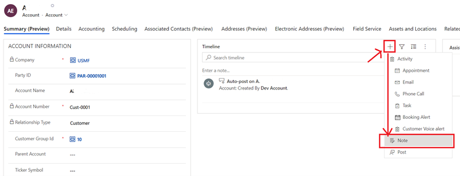
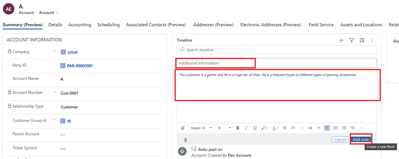
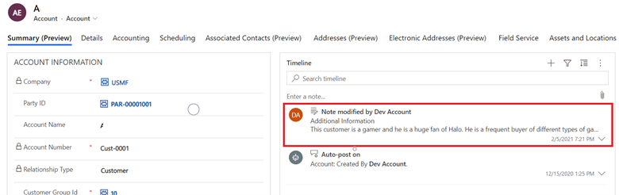
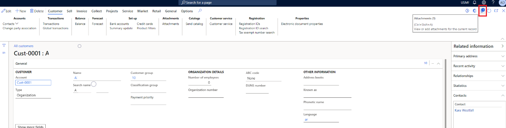
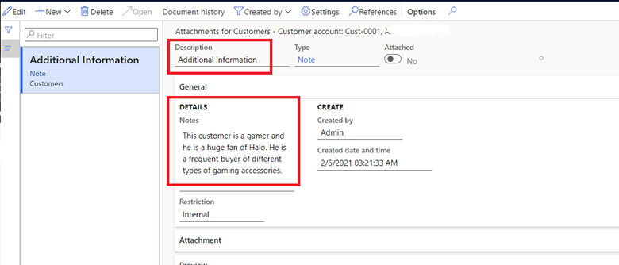
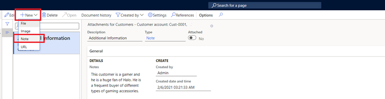
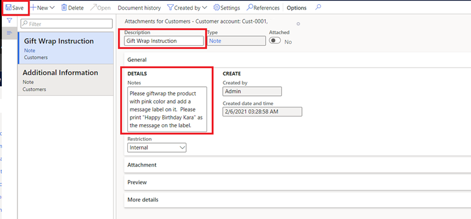
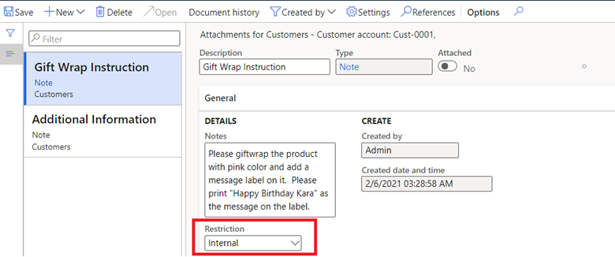
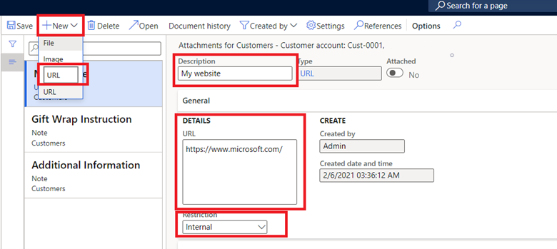
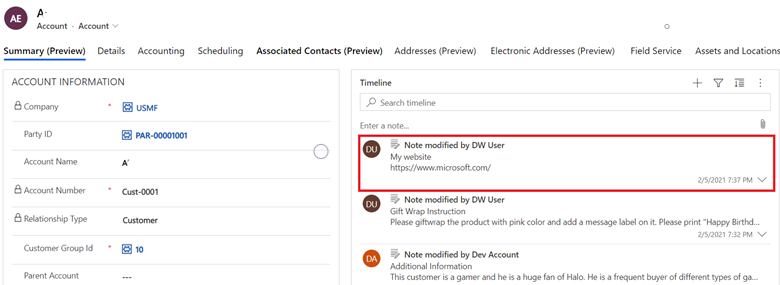

# Note integration

[!include [banner](../../includes/banner.md)]

During business processes, Microsoft Dynamics 365 users often gather information about their customers. This information is recorded as activities and notes. This topic describes the integration of note data in dual-write.

Customer information can be classified in the following ways:

+ **Actionable information that a Dynamics 365 user handles on behalf of a customer** – For example, Contoso (a Dynamics 365 user) is conducting a game show. One of Contoso's customers (a customer) wants to attend the game show. The customer asks a Contoso employee to book a slot in the game show for them. The booking occurs in Contoso's event attendee's calendar.
+ **Actionable information for a Dynamics 365 user** – For example, a customer who is purchasing a Surface unit enters special instructions that indicate that the device should be gift wrapped before delivery. These instructions are actionable information that should be handled by the Contoso employee who is responsible for packaging.
+ **Non-actionable information** – For example, a customer visits the Contoso store and, during their conversation with a store associate, expresses interest in *Halo* games and gaming accessories. The store associate makes a note of this information. The product recommendations engine then uses it to make recommendations to the customer.

In general, actionable information is captured as *activities* in Finance and Operations apps and customer engagement apps. Non-actionable information is captured as *notes* in Finance and Operations apps, and as *annotations* in customer engagement apps.

> [!TIP]
> Although notes are intended for non-actionable information, the apps won't prevent you from using them to store and handle actionable information if you want to use them in that way.

Microsoft is currently releasing functionality for note integration. (Functionality for activity integration will be released later.) Note integration is available for customers, vendors, sales orders, and purchase orders.

## Create a note in a customer engagement app

To create a note in a customer engagement app and then sync it to a Finance and Operations app, follow these steps.

1. In the customer engagement app, open the account record for a customer.
2. In the **Timeline** pane, select the plus sign (**+**), and then select **Note** to create a note.

    

3. Enter a title and description, and then select **Add note**.

    

    The new note is added to the customer timeline.

    

4. Sign in to the Finance and Operations app, and open the same customer record. Notice that the **Attachments** button (paperclip symbol) in the upper-right corner indicates that the record has an attachment.

    

5. Select the **Attachments** button to open the **Attachments** page. You should find the note that you created in the customer engagement app.

    

Any updates to the note are synced back and forth between the Finance and Operations app and the customer engagement app.

## Create a note in a Finance and Operations app

You can also create a note in a Finance and Operations app, and it will be synced to a customer engagement app.

To create a note in a Finance and Operations app and then sync it to a customer engagement app, follow these steps.

1. In the Finance and Operations app, on the **Attachments** page, select **New** \> **Note**.

    

2. Enter a title and a brief set of instructions, and then select **Save**.

    

3. In the customer engagement app, update the record. You should find the new note on the timeline.

    

You can classify a note as either internal or external.

- In the Finance and Operations app, on the **Attachments** page, open the note, and then, in the **Restriction** field, select **Internal** or **External**.

    

You can also create a URL.

1. In the Finance and Operations app, on the **Attachments** page, select **New** \> **URL**.
2. Enter a title and the URL.
3. In the **Restriction** field, select **Internal** or **External**.

    

4. Select **Save**.

    Because customer engagement apps don't have a URL type, the URL is integrated with dual-write as a note.

    

> [!NOTE]
> File attachments aren't supported.

## Templates

Note integration includes a collection of table maps that work together during data interaction, as shown in the following table.

| Finance and Operations app | Customer engagement app | Description |
|----------------------------|-------------------------|-------------|
| [Customer Attachments](mapping-reference.md#230) | Annotations | Businesses that use plain text and URLs to capture customer-specific information (for both organizations and persons). |
| [Vendor document attachments](mapping-reference.md#231) | Annotations | Businesses that use plain text and URLs to capture vendor-specific information (for both organizations and persons). |
| [Sales order header document attachments](mapping-reference.md#229) | Annotations | Businesses that use plain text and URLs to capture sales order–specific information. |
| [Purchase order header document attachments](mapping-reference.md#232) | Annotations | Businesses that use plain text and URLs to capture purchase order–specific information. |

## Limitations

Once you install the notes solution, you cannot uninstall it. 

For more information, see [Dual-write mapping reference](mapping-reference.md).
