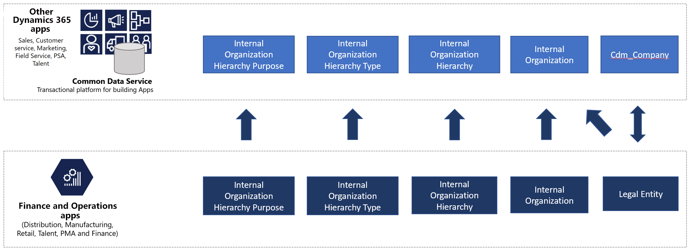

# Organization hierarchy in Dataverse

[!include [banner](../../includes/banner.md)]

Because Dynamics 365 Finance is a financial system, *organization* is a core concept, and system setup starts with the configuration of an organization hierarchy. Business financials can then be tracked at the organization level and also at any level in the organization hierarchy.

Although Dataverse doesn't have the concept of an organization hierarchy, it does have a few loose concepts, such as total sales revenue. As part of Dataverse integration, the organization hierarchy data structure is added to Dataverse.

## Data flow

A business ecosystem that consists of Finance and Operations apps and Dataverse will continue to have an organization hierarchy. This organization hierarchy is built on Finance and Operations apps, but it's exposed in Dataverse for informational and extensibility purposes. The following illustration shows the organization hierarchy information that is exposed in Dataverse as a one-way data flow from Finance and Operations apps to Dataverse.

Organization hierarchy table maps are available for one-way synchronization of data from Finance and Operations apps to Dataverse.

## Templates

An organization is a group of people who are working together to carry out a business process or achieve a goal. Organizational hierarchies represent the relationships between the organizations that make up your business. You can define the following types of internal organizations: legal entities, operating units, and teams. As the following table shows, a collection of table maps is created to sync legal entities, operating unit,s and related orgnization hierarchy information.

Finance and operations apps | Customer engagement apps     | Description
-----------------------|--------------------------------|---
[Legal entities](mapping-reference.md#102) | cdm_companies | 
[Legal entities](mapping-reference.md#142) | msdyn_internalorganizations |
[Operating unit](mapping-reference.md#143) | msdyn_internalorganizations |
[Organization hierarchy - published](mapping-reference.md#139) | msdyn_internalorganizationhierarchies | This template provides one-way synchronization of the Organization Hierarchy Published table.
[Organization hierarchy purposes](mapping-reference.md#140) | msdyn_internalorganizationhierarchypurposes | This template provides one-way synchronization of the Organization Hierarchy Purpose table.
[Organization hierarchy type](mapping-reference.md#141) | msdyn_internalorganizationhierarchytypes | This template provides one-way synchronization of the Organization Hierarchy Type table.

## Internal Organization

Internal organization information in Dataverse comes from two tables, **Operating unit** and **Legal entities**.

[!INCLUDE[footer-include](../../../../includes/footer-banner.md)]
