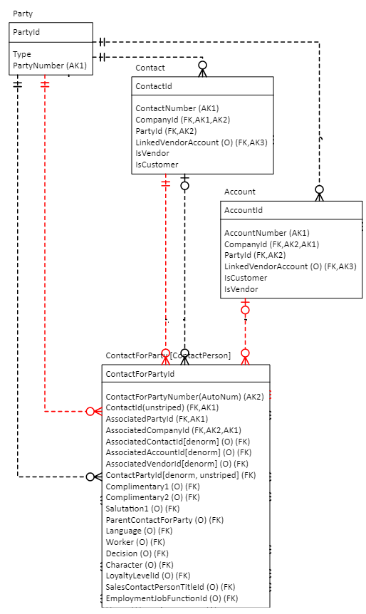

# Using Power Portal with the Party data model

[!INCLUDE[banner](../../includes/banner.md)]

[!INCLUDE[rename-banner](~/includes/cc-data-platform-banner.md)]

The Dual-write application orchestration solution version 2.0.999.0 and later includes data model changes to party and global address book for the Account and Contact tables. The changes allow many-to-many relationships that support advanced business scenarios. These changes are not supported by portal web roles, including the customer portal, that are shipped out-of-the-box or that existed in your environment before you installed dual-write. For the web roles to work as expected, you need to create new web roles using the new data model. 

In summary, the way the tables interact has changed, but the table permissions in the customer portal haven't changed. This topic explains how to create new web roles that work with the new advanced data model.

This diagram shows the table relationship **without** the party and global address book data model:

   

This diagram shows the table relationship **with** the party and global address book data model:

   

## Create a new table permission

To create these new table permissions, follow these steps:

1. Sign in to [Power Apps](https://make.powerapps.com), and go to your apps.
2. Select your Portal Management app.
3. In the side bar, select **Security > Table permissions**.

    You must create three new permissions:

    + Contact to Party connection
    + Party to Account connection
    + Account to Order connection

4. Create and save a new permission for the Contact to Party connection, setting these parameters:

    + **Name**: Party to Account Connection (or your choice)
    + **Table Name**: msdyn_contactforparty
    + **Website**: Customer Portal
    + **Scope**: Contact
    + **Privileges**: Select all
    + **Web roles**: Authenticated Users, Customer Representative (or your choice)

5. Create and save a new permission for the Party to Account connection, setting these parameters:

    + **Name**: Party to Account Connection (or your choice)
    + **Table Name**: account
    + **Website**: Customer Portal
    + **Scope**: Parent
    + **Privileges**: Select all
    + **Parent Table Permission**: Contact to Party Connection

6. Create and save a new permission for the Account to Order connection, setting these parameters:

    + **Name**: Account to Order Connection (or your choice)
    + **Table Name**: salesorder
    + **Website**: Customer Portal
    + **Scope**: Parent
    + **Privileges**: Select all
    + **Parent Table Permission**: Party to Account Connection

[!INCLUDE[footer-include](../../../../includes/footer-banner.md)]
