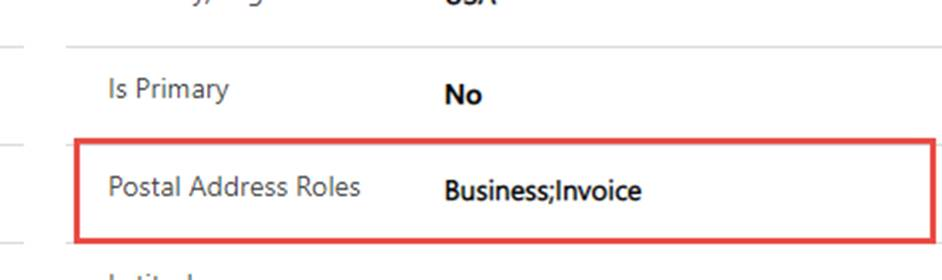

# Party and global address book

[!include [banner](../../includes/banner.md)]

[!include [rename-banner](~/includes/cc-data-platform-banner.md)]

Party and global address book are concepts in Finance and Operations applications. A Party can be an organization or a person. It's convenient to globally store and manage properties of a **Party**, like name, language, contacts, and addresses. When a property value changes at one place, it reflects in all places where the **Party** is involved.

## Party

A *Party* is a person or an organization involved in the business. By using the Party concept, a person or an organization can play more than one role (worker, customer, vendor, or contact) in a business. The role is based on the context and purpose. Here are some examples from two fictitious companies, Contoso and Fabrikam.

+ **Worker**: An employee. For example, an employee of Contoso.
+ **Vendor**: A supplier organization, or a sole proprietor who supplies goods or services to a business. For example, if Fabrikam sells supplies to Contoso, then Fabrikam is in the role of vendor.
+ **Contact**: A person to contact. For example, if Contoso buys supplies from Fabrikam, an employee at Contoso would reach out to the contact at Fabrikam.
+ **Customer**: A customer is a person or company that buys things from a company. For example, if Contoso buys supplies from Fabrikam, then Contoso is a customer of Fabrikam.

The Party model is often used to represent medium to complex relationships between organizations and people, particularly when a party plays more than one role. Here are some common examples:

+ A party can be both a customer and a vendor. For example, in North America, Fabrikam sells electric wires to Contoso and purchases assembled speakers from Contoso. In Europe, Fabrikam sells parts to Contoso, but doesn't by anything from Contoso.
+ A party can be both an employee and a customer. For example, an employee of Contoso buys electronics from Contoso for personal use.
+ There can be a many-to-many relationship between a person and an organization. For example, Fabrikam supplies service specialists and employs a placement coordinator. The coordinator matches the service specialists for the work requests from several of Fabrikam's customers. Contoso is one of the customer accounts. When Contoso needs a specialist, Contoso contacts the coordinator, who then facilitates the request. The coordinator handles requests for all customers, creating a many-to-many relationship.

The following image shows the data model for Party:

> [!Tip]
> When you are trying to create a new account record, use the “Party” field to search for the record by name. In case you find the record, you just need to select the record. The system auto fills all the data from the party. You don’t need to manually enter all the required fields. This behavior can be found on Account, Contact and Vendor forms shipped out-of-the-box.

Not all party roles of Finance and Operations apps are supported by dual-write. For a complete list of party roles, see [Global address book overview](../../../fin-ops/organization-administration/overview-global-address-book.md).

### Global address book

The global address book is a directory of postal and electronic addresses of the organizations and individuals participating in a business.

The global address book stores and handles as many postal addresses and electronic addresses as needed. For example, suppose that Fabrikam has gas stations in 50 locations. Each location has a different postal address, email, and phone number. All business purchases are billed to the main gas station, but purchases are shipped directly to the specific gas station that requested the purchase. The global address book stores the main gas station as the billing address and each gas station as a shipping address for Fabrikam. The addresses can be stored once and retrieved as needed for quotations and orders.

A person or an organization can play more than one role based on the business context. When they do so, their postal addresses and electronic addresses might be the same. In this case, a change of address in one role should appear on the other role and vice versa. The global address book stores and handles addresses globally.

## Contacts

In customer engagement apps, a *Contact* is a person. However, the **Contact** table has been overloaded to represent a person, a portal user, a B2C customer, or a vendor. The representation is implicit and you cannot tell the difference without looking into related transactions. The **Contact** table has been limited to have a 1:1 relationship with the **Account** table. As part of Party and global address book model, dual-write introduces explicit properties for classification and dual-write allows N:N relationships between a **Contact** person and an organization (Account entity or Vendor entity).

There are two types of **Contact** rows:

+ Striped contact – Contact row with a mandatory value in the **Company** field.
+ Unstriped contact – Contact row with blank **Company** field blank.

The **Contact** table can store these types of rows:

Row type | Description
---|---
A person who is a customer, for example a sellable contact or B2C customer. | A striped contact record where the **Company** field is not blank and the **Is Customer** field is set to **Yes**.
A person who is a vendor, for example, a sole proprietor like vendor. | A striped contact record where the **Company** field is not blank and the **Is Vendor** field is set to **Yes**.
A person who is both a customer and a vendor. | A striped contact record where the **Company** field is not blank, the **Is Customer** field is set to **Yes**, and the **Is Vendor** field is set to **Yes**. A person can be both a producer for one product and a consumer for another product. Both Finance and Operations apps and dual-write support this relationship.
A person who is a contact person for an organization, but is not a customer nor a vendor. | An unstriped contact record where the **Company** field is blank, the **Is Customer** field is set to **No**, and **Is Vendor** field is set to **No**.

## Contact for Party

**Contact for Party** stores and handles N:N relationships between **Account** rows and **Contact** rows. It can filter out the striped **Contact** rows from unstriped rows and associate only the unstriped **Contact** rows to an **Account** or **Vendor** rows.

For example, Natasha Jones and Miguel Reyes are veterinarians who provide care for farms in their areas. Natasha serves the Seattle area and Miguel serves the Kent area. In the customer engagement app, the farms are represented as customers and the veterinarians are contact persons. A single **Contact** record for Natasha is associated with all the farms that Natasha works with. Similarly, a single **Contact** record for Miguel is associated with all the farms that Miguel works with.

These relationships are stored in the **Contact for Party** table. You can find the information in the out-of-the-box forms:

+ When you are in the **Account** form, there is a tab named **Associated Contacts**. Use this tab to associate one or more contacts to the **Account** row. On this form, you are assigning a contact person for an organization. After you assign contacts, you can choose one as the primary contact for that account. Using the **Quick Create** form, you can only choose a contact person. The behavior is the same when you are using the **Vendor** form and the record type is **Organization**.
+ When you are in the **Contact** form, and the row is a customer or vendor or both (a striped contact), there is a tab named **Associated Contacts**. Use this tab to associate one or more contacts. On this form, you are assigning a contact person for the B2C customer or vendor. After you assign contacts, you can choose one as the primary contact. Using the **Quick Create** form, you can only choose a contact person.
+ When you are in the **Contact** form, and the row is a contact person (an unstriped contact), there is a tab named **Associated Organizations**. Use this tab to associate one or more customers or vendors. On this form, you are assigning a customer or vendor to the underlying contact person. The customer or vendor can be an organization, a person, or both. You can choose only one value from the four fields at a given time.

    

    + If you choose **Party ID**, then the underlying contact is assigned to all the roles of the chosen party.
    + If you choose **Associated Contact**, then you are selecting the striped contact that is of type person.
    + If you choose **Associated Account** or **Vendor**, then you are selecting an organization.

    Regardless of your choice, the association is created at the party level and applicable to all the roles of the party and stored in “Contact for Party” entity.

> [!Note]
> The display name for the **Contact for Party** table in the customer engagement app is **Contact for Customer/Vendor**.

When you open a **Contact** row where **Is Customer** is **No** and **Is Vendor** is **No**, you will see the **Associated Organizations** tab. Use this tab to associate one or more customer or vendor organizations to the contact.

When you open a **Contact** row where **Is Customer** is **Yes** or **Is Vendor** is **Yes**, you will see the **Associated Contacts** tab. Use this tab to associate one or more contacts.

## Postal address

A new tab named **Addresses** has been introduced on the **Account**, **Contact**, and **Vendor** forms. The **Addresses** for supports N addresses by using a grid, as shown in this image:

+ The **Postal Address Roles** column lists the purpose of the address.
+ The **Is Primary** column lists the primary address.
+ The **Address Number** column lists the address order.
+ The **+ New Address** button lets you create a new address. You can create as many addresses as you want.

The **Address 1** and **Address 2** fields on the **Summary** tab of the **Account** form correspond to the **Delivery** and **Invoice** addresses, respectively.

The **Address 1**, **Address 2**, and **Address 3** fields on the **Summary** tab of the **Contact** form, correspond to the **Business**, **Delivery** and **Invoice** addresses, respectively.

## Electronic address

A new tab named **Electronic Addresses** has been introduced on the **Account**, **Contact**, and **Vendor** forms. The **Addresses** for supports N addresses by using a grid, as shown in this image:

+ The **Type** column lists the type of the address.
+ The **Is Primary** column lists the primary address.
+ The **Purpose** column lists the purpose of the electronic address.
+ The **+ New Electronic Address** lets you create a new address. You can create as many addresses as you want.

Electronic addresses are available only on this grid. In future releases, all electronic and postal address fields will be removed from other tabs, for example the **Summary** and **Details** tabs.

## Setup instructions

1. Install the latest version (2.2.2.50 or later) of [Dual-write application orchestration solution](https://aka.ms/dual-write-app).

2. Install [Dual-write Party and Global Address Book Solutions](https://aka.ms/dual-write-gab).

3. Stop the following maps, because they aren't required anymore. Instead, run the `Contacts V2 (msdyn_contactforparties)` map.

    + CDS Contacts V2 and Contacts (refers to customer contacts)
    + CDS Contacts V2 and Contacts (refers to vendor contacts)

4. The following entity mappings are updated for party functionality, so the latest version must be applied to these mappings.

    Map | Update to this version | Changes
    ---|---|---
    `CDS Parties (msdyn_parties)`| 1.0.0.0 | This is a new map added as part of this release.
    `Contacts V2 (msdyn_contactforparties)`| 1.0.0.5 | This is a new map added as part of this release.
    `Customers V3 (accounts)` | 1.0.0.5 |Removed `PartyNumber` and other party-related fields like name, personal details, postal address fields, and electronic contact address.
    `Customer V3 (contacts)` | 1.0.0.5 | Removed `PartyNumber` and other party-related fields like name, personal details, postal address fields, and electronic contact address.
    `Vendors V2 (msdyn_vendors)` | 1.0.0.6 | Removed `PartyNumber` and other party-related fields like name, personal details, postal address fields, and electronic contact address.
    `CDS Sales quotation headers (quotes)` | 1.0.0.7 | Replaced the contact person with `ContactforParty` reference.
    `Sales invoice headers V2 (invoices)` | 1.0.0.4 | Replaced the contact person with `ContactforParty` reference.
    `CDS Sales order headers (salesorders)` | 1.0.0.5 | Replaced the contact person with `ContactforParty` reference.
    `CDS Party postal address locations (msdyn_partypostaladdresses)` | 1.0.0.1  | This is a new map added as part of this release.
    `CDS postal address history V2 (msdyn_postaladdresses)` | 1.0.0.1 | This is a new map added as part of this release.
    `CDS postal address locations (msdyn_postaladdresscollections)` | 1.0.0.0 | This is a new map added as part of this release.
    `Party Contacts V3 (msdyn_partyelectronicaddresses)` | 1.0.0.0 | This is a new map added as part of this release.
    `Complimentary Closings ( msdyn_compliemntaryclosings)` | 1.0.0.0 | This is a new map added as part of this release.
    `Decision making roles (msdyn_decisionmakingroles)` | 1.0.0.0 | This is a new map added as part of this release.
    `Loyalty levels (msdyn_loyaltylevels)` | 1.0.0.0 | This is a new map added as part of this release.
    `Contact person titles (msdyn_salescontactpersontitles)` | 1.0.0.0 | This is a new map added as part of this release.
    `Personal character types (msdyn_personalcharactertypes)` | 1.0.0.0 | This is a new map added as part of this release.
    `Salutations (msdyn_salutations)` | 1.0.0.0 | This is a new map added as part of this release.
    `Employment job functions (msdyn_employmentjobfunctions)` | 1.0.0.0 | This is a new map added as part of this release.

5. Before running the above maps, make sure the integration keys are updated properly as follows:

    | Map | Keys |
    |-----|------|
    | Account |  accountnumber [Account Number] msdyn_company.cdm_companycode [Company (Company Code)] |
    | Contact | msdyn_contactpersonid [Account Number/Contact Person ID] msdyn_company.cdm_companycode [Company (Company Code)] |
    | Contact For Customer/Vendor | msdyn_contactforpartynumber [Contact For Party Number] msdyn_associatedcompanyid.cdm_companycode [Company (Company Code)] |
    | Vendor | msdyn_vendoraccountnumber [Vendor Account Number] msdyn_company.cdm_companycode [Company (Company Code)]|

6. In Dataverse, the duplicate detection rules character limits have increased from 450 to 700 characters. This limit lets you add one or more keys to the duplicate detection rules. Expand the duplicate detection rule for the **Accounts** table by setting the following fields.

    | Field | Value |
    |-------|-------|
    | Name | Contacts with the same first name and last name. |
    | Description | Detects contact records that have the same values in the First Name and Last Name fields. |
    | Base Record Type | Contact |
    | Matching Record Type | Contact |
    | First Name | Exact Match |
    | Last Name | Exact Match |
    | Company | Exact Match |
    | Party Id | Exact Match |
    | Select | (blank) |

    

7. Expand the duplicate detection rule for the **Contacts** table by setting the following fields.

    | Field | Value |
    |-------|-------|
    | Name | Contacts with the same first name and last name. |
    | Description | Detects contact records that have the same values in the First Name and Last Name fields. |
    | Base Record Type | Contact |
    | Matching Record Type | Contact |
    | First Name | Exact Match |
    | Last Name | Exact Match |
    | Company | Exact Match |
    | Party Id | Exact Match |
    | Select | (blank) |

    

8. Run the maps in the following order. If you get an error that states "Project validation failed. Missing destination field...", then open the map and select **Refresh Tables**. Then run the map.

    Finance and Operations app | Customer engagement app  
    ----------------------------|------------------------
    [CDS Parties](mapping-reference.md#220) | msdyn_parties
    [CDS postal address locations](mapping-reference.md#234) | msdyn_postaladdresscollections
    [CDS postal address history V2](mapping-reference.md#235) | msdyn_postaladdresses
    [CDS Party postal address locations](mapping-reference.md#233) | msdyn_partypostaladdresses
    [Party contacts V3](mapping-reference.md#236) | msdyn_partyelectronicaddresses
    [Customers V3](mapping-reference.md#101) | accounts
    [Customers V3](mapping-reference.md#116) | contacts
    [Vendors V2](mapping-reference.md#202) | msdyn_vendors
    [Contact person titles](mapping-reference.md#223) | msdyn_salescontactpersontitles
    [Complimentary closings](mapping-reference.md#222) | msdyn_complimentaryclosings
    [Salutations](mapping-reference.md#228) | msdyn_salutations
    [Decision making roles](mapping-reference.md#224) | msdyn_decisionmakingroles
    [Employment job functions](mapping-reference.md#225) | msdyn_employmentjobfunctions
    [Loyalty levels](mapping-reference.md#226) | msdyn_loyaltylevels
    [Personal character types](mapping-reference.md#227) | msdyn_personalcharactertypes
    [Contacts V2](mapping-reference.md#221) | msdyn_contactforparties
    [CDS sales quotation header](mapping-reference.md#215) | quotes
    [CDS sales order headers](mapping-reference.md#217) | salesorders
    [Sales invoice headers V2](mapping-reference.md#118) | invoices

> [!Note]
> The `CDS Contacts V2 (contacts)` map is the map that you stopped in the step 1. When you try to run other maps, these 2 maps may appear in the list of dependents. Don't run these maps.

> [!Note]
> If the party and global address book solution is installed, you must disable the pluging named `Microsoft.Dynamics.SCMExtended.Plugins.Plugins.LeadPrimaryContactPostCreate: QualifyLead of lead`. If you uninstall the party and global address book solution, then you must re-enable the plugin.

> [!Note]
> The `msdyn_*partynumber` field (a single line text field) that is included in the **Account**, **Contact** and **Vendor** tables should not be used going forward. The label name has a prefix of **(Deprecated)** for clarity. Instead, use the **msdyn_partyid** field. The field is a lookup to the **msdyn_party** table.

> Table Name | Old field | New field
> --------|-------|--------
> Account | `msdyn_partynumber` | `msdyn_partyid`
> Contact | `msdyn_partynumber` | `msdyn_partyid`
> msdyn_vendor | `msdyn_vendorpartynumber` | `msdyn_partyid`

## Templates

A collection of table maps work together for party and global address book interaction, as shown in the following table.

Finance and Operations app | Customer engagement app     | Description
----------------------------|-----------------------------|------------
[Contact person titles](mapping-reference.md#223) | msdyn_salescontactpersontitles |
[Customers V3](mapping-reference.md#101) | accounts |
[Customers V3](mapping-reference.md#116) | contacts |
[CDS Parties](mapping-reference.md#220) | msdyn_parties |
[CDS Party postal address locations](mapping-reference.md#233) | msdyn_partypostaladdresses |
[CDS postal address history V2](mapping-reference.md#235) | msdyn_postaladdresses |
[CDS postal address locations](mapping-reference.md#234) | msdyn_postaladdresscollections |
[CDS sales quotation header](mapping-reference.md#215) | quotes |
[CDS sales order headers](mapping-reference.md#217) | salesorders |
[Complimentary closings](mapping-reference.md#222) | msdyn_complimentaryclosings |
[Contacts V2](mapping-reference.md#221) | msdyn_contactforparties |
[Decision making roles](mapping-reference.md#224) | msdyn_decisionmakingroles |
[Employment job functions](mapping-reference.md#225) | msdyn_employmentjobfunctions |
[Loyalty levels](mapping-reference.md#226) | msdyn_loyaltylevels |
[Party contacts V3](mapping-reference.md#236) | msdyn_partyelectronicaddresses |
[Personal character types](mapping-reference.md#227) | msdyn_personalcharactertypes |
[Sales invoice headers V2](mapping-reference.md#118) | invoices |
[Salutations](mapping-reference.md#228) | msdyn_salutations |
[Vendors V2](mapping-reference.md#202) | msdyn_vendors |

For more information, see [Dual-write mapping reference](mapping-reference.md).

## Known issues and limitations

+ In Finance and Operations apps, when you create a customer along with address and save it, the address might not synchronize to the **Address** table. This is because of a dual-write platform sequencing issue. As a workaround, create the customer first and save it. Then add the address.
+ In Finance and Operations apps, when a customer record has a primary address and you create a new contact for that customer, then the contact record inherits a primary address from the associated customer record. This happens for vendor contact, too. Dataverse doesn’t currently support this behavior. If dual-write is enabled, a customer contacts that is inherited with a primary address from the Finance and Operations app is synchronized to Dataverse along with its address.
+ Electronic addresses from the `msdyn_partyelectronicaddress` table do not flow to the electronic address fields on the **Account** and **Contact** tables. We plan to fix this issue in an incremental release. The existing data on the electronic address fields on the **Account** and **Contact** tables will not be overwritten.
+ Electronic addresses set on the electronic address tab of the **Account**, **Contact**, and **Vendor** forms come from the `msdyn_partyelectronicaddress` table. This information does not flow to its associated transactions like sales order, quotation, and purchase order. We plan to fix this issue in an incremental release. The existing data on the electronic address fields on the account and contact records will continue to work on transactions like sales order, quotation, and purchase order.
+ In Finance and Operations apps, you can create a contact record from the **Add Contact** form. When you try to create a new contact from the **View Contact** form, the action fails. This is a known issue.

    

+ **Initial sync** does not support the **Available From** and **Available To** time fields on **ContactForParty**, because when DIXF converts the value into a string rather than an integer. The conversion triggers the error `Cannot convert the literal '<say 08:00:00>’ to the expected type edm.int32`.
+ When a postal address is used for more than one reason, for example, business communication address and billing address, it should appear as `Business;Invoice` as shown in the following image. If you add a space in between the values, you will get an error.

    

+ You can't enter a forward-dated postal address using a Finance and Operations app with dual-write, because the dataverse platform does not support date effectivity. If you enter a future-dated postal address using a Finance and Operations app, it synchronizes to Dataverse fully and you will see the address on the user interface immediately. Any updates to this record will result in an error as it is future-dated and not current in the Finance and Operations app.
