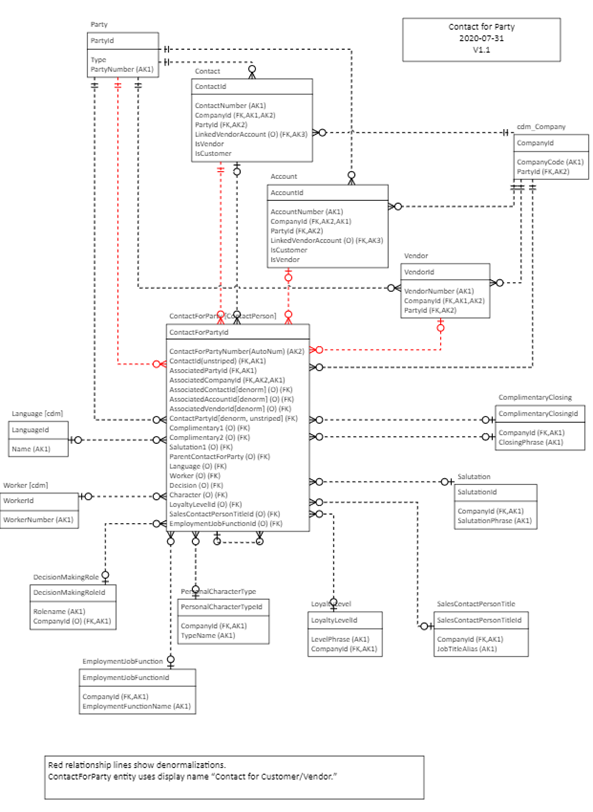
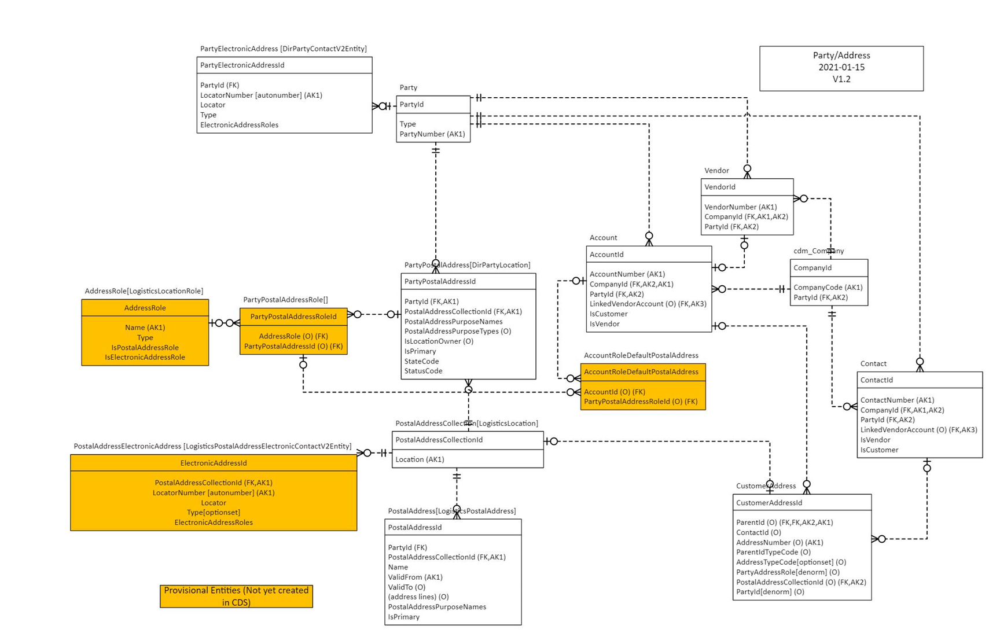
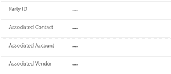
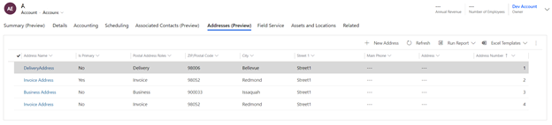
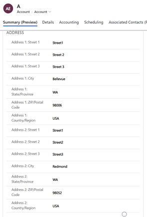
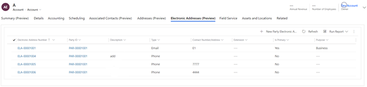
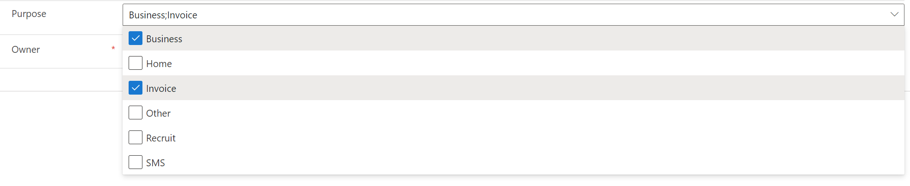
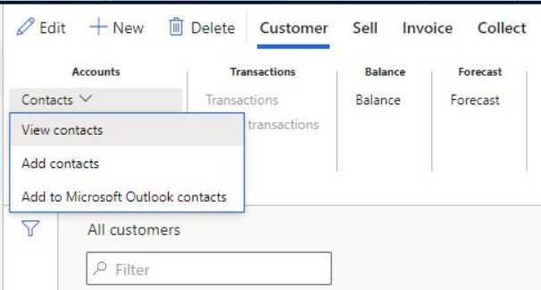

# Party and global address book

[!include [banner](../../includes/banner.md)]

**Party** and **Global address book** are concepts in finance and operations applications. A party can be an organization or a person. It's convenient to globally store and manage properties of a party, such as the name, language, contacts, and addresses. Then, when a property value is changed in one place, the change is reflected in all places where the party is involved.

## Party

A party is a person or an organization that is involved in a business. When the party concept is used, a person or an organization can play more than one role in a business (for example, worker, customer, vendor, or contact). The role is based on the context and purpose. Here are some examples of roles from two fictitious companies, Contoso and Fabrikam:

+ **Worker** – An employee. An example is an employee of Contoso.
+ **Vendor** – A supplier organization, or a sole proprietor who supplies goods or services to a business. For example, if Fabrikam sells supplies to Contoso, Fabrikam is a vendor of Contoso.
+ **Contact** – A person to contact. For example, if Contoso buys supplies from Fabrikam, employees at Contoso will reach out to the contact at Fabrikam.
+ **Customer** – A person or company that buys things from a company. For example, if Contoso buys supplies from Fabrikam, Contoso is a customer of Fabrikam.

The party model is often used to represent medium to complex relationships between organizations and people, especially when a party plays more than one role. Here are some common examples:

+ A party can be both a customer and a vendor. For example, in North America, Fabrikam sells electric wires to Contoso and buys assembled speakers from Contoso. In Europe, Fabrikam sells parts to Contoso, but it doesn't buy anything from Contoso.
+ A party can be both an employee and a customer. For example, an employee of Contoso buys electronics from Contoso for personal use.
+ There can be a many-to-many (N:N) relationship between a person and an organization. For example, Fabrikam provides service specialists and employs a placement coordinator. The placement coordinator matches service specialists to work requests from several of Fabrikam's customers. Contoso is one of Fabrikam's customers. When Contoso requires a service specialist, it contacts the placement coordinator, who then facilitates the request. Because the placement coordinator handles requests for all customers, an N:N relationship is involved.

The following illustration shows the data model for party.

> [!TIP]
> When you're trying to create a new account record, use the **Party** field to search for the record by name. In this way, if you find the record, you just have to select it. The system then automatically fills in all the data from the party. You don't have to manually set all the required fields. This behavior can be found on the out-of-box **Account**, **Contact**, and **Vendor** pages.

Dual-write doesn't support all party roles of finance and operations apps. For a complete list of party roles, see [Global address book overview](../../../fin-ops/organization-administration/overview-global-address-book.md).

### Global address book

The global address book is a directory of postal and electronic addresses of the organizations and individuals that participate in a business.

The global address book stores and handles as many postal addresses and electronic addresses as required. For example, Fabrikam has gas stations in 50 locations. Each location has a different postal address, email address, and phone number. All business purchases are billed to the main gas station but shipped directly to the specific gas station that requested the purchase. The global address book stores the main gas station as the billing address for Fabrikam and stores each gas station as a shipping address. The addresses can be stored one time and then retrieved as they are required for quotations and orders.

Depending on the business context, a person or an organization might play more than one role, and the same postal address and electronic address might be used for all the roles. In this case, a change of address in one role should appear in all the other roles. The global address book stores and handles addresses globally.

The following illustration shows the data model for the global address book.

## Contact

In customer engagement apps, a contact is a person. However, the **Contact** table has been overloaded to represent a person, a portal user, a business-to-consumer (B2C) customer, or a vendor. The representation is implicit, and you can't tell the difference unless you examine related transactions. The **Contact** table has been limited to a one-to-one (1:1) relationship with the **Account** table. As part of the party and global address book model, dual-write introduces explicit properties for classification and allows for N:N relationships between a contact that is a person and an organization (**Account** or **Vendor** entity).

There are two types of **Contact** rows:

+ **Striped contact** – A **Contact** row where the **Company** field has a mandatory value.
+ **Unstriped contact** – A **Contact** row where the **Company** field is blank.

The **Contact** table can store the following types of rows.

| Row type | Description |
|----------|-------------|
| A person who is a customer (for example, a sellable contact or a B2C customer) | A striped contact record where the **Company** field isn't blank and the **Is Customer** field is set to **Yes**. |
| A person who is a vendor (for example, a sole proprietor such as a vendor) | A striped contact record where the **Company** field isn't blank and the **Is Vendor** field is set to **Yes**. |
| A person who is both a customer and a vendor | A striped contact record where the **Company** field isn't blank, the **Is Customer** field is set to **Yes**, and the **Is Vendor** field is set to **Yes**. A person can be both a producer for one product and a consumer for another product. Both finance and operations apps and dual-write support this relationship. |
| A person who is a contact person for an organization, but isn't a customer or a vendor | An unstriped contact record where the **Company** field is blank, the **Is Customer** field is set to **No**, and the **Is Vendor** field is set to **No**. |

## Contact for Party table

The **Contact for Party** table stores and handles N:N relationships between **Account** rows and **Contact** rows. It can filter out the striped **Contact** rows from unstriped rows and associate only the unstriped **Contact** rows with **Account** or **Vendor** rows.

For example, Natasha Jones and Miguel Reyes are veterinarians who provide care for farms in their areas. Natasha serves the Seattle area, and Miguel serves the Kent area. In the customer engagement app, the farms are represented as customers, and the veterinarians are represented as contact persons. A single **Contact** record for Natasha is associated with all the farms that Natasha works with. Likewise, a single **Contact** record for Miguel is associated with all the farms that Miguel works with.

These relationships are stored in the **Contact for Party** table. You can find the information on the out-of-box **Account**, **Contact**, and **Vendor** pages:

+ On the **Account** page, you can use the **Associated Contacts** tab to associate one or more contacts with the **Account** row. In this way, you assign contact persons for an organization. You can then select one contact as the primary contact for the account. If you use the **Quick create** page, you can only select a contact person. The behavior is the same when you're using the **Vendor** page and the record type is **Organization**.
+ On the **Contact** page, when the row is a customer, a vendor, or both (a striped contact), you can use the **Associated Contacts** tab to associate one or more contacts. In this way, you assign contact persons for a B2C customer or vendor. You can then select one contact as the primary contact. If you use the **Quick create** page, you can only select a contact person.
+ On the **Contact** page, when the row is a contact person (an unstriped contact), you can use the **Associated Organizations** tab to associate one or more customers or vendors. In this way, you assign customers or vendors to the underlying contact person. The customer or vendor can be an organization, a person, or both. You can select a value in only one of the four fields at a time:

    + If you select a value in the **Party ID** field, the underlying contact is assigned to all the roles of the selected party.
    + If you select a value in the **Associated Contact** field, you're selecting the striped contact of the **Person** type.
    + If you select a value in the **Associated Account** or **Associated Vendor** field, you're selecting an organization.

    

    Regardless of your selection, the association is created at the party level, it applies to all the roles of the party, and it's stored in the **Contact for Party** entity.

> [!NOTE]
> The display name for the **Contact for Party** table in customer engagement apps is **Contact for Customer/Vendor**.

When you open a **Contact** row where both the **Is Customer** field and the **Is Vendor** are set to **No**, the **Associated Organizations** tab is shown. Use this tab to associate one or more customer or vendor organizations with the contact.

When you open a **Contact** row where either the **Is Customer** field or the **Is Vendor** field is set to **Yes**, the **Associated Contacts** tab is shown. Use this tab to associate one or more contacts.

## Postal addresses

A new **Addresses** tab has been introduced on the **Account**, **Contact**, and **Vendor** pages. This tab supports multiple postal addresses by using a grid, as shown in the following illustration.

The grid includes the following columns:

+ **Postal Address Roles** – The purpose of the postal address.
+ **Is Primary** – A value that indicates whether the address is the primary address.
+ **Address Number** – The address order.

You can use the **New Address** button above the grid to create as many postal addresses as you want.

In customer engagement apps, when a user enters the addresses on the **Summary** tab of the **Accounts** page, the **Address 1** and **Address 2** fields correspond to the **Delivery** and **Invoice** addresses, respectively. However, when a user creates a postal address in finance and operations apps, the first two addresses of the customer record will appear in the **Address1** and **Address2** fields, and the user has the option to change the address purpose to **Delivery** and **Invoice**.

Similarly, the **Address 1**, **Address 2**, and **Address 3** fields on the **Summary** tab of the **Contact** page correspond to the **Business**, **Delivery**, and **Invoice** addresses, respectively.

## Electronic addresses

A new **Electronic Addresses** tab has been introduced on the **Account**, **Contact**, and **Vendor** pages. This tab supports multiple electronic addresses by using a grid, as shown in the following illustration.

The grid includes the following columns:

+ **Type** – The type of electronic address.
+ **Is Primary** A value that indicates whether the address is the primary address.
+ **Purpose** – The purpose of the electronic address.

You can use the **New Electronic Address** button above the grid to create as many addresses as you want.

During the lead qualification process, you can provide both a business phone number and a mobile phone number. The business phone number is considered the primary phone number if **IsMobile=No**, and the mobile phone number is considered the secondary phone number if **IsMobile=Yes**.

> [!TIP]
> Use **Addresses** and **Electronic Addresses** tabs on the **Account** and **Contact** forms to manage postal and electronic addresses. This ensures that address data synchronizes to finance and operations apps.

## Setup

1. Open your customer engagement app environment.

2. Install all prerequisite solutions, as described in [Separated Dual-write Application Orchestration package](separated-solutions.md).

3. Install [Dual-write Party and Global Address Book Solutions](https://aka.ms/dual-write-gab).

4. Open the finance and operations app. Navigate to the Data Management module and select the Dual-write tab. The dual-write administration page opens.

5. Apply both the solutions installed in steps 2 and 3 using the [Apply Solution](link-your-environment.md) function.

6. Stop the following maps, because they aren't required anymore. Instead, run the `Contacts V2 (msdyn_contactforparties)` map.

    + CDS Contacts V2 and Contacts (refers to customer contacts)
    + CDS Contacts V2 and Contacts (refers to vendor contacts)

7. The following entity mappings are updated for party functionality, so the latest version must be applied to these mappings.

    Map | Update to this version | Changes
    ---|---|---
    `CDS Parties (msdyn_parties)`| 1.0.0.2 | This is a new map added as part of this release.
    `Contacts V2 (msdyn_contactforparties)`| 1.0.0.6 | This is a new map added as part of this release.
    `Customers V3 (accounts)` | 1.0.0.5 |Removed `PartyNumber` and other party-related fields like name, personal details, postal address fields, and electronic contact address.
    `Customer V3 (contacts)` | 1.0.0.5 | Removed `PartyNumber` and other party-related fields like name, personal details, postal address fields, and electronic contact address.
    `Vendors V2 (msdyn_vendors)` | 1.0.0.6 | Removed `PartyNumber` and other party-related fields like name, personal details, postal address fields, and electronic contact address.
    `CDS Sales quotation headers (quotes)` | 1.0.0.7 | Replaced the contact person with `ContactforParty` reference.
    `Sales invoice headers V2 (invoices)` | 1.0.0.4 | Replaced the contact person with `ContactforParty` reference.
    `CDS Sales order headers (salesorders)` | 1.0.0.5 | Replaced the contact person with `ContactforParty` reference.
    `CDS Party postal address locations (msdyn_partypostaladdresses)` | 1.0.0.1  | This is a new map added as part of this release.
    `CDS postal address history V2 (msdyn_postaladdresses)` | 1.0.0.2 | This is a new map added as part of this release.
    `CDS postal address locations (msdyn_postaladdresscollections)` | 1.0.0.0 | This is a new map added as part of this release.
    `Party Contacts V3 (msdyn_partyelectronicaddresses)` | 1.0.0.0 | This is a new map added as part of this release.
    `Complimentary Closings (msdyn_compliemntaryclosings)` | 1.0.0.0 | This is a new map added as part of this release.
    `Decision making roles (msdyn_decisionmakingroles)` | 1.0.0.0 | This is a new map added as part of this release.
    `Loyalty levels (msdyn_loyaltylevels)` | 1.0.0.0 | This is a new map added as part of this release.
    `Contact person titles (msdyn_salescontactpersontitles)` | 1.0.0.0 | This is a new map added as part of this release.
    `Personal character types (msdyn_personalcharactertypes)` | 1.0.0.0 | This is a new map added as part of this release.
    `Salutations (msdyn_salutations)` | 1.0.0.0 | This is a new map added as part of this release.
    `Employment job functions (msdyn_employmentjobfunctions)` | 1.0.0.0 | This is a new map added as part of this release.
    `CDS Address roles (msdyn_addressroles)` | 1.0.0.0 | This is a new map added as part of this release.

8. Before running the above maps, you must update the integration keys manually as described in the following steps. Then select **Save**.

    | Map | Keys |
    |-----|------|
    | Account |  accountnumber [Account Number] msdyn_company.cdm_companycode [Company (Company Code)] |
    | Contact | msdyn_contactpersonid [Account Number/Contact Person ID] msdyn_company.cdm_companycode [Company (Company Code)] |
    | Contact For Customer/Vendor | msdyn_contactforpartynumber [Contact For Party Number] msdyn_associatedcompanyid.cdm_companycode [Associated Company (Company Code)] |
    | Vendor | msdyn_vendoraccountnumber [Vendor Account Number] msdyn_company.cdm_companycode [Company (Company Code)]|

9. In Dataverse, the duplicate detection rules character limits have increased from 450 to 700 characters. This limit lets you add one or more keys to the duplicate detection rules. Expand the duplicate detection rule for the **Accounts** table by setting the following fields.

    | Field | Value |
    |-------|-------|
    | Name | Accounts with the same account name. |
    | Description | Detects account records that have the same value in the Account Name attribute. |
    | Base Record Type | Account |
    | Matching Record Type | Account |
    | Account Name (field) | Exact Match |
    | Company (field) | Exact Match |
    | Relationship Type (field) | Exact Match |
    | Party Id (field) | Exact Match |
    | Select (field) | (blank) |

    

10. Expand the duplicate detection rule for the **Contacts** table by setting the following fields.

    | Field | Value |
    |-------|-------|
    | Name | Contacts with the same first name and last name. |
    | Description | Detects contact records that have the same values in the First Name and Last Name fields. |
    | Base Record Type | Contact |
    | Matching Record Type | Contact |
    | First Name (field) | Exact Match |
    | Last Name (field) | Exact Match |
    | Company (field) | Exact Match |
    | Party Id (field) | Exact Match |
    | Select (field) | (blank) |

    

11. If you are an existing dual-write user, follow the instructions in [Upgrade to the party and global address book model](upgrade-party-gab.md) and upgrade your data. **Do not proceed to step 12 without completing this step.** If you are a new dual-write user, proceed to step 12.

12. If you are an existing dual-write user, complete step 11, and then you can run the maps in the following order. If you are a new dual-write customer, you can proceed directly. If you are shown an error message that states "Project validation failed. Missing destination field...", open the map and select **Refresh Tables**, then run the map.

    Finance and operations app | Customer engagement app  
    ----------------------------|------------------------
    [CDS Parties](mapping-reference.md#220) | msdyn_parties
    [CDS postal address locations](mapping-reference.md#234) | msdyn_postaladdresscollections
    [CDS postal address history V2](mapping-reference.md#235) | msdyn_postaladdresses
    [CDS Party postal address locations](mapping-reference.md#233) | msdyn_partypostaladdresses
    [Party contacts V3](mapping-reference.md#236) | msdyn_partyelectronicaddresses
    [Customers V3](mapping-reference.md#101) | accounts
    [Customers V3](mapping-reference.md#116) | contacts
    [Vendors V2](mapping-reference.md#202) | msdyn_vendors
    [Contact person titles](mapping-reference.md#223) | msdyn_salescontactpersontitles
    [Complimentary closings](mapping-reference.md#222) | msdyn_complimentaryclosings
    [Salutations](mapping-reference.md#228) | msdyn_salutations
    [Decision making roles](mapping-reference.md#224) | msdyn_decisionmakingroles
    [Employment job functions](mapping-reference.md#225) | msdyn_employmentjobfunctions
    [Loyalty levels](mapping-reference.md#226) | msdyn_loyaltylevels
    [Personal character types](mapping-reference.md#227) | msdyn_personalcharactertypes
    [Contacts V2](mapping-reference.md#221) | msdyn_contactforparties
    [CDS sales quotation header](mapping-reference.md#215) | quotes
    [CDS sales order headers](mapping-reference.md#217) | salesorders
    [Sales invoice headers V2](mapping-reference.md#118) | invoices
    [CDS Address roles](mapping-reference.md#301) | msdyn_addressroles

> [!NOTE]
> The `CDS Contacts V2 (contacts)` map is the map that you stopped in step 1. When you try to run other maps, these 2 maps may appear in the list of dependents. Don't run these maps.
>
> If the party and global address book solution is installed, you must disable the plugin named `Microsoft.Dynamics.SCMExtended.Plugins.Plugins.LeadPrimaryContactPostCreate: QualifyLead of lead`. 
> To disable the plugin, contact support. 
> If you uninstall the party and global address book solution, then you must re-enable the plugin.
>
> The `msdyn_*partynumber` field (a single line text field) that is included in the **Account**, **Contact** and **Vendor** tables should not be used going forward. The label name has a prefix of **(Deprecated)** for clarity. Instead, use the **msdyn_partyid** field. The field is a lookup to the **msdyn_party** table.
>
> Table Name | Old field | New field
> --------|-------|--------
> Account | `msdyn_partynumber` | `msdyn_partyid`
> Contact | `msdyn_partynumber` | `msdyn_partyid`
> msdyn_vendor | `msdyn_vendorpartynumber` | `msdyn_partyid`

## Templates

A collection of table maps work together for party and global address book interaction, as shown in the following table.

| Finance and operations app | Customer engagement app | Description |
|----------------------------|-------------------------|-------------|
| [Contact person titles](mapping-reference.md#223) | msdyn\_salescontactpersontitles |
| [Customers V3](mapping-reference.md#101) | accounts |
| [Customers V3](mapping-reference.md#116) | contacts |
| [CDS Parties](mapping-reference.md#220) | msdyn\_parties |
| [CDS Party postal address locations](mapping-reference.md#233) | msdyn\_partypostaladdresses |
| [CDS postal address history V2](mapping-reference.md#235) | msdyn\_postaladdresses |
| [CDS postal address locations](mapping-reference.md#234) | msdyn\_postaladdresscollections |
| [CDS sales quotation header](mapping-reference.md#215) | quotes |
| [CDS sales order headers](mapping-reference.md#217) | salesorders |
| [Complimentary closings](mapping-reference.md#222) | msdyn\_complimentaryclosings |
| [Contacts V2](mapping-reference.md#221) | msdyn\_contactforparties |
| [Decision making roles](mapping-reference.md#224) | msdyn\_decisionmakingroles |
| [Employment job functions](mapping-reference.md#225) | msdyn\_employmentjobfunctions |
| [Loyalty levels](mapping-reference.md#226) | msdyn\_loyaltylevels |
| [Party contacts V3](mapping-reference.md#236) | msdyn\_partyelectronicaddresses |
| [Personal character types](mapping-reference.md#227) | msdyn\_personalcharactertypes |
| [Sales invoice headers V2](mapping-reference.md#118) | invoices |
| [Salutations](mapping-reference.md#228) | msdyn\_salutations |
| [Vendors V2](mapping-reference.md#202) | msdyn\_vendors |
| [CDS Address roles](mapping-reference.md#301) |msdyn\_addressroles|

For more information, see [Dual-write mapping reference](mapping-reference.md).

## Address roles as a multi-select drop-down list
A postal address or an electronic address can serve more than one purpose. For example, a postal address can serve as both a billing address and a delivery address. In these cases, a user can select both **Invoice** and **Delivery** in the drop-down list, as shown in the following illustration. 

## Known issues and limitations

+ In finance and operations apps, when you create a customer along with address and save it, the address might not synchronize to the **Address** table. This is because of a dual-write platform sequencing issue. As a workaround, create the customer first and save it. Then add the address.
+ In finance and operations apps, when a customer record has a primary address and you create a new contact for that customer, then the contact record inherits a primary address from the associated customer record. This happens for vendor contact, too. Dataverse doesn't currently support this behavior. If dual-write is enabled, a customer contacts that is inherited with a primary address from the finance and operations app is synchronized to Dataverse along with its address.
+ In finance and operations apps, you can create a contact record from the **Add Contact** form. When you try to create a new contact from the **View Contact** form, the action fails. This is a known issue.

    

+ **Initial sync** does not support the **Available From** and **Available To** time fields on **ContactForParty**, because DIXF converts the value into a string instead of an integer. The conversion triggers the error `Cannot convert the literal '<say 08:00:00>' to the expected type edm.int32`.
+ You can't enter a forward-dated postal address using a finance and operations app with dual-write, because Dataverse does not support date effectivity. If you enter a future-dated postal address using a finance and operations app, it synchronizes to Dataverse fully and you will see the address on the user interface immediately. Any updates to this record will result in an error as it is future-dated and not current in the finance and operations app.
