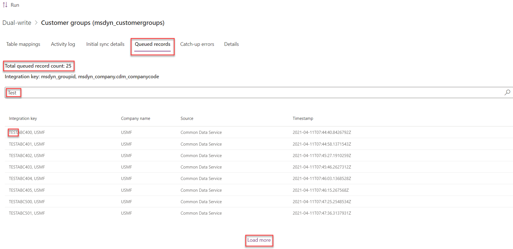

# Pause dual-write for maintenance

[!include [banner](../../includes/banner.md)]

You can pause table maps, either manually or automatically via rules. By pausing table maps, you help ensure business continuity, especially during planned or unplanned maintenance. While the app is being maintained, users can continue to do their work and create records.

When you pause a table map that is in the **Running** state, all records that have been created or updated are queued until you resume the table map. The queued records are stored in secure Microsoft Azure storage. They are then played back when you resume the table map and put it back into the **Running** state.

> [!NOTE]
> While a table map is in the **Paused** state, the following limits apply: 
> - A pause can be active for a maximum of only one day.
> - There is a maximum size of 1 GB worth of records that can be queued. 
>
> Paused maps must be reactivated in less than one day from the pause start date, or else pending changes can be lost impacting data consistency. 
> Reaching either one of these limits will result in a block on all additional records until the sync is resumed and the queued records are caught up. Users will have to manually resume the job in order for the catch up to be completed.

Records that have been created or updated for a table map that is in the **Paused** state can be viewed on the **Queued records** tab for each table map.

The **Total queued record count** line shows the total number of records that have been queued for a given table map. You can select **Load more** to view additional records in the paginated view. You can also filter the records by the integration key.

## Resume synchronization
When you resume the table map, its state is changed from **Paused** to **Running**, and the records are written from the queue to the destination app. There are three options that affect how queued records are managed when synchronization resumes:
- **Catch up synchronization of queued records** - Records in the queue will be processed prior to resuming live synchronization of new records. New records created for the map will continue to be added to the queue rather than synched with live synchronization until all records have been processed in the queue. Live synchronization for new records of the mapped tables will continue when all records in the queue have been processed.
- **Skip to live synchronization preserving queued records to catch up errors for retry** - Live synchronization of new records for the table map resumes immediately. Queued records are moved to the **Catch-up errors** list where you have the option to retry processing of the records. Records in the **Catch-up errors** list that are retried are processed asynchronously.
- **Skip to live synchronization and discard queued records** - Live synchronization resumes immediately for the new records created for the table map. Any queued records are discarded from the queue and are not synchronized with the destination app.

Some records might error out and fail to be written for various reasons, such as business validations in the destination app. In these cases, the records will remain in the queue and can be viewed on the **Catch-up errors** tab. For more information, see [Catch-up errors from pausing a table map](errors-and-alerts.md#catch-up-errors-from-pausing-a-table-map).

## Skip to live synchronization
The **Skip to live sync** action is available for a table map while it is resuming, and queued records are being processed. If, when resuming the table map, the **Catch up synchronization of queued records** option was selected, records in the queue will be processed prior to resuming live synchronization of new records. It's possible that the queue may be processed more slowly than desired. For example, there may be a high number of records in the queue, or a high volume of new records being created, adding records to the queue faster than the queue is being processed. When this occurs, you have the option to skip to live synchronization.

When selecting the **Skip to live sync** action, live synchronization of new records for the table map resumes immediately rather than adding new records to the queue. If the **Preserve queued records to catch-up errors** option is selected, all remaining records in the queue are moved to the **Catch-up errors** list where you have the option to retry processing of the records. Records in the **Catch-up errors** list that are retried are processed asynchronously. If the **Preserve queued records to catch-up errors** option is *not* selected, any records remaining in the queue are discarded from the queue and are not synchronized with the destination app.

[!INCLUDE[footer-include](../../../../includes/footer-banner.md)]
