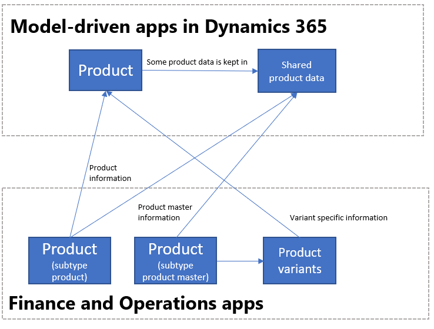

# Unified product experience

[!include [banner](../../includes/banner.md)]

When a business ecosystem is made up of Dynamics 365 applications, such as Finance, Supply Chain Management, and Sales, businesses often use these applications to source product data. This is because these apps provide a robust product infrastructure complemented with sophisticated pricing concepts and accurate on-hand inventory data. Businesses who use an external Product Lifecycle Management (PLM) system for sourcing the product data can channelize products from finance and operations apps to other Dynamics 365 apps. The unified product experience brings the integrated product data model in to Dataverse, so that all application users, including Power Platform users, can take advantage of the rich product data coming from finance and operations apps.

Here is the product data model from Sales.

Here is the product data model from finance and operations apps.

These two product data models have been integrated in Dataverse as shown below.

The dual-write table maps for products have been designed to flow data one-way only, in near-real time from finance and operations apps to Dataverse. However, the product infrastructure has been made open to make it bi-directional if required. Although you can customize it, it's at your own risk, as Microsoft doesn't recommend this approach.

## Templates

Product information contains all the information related to the product and its definition, such as the product dimensions or the tracking and storage dimensions. As the following table shows, a collection of table maps is created to sync products and related information.

Finance and operations apps | Other Dynamics 365 apps | Description
-----------------------|--------------------------------|---
[All products](mapping-reference.md#138) | msdyn_globalproducts | The all products table contains all the products available in finance and operations apps, both the released products and the non-released products.
[CDS released distinct products](mapping-reference.md#213) | Product | The **Product** table contains the columns that define the product. It includes individual products (products with subtype product) and the product variants. The following table shows the mappings.
[Colors](mapping-reference.md#170) | msdyn\_productcolors
[Configurations](mapping-reference.md#171) | msdyn\_productconfigurations
[Default order settings](mapping-reference.md#172) | msdyn_productdefaultordersettings |
[Product categories](mapping-reference.md#166) | msdyn_productcategories | Each of the product categories and information about its structure and characteristics are contained in the product category table.
[Product category assignments](mapping-reference.md#167) | msdyn_productcategoryassignments | To assign a product to a category the product category assignments table can be used.
[Product category hierarchies](mapping-reference.md#168) | msdyn_productcategoryhierarchies | You use product hierarchies to categorize or group products. The category hierarchies are available in Dataverse using the Product category hierarchy table.
[Product category hierarchy roles](mapping-reference.md#169) | msdyn_productcategoryhierarchyroles | Product hierarchies can be used for different roles in Dynamics 365 finance and operations. They specify which category is used in each role the product category role table is used.
[Product default order settings V2](mapping-reference.md#175) | msdyn_productspecificdefaultordersettings |
[Product dimension groups](mapping-reference.md#173) | msdyn\_productdimensiongroups | The product dimension group defined which product dimensions define the product.
[Product master colors](mapping-reference.md#187) | msdyn_sharedproductcolors | The **Shared product color** table indicates the colors that a specific product master can have. This concept is migrated to Dataverse to keep data consistent.
[Product master configurations](mapping-reference.md#188) | msdyn_sharedproductconfigurations | The **Shared product configuration** table indicates the configurations that a specific product master can have. This concept is migrated to Dataverse to keep data consistent.
[Product master sizes](mapping-reference.md#190) | msdyn_sharedproductsizes | The **Shared product size** table indicates the sizes that a specific product master can have. This concept is migrated to Dataverse to keep data consistent.
[Product master styles](mapping-reference.md#191) | msdyn_sharedproductstyles | The **Shared product style** table indicates the styles that a specific product master can have. This concept is migrated to Dataverse to keep data consistent.
[Product Number Identified Barcode](mapping-reference.md#164) | msdyn\_productbarcodes | Product bar codes are used to uniquely identify products.
[Product specific unit conversions](mapping-reference.md#176) | msdyn_productspecificunitofmeasureconversions |
[Released products V2](mapping-reference.md#189) | msdyn\_sharedproductdetails | The **msdyn\_sharedproductdetails** table contains the columns from finance and operations apps that define the product, and that contain the product's financial and management information.
[Sizes](mapping-reference.md#174) | msdyn\_productsizes
[Storage dimension groups](mapping-reference.md#177) | msdyn_productstoragedimensiongroups | The product storage dimension group represents the method used to define the placement the product in the warehouse.
[Styles](mapping-reference.md#178) | msdyn\_productstyles
[Tracking dimension groups](mapping-reference.md#179) | msdyn_producttrackingdimensiongroups | The product tracking dimension group represents the method used to track the product in inventory.
[Units](mapping-reference.md#219) | uoms
[Unit conversions](mapping-reference.md#199) | msdyn_ unitofmeasureconversions

## Integration of products

In this model, the product is represented by the combination of two tables in Dataverse: **Product** and **msdyn\_sharedproductdetails**. Whereas the first table contains the definition of a product (the unique identifier for the product, the product name, and the description), the second table contains the columns stored at the product level. The combination of these two tables is used to define the product according to the concept of the stockkeeping unit (SKU). Each released product will have its information in the mentioned tables (Product and Shared Product Details). To keep track of all products (released and not released), the **Global products** table is used.

Because the product is represented as a SKU, the concepts of distinct products, product masters, and product variants can be captured in Dataverse in the following way:

- **Products with subtype product** are products that are defined by themselves. No dimensions have to be defined. An example is a specific book. For these products, one row is created in the **Product** table, and one row is created in the **msdyn\_sharedproductdetails** table. No product family row is created.
- **Product masters** are used as generic products that hold the definition and rules that determine the behavior in business processes. Based on these definitions, distinct products that are known as product variants can be generated. For example, T-shirt is the product master, and it can have Color and Size as dimensions. Variants can be released that have different combinations of these dimensions, such a small blue T-shirt or a medium green T-shirt. In the integration, one row per variant is created in the product table. This row contains the variant-specific information, such as the different dimensions. The generic information for the product is stored in the **msdyn\_sharedproductdetails** table. (This generic information is stored in the product master.) The product master information is synced to Dataverse as soon as the released product master is created (but before variants are released).
- **Distinct products** refer to all the products subtype product and all the product variants.

With the dual-write functionality enabled, the products from finance and operations will be synchronized in other Dynamics 365 products in **Draft** state. They're added to the first price list with the same currency used in the customer engagement app and using alphabetical sort on the price list name. In other words, they're added to the first price list in a Dynamics 365 app that matches the currency of your legal table where the product is released in a finance and operations app. If there's no price list for the given currency, a price list will automatically be created and the product will be assigned to it.

The current implementation of the dual-write plugins that associate the default price list to the unit look up the currency associated with the finance and operations app and find the first price list in the customer engagement app using alphabetical sort on the price list name. To set a default price list for a specific currency when you have multiple price lists for that currency, you must update the price list name to a name that is earlier in alphabetical order than any other price lists for that same currency. If it doesn't have any price list for the given currency, a new one is created.

By default products from finance and operations apps are synchronized to other Dynamics 365 apps in **Draft** state. To synchronize the product with **Active** state so that you can directly use it in sales order quotations, the following setting needs to be chosen: **System> Adminstration > System administration > System settings > Sales** tab and select **Create products in active state = yes**.

When products are synchronized, you must enter a value for the **Sales unit** field in the finance and operations app, because it is a mandatory field in Sales.

The creation of product families from Dynamics 365 Sales isn't supported with the dual-write synchronization of products.

The synchronization of products happens from the finance and operations app to Dataverse. This means that the values of the product table columns can be changed in Dataverse, but when the synchronization is triggered (when a product column is modified in a finance and operations app), this will overwrite the values in Dataverse.

Finance and operations apps | Customer engagement apps |
---|---
[CDS released distinct products](mapping-reference.md#213) | Product |
[Released products V2](mapping-reference.md#189) | msdyn_sharedproductdetails |
[All products](mapping-reference.md#138) | msdyn_globalproducts |

## Product dimensions

Product dimensions are characteristics that identify a product variant. The four product dimensions (Color, Size, Style, and Configuration) are also mapped to Dataverse to define the product variants. The following illustration shows the data model for the product dimension Color. The same model is applied to Sizes, Styles and Configurations.

Finance and operations apps | Customer engagement apps |
---|---
[Colors](mapping-reference.md#170) | msdyn\_productcolors
[Sizes](mapping-reference.md#174) | msdyn\_productsizes
[Styles](mapping-reference.md#178) | msdyn\_productstyles
[Configurations](mapping-reference.md#171) | msdyn\_productconfigurations

When a product has different product dimensions (for example, a product master has Size and Color as product dimensions), each distinct product (that is, each product variant) is defined as a combination of those product dimensions. For example, product number B0001 is an extra-small black T-shirt, and product number B0002 is a small black T-shirt. In this case, the existing combinations of product dimensions are defined. For example, the T-shirt from the preceding example can be extra-small and black, small and black, medium and black, or large and black, but it can't be extra-large and black. In other words, the product dimensions that a product master can take are specified, and variants can be released based on these values.

To keep track of the product dimensions that a product master can take, the following tables are created and mapped in Dataverse for each product dimension. For more information, see [Product information overview](../../../../supply-chain/pim/product-information.md).

Finance and operations apps | Customer engagement apps |
---|---
[Product master colors](mapping-reference.md#187) | msdyn_sharedproductcolors |
[Product master configurations](mapping-reference.md#188) | msdyn_sharedproductconfigurations |
[Product master sizes](mapping-reference.md#190) | msdyn_sharedproductsizes |
[Product master styles](mapping-reference.md#191) | msdyn_sharedproductstyles |
[Product Number Identified Barcode](mapping-reference.md#164) | msdyn\_productbarcodes |

## Default order settings and product-specific default order settings

Default order settings define the site and warehouse where items will be sourced from or stored, the minimum, maximum, multiple and standard quantities that will be used for trading or inventory management, the lead times, the stop flag, and the order promising method. This information is available in Dataverse using the default order settings and product-specific default order settings entity. You can read more information about the functionality in the [Default order settings article](../../../../supply-chain/production-control/default-order-settings.md).

Finance and operations apps | Customer engagement apps |
---|---
[Default order settings](mapping-reference.md#172) | msdyn_productdefaultordersettings |
[Product default order settings V2](mapping-reference.md#175) | msdyn_productspecificdefaultordersettings |

## Unit of measure and unit of measure conversions

The units of measure and its respective conversion are available in the Dataverse following the data model shown in the diagram.

The unit of measure concept is integrated between finance and operations apps and other Dynamics 365 apps. For each unit class in a finance and operations app, a unit group is created in a Dynamics 365 app, which contains the units belonging to the unit class. A default base unit is also created for every unit group.

The following are differences between Dynamics 365 finance and operations apps and Dynamics 365 Sales units of measure:
- In Dynamics 365 finance and operations apps, there are units of measure conversions inter-class and intra-class. It's possible to make changes to sales unit between different classes (inter-class) as long as an existing conversion exists for the product. 
- In Dynamics 365 Sales, you can only change the unit to another unit in the same group. 
- With the standard integration provided, where a unit group is created in Dynamics 365 Sales for each unit class in Dynamics finance and operations app, then it's not possible to change the sales unit of the product in Dynamics 365 Sales to another unit in a different group. This is a restriction in Dynamics 365 Sales. This means that it's not possible to do an inter-class conversion in finance and operations and sync it to Sales. 
- If the scenario to do an inter-class unit conversion in finance and operations apps and then sync to Sales is needed, the default implementation must be changed. All the units from finance and operations will need to be synced to a single unit group in Dynamics 365 Sales that represent the finance and operations unit class. This can be achieved by customizing the dual write mapping template for units and map the msdyn_externalunitclassname to a fixed value instead of UNITCLASS. 

Finance and operations apps | Customer engagement apps |
---|---
[Product specific unit conversions](mapping-reference.md#176) | msdyn_productspecificunitofmeasureconversions |
[Units](mapping-reference.md#219) | uoms
[Unit conversions](mapping-reference.md#199) | msdyn_ unitofmeasureconversions

## Initial synchronization of units data matching between finance and operations and Dataverse

### Initial synchronization of units

When dual write is enabled, units from finance and operations apps are synchronized to other Dynamics 365 apps. The unit groups synchronized from finance and operations apps in Dataverse have a flag set that indicates they are "Externally maintained".

### Matching units and unit classes/groups data from finance and operations and other Dynamics 365 apps

First, it's important to note that the integration key for unit is msdyn_symbol. Therefore, this value must be unique in Dataverse or other Dynamics 365 apps. In other Dynamics 365 apps, it's the pair "Unit group ID" and "Name" that define the uniqueness of a unit, you need to consider different scenarios for matching unit data between finance and operations apps and Dataverse.

For units matching/overlapping in finance and operations apps and other Dynamics 365 apps:

+ **The unit belongs to a unit group in other Dynamics 365 apps that corresponds to the associated unit class in finance and operations apps**. In this case, the column msdyn_symbol in other Dynamics 365 apps must be filled in with the unit symbol from finance and operations apps. Therefore, when the data will be matched, and the unit group will be set as "Externally maintained" in other Dynamics 365 apps.
+ **The unit belongs to a unit group in other Dynamics 365 apps that does not correspond to the associated unit class in finance and operations apps (no existing unit class in finance and operations apps for the unit class in other Dynamics 365 apps).** In this case, the msdyn_symbol must be filled in with a random string. Note that this value must be unique in other Dynamics 365 apps.

For units and unit classes in finance and operations not existing in other Dynamics 365 apps:

As part of dual-write the unit groups from finance and operations apps and its corresponding units are created and synchronized in other Dynamics 365 apps and Dataverse and the unit group will be set as "Externally maintained". No extra bootstrapping effort is required.

For units in other Dynamics 365 apps that don't exist in finance and operations apps:

The column msdyn_symbol must be filled in for all units. The units can always be created in finance and operations apps in the corresponding unit class (if it exists). If the unit class doesn't exist, first the unit class must be created (note that you can't create a unit class in finance and operations apps except through extension if you are extending the enum) matching the other Dynamics 365 apps unit group. Then you can create the unit. The unit symbol in finance and operations apps must be the msdyn_symbol previously specified in other Dynamics 365 apps for the unit.

## Product policies: dimension, tracking and storage groups

The product policies are sets of policies used for defining products and its characteristics in inventory. The product dimension group, product tracking dimension group and storage dimension group can be found as product policies.

Finance and operations apps | Customer engagement apps |
---|---
[Product dimension groups](mapping-reference.md#173) | msdyn\_productdimensiongroups |
[Storage dimension groups](mapping-reference.md#177) | msdyn_productstoragedimensiongroups |
[Tracking dimension groups](mapping-reference.md#179) | msdyn_producttrackingdimensiongroups |

## Product hierarchies

Finance and operations apps | Customer engagement apps |
---|---
[Product category assignments](mapping-reference.md#167) | msdyn_productcategoryassignments |
[Product category hierarchies](mapping-reference.md#168) | msdyn_productcategoryhierarchies |
[Product category hierarchy roles](mapping-reference.md#169) | msdyn_productcategoryhierarchyroles |

## Integration key for products

To uniquely identify products between Dynamics 365 Finance and products in Dataverse the integration keys are used.
For products, the **(productnumber)** is the unique key that identifies a product in Dataverse. It's composed by the concatenation of: **(company, msdyn_productnumber)**. The **company** indicates the legal entity in finance and operations and **msdyn_productnumber** indicates the product number for the specific product in finance and operations.

For users of other Dynamics 365 apps, the product is identified in the UI with the **msdyn_productnumber** (note that the label of the column is **Product number**). In the product page, both the company and the msydn_productnumber are shown. However, the (productnumber) column, the unique key for a product, isn't shown.

If you build apps on Dataverse, you should pay attention to using the **productnumber** (the unique product ID) as the integration key. Don't use **msdyn_productnumber**, because it's not unique.

## Initial synchronization of products and migration of data from Dataverse to finance and operations

### Initial synchronization of products

When dual-write is enabled, products from finance and operations apps are synchronized to Dataverse and customer engagement apps. Products created in Dataverse and other Dynamics 365 apps before dual-write was released won't be updated or matched with product data from finance and operations apps.

### Matching product data from finance and operations and other Dynamics 365 apps

If the same products are kept (overlapping/matching) in finance and operations and in Dataverse and other Dynamics 365 apps, when enabling dual-write the synchronization of products from finance and operations will take place, and duplicate rows will appear in Dataverse for the same product.
To avoid the previous situation, if other Dynamics 365 apps have products that are overlapping/matching with finance and operations, then the administrator enabling dual write must bootstrap the columns **Company** (example: "USMF") and **msdyn_productnumber** (example: "1234:Black:S") before the synchronization of products takes place. In other words, these two columns in the product in Dataverse must be filled in with the respective company in finance and operations to which the product needs to be matched with and with its product number.

Then, when the synchronization is enabled and takes place, the products from finance and operations will be synchronized with the matched products in Dataverse and other Dynamics 365 apps. This is applicable for both distinct products and product variants.

### Migration of product data from other Dynamics 365 apps to finance and operations

If other Dynamics 365 apps have products that aren't present in finance and operations, the administrator can use the **EcoResReleasedProductCreationV2Entity** for importing those products in finance and operations. And secondly, match the product data from finance and operations and other Dynamics 365 apps as described above.

[!INCLUDE[footer-include](../../../../includes/footer-banner.md)]

