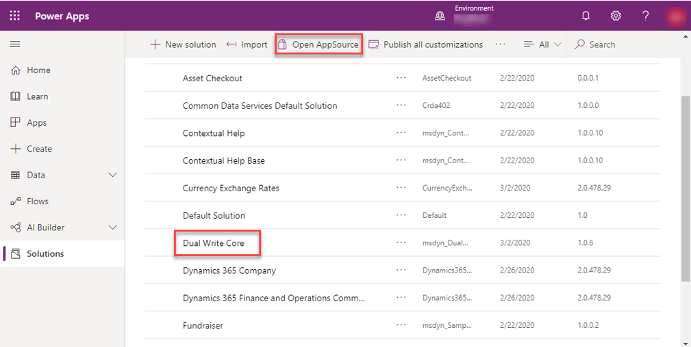
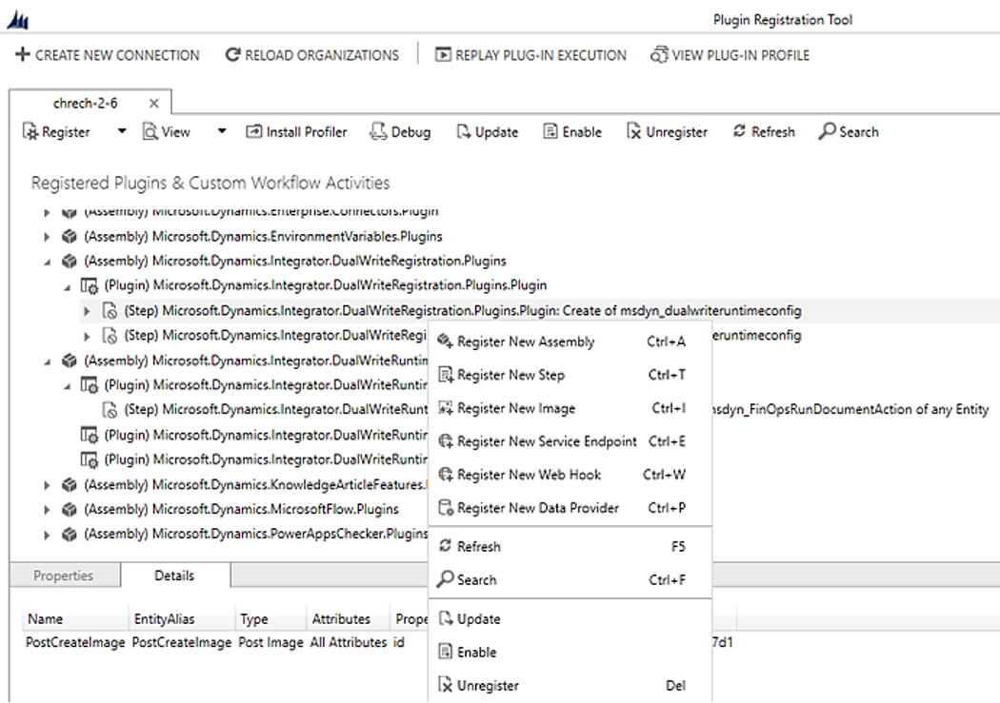

# System requirements and prerequisites

[!include [banner](../../includes/banner.md)]

## What regions are available?

Currently, we support dual-write in the following regions:

+ Asia
+ Australia
+ Brazil
+ Canada
+ Europe
+ France
+ Germany
+ India
+ Japan
+ South America
+ Switzerland
+ United Arab Emirates
+ United Kingdom
+ United States

> [!NOTE]
> There are currently no plans to support any additional regions.

## Verify requirements and grant access

Before you enable dual-write, follow these steps to make sure that you meet the minimum system requirements and to grant access to the apps that must connect to each other. The dual-write health check validates the prerequisites as you complete the dual-write wizard to link a finance and operations app environment to a Dataverse environment.

You must set **Enable Dynamics 365 apps** to **Yes** when you set up the environment, as shown in the following image. Alternatively, you can choose a customer engagement app environment that comes with Dataverse and already has **Enable Dynamics 365 apps** set to **Yes**.

:::image type="content" source="media/add_database_expanded2.png" alt-text="Enable apps switch.":::

1. Validate the platform update and app version.

    Make sure that your finance and operations app environment is running Platform update 33 (app version 10.0.9) or later.

    **Related health check result:**

    *App version is up to date*

    *Dual Write is supported on finance and operations app environments with Platform Update PU 33 (App version 10.0.9) or above*

2. Install the dual-write core solution.

    The dual-write core solution contains metadata for your table maps and must be installed in your environments.

    1. In Power Apps, in the left pane, select **Solutions**.
    2. Select **Open AppSource**.
    3. Select the **Dual Write Core** solution.
    4. Follow the prompts to import the solution.

    

    **Related health check result:**

    *The dual-write core solution was found*

    *The dual-write core solution contains metadata for your table maps and must be installed in the environment*

3. Grant Dataverse access so that it can connect to a finance and operations app.

    1. Open your instance of the finance and operations app, search and navigate to Azure Active Directory applications.

    2. Select **New** to add a new client ID row: **6f7d0213-62b1-43a8-b7f4-ff2bb8b7b452**. This row is the application ID for an app that will be used to connect from Dataverse to the finance and operations app.
    3. Repeat the previous two steps to add another client ID row: **2e49aa60-1bd3-43b6-8ab6-03ada3d9f08b**.

    When you've finished, follow these steps to refresh the list of tables:

    1. Go to **Workspaces \> Data management**, select the **Data entities** tile, and make sure that the entity list is filled in.
    2. Go to **Workspaces \> Data management**, and select the **Framework parameters** tile. Then, on the **Entity settings** tab (`https://<BaseFinanceandOperationsappsURL>/?cmp=USMF&mi=DM_DataManagementWorkspaceMenuItem&TableName=DMFDefinitionGroupEntity`), select **Refresh entity list**.

    **Related health check result:** 
    *The Dataverse can connect to the finance and operations app* 
    *Before you can enable dual-write, you must grant access to the apps to connect to each other 
    &nbsp;&nbsp;&nbsp;&nbsp;&nbsp;&nbsp;App user with id 6f7d0213-62b1-43a8-b7f4-ff2bb8b7b452 exists 
    &nbsp;&nbsp;&nbsp;&nbsp;&nbsp;&nbsp;App user with id 2e49aa60-1bd3-43b6-8ab6-03ada3d9f08b exists*

4. Grant a finance and operations app access so that it can connect to Dataverse. Follow the steps in [Create an application user](/power-platform/admin/manage-application-users#create-an-application-user), using the following information for applications IDs and security roles.

    + **Applications**: Add users to the following applications. The application users must be assigned to a security role that has **Create**, **Read**, **Write**, and **Delete** permissions on all tables in Microsoft Dataverse that will be configured for dual-write.

        + 00000015-0000-0000-c000-000000000000
        + 2e49aa60-1bd3-43b6-8ab6-03ada3d9f08b

    + **Security roles**: Select a preconfigured **Security Role** to grant a **Read** privilege with a **User** scope for each table integrated through dual-write.

        >[!NOTE]
        > Company and currency exchange tables are global in nature and all dual-write users require read access to these 2 tables.
        > All dual-write users will need to be added to the **Dual-Write App User** security role.
        > In order to allow non-administrator users to create rows in a dual-write enabled table, they will need to be assigned the **Dual-Write Runtime User** security role.

        For instructions on how to create a Security Role, see [Create or configure a custom security role](/power-platform/admin/database-security#create-or-configure-a-custom-security-role).

        > [!NOTE]
        > The root business unit’s default team will become the default owner for all rows integrated through dual-write.
        > Because that team must be assigned a security role, this means that all users in the root business unit will inherit the security role.
        > This means that at the very least, **users from that business unit will have read access to all the rows that are owned by that team**. If this isn’t the desired behavior, make sure that users are not a member of the root business unit.

    **Related health check result:** 
    *The finance and operations app can connect to the Dataverse* 
    *Before you can enable dual-write, you must grant access to the apps to connect to each other 
    &nbsp;&nbsp;&nbsp;&nbsp;&nbsp;&nbsp;App user with id 00000015-0000-0000-c000-000000000000 exists 
    &nbsp;&nbsp;&nbsp;&nbsp;&nbsp;&nbsp;App user with id 2e49aa60-1bd3-43b6-8ab6-03ada3d9f08b exists*

    > [!NOTE]
    > When a record is created in finance and operations apps, the **Owner** field will be set when the data is dual-written to Dataverse, even if the matched record exists in Dataverse. Because dual-write uses the app user that has the ID **00000015-0000-0000-c000-000000000000** to communicate with Dataverse, the **Modified by** field will be set to the app user.

5. Provide app consent in the tenant.
   For dual-write core solution version 1.0.16.0 or above, this step is no longer needed.

    **Related health check result:** 
    *Apps in tenant* 
    *The required dual-write applications need to be installed in the tenant. 
    &nbsp;&nbsp;&nbsp;&nbsp;&nbsp;&nbsp;App ID: 6f7d0213-62b1-43a8-b7f4-ff2bb8b7b452 
    &nbsp;&nbsp;&nbsp;&nbsp;&nbsp;&nbsp;App ID: 2e49aa60-1bd3-43b6-8ab6-03ada3d9f08b*

6. Make sure that the dual-write plug-ins are enabled.

    This step isn't usually required, because the plug-ins should be enabled as part of the process of installing the dual-write core solution. However, if the health check fails, follow these steps to manually enable the dual-write plug-ins:

    1. Download the [Plug-in Registration Tool](https://www.nuget.org/packages/Microsoft.CrmSdk.XrmTooling.PluginRegistrationTool).

        In the Plugin Registration Tool, there should be two plug-in assemblies that are associated with dual-write: **DualWriteRegistration.Plugins** and **DualWriteRuntime.Plugins**. These assemblies have plug-in steps that must be enabled, in order, before dual-write can be used. To view the plug-in steps, expand a plug-in assembly and its plug-in types. All the steps that belong to the dual-write plug-in assemblies should be enabled.

    2. To enable a step, select and hold the step (or right-click it), and then select **Enable**. If no **Enable** option is available, only a **Disable** option, the step has already been enabled and doesn't have to be changed.

        

    > [!NOTE]
    > If the dual-write plug-in assemblies can't be found, import the latest version of the dual-write core solution.

    **Related health check result:** 
    *The dual-write registration and runtime plugins are enabled* 
    *To ensure listening into CRUD operations on the Dataverse, the dual-write plugins need to be enabled*

7. Install the **Dual-write application orchestration solutions**.

    In Power Apps, in the left pane, select **Solutions**. Select **Open AppSource**, and search for packages namely [Dual-write Application Core solution](https://appsource.microsoft.com/product/dynamics-365/mscrm.dwappcore?tab=Overview), [Dual-write Human Resources solution](https://appsource.microsoft.com/product/dynamics-365/mscrm.hcm_dualwrite?tab=Overview), [Dual-write Supply Chain solution](https://appsource.microsoft.com/en-us/product/dynamics-365/mscrm.dwscm?tab=Overview), [Dual-write Finance solution](https://appsource.microsoft.com/dynamics-365/mscrm.dwfne?tab=Overview), [Dual-write Notes solution](https://appsource.microsoft.com/product/dynamics-365/mscrm.dwnotessln?tab=Overview), [Dual-write Asset Management solution](https://appsource.microsoft.com/product/dynamics-365/mscrm.dwassetmanagement?tab=Overview), and [Dual-write party and global address book solution](https://appsource.microsoft.com/product/dynamics-365/mscrm.dwgabsln?tab=Overview). These solutions cover master data scenarios like
    
    + Customers, products, and vendors.
    + End-to-end process flows like quote to cash.
    + On-demand functions like pricing, inventory, ATP dates.
    + Reference data for ledger, tax, payment terms, and schedules etc.

Please follow the [pre-requisites instructions](/dev-itpro/data-entities/dual-write/separated-solutions) to find the solution you are looking for. Select the solution, and follow the prompts to import it. 
     
Dual-write framework is extensible and accommodates customer-centric business data exchange through a few additional clicks.
    
> [!NOTE]
> You must select **Apply Solution** as part of the next steps, when you use the dual-write wizard to link your environments. 
> It may take a few minutes for the solution packages to be created in Power Apps solutions section. Wait for it to appear before moving to the next step.

8. Uninstall the Prospect to Cash (P2C) solution.

    The P2C solution doesn't work concurrently with dual-write. Therefore, don't install the P2C solution. If it's already installed, you must uninstall it before you enable dual-write.

9. Provide the supported tenant configuration.

    Make sure that the finance and operations app and Dataverse are installed under the same tenant. Cross-tenant scenarios aren't currently supported.

    > [!NOTE]
    > For dual-write core solution versions lower than 1.0.16.0, see the following section for modifications and additional steps. 

**For dual-write core solution lower than version 1.0.16.0 only**

1. In step 3b above, create a new client ID row: **33976c19-1db5-4c02-810e-c243db79efde** (versus 6f7d0213-62b1-43a8-b7f4-ff2bb8b7b452).
2. Add app consent in the tenant:

    1. Open the following URL, and sign in by using your admin credentials. You should be prompted for consent.

        [https://login.microsoftonline.com/common/oauth2/authorize?client_id=33976c19-1db5-4c02-810e-c243db79efde&response_type=code&prompt=admin_consent](https://login.microsoftonline.com/common/oauth2/authorize?client_id=33976c19-1db5-4c02-810e-c243db79efde&response_type=code&prompt=admin_consent)

    2. Select **Accept**.

        By selecting **Accept**, you indicate that you're providing consent to install the app that has application ID **33976c19-1db5-4c02-810e-c243db79efde** in your tenant. Dataverse requires this app to communicate with the finance and operations app.

    
    **Related health check result:** 
    *Apps in tenant* 
    *The required dual-write applications need to be installed in the tenant. 
    &nbsp;&nbsp;&nbsp;&nbsp;&nbsp;&nbsp;App ID: 33976c19-1db5-4c02-810e-c243db79efde 
    &nbsp;&nbsp;&nbsp;&nbsp;&nbsp;&nbsp;App ID: 2e49aa60-1bd3-43b6-8ab6-03ada3d9f08b*

## Next steps

[Use the dual-write wizard to link your environments](link-your-environment.md)

[!INCLUDE[footer-include](../../../../includes/footer-banner.md)]

