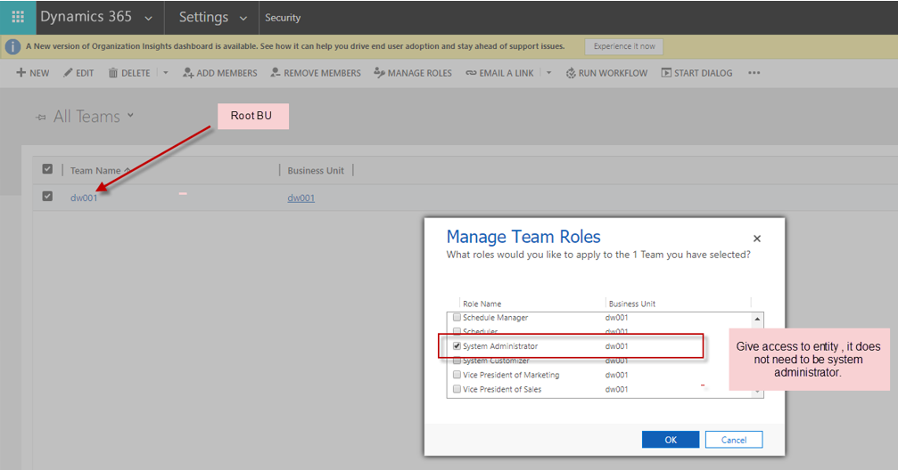

---

title: System requirements and prerequisites
description: This topic describes the system requirements and prerequisites that must be in place before you can enable dual-write for Finance and Operations apps.
author: sabinn-msft

ms.technology: 
ms.topic: conceptual
ms.date: 03/20/2020
ms.author: v-douklo

LocalizationGroup: 
---

# System requirements and prerequisites

[!include [banner](../../includes/banner.md)]

[!include [banner](../../includes/preview-banner.md)]

## Verify requirements and grant access

Before you enable dual-write, follow these steps to make sure that you meet the minimum system requirements and to grant access to the apps that must connect to each other. The dual-write health check validates the prerequisites as you complete the dual-write wizard to link a Finance and Operation app environment to a Common Data Service environment.

1. Validate the platform update and app version.

    Make sure that your Finance and Operations app environment is running Platform update 33 (app version 10.0.9) or later.

    **Related health check result:**

    *App version is up to date*

    *Dual Write is supported on Finance and Operations app environments with Platform Update PU 33 (App version 10.0.9) or above*

2. Install the dual-write core solution.

    The dual-write core solution contains metadata for your entity maps and must be installed in your environments.

    1. In Power Apps, in the left pane, select **Solutions**.
    2. Select **Open AppSource**.
    3. Select the **Dual Write Core** solution.
    4. Follow the prompts to import the solution.

    

    **Related health check result:**

    *The dual-write core solution was found*

    *The dual-write core solution contains metadata for your entity maps and must be installed in the environment*

3. Grant Common Data Service access so that it can connect to a Finance and Operations app.

    1. Open your instance of the Finance and Operations app by using the following URL. Replace **\<BaseAXURL\>** with your instance.

        `https://<<BaseAXURL>>/?cmp=DAT&mi=SysAADClientTable`

    2. Select **New** to add a new client ID record: **33976c19-1db5-4c02-810e-c243db79efde**. This record is the application ID for an app that will be used to connect from Common Data Service to the Finance and Operations app.
    3. Repeat the previous two steps to add another client ID record: **2e49aa60-1bd3-43b6-8ab6-03ada3d9f08b**.

        

    When you've finished, follow these steps to refresh the list of entities:

    1. Go to **Workspaces \> Data management**, select the **Data entities** tile, and make sure that the entity list is filled in.
    2. Go to **Workspaces \> Data management**, and select the **Framework parameters** tile. Then, on the **Entities** tab (`https://<<BaseAXURL>>/?cmp=USMF&mi=DM_DataManagementWorkspaceMenuItem&TableName=DMFDefinitionGroupEntity`), select **Refresh entities list**.

    **Related health check result:**

    *The Common Data Service can connect to the Finance and Operations app*

    *Before you can enable dual-write, you must grant access to the apps to connect to each other 
    &nbsp;&nbsp;&nbsp;&nbsp;&nbsp;&nbsp;App id 33976c19-1db5-4c02-810e-c243db79efde exists 
    &nbsp;&nbsp;&nbsp;&nbsp;&nbsp;&nbsp;App id 2e49aa60-1bd3-43b6-8ab6-03ada3d9f08b exists 
    &nbsp;&nbsp;&nbsp;&nbsp;&nbsp;&nbsp;App user with id 33976c19-1db5-4c02-810e-c243db79efde exists 
    &nbsp;&nbsp;&nbsp;&nbsp;&nbsp;&nbsp;App user with id 2e49aa60-1bd3-43b6-8ab6-03ada3d9f08b exists*

4. Grant a Finance and Operations app access so that it can connect to Common Data Service.

    1. In Power Apps, select the **Settings** button (gear symbol) in the upper-right corner, go to **Advanced settings \> Security**, and then select **Users**.

        

    2. Use the drop-down menu to change the view from **Enabled Users** to **Application Users**.

        

    3. Create a new user, and then, on the **User** menu, select **Application User**.

        

    4. In the **Application ID** field, enter **00000015-0000-0000-c000-000000000000**. This application ID is for a Finance and Operations app and will enable the app to connect to Common Data Service. When you've finished, follow the prompts to fill in the other fields, and then save the user account.

        

    5. Provide a primary email address.
    6. Select **Manage Roles**, and then, in the **Manage User Roles** dialog box, select the **System Administrator** check box to provide system admin rights to the selected application user.

        

    7. Go to **Dynamics 365 \> Settings \> Security**, select **Teams**, and then change the view to **All Teams**.
    8. Select the root business unit/organization, select **Manage Roles**, and then, in the **Manage Team Roles** dialog box, select the **System Administrator** check box to assign the required system admin rights.

        

    9. Repeat the previous five steps for application ID **2e49aa60-1bd3-43b6-8ab6-03ada3d9f08b**.

        

    **Related health check result:**

    *The Finance and Operations app can connect to the Common Data Service*

    *Before you can enable dual-write, you must grant access to the apps to connect to each other 
    &nbsp;&nbsp;&nbsp;&nbsp;&nbsp;&nbsp;App user with id 00000015-0000-0000-c000-000000000000 exists 
    &nbsp;&nbsp;&nbsp;&nbsp;&nbsp;&nbsp;App user with id 2e49aa60-1bd3-43b6-8ab6-03ada3d9f08b exists*

5. Provide app consent in the tenant.

    Make sure that you provide the required app consent.

    1. Open the following URL, and sign in by using your admin credentials. You should be prompted for consent.

        [https://login.microsoftonline.com/common/oauth2/authorize?client_id=33976c19-1db5-4c02-810e-c243db79efde&response_type=code&prompt=admin_consent](https://login.microsoftonline.com/common/oauth2/authorize?client_id=33976c19-1db5-4c02-810e-c243db79efde&response_type=code&prompt=admin_consent)

    2. Select **Accept**.

        By selecting **Accept**, you indicate that you're providing consent to install the app that has application ID **33976c19-1db5-4c02-810e-c243db79efde** in your tenant. Common Data Service requires this app to communicate with the Finance and Operations app.

    3. Repeat the previous two steps for application ID **2e49aa60-1bd3-43b6-8ab6-03ada3d9f08b**.

    **Related health check result:**

    *Apps in tenant*

    *The required dual-write applications need to be installed in the tenant. 
    &nbsp;&nbsp;&nbsp;&nbsp;&nbsp;&nbsp;App ID: 33976c19-1db5-4c02-810e-c243db79efde 
    &nbsp;&nbsp;&nbsp;&nbsp;&nbsp;&nbsp;App ID: 2e49aa60-1bd3-43b6-8ab6-03ada3d9f08b*

6. Make sure that the dual-write plug-ins are enabled.

    This step isn't usually required, because the plug-ins should be enabled as part of the process of installing the dual-write core solution. However, if the health check fails, follow these steps to manually enable the dual-write plug-ins:

    1. Download the [Plug-in Registration Tool](https://www.nuget.org/packages/Microsoft.CrmSdk.XrmTooling.PluginRegistrationTool).

        In the Plugin Registration Tool, there should be two plug-in assemblies that are associated with dual-write: **DualWriteRegistration.Plugins** and **DualWriteRuntime.Plugins**. These assemblies have plug-in steps that must be enabled, in order, before dual-write can be used. To view the plug-in steps, expand a plug-in assembly and its plug-in types. All the steps that belong to the dual-write plug-in assemblies should be enabled.

    2. To enable a step, select and hold the step (or right-click it), and then select **Enable**. If no **Enable** option is available, only a **Disable** option, the step has already been enabled and doesn't have to be changed.

        

    > [!NOTE]
    > If the dual-write plug-in assemblies can't be found, import the latest version of the dual-write core solution.

    **Related health check result:**

    *The dual-write registration and runtime plugins are enabled*

    *To ensure listening into CRUD operations on the Common Data Service, the dual-write plugins need to be enabled*

7. Uninstall the Prospect to Cash (P2C) solution.

    The P2C solution doesn't work concurrently with dual-write. Therefore, don't install the P2C solution. If it's already installed, you must uninstall it before you enable dual-write.

8. Provide the supported tenant configuration.

    Make sure that the Finance and Operations app and Common Data Service are installed under the same tenant. Cross-tenant scenarios aren't currently supported.

9. Install the dual-write entity maps solution.

    1. In Power Apps, in the left pane, select **Solutions**. Select **Open AppSource**, and search for the solution that is named **Common Data Service Add-in for Finance and Operations package**. Select the solution, and follow the prompts to import it.
    2. In the Finance and Operations app, on the **Dual-write** page, select **Apply Solution** to apply the entity maps that you just downloaded and installed. After you apply the solution, you should see that the default entity maps are published.

        

You've now successfully imported and applied a Microsoft-published dual-write entity map solution to your environment.

## Next steps

[Use the dual-write wizard to link your environments](link-your-environment.md)
