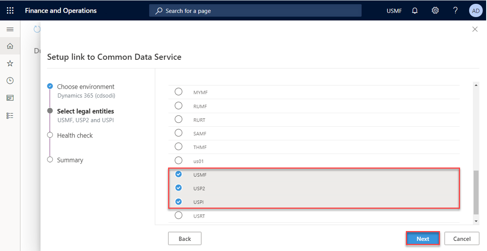
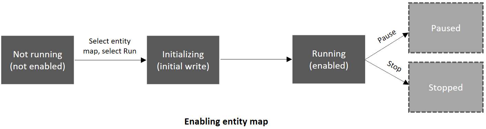

---

title: "System requirements and prerequisites"
description: Describes the .
author: sabinn-msft

ms.technology: 
ms.topic: conceptual
ms.date: 03/13/2020
ms.author: v-douklo

LocalizationGroup: 
---

# System requirements and prerequisites

Before you can enable Dual Write, please walk through the steps below to ensure you meet the minimum system requirements and grant access to the apps to connect to each other. The dual-write Health check validates the required pre-requisites below as you walk through the dual-write wizard to link to the Common Data Service environment.

1. Ensure platform update and app version

   Ensure your Dynamics 365 Finance and Operations environment is at least platform update 33 (App version 10.0.9) or above

   Related health check:

   App version is up to date

   Dual Write is supported on Dynamics 365 Finance and Operations environments with Platform Update PU 33 (App version 10.0.9) or above

2. Install the dual-write core solution

   The dual-write core solution contains metadata for your entity maps and is required to be installed in your environments.

   Steps to install the dual-write core solution:

   * In the maker PowerApps portal, navigate to Solutions (left hand pane), Open AppSource and search for the solution named dual-write core and follow the prompts to import the solution. 

        

    Related health check:

    The dual-write core solution was found

    The dual-write core solution contains metadata for your entity maps and must be installed in the environment

3. Grant access to the Common Data Service to connect to Finance and Operations

   Follow steps below to grant access for the Common Data Service to connect to Dynamics 365 Finance and Operations:

   * Launch your Dynamics 365 for Finance and Operations instance with this URL `https://<<BaseAXURL>>/?cmp=DAT&mi=SysAADClientTable` (substitute <BaseAXURL> with your instance)

   * Click New to add a new Client id record: **33976c19-1db5-4c02-810e-c243db79efde** This is the Application ID for an app which would be used to connect from Common Data Service to Dynamics 365 Finance and Operations.

   * Repeat the above steps for another client id record: **2e49aa60-1bd3-43b6-8ab6-03ada3d9f08b**

       

#### Refresh Entities

* From the left-hand pane, go to Data Management/Data entities and make sure the entity list is populated.

* Also, make sure to refresh entities by going to **Data Management > Framework parameter > Entities tab -> Refresh entities list** `(https://<<BaseAXURL>>/?cmp=USMF&mi=DM_DataManagementWorkspaceMenuItem&TableName=DMFDefinitionGroupEntity)`
       
    Related health check:

    The Common Data Service can connect to Dynamics 365 Finance and Operations

    Before you can enable dual-write, you must grant access to the apps to connect to each other 
        App id 33976c19-1db5-4c02-810e-c243db79efde exists 
        App id 2e49aa60-1bd3-43b6-8ab6-03ada3d9f08b exists 
        App user with id 33976c19-1db5-4c02-810e-c243db79efde exists 
        App user with id 2e49aa60-1bd3-43b6-8ab6-03ada3d9f08b exists

4. Grant access to Finance and Operations to connect to the Common Data Service

    Follow steps below to grant access for Dynamics 365 Finance and Operations to connect to the Common Data Service:

    * From the Power Apps maker portal, click on the gear on top right corner and navigate to Advanced settings\Security and click on Users

       

    * Switch to Application Users 

       

    * Create a new user and select Application User in the drop down

        

    * Add Application id - **00000015-0000-0000-c000-000000000000** and follow prompts to fill additional fields and save user account. This Application Id is for Dynamics 365 Finance and Operations and will allow it to connect to the Common Data Service

       

       

    * Provide any email id

    * Provide "System Administrator" rights to Application User via Manage Roles 

    * Navigate to Settings\Security\Teams and change view to All teams

    * Select the Root Business unit/Organization and assign required "system administrator" role 

       

    * Repeat the same for Application id - **2e49aa60-1bd3-43b6-8ab6-03ada3d9f08b** and follow prompts to fill additional fields and save user account.

       

    * Provide "System Administrator" rights to Application User via Manage Roles

    Related health check:

    The Dynamics 365 Finance and Operations can connect to the Common Data Service

    Before you can enable dual-write, you must grant access to the apps to connect to each other 
        App user with id 00000015-0000-0000-c000-000000000000 exists 
        App user with id 2e49aa60-1bd3-43b6-8ab6-03ada3d9f08b exists

5. Apps in tenant[CY2]

    Follow these steps to make sure you provide required app consent

    * Launch URL below with your admin credentials which should prompt you for consent. 
    [https://login.microsoftonline.com/common/oauth2/authorize?client_id=33976c19-1db5-4c02-810e-c243db79efde&response_type=code&prompt=admin_consent](https://login.microsoftonline.com/common/oauth2/authorize?client_id=33976c19-1db5-4c02-810e-c243db79efde&response_type=code&prompt=admin_consent)

    * Click **Accept**

       This would mean that you are providing the consent to install the app (with id =33976c19-1db5-4c02-810e-c243db79efde) in your tenant. This app is required for CDS to talk to F&O

    * Repeat steps for application id - **2e49aa60-1bd3-43b6-8ab6-03ada3d9f08b** and follow prompts[CY3]

    Related health check:

    Apps in tenant

    The required dual-write applications need to be installed in the tenant. 
       App ID: 33976c19-1db5-4c02-810e-c243db79efde 
       App ID: 2e49aa60-1bd3-43b6-8ab6-03ada3d9f08b

6. Ensure dual-write plugins are enabled

   The dual-write plugins should be enabled as part of the dual-write core solution installation. However, if this check fails please follow steps below to enable dual-write plugins:

   >[!Note]:
   >Steps below are typically not required, and plugins should available and enabled as part of installing the dual-write core solution

   Download the Plug-in Registration tool from [here](https://www.nuget.org/packages/Microsoft.CrmSdk.XrmTooling.PluginRegistrationTool). In the Plugin Registration Tool, there should be two plugin assemblies associated with dual-write, which are DualWriteRegistration.Plugins and DualWriteRuntime.Plugins. These assemblies have plugin steps which must be enabled in order for successful use of dual-write. To view the plugin steps, you can expand the plugin assembly and its plugin types. All the steps belonging to the dual-write assemblies should be enabled. 

   A step can be enabled by right-clicking the step and selecting "Enable" (note that if there is no option for Enable, but instead an option for Disable, then the step is already enabled and does not need to be touched).

   If the dual-write plugin assemblies cannot be found, please import the latest version of the Dual Write Core solution.

    

Related health check:

The dual-write registration and runtime plugins are enabled

To ensure listening into CRUD operations on the Common Data Service, the dual-write plugins need to be enabled 

7. Uninstall the Prospect to Cash solution:

   The "Prospect to Cash" solution or P2C doesn't work simultaneously with dual-write. So, please do not install "Prospect to Cash" solution. If you have the P2C solution installed, you need to un-install it before enabling dual-write

8. Supported tenant configuration:

   Please ensure that the Dynamics 365 Finance and Operations and Common Data Service are installed under the same tenant. We currently do not support cross tenant scenarios

9. Install dual-write entity maps solution

    * Like the instructions of installing the dual-write core package, in the maker PowerApps portal, navigate to Solutions (left hand pane), open AppSource and search for the solution named Common Data Service Add-in for Finance and Operations package and follow the prompts to import the solution.

    * On the dual-write UI in Dynamics 365 Finance and Operations click "Apply Solution" in the top menu of the dual write page to apply the entity maps that you just downloaded and installed. Once you apply the solution, you will see the default entity maps published

        

That's it - You successfully imported and applied a Microsoft published Dual Write entity map solution to your environment

 

### How-to use the dual-write wizard to link your environments

1. Log-in to the Dynamics 365 Finance and Operation environment that you wish to link to your Common Data Service environment and navigate to Data Management and click on the dual-write tile

    

2. Click on the New link to environment button to link your link you Dynamics 265 Finance and Operations and the Common Data Service environments

3. At this point we will automatically fetch the Common Data Service environments for the logged-in user, where user is an environment admin. Once the environments are discovered, under the Choose environment step, select the Common Data Service environment that you wish to link to and click Next

    

4. Select your legal entities and click Next

    

5. At this point, we run a Health check to make sure that your system meets the requirements to enable dual-write and all the pre-requisites are complete

    

    If any of the health check fails, please ensure that you have completed all the pre-requisites before you can move to the next step.

    In this example, the health check shows that the check for granting access to connect the apps failed. You will need to first grant the access to connect the apps by the creating the respective application ids and re-run the dual-write wizard. 

6. Review the summary and privacy notice and consent and click on Create

7. That's it&mdash;you just linked your Dynamics 365 Finance and Operations to the Common Data Service environment. Next step is to enable entity maps for dual-write 

    

   >[!Note]
   >If you do not see your entity maps or see a blank screen, please make sure to install the F&O entity map solution

### Enable entity map for dual-write

When you enable an entity map for Dual Write, it starts from the Not Running stage, goes through the initialization phase where it does an initial write by copying pre-existing data on entities on both sides, before finally marking the status as Running, when the entity is completely enabled.

From the Run state, you can Stop or Pause an entity wherein all changes are queued until you resume wherein the entity goes through catch-up mode when all the queued changes are played back.

Example of Pausing an entity -

|Status |Description |Available actions |
| --- | --- | --- |
|Not running |Every entity begins from the "Not Running" status. Prior to enabling an entity for Dual Write, it is in the "Not Running" status |Run |
|Initializing |Initial write |N/A |
|Running |Entity is enabled for Dual Write |Stop, Pause |
|Paused |Entity is in paused state and all new requests are queued |Run |
|Resuming |Catch-up on queued records from when entity was paused |N/A |
| | | |

In the initializing phase, if you have preexisting data, we copy the data as part of the initial write phase

Entities have several dependent entities Ex: Customers-Contacts have "customer groups" and "currencies" as dependent entities. 

Since these are relational apps with relational data, if you don't enable the dependent entities, you may run into errors, down the line. To prevent this, before we enable the entity map, we provide you with a list of related entities that we recommend you enable

Example of enabling Customers V3&mdash;Contacts entity map 

When you select an entity map Ex: Customers V3&mdash;Contacts and click Run (in top menu), before we enable the entity map, we provide you with a list of all the dependent entities (Use the toggle to Show related entity maps). By clicking Run, you can enable Customers V3&mdash;Contacts entity map and all its related entities.

>[!Note]
>This also applies when you Pause an entity wherein you get the option to pause all the related entities as well

You can further customize this by specifying a different master (default is Common Data Service) for resolving conflicts. In cases where you don't want to copy pre-existing data, you can skip initial sync by unchecking the Initial Sync checkbox or remove one or more of the related entities by unchecking them. You can also drag and drop the entity maps to change the order in which they would sync

Once you have made your selections and click Run, the entity map and all its related entities go through the initial write phase and you will be redirected to the entity map list page. In case you run into errors; you can view the error details under the Initial Sync details tab where we provide all the detailed errors while copying pre-existing data. Once you fix the underlying errors, you can choose to rerun the execution and monitor the outcome. Alternatively, if you choose to no longer sync the preexisting data or you run into recurring issues due to underlying data, you can choose to skip initial writes and turn on live writes by clicking on Skip Initial sync button in the top menu.

    
#### Criteria for linking entities

To enable Dual Write entity maps, an alternate key must be defined in the Common Data Service. The alternate key value in Common Data Service must match with key defined in Dynamics 365 for Finance and Operations

Ex: In Dynamics 365 for Finance and Operations, CustomerAccount is the key for the Account entity

In the Common Data Service, we defined accountnumber as the key for Account entity 

We also make sure that accountnumber is mapped to CustomerAccount in the Customers V3 entity map

## Next steps

[Customizing entity and field mappings](customizing-mappings.md)

