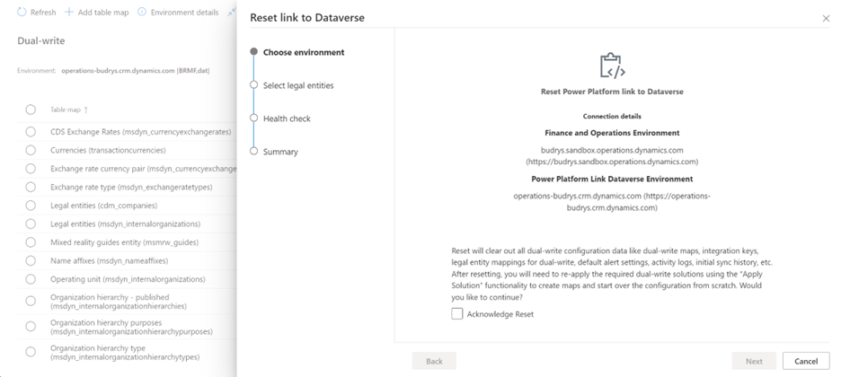
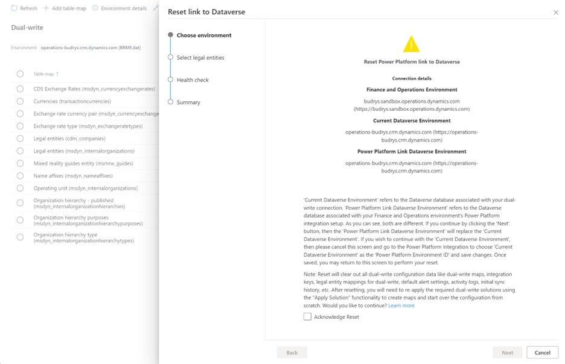

# Reset dual-write connections

[!include [banner](../../includes/banner.md)]

The initial configuration of the dual-write connection between finance and operations apps and Microsoft Power Platform is done in Microsoft Dynamics Lifecycle Services by using the Power Platform integration setup. For more information about this initial configuration, see [Dual-write setup from Lifecycle Services](./lcs-setup.md). After it's done, there might be cases where you want to clear the dual-write connections and configuration, and start again from scratch. Alternatively, you might encounter a stuck state. In these cases, the dual-write platform lets you clear and reset all dual-write connections and configuration, so that you can set up dual-write again for the environment.

You can select between two options when you perform a reset:

- **Power Platform Link Dataverse Environment** – This option is the default and recommended option. It clears the dual-write connections between finance and operations apps and Dataverse, and resets the connection that links the finance and operations environment to the Dataverse environment that's configured with the [Power Platform integration](../../power-platform/enable-power-platform-integration.md). If the dual-write connection is currently set up with a Dataverse environment other than the one that's linked through the Power Platform integration, that connection is cleared and reset to align the link with the Power Platform integration. The Power Platform integration is intended to link finance and operations apps to a Dataverse environment on a one-to-one basis, to enable tight integration between the two platforms.
- **Current Dataverse Environment** – This option clears the dual-write connection and resets the link to create a dual-write connection with the same Dataverse environment that the finance and operations environment is currently linked to. In previous releases, dual-write provided the option to create the dual-write connection to Dataverse environments other than the one that's linked through the Power Platform integration. Although that option is no longer available, it might have been used in your environment. During the reset for dual-write connections, select the **Current Dataverse Environment** option only if you want to re-create dual-write connections to link to the current Dataverse environment instead of changing the connection to align the link with the Power Platform integration.

> [!NOTE]
> If the dual-write connection is currently configured to link to a Dataverse environment other than the one that's set up with the Power Platform integration, and you select to reset the connection so that you can link to the Dataverse environment that's selected in the Power Platform integration, no option is available to reset and return to the previously linked environment. The dual-write connection is permanently aligned with the Power Platform integration.

## Prerequisite

You must stop all dual-write maps before you perform a reset of dual-write connections.

## What does the Reset link button do? 

When you select **Reset link**, the dual-write service performs the following back-end actions:

- Clear all dual-write runtime configuration data from the following tables:

    - Finance and operations tables:

        - DualWriteProjectConfiguration
        - DualWriteProjectFieldConfiguration
        - BusinessEventsDefinition

    - Dataverse table:

        - Dual Write Runtime Configurations

- Remove all dual-write **configuration data** like dual-write maps, integration keys, legal entity mapping for dual-write, default alert settings, activity logs, initial sync history etc.
- Restore the dual-write connection set between finance and operations apps and Dataverse from the Power Platform integration setup.

> [!IMPORTANT]
> After a reset, you must bring over the maps and start over from scratch by using the **Apply Solution** functionality to apply the required solutions. Therefore, unless you're sure that you want to reset dual-write, don't select the **Reset link** button.

## Reset scenarios

Your experience when you select the **Reset link** button might vary slightly, depending on the type of your finance and operations environment (production, sandbox, or cloud-hosted) and the status of the Power Platform integration setup. The following scenarios describe these variations.

### Scenario 1: Dual-write uses the same Dataverse organization ID that's set up for Power Platform integration

When you select **Reset link**, the **Reset link to Dataverse** wizard is opened. The first page, **Choose environment**, shows environment details for your reference.

1. On the **Choose environment** page, select the **Acknowledge Reset** checkbox to confirm that you want to reset the setup of the dual-write configuration.
2. Select **Next** to continue.
3. On the **Select legal entities** page, select the legal entities that you want to reset your dual-write connection for. By default, **None** is selected.
4. When you've finished selecting the legal entities, select **Next** to open the **Health check** page.
5. Select **Next** to open the **Summary** page.

If you forgot to stop the running dual-write maps before you selected the **Reset link** button, another **Force Reset** checkbox appears on the **Choose environment** page. This checkbox and its associated behavior have been adopted from the **Unlink** functionality, because users are familiar with them. You must select this checkbox to proceed.

### Scenario 2: The Dataverse organization ID that dual-write uses differs from the one that's set up for Power platform integration

When you select **Reset**, the **Reset link to Dataverse** wizard is opened. The first page, **Choose environment**, shows values for **Current Dataverse Environment** and **Power Platform Link Dataverse Environment**.

- **Current Dataverse Environment** refers to the Dataverse database that's associated with your dual-write connection.
- **Power Platform Link Dataverse Environment** refers to the Dataverse database that's associated with the Power Platform integration setup for your finance and operations environment. As you'll see, the two values differ.

As for scenario 1, you should select the **Acknowledge Reset** checkbox to proceed. If maps are in a **not running** state, a **Force Reset** button is available for selection.

When you select **Next** on the **Choose environment** page, the Dataverse database that's specified under **Current Dataverse Environment** is replaced with the database that's specified under **Power Platform Link Dataverse Environment**. If you want to continue to use dual-write with the Dataverse database that's specified under **Current Dataverse Environment**, then select **Cancel** to cancel the reset action. Open a support case with Microsoft, and we'll help you with the replacement. Refer to ICM 349669515.

As for scenario 1, after you select **Next** on the **Choose environment** page, the **Select legal entities** page appears, where you can select the legal entities that you want to reset your dual-write connection for. When you've finished, select **Next** to open the **Health check** page. Then select **Next** to open the **Summary** page. 

### Scenario 3: Your Power Platform integration setup is blank, and no Dataverse organization ID is set up for it

When you select **Reset link**, the **Reset link to Dataverse** wizard is opened. The first page, **Choose environment**, informs you that you must set up a Power Platform link to Dataverse.

In this case, go to the [Power Platform integration](../../power-platform/environment-lifecycle-connect-finops-existing-dv.md), select **Current Dataverse Environment** in the **Power Platform Environment ID** field, and then select **Save** to save your change. You can then reinitiate the reset action.

### Scenario 4: You're using a cloud-hosted instance of finance and operations apps

When you select **Reset link**, the **Reset link to Dataverse** wizard is opened. The first page, **Choose environment**, shows the current environment details for your reference.

**Current Dataverse Environment** refers to the database that's associated with your dual-write connection. Because there won't be any Power Platform integration setup, the reset functionality refreshes the displayed dual-write connection set as-is. If you want to associate the finance and operations environment with a different Dataverse organization, you must redeploy the finance and operations environment.

As for scenario 1, you should select the **Acknowledge Reset** checkbox to proceed. If maps are in a **not running** state, a **Force Reset** button is available for selection.

On the **Select legal entities** page, select the legal entities that you want to reset your dual-write connection for. When you've finished, select **Next** to open the **Health check** page. Then select **Next** to open the **Summary** page.
