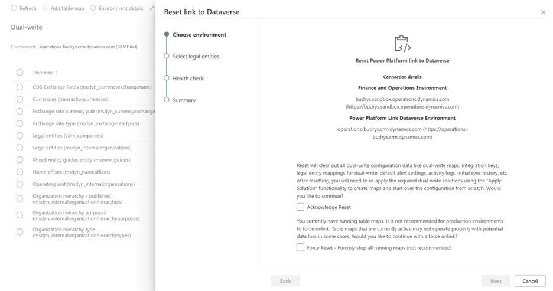
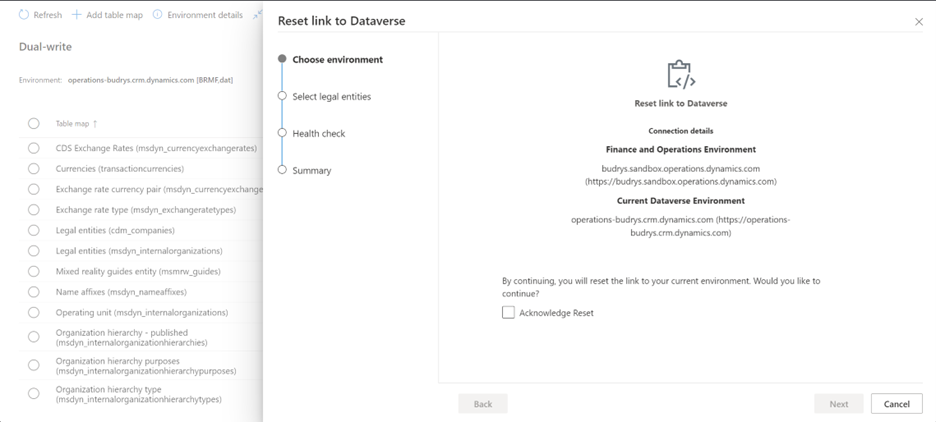

# Reset dual-write connections

[!include [banner](../../includes/banner.md)]
[!include [banner](../../includes/preview-banner.md)]

Currently, when you want to clear a configuration and start from scratch, or when you encounter a stuck state, you link and unlink the dual-write connection between finance and operations apps and Microsoft Dataverse. During this process, if you accidentally select an incorrect Dataverse organization, data can become corrupted. To help prevent this issue, as of Platform update 54 (PU54) for version 10.0.30 of finance and operations apps, Microsoft is removing the **Link** and **Unlink** buttons from the dual-write administration user interface (UI). All dual-write connections are now handled through Microsoft Dynamics Lifecycle Services, by using the Power Platform integration setup. Instead, a new **Reset link** button that's being added in the dual-write administration UI will help you refresh the connection without changing the underlying Dataverse organization ID.

## Prerequisites

- To see the **Reset link** button, you must have Platform update 54 for version 10.0.30 of finance and operations apps, or later.
- You must stop all dual-write maps before you use the **Reset link** button.

## New banner on dual-write administration screen
As soon as you open the dual-write administration screen, you will see an information banner at the top saying "The 'link' and 'Unlink' buttons have been replaced with the ‘reset link’ button. Learn more". This is to make sure you are aware of the change.

## What does the Reset link button do? 

When you select **Reset link**, the dual-write service performs the following back-end actions:

- Clear all dual-write runtime configuration data from the following tables:

    - Finance and operations tables:

        - DualWriteProjectConfiguration
        - DualWriteProjectFieldConfiguration
        - BusinessEventsDefinition

    - Dataverse table:

        - Dual Write Runtime Configurations

- Remove all dual-write **configuration data** like dual-write maps, integration keys, legal entity mapping for dual-write, default alert settings, activity logs, initial sync history etc.
- Restore the dual-write connection set between finance and operations apps and Dataverse from the Power Platform integration setup.

> [!IMPORTANT]
> After a reset, you must bring over the maps and start over from scratch by using the **Apply Solution** functionality to apply the required solutions. Therefore, unless you're sure that you want to reset dual-write, don't select the **Reset link** button.

## Reset scenarios

Your experience when you select the **Reset link** button will vary slightly, depending on the type of your finance and operations environment (production, sandbox, or cloud-hosted) and the status of the Power Platform integration setup. The following scenarios describe these variations.

### Scenario 1: Dual-write uses the same Dataverse organization ID that's set up for Power Platform integration

When you select **Reset link**, the **Reset link to Dataverse** wizard is opened. The first page, **Choose environment**, shows environment details for your reference.

1. On the **Choose environment** page, select the **Acknowledge Reset** checkbox to confirm that you want to reset the setup of the dual-write configuration.
2. Select **Next** to continue.
3. On the **Select legal entities** page, select the legal entities that you want to reset your dual-write connection for. By default, **None** is selected.
4. When you've finished selecting the legal entities, select **Next** to open the **Health check** page.
5. Select **Next** to open the **Summary** page.

If you forgot to stop the running dual-write maps before you selected the **Reset link** button, then you will see an additional **Force Reset** checkbox on the **Choose environment** page. This checkbox and its associated behavior have been adopted from the **Unlink** functionality because users are familiar with them. You must select this checkbox to proceed further.

### Scenario 2: The Dataverse organization ID that dual-write uses differs from the one that's set up for Power platform integration

When you select **Reset**, the **Reset link to Dataverse** wizard is opened. The first page, **Choose environment**, shows values for **Current Dataverse Environment** and **Power Platform Link Dataverse Environment**.

- **Current Dataverse Environment** refers to the Dataverse database that's associated with your dual-write connection.
- **Power Platform Link Dataverse Environment** refers to the Dataverse database that's associated with the Power Platform integration setup for your finance and operations environment. As you'll see, the two values differ.

As for scenario 1, you should select the **Acknowledge Reset** to proceed futher. If maps are in **not running** state, then you will see a **Force Reset** button for selection.

When you select **Next** on the **Choose environment** page, the Dataverse database that's specified under **Current Dataverse Environment** is replaced with the database that's specified under **Power Platform Link Dataverse Environment**. If you want to continue to use dual-write with the Dataverse database that's specified under **Current Dataverse Environment**, then select **Cancel** to cancel the reset action. Open a support case with Microsoft, and we'll help you with the replacement. Refer to ICM 349669515.

As for scenario 1, after you select **Next** on the **Choose environment** page, the **Select legal entities** page appears, where you can select the legal entities that you want to reset your dual-write connection for. When you've finished, select **Next** to open the **Health check** page. Then select **Next** to open the **Summary** page. 

### Scenario 3: Your Power Platform integration setup is blank, and no Dataverse organization ID is set up for it

When you select **Reset link**, the **Reset link to Dataverse** wizard is opened. The first page, **Choose environment**, informs you that you must set up a Power Platform link to Dataverse.

In this case, go to the [Power Platform integration](../../power-platform/enable-power-platform-integration.md#connect-to-existing-dataverse), select **Current Dataverse Environment** in the **Power Platform Environment ID** field, and then select **Save** to save your change. You can then reinitiate the reset action.

### Scenario 4: You're using a cloud-hosted instance of finance and operations apps

When you select **Reset link**, the **Reset link to Dataverse** wizard is opened. The first page, **Choose environment**, shows the current environment details for your reference.

**Current Dataverse Environment** refers to the database that's associated with your dual-write connection. Because there won't be any Power Platform integration setup, the reset functionality will refresh the displayed dual-write connection set as-is. If you want to associate the finance and operations environment with a different Dataverse organization, you must redeploy the finance and operations environment.

As for scenario 1, you should select the **Acknowledge Reset** to proceed futher. If maps are in **not running** state, then you will see a **Force Reset** button for selection.

On the **Select legal entities** page, select the legal entities that you want to reset your dual-write connection for. When you've finished, select **Next** to open the **Health check** page. Then select **Next** to open the **Summary** page.
