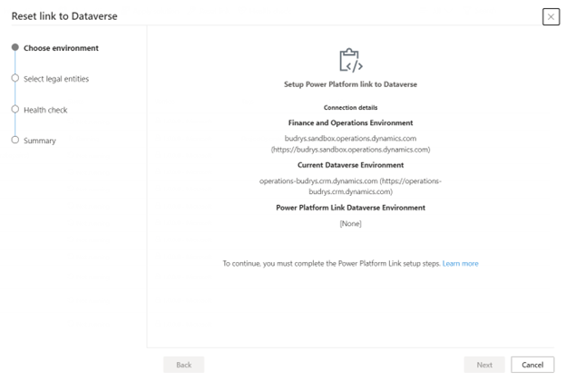

# Reset functionality

[!include [banner](../includes/banner.md)]
[!include [banner](../includes/preview-banner.md)]

Currently when you either want to clear a configuration and start from scratch or you encounter a stuck state, you **Link** and **Unlink** the dual-write connection between finance and operations applications and Dataverse. During this process, you could accidentally choose an incorrect Dataverse organization that results in data corruption. To avoid this mistake, we're removing these buttons from dual-write administration UI inside finance and operations applications starting 10.0.30 PU54. All dual-write connections will take place from Lifecycle Services using the power platform integration setup. Instead we're introducing a new **Reset** button on the dual-write administration UI to help you to refresh the connection without changing the underlying Dataverse organization id.

## Pre-requisites

- You must have finance and operations version 10.0.30 PU54 and above to see the **Reset** button.
- You must stop all dual-write maps before using the **Reset** button.

## What does the reset button do? 

When you select the **Reset** button, the dual-write service does the following things at the backend:

- Clears out all dual-write runtime configuration data from the following tables.

Finance and operations tables:

    - DualWriteProjectConfiguration
    - DualWriteProjectFieldConfiguration
    - BusinessEventsDefinition

Dataverse table:

    - Dual Write Runtime Configurations

- Removes all dual-write maps including their metadata like integration keys, filters, status etc., static data like legal entities configured for dual-write, default settings and transformations on map etc., and runtime data like activity logs, version history etc.
- Restores the dual-write connection set between finance and operations applications and Dataverse from power platform integration setup.

After the reset you need to apply the required solutions using the **Apply Solution** functionality to bring the maps and start over from scratch. So, unless you're sure about resetting dual-write, please don't click this button.

## Reset scenarios

Based on your finance and operations environment type (production/sandbox/cloud hosted) and its status of the power platform integration setup, you'll experience a slight variation when you click on Reset button. These variations are detailed as follows:

****Scenario #1:** The Dataverse organization id used by dual-write is the one setup for power platform integration.

Selecting the **Reset** button shows the following window with environment details displayed for your reference.

- By choosing the **Acknowledge Reset** checkbox, you're acknowledging to reset the dual-write configuration setup.
- By choosing the **Force Reset** checkbox, you're asking to stop any maps that are in the **Running** state before initiating reset. We've restored this checkbox and associated behavior from the **Unlink** functionality for familarity reasons.
- Select **Next** to proceed further.
- On the **Select legal entities** screen, select the legal entities for which you wish to reset your dual-write connection. By default, **None** is selected.
- After selecting the legal entities, select **Next** to display the **Health check** screen followed by the **Summary** screen.

Before clicking the Reset button, if you forgot to stop the running dual-write maps, and also on the **Reset** screen if you forgot to select the **Force Reset** checkbox, your reset action will fail with a **Failed** message as shown below:

###**Scenario #2:** The Dataverse organization id used by dual-write is different from the one setup for power platform integration.

Selecting the **Reset** button shows the following window with **Current Dataverse Environment** and **Power Platform Linked Dataverse Environment** as shown below.

**Current Dataverse Environment** refers to the Dataverse database associated with your dual-write connection. **Power Platform Link Dataverse Environment** refers to the Dataverse database associated with your finance and operations environment's power platform integration setup. As you can see, both are different.

Similar to scenario #1, you should select the **Acknowledge Reset** and **Force Reset** checkboxes before selecting the **Next** button.

Because the Dataverse databases are different, selecting the **Next** button replaces the **Current Dataverse Environment** with the Dataverse database mentioned under **Power Platform Link Dataverse Environment.** If you'd like to continue dual-write with the Dataverse database mentioned under **Current Dataverse Environment** and the environment type is production, then you should cancel the reset action by selecting the **Cancel** button. Raise a support case with Microsoft by referring to ICM 349669515 and we'll help you with the replacement.

> [!Note] 
> Backend replacement through Microsoft support cases is facilitated only for finance and operations production environments. Not for other types of environments.

Similar to scenario #1, selecting next lets you choose the legal entities for which you wish to reset your dual-write connection. After selecting the legal entities, select **Next** to display the **Health check** screen followed by the **Summary** screen. When one or more table maps are in the **Running** state and you forgot to stop them before reset and you also forgot to select the **Force Reset** checkbox, then your reset action will fail with a **Failed** message.

###**Scenario #3:** Your power platform integration setup is blank and doesn't have a Dataverse organization id configured

Selecting the **Reset** button shows the following window with current environment details displayed for your reference.

In this case, please go to [Power Platform Integration](https://nam06.safelinks.protection.outlook.com/?url=https%3A%2F%2Flearn.microsoft.com%2Fen-us%2Fdynamics365%2Ffin-ops-core%2Fdev-itpro%2Fpower-platform%2Fenable-power-platform-integration%23connect-to-existing-dataverse&data=05%7C01%7Cramasri%40microsoft.com%7C2f8fe7106138411f6c0408daa369b317%7C72f988bf86f141af91ab2d7cd011db47%7C1%7C0%7C638001971624185428%7CUnknown%7CTWFpbGZsb3d8eyJWIjoiMC4wLjAwMDAiLCJQIjoiV2luMzIiLCJBTiI6Ik1haWwiLCJXVCI6Mn0%3D%7C3000%7C%7C%7C&sdata=8xwIg39VdzXXtcBzETMbH1%2F%2BzCBIkSUVyomsPLRbHtE%3D&reserved=0) and choose **Current Dataverse Environment** as the **Power Platform Environment ID** and **Save** the changes. After completing it, you can re-initiate the reset action.

###**Scenario #4:** You're using cloud hosted instance of finance and operations applications

Selecting the **Reset** button shows the following window with environment details displayed for your reference.

The **Current Dataverse Environment** refers to the database associated with dual-write connection. Because there won't be any power platform integration setup, the reset functionality will refresh the displayed dual-write connection set as-is. In case you wish to associate the finance and operations environment with a different Dataverse organization, then you need to redeploy the finance and operations environment.

Similar to scenario #1, you should select the **Acknowledge Reset** and **Force Reset** checkboxes, and then select the **Next** button. On the **Select legal entities**, select the legal entities for which you wish to reset your dual-write connection.  After selecting the legal entities, select **Next** to display the **Health check** screen followed by the **Summary** screen. When one or more table maps are in the **Running** state and you forgot to stop them before reset and you also forgot to select the **Force Reset** checkbox, then your reset action will fail with a **Failed** message.
