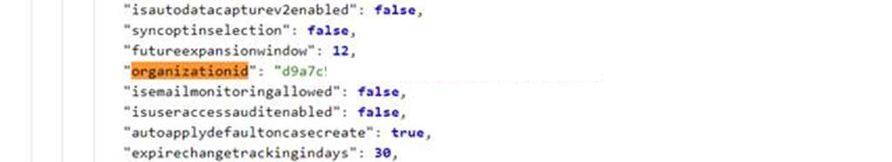
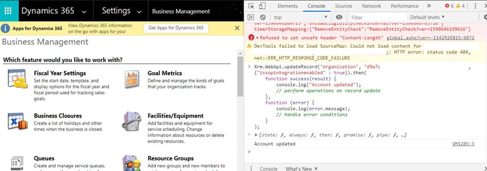
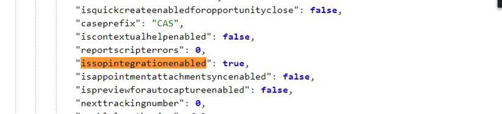
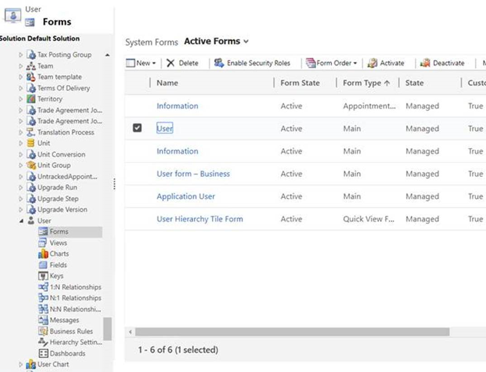
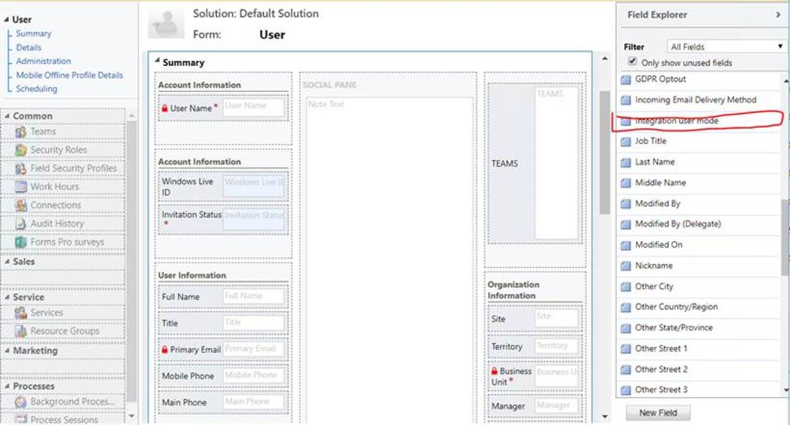
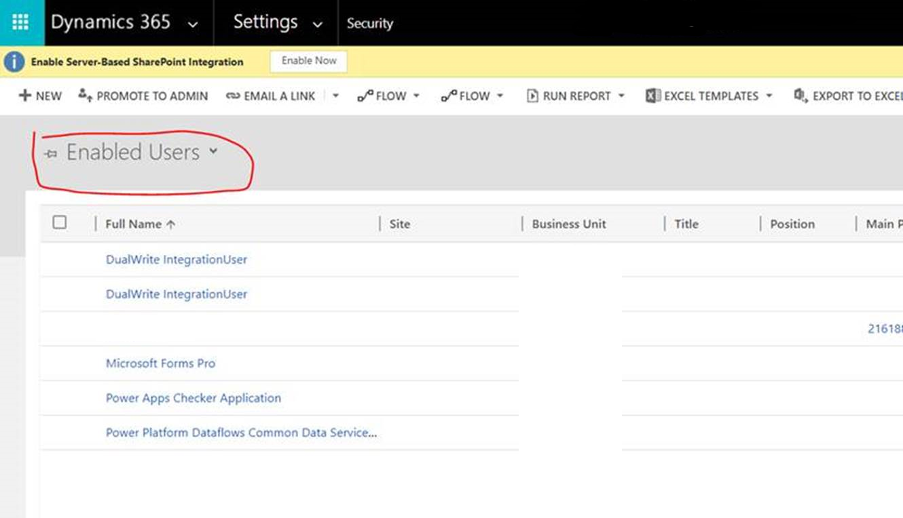
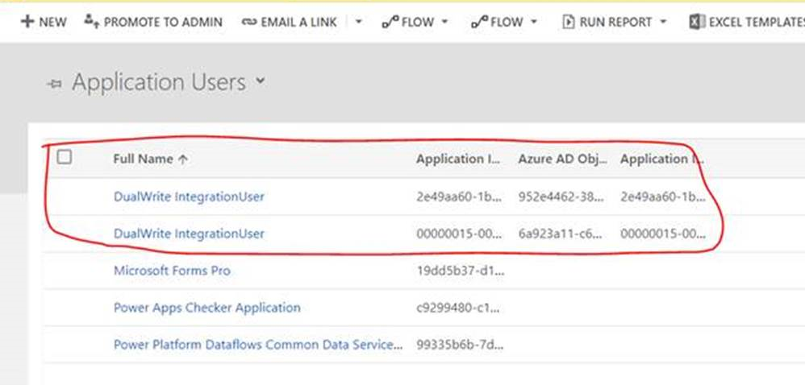
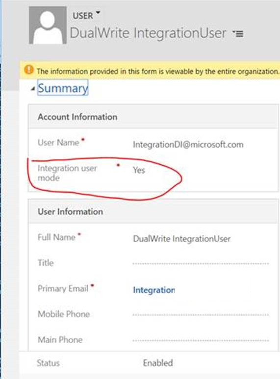

# Set up the mapping for the sales order status columns

[!include [banner](../../includes/banner.md)]

The columns that indicate sales order status have different enumeration values in Microsoft Dynamics 365 Supply Chain Management and Dynamics 365 Sales. Additional setup is required to map these columns in dual-write.

## columns in Supply Chain Management

In Supply Chain Management, two columns reflect the status of the sales order. The columns that you must map are **Status** and **Document Status**.

The **Status** enumeration specifies the overall status of the order. This status is shown on the order header.

The **Status** enumeration has the following values:

- Open Order
- Delivered
- Invoiced
- Cancelled

The **Document Status** enumeration specifies the most recent document that was generated for the order. For example, if the order is confirmed, this document is a sales order confirmation. If a sales order is partially invoiced, and then the remaining line is confirmed, the document status remains **Invoice**, because the invoice is generated later in the process.

The **Document Status** enumeration has the following values:

- Confirmation
- Picking List
- Packing Slip
- Invoice

## columns in Sales

In Sales, two columns indicate the status of the order. The columns that you must map are **Status** and **Processing Status**.

The **Status** enumeration specifies the overall status of the order. It has the following values:

- Active
- Submitted
- Fulfilled
- Invoiced
- Cancelled

The **Processing Status** enumeration was introduced so that the status can be mapped more accurately with Supply Chain Management.

The following table shows the mapping of **Processing Status** in Supply Chain Management.

| Processing Status   | Status in Supply Chain Management | Document Status in Supply Chain Management |
|---------------------|-----------------------------------|--------------------------------------------|
| Active              | Open Order                        | None                                       |
| Confirmed           | Open Order                        | Confirmation                               |
| Picked              | Open Order                        | Picking List                               |
| Partially Delivered | Open Order                        | Packing Slip                               |
| Delivered           | Delivered                         | Packing Slip                               |
| Partially Invoiced  | Delivered                         | Invoice                                    |
| Invoiced            | Invoiced                          | Invoice                                    |
| Cancelled           | Cancelled                         | Not applicable                             |

The following table shows the mapping of **Processing Status** between Sales and Supply Chain Management.

| Processing Status   | Status in Sales | Status in Supply Chain Management |
|---------------------|-----------------|-----------------------------------|
| Active              | Active          | Open Order                        |
| Confirmed           | Submitted       | Open Order                        |
| Picked              | Submitted       | Open Order                        |
| Partially Delivered | Active          | Open Order                        |
| Partially Invoiced  | Active          | Open Order                        |
| Partially Invoiced  | Fulfilled       | Delivered                         |
| Invoiced            | Invoiced        | Invoiced                          |
| Cancelled           | Cancelled       | Cancelled                         |

Note that Dual-write Supply chain solution version XXXX<!--Update version information--> and Supply Chain Management version 10.0.32?<!--Confirm version number--> introduces changes to the status map. The changes depend on whether the map for the *CDS sales order headers* entity or the map for the *Dynamics 365 Sales order headers* entity is running. 

The following table shows the resulting status map if the map for the *CDS sales order headers* entity is running.

| Processing Status   | Status in Supply Chain Management | Document Status in Supply Chain Management | Status in Sales |
|---------------------|-----------------------------------|--------------------------------------------|-----------------|
| Active              | Open Order                        | None                                       | Active          |
| Confirmed           | Open Order                        | Confirmation                               | Active          |
| Picked              | Open Order                        | Picking List                               | Active          |
| Partially Delivered | Open Order                        | Packing Slip                               | Active          |
| Partially Invoiced  | Open Order                        | Invoice                                    | Active          |
| Delivered           | Delivered                         | Packing Slip                               | Fulfilled       |
| Invoiced            | Invoiced                          | Invoice                                    | Invoiced        |
| Cancelled           | Cancelled                         | Not applicable                             | Canceled        |

If the map for the *Dynamics 365 Sales order headers* entity is running, an additional processing status (*Delivered and Partially Invoiced*) is introduced. The following stable shows the resulting status map.

| Processing Status                 | Status in Supply Chain Management | Document Status in Supply Chain Management | Status in Sales |
|-----------------------------------|-----------------------------------|--------------------------------------------|-----------------|
| Active                            | Open Order                        | None                                       | Active          |
| Confirmed                         | Open Order                        | Confirmation                               | Active          |
| Picked                            | Open Order                        | Picking List                               | Active          |
| Partially Delivered               | Open Order                        | Packing Slip                               | Active          |
| Partially Invoiced                | Open Order                        | Invoice                                    | Active          |
| Delivered                         | Delivered                         | Packing Slip                               | Fulfilled       |
| Delivered and Partially Invoiced  | Delivered                         | Invoice                                    | Fulfilled       |
| Invoiced                          | Invoiced                          | Invoice                                    | Invoiced        |
| Cancelled                         | Cancelled                         | Not applicable                             | Canceled        |

## Setup

To set up the mapping for the sales order status columns, you must enable the **IsSOPIntegrationEnabled** and **isIntegrationUser** attributes.

To enable the **IsSOPIntegrationEnabled** attribute, follow these steps.

1. In a browser, go to `https://<test-name>.crm.dynamics.com/api/data/v9.0/organizations`. Replace **\<test-name\>** with your company's link to Sales.
2. On the page that is opened, find **organizationid**, and make a note of the value.

    

3. In Sales, open the browser console, and run following script. Use the **organizationid** value from step 2.

    ```javascript
    Xrm.WebApi.updateRecord("organization",
    "d9a7c5f7-acbf-4aa9-86e8-a891c43f748c", {"issopintegrationenabled" :
    true}).then(
        function success(result) {
            console.log("Account updated");
            // perform operations on row update
        },
        function (error) {
            console.log(error.message);
            // handle error conditions
        }
    );
    ```

    

4. Verify that **IsSOPIntegrationEnabled** is set to **true**. Use the URL from step 1 to check the value.

    

To enable the **isIntegrationUser** attribute, follow these steps.

1. In Sales, go to **Setting \> Customization \> Customize the System**, select **User table**, and then open **Form \> User**.

    

2. In Field Explorer, find **Integration user mode**, and double-click it to add it to the form. Save your change.

    

3. In Sales, go to **Setting \> Security \> Users**, and change the view from **Enabled Users** to **Application Users**.

    

4. Select the two entries for **DualWrite IntegrationUser**.

    

5. Change the value of the **Integration user mode** column to **Yes**.

    

Your sales orders are now mapped.


[!INCLUDE[footer-include](../../../../includes/footer-banner.md)]
