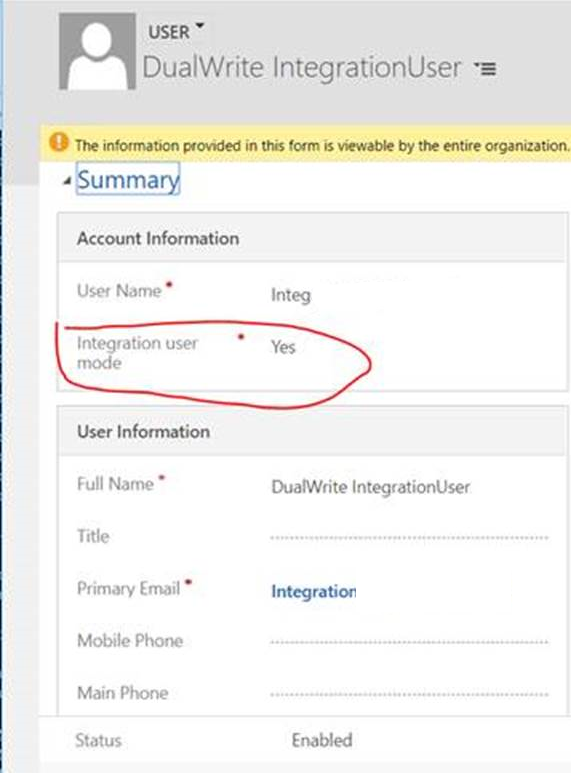

---
# required metadata

title: Set up the mapping for the sales order status fields
description: 
author:  robinarh
manager: tonyafehr
ms.date: 06/25/2020
ms.topic: article
ms.prod: 
ms.service: dynamics-ax-applications
ms.technology: 

# optional metadata

ms.search.form: 
# ROBOTS: 
audience: Application User, IT Pro
# ms.devlang: 
ms.reviewer: rhaertle
ms.search.scope: Core, Operations
# ms.tgt_pltfrm: 
ms.custom: 
ms.assetid: 
ms.search.region: global
ms.search.industry: 
ms.author: 
ms.dyn365.ops.version: 
ms.search.validFrom: 2020-06-25
---

# Set up the mapping for sales order status fields

[!include [banner](../../includes/banner.md)]

The sales order status fields have different enumeration values in Dynamics 365 Supply Chain Management and in Dynamics 365 Sales. Additional setup is required to map these fields in dual-write.

## Fields in Dynamics 365 Supply Chain Management

In Dynamics 365 Supply Chain Management we have two different fields that reflect the status of the sales order. The fields you need to map are **Status** and **Document Status**.

The **Status** enumeration specifies the overall status of the order. This is the status you'll see in the header and gives you the overall status of the order.

| Status |
| ----------------------- |
| Open Order              |
| Delivered               |
| Invoiced                |
| Cancelled               |

**Document Status** enumeration specifies what the latest document generated for the order is. So if the order is confirmed the latest document generated for it is a sales order confirmation. It's important to note that if a sales order is partially invoiced and then the remaining line is then confirmed the document status will still be 'Invoice' as the invoice is generated later in the process.

| Document Status |
| -------------------------------- |
| Confirmation                     |
| Picking List                     |
| Packing Slip                     |
| Invoice                          |

## Fields in Dynamics 365 Sales

In Dynamics 365 Sales we have different fields to indicate the status of the order. The fields you need to map are **Status** and **Processing Status**.

The **Status** enumeration specifies the overall status of the order.

| Status |
| ----------------------- |
| Active                  |
| Submitted               |
| Fulfilled               |
| Invoiced                |
| Cancelled               |

The **Processing Status** enumeration was a special field that was introduced to more accurately map the status with Dynamics 365 Supply Chain Management.

| Processing Status | Supply Chain Management Status | Supply Chain Management Document Status |
| --------------------------- | -------------- | ----------------------- |
| Active                      | Open Order     | None                    |
| Confirmed                   | Open Order     | Confirmation            |
| Picked                      | Open Order     | Picking List            |
| Partially Delivered         | Open Order     | Packing Slip            |
| Delivered                   | Delivered      | Packing Slip            |
| Partially Invoiced          | Delivered      | Invoice                 |
| Invoiced                    | Invoiced       | Invoiced                |
| Cancelled                   | Cancelled      | n/a                     |

## Mapping for Processing Status

| Processing Status | Sales Status | Supply Chain Management Status |
| --------------------- | ------------- | --------------- |
| Active                | Active        | Open Order      |
| Confirmed             | Submitted     | Open Order      |
| Picked                | Submitted     | Open Order      |
| Partially Delivered   | Active        | Open Order      |
| Partially Invoiced    | Active        | Open Order      |
| Partially Invoiced    | Fulfilled     | Delivered       |
| Invoiced              | Invoiced      | Invoiced        |
| Cancelled             | Cancelled     | Cancelled       |

## Set up

You need to enable the **IsSOPIntegrationEnabled** and **isIntegrationUser** attributes.

To enable the **IsSOPIntegrationEnabled** attribute:

1. In your browser, go to https://<test-name>.crm.dynamics.com/api/data/v9.0/organizations, replacing **<test-name>** with your company's link to Dynamics 365 Sales. 

2. Find the **organizationid** in the page.

    

3. Open the browser console in Dynamics 365 Sales. Run following script, using the **organizationid** from step 2.

    ```javascript
    Xrm.WebApi.updateRecord("organization",
    "d9a7c5f7-acbf-4aa9-86e8-a891c43f748c", {"issopintegrationenabled" :
    true}).then(
        function success(result) {
            console.log("Account updated");
            // perform operations on record update
        },
        function (error) {
            console.log(error.message);
            // handle error conditions
        }
    );
    ```

    

4. Verify that **IsSOPIntegrationEnabled** is enabled. Use the link from step 1 to check the value.

    

To enable the **“isIntegrationUser** attribute:

1. In Dynamics 365 Sales, navigate to **Setting \> Customization \> Customize the System**, choose **User entity**, and open **Form \> User**.

    

2. Find **Integration user node** in the Field Explorer. Double-click it to add it to the form. Save.

    

3. In Dynamics 365 Sales, go to **Setting \> Security \> Users**. Change **Enabled Users** to **Application Users**.

    

4. Select the two entries for **DualWrite IntegrationUser**, and change **Integration user mode** to **Yes**.

    

    

Your sales orders are now mapped.
