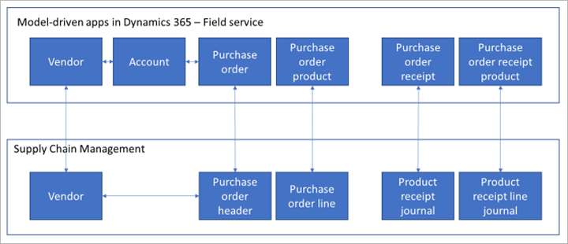
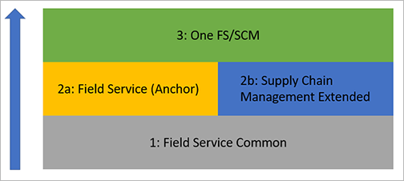

---
# required metadata

title: Integrate procurement in Supply Chain Management with Field Service through dual-write
description: Supply Chain Management has robust procurement functionality. Field Service offers similar functionality to support the purchasing processes associated with the service motion. This integration supports purchase order creation and, in most cases, update from both applications.
author: mkirknel
manager: tfehr
ms.date: 11/11/2020
ms.topic: article
ms.prod: 
ms.service: dynamics-ax-applications
ms.technology: 

# optional metadata

# ms.search.form: [Operations AOT form name to tie this topic to]
audience: Application User
# ms.devlang: 
ms.reviewer: rhaertle
ms.search.scope: Core, Operations
# ms.tgt_pltfrm: 
# ms.custom: [used by loc for topics migrated from the wiki]
ms.search.region: Global
# ms.search.industry: [leave blank for most, retail, public sector]
ms.author: mkirknel
ms.search.validFrom: 2020-11-11
ms.dyn365.ops.version: Release 10.0.17
---

# Integrate procurement in Supply Chain Management with Field Service through dual-write

[!include [banner](../includes/banner.md)]

Dynamics 365 Supply Chain Management has robust procurement functionality. Dynamics 365 Field Service offers similar functionality to support the purchasing processes associated with the service motion. This dual-write integration and the resulting cross-functional use-cases are enabled by detailed table mappings, supporting solution logic, with combined views and forms.

This integration supports purchase order creation and, in most cases, update from both applications. However, Supply Chain Management controls pricing, addresses, and product receipt. This enables a number of powerful cross-functional use cases for organizations using both Field Service and Supply Chain Management to allow procurements to be initiated and tracked across both systems.

The following illustration shows the entities in each of the different system and how they are mapped to one another. Note that purchase orders in Field Service reference an *account*, while purchase orders in Supply Chain Management reference a*vendor*. To resolve this correctly, the system makes use of a reference to link vendors with accounts (see also [Integrated vendor master](vendor-mapping.md)). Other entities map directly as shown in the illustration.

## Prerequisites

To integrate Supply Chain Management with Field Service, you must be running the following versions of the relevant components:

- Field Service version 8.8.31.60 or higher for comprehensive purchase order integration
- Dual-write version <!-- #### --> or higher (required to run the *One FS/SCM* solution) <!-- Mai: [@Rama Krishnamoorthy](mailto:ramasri@microsoft.com) [@Jitender Verma](mailto:Jitender.Verma@microsoft.com) can one of you help us with providing what version of DW is needed for procurement integration)? -->
- Supply Chain Management version 10.0.14 or higher

## Installation guidelines

For more information on setting up dual-write, see the [Dual-write home page](dual-write-home-page.md#dual-write-setup)

For more information on how to install Dynamics 365 Field Service, see [How to install Dynamics 365 Field Service](https://docs.microsoft.com/dynamics365/field-service/install-field-service#step-1-install-dynamics-365-field-service)

When enabled in Dataverse, dual-write and Field Service will introduce a number of solution layers which extend the environment with new metadata, forms, views, and logic, as shown in the following figure. These solutions can be enabled in any order.

The figure references the following elements, which you typically install in the following order:

1. **Field Service Common**: Both solutions' installation package will introduce a solution called Field Service Common. This solution introduces several common components required across both Field Service and Supply Chain Management Extended.
1. **Filed Service (Anchor) and/or Supply Chain Management Extended**: The Filed Service (Anchor) and/or Supply Chain Management Extended can be installed next and can be introduced independently. While Field Service is composed of many solutions and patches working together, the Field Service (Anchor) solution (version 8.8.31.60 or higher) signifies that there are many specific solution components present. The Supply Chain Management Extended solution installs many tables, attributes, and behaviors that are specific to Supply Chain Management, and which are required for dual-write to work correctly with Microsoft Dataverse.
1. **One FS/SCM:** If both the Field Service (Anchor) and Supply Chain Management Extended solutions are present and meet the minimum versions, another solution called *One FS/SCM* will be installed. This solution contains logic and some solution components that don't otherwise merge and allows for comprehensive solution behavior across common functionality between Field Service and Supply Chain Management.

## Initial synchronization

To create purchase orders and work with existing purchase order, it is required that reference data is synchronized between Supply Chain Management and Dataverse. Please use the *initial write* functionality to detect the entity relationships and find the entities you need to enable for a given map.

Major entities that are needed are:

- Products templates, such as:
  - All products
  - Released products V2
  - Dataverse released distinct products
- Sites
- Warehouses
- Procurement categories templates, such as:
  - Procurement categories
  - Pro
  - Product category hierarchy ro
  - Product category assignments
- Vendor templates, such as Vendor V2 (see also the note following this list).
- Contact person template, such as Dataverse Contacts V2
- Worker template, such as Worker

This will ensure that all documents (purchase orders and Product receipts) in Supply Chain Management are available in Dataverse.

> [!NOTE]
> The Field Service Purchase Order relies on the Account entity to track Vendors. This means that the Dataverse tables for Purchase Order use the Account to track Vendor. In order to accommodate this key difference, there are four key workflows that must be enabled which will keep the Accounts as Vendors in sync. 
>
> The following four processes must be activated:
>
>- *Create Vendors in Accounts Entity*
>- *Create Vendors in Vendors Entity*
>- *Update Vendors in Accounts Entity*
>- *Update Vendors in Vendors Entity*
>
> If One FS/SCM installs because both Field Service and Supply Chain Management Extended are present, these workflows will be enabled automatically. If Field Service is not present, but an organization would still like to integrate the Purchase Order tables with Dataverse, this should be possible but it will require that these workflows are activated.
>
> In either case, unless an organization is starting from scratch, it may be necessary to ensure that all Vendors are created in Dataverse as Accounts before creating Purchase Orders, otherwise you may see errors.

Once all of the prerequisites are in pace, if you want existing purchase orders and product receipts to be available in both systems, then you should do an initial sync of the following templates:

- *Purchase Order Header V2*
- *CDS Purchase Order Line*
- *CDS Purchase Order Line soft delete*
- *Purchase Order Receipt*
- *Purchase Order Receipt Product*

## Templates

The following templates are available for integrating procurement related documents.

| Supply Chain Management | Other Dynamics 365 apps (such as Field Service) | Description |
|---|---|---|
| Purchase order header V2 | msdyn\_Purchaseorders | This entity contains the fields from representing the purchase order header. |
| Dataverse purchase order line entity | msdyn\_PurchaseOrderProducts | This entity contains the fields that represents the purchase order lines |
| Product receipt header | msdyn\_purchaseorderreceipts | This entity is the product receipt headers that is created when a product receipt is posted in Supply Chain Management. |
| Product receipt line | msdyn\_purchaseorderreceiptproducts | This entity is the product receipt lines that is created when a product receipt is posted in Supply Chain Management. |
| CDS purchase order line soft deleted entity | msdyn\_purchaseorderproducts | This entity contains information about which purchase order lines that are soft deleted. |

## Mappings

### Mapping types

There are several different mapping types. The following table explains the symbols used in the template tables.

| **Symbol** | **Description** |
|---|---|
| \> | One-way |
| \>\> | One-way, and data is transformed in the process. |
| = | Bidirectional |
| \>\< | Bidirectional, and data is transformed in the process. |
| \<\< | One-way, and data is transformed in the process. |

### Purchase order header V2 ( msdyn\_Purchaseorders)

This template synchronizes data between Supply Chain Management and Dataverse.

| Supply Chain Management | Map type | Dataverse |
|---|---|---|
| DELIVERYADDRESSNAME | \> | msdyn\_addressname |
| REQUESTEDDELIVERYDATE | = | msdyn\_dateexpected |
| PURCHASEORDERNUMBER | = | msdyn\_name |
| PAYMENTTERMSNAME | = | msdyn\_paymentterm.msdyn\_name |
| DEFAULTRECEIVINGWAREHOUSEID | = | msdyn\_receivetowarehouse.msdyn\_warehouseidentifier |
| ACCOUNTINGDATE | = | msdyn\_accountingdate |
| AREPRICESINCLUDINGSALESTAX | \>\< | msdyn\_arepriceincludingsalestax |
| ATTENTIONINFORMATION | \> | msdyn\_attentioninformation |
| CASHDISCOUNTCODE | = | msdyn\_cashdiscountcode |
| CASHDISCOUNTPERCENTAGE | = | msdyn\_cashdiscountpercentage |
| CONTACTPERSONID | = | msdyn\_contactpersonid.msdyn\_contactpersonid |
| CURRENCYCODE | = | transactioncurrencyid.isocurrencycode |
| DEFAULTRECEIVINGSITEID | = | msdyn\_defaultreceivingsiteid.msdyn\_siteid |
| DELIVERYTERMSID | = | msdyn\_deliveryterm.msdyn\_termscode |
| EMAIL | = | msdyn\_email |
| ISCHANGEMANAGEMENTACTIVE | \>\> | msdyn\_ischangemanagementactive |
| ISDELIVEREDDIRECTLY | \>\> | msdyn\_isdeliverydirectly |
| LANGUAGEID | \>\< | msdyn\_language |
| ORDERERPERSONNELNUMBER | = | msdyn\_ordererpersonnelnumber.cdm\_workernumber |
| REASONCODE | = | msdyn\_reasoncode |
| REASONCOMMENT | = | msdyn\_reasoncomment |
| TOTALDISCOUNTPERCENTAGE | = | msdyn\_totaldiscountpercentage |
| URL | = | msdyn\_url |
| VENDORORDERREFERENCE | = | msdyn\_vendororderreference |
| VENDORPAYMENTMETHODNAME | = | msdyn\_vendorpaymentmethod.msdyn\_name |
| VENDORPAYMENTMETHODSPECIFICATIONNAME | \> | msdyn\_vendorpaymentmethodspecificationname |
| ORDERVENDORACCOUNTNUMBER | = | msdyn\_vendor.accountnumber |
| DELIVERYMODEID | = | msdyn\_shipvia.msdyn\_name |
| INVOICEVENDORACCOUNTNUMBER | = | msdyn\_invoicevendoraccount.accountnumber |
| DOCUMENTAPPROVALSTATUS | \>\> | msdyn\_documentapprovalstatus |
| PURCHASEORDERSTATUS | \>\> | msdyn\_purchaseorderstatus |
| DELIVERYADDRESSCITY | \> | msdyn\_city |
| DELIVERYADDRESSCOUNTRYREGIONISOCODE | \> | msdyn\_country |
| DELIVERYADDRESSSTATEID | \> | msdyn\_stateorprovince |
| DELIVERYADDRESSZIPCODE | \> | msdyn\_postalcode |
| DELIVERYADDRESSSTREET | \> | msdyn\_address1 |
| DELIVERYADDRESSSTREETNUMBER | \> | msdyn\_address2 |
| CONFIRMEDDELIVERYDATE | = | msdyn\_confirmeddeliverydate |
| DELIVERYADDRESSLONGITUDE | \> | msdyn\_longitude |
| DELIVERYADDRESSLATITUDE | \> | msdyn\_latitude |
| DELIVERYADDRESSCOUNTRYREGIONID | \> | msdyn\_deliveryaddresscountryregionid |
| DELIVERYADDRESSDESCRIPTION | \> | msdyn\_deliveryaddressdescription |
| DELIVERYADDRESSDISTRICTNAME | \> | msdyn\_deliveryaddressdistrictname |
| DELIVERYADDRESSDUNSNUMBER | \> | msdyn\_deliveryaddressdunsnumber |
| DELIVERYADDRESSLOCATIONID | \> | msdyn\_deliveryaddresslocationid |
| DELIVERYADDRESSPOSTBOX | \> | msdyn\_deliveryaddresspostbox |
| DELIVERYADDRESSTIMEZONE | \> | msdyn\_deliveryaddresstimezone |
| DELIVERYBUILDINGCOMPLIMENT | \> | msdyn\_deliverybuildingcompliment |
| FORMATTEDDELIVERYADDRESS | \> | msdyn\_formatteddeliveryaddress |
| INVOICEADDRESSCITY | \> | msdyn\_invoiceaddresscity |
| INVOICEADDRESSCOUNTRYREGIONID | \> | msdyn\_invoiceaddresscountryregionid |
| INVOICEADDRESSCOUNTY | \> | msdyn\_invoiceaddresscounty |
| INVOICEADDRESSSTATE | \> | msdyn\_invoiceaddressstate |
| INVOICEADDRESSSTREET | \> | msdyn\_invoiceaddressstreet |
| INVOICEADDRESSSTREETNUMBER | \> | msdyn\_invoiceaddressstreetnumber |
| INVOICEADDRESSZIPCODE | \> | msdyn\_invoiceaddresszipcode |

### Dataverse purchase order line entity (msdyn\_PurchaseOrderProducts)

This template synchronizes data between Supply Chain Management and Dataverse.

| Supply Chain Management | Map type | Dataverse |
|---|-|---|
| REQUESTEDDELIVERYDATE | = | msdyn\_dateexpected |
| LINEDESCRIPTION | = | msdyn\_description |
| LINENUMBER | = | msdyn\_lineorder |
| PRODUCTNUMBER \*) | = | msdyn\_product.msdyn\_productnumber |
| PURCHASEORDERNUMBER | = | msdyn\_purchaseorder.msdyn\_name |
| ORDEREDPURCHASEQUANTITY | = | msdyn\_quantity |
| LINEAMOUNT | \> | msdyn\_lineamount |
| PURCHASEPRICE | \> | msdyn\_unitcost |
| BARCODE | = | msdyn\_barcode |
| CATCHWEIGHTUNITSYMBOL | = | msdyn\_catchweightunitsymbol.msdyn\_symbol |
| CONFIRMEDSHIPPINGDATE | = | msdyn\_confirmedshippingdate |
| CUSTOMERREFERENCE | = | msdyn\_customerreference |
| CUSTOMERREQUISITIONNUMBER | = | msdyn\_customerrequisitionnumber |
| EXTERNALITEMNUMBER | = | msdyn\_externalitemnumber |
| ISPARTIALDELIVERYPREVENTED | \>\< | msdyn\_ispartialdeliveryprevented |
| LINEDISCOUNTAMOUNT | \> | msdyn\_linediscountamount |
| LINEDISCOUNTPERCENTAGE | \> | msdyn\_linediscountpercentage |
| ORDEREDCATCHWEIGHTQUANTITY \[ | = | msdyn\_orderedcatchweightquantity |
| PURCHASEORDERLINESTATUS | \>\> | msdyn\_purchaseorderlinestatus |
| PURCHASEPRICEQUANTITY | = | msdyn\_purchasepricequantity |
| RECEIVINGSITEID | = | msdyn\_receivingsiteid.msdyn\_siteid |
| REQUESTEDSHIPPINGDATE | = | msdyn\_requestedshippingdate |
| REQUESTERPERSONNELNUMBER | = | msdyn\_requesterpersonnelnumber.cdm\_workernumber |
| PROCUREMENTPRODUCTCATEGORYNAME | \> | msdyn\_procurementproductcategory.msdyn\_name |
| PROCUREMENTPRODUCTCATEGORYHIERACHYNAME | \> | msdyn\_procurementproductcategory.msdyn\_hierarchy.msdyn\_name |
| CURRENCYCODE | \> | transactioncurrencyid.isocurrencycode |
| CONFIRMEDDELIVERYDATE | = | msdyn\_confirmeddeliverydate |
| DELIVERYADDRESSCITY | \> | msdyn\_deliveryaddresscountryregionid |
| DELIVERYADDRESSSTATEID | \> | msdyn\_deliveryaddressstate |
| DELIVERYADDRESSSTREET | \> | msdyn\_deliveryaddressstreet |
| DELIVERYADDRESSSTREETNUMBER | \> | msdyn\_deliveryaddressstreetnumber |
| DELIVERYADDRESSZIPCODE | \> | msdyn\_deliveryaddresszipcode |
| FORMATTEDDELVERYADDRESS | \> | msdyn\_formatteddeliveryaddress |
| PURCHASEUNITSYMBOL | = | msdyn\_unit.msdyn\_symbol |
| RECEIVINGWAREHOUSEID | = | msdyn\_associatetowarehouse.msdyn\_warehouseidentifier |
| DELIVERYADDRESSDESCRIPTION | \> | msdyn\_deliveryaddressdescription |
| DELIVERYADDRESSNAME | \> | msdyn\_deliveryaddressname |

\*) THe product number is used for synchronization. This identifies the product as a SKU (including product dimensions). For more information about product integration with Dataverse, see [Unified product experience](product-mapping.md).

### Product receipt header (msdyn\_purchaseorderreceipts)

This template synchronizes data between Supply Chain Management and Dataverse.

| Supply Chain Management | Map type | Dataverse |
|---|---|---|
| RECORDID | \> | msdyn\_recordid |
| PRODUCTRECEIPTDATE | \> | msdyn\_datereceived |
| DELIVERYADDRESSLATITUDE | \> | msdyn\_deliveryaddresslatitude |
| DELIVERYADDRESSLONGITUDE | \> | msdyn\_deliveryaddresslongitude |
| PURCHASEORDERNUMBER | \> | msdyn\_purchaseorder.msdyn\_name |
| DELIVERYMODEID | \> | msdyn\_shipvia.msdyn\_name |
| DELIVERYTERMSID | \> | msdyn\_deliveryterm.msdyn\_termscode |
| ORDERVENDORACCOUNTNUMBER | \> | msdyn\_ordervendor.msdyn\_vendoraccountnumber |
| REQUESTERPERSONNELNUMBER | \> | msdyn\_requesterpersonnel.cdm\_workernumber |
| ISDELIVERYADDRESSPRIVATE | \> | msdyn\_isdeliveryaddressprivate |
| DELIVERYADDRESSCOUNTRYREGIONID | \> | msdyn\_deliveryaddresscountryregionid |
| DELIVERYADDRESSCOUNTYID | \> | msdyn\_deliveryaddresscountyid |
| DELIVERYADDRESSSTATEID | \> | msdyn\_deliveryaddressstateid |
| DELIVERYADDRESSZIPCODE | \> | msdyn\_deliveryaddresszipcode |
| DELIVERYADDRESSNAME | \> | msdyn\_deliveryaddressname |
| DELIVERYADDRESSTIMEZONE | \> | msdyn\_deliveryaddresstimezone |
| DELIVERYADDRESSPOSTBOX | \> | msdyn\_deliveryaddresspostbox |
| DELIVERYADDRESSSTREETNUMBER | \> | msdyn\_deliveryaddressstreetnumber |
| DELIVERYADDRESSSTREET | \> | msdyn\_deliveryaddressstreet |
| PRODUCTRECEIPTNUMBER | \> | msdyn\_name |
| ATTENTIONINFORMATION | \> | msdyn\_note |
| DELIVERYCITYINKANA | \> | msdyn\_deliverycityinkana |
| DELIVERYSTREETINKANA | \> | msdyn\_deliverystreetinkana |
| FORMATTEDDELIVERYADDRESS | \> | msdyn\_formatteddeliveryaddress |
| DELIVERYADDRESSLOCATIONID | \> | msdyn\_deliveryaddresslocationid |
| DELIVERYADDRESSCITY | \> | msdyn\_deliveryaddresscity |
| DELIVERYADDRESSDESCRIPTION | \> | msdyn\_deliveryaddressdescription |
| DELIVERYADDRESSDISTRICTNAME | \> | msdyn\_deliveryaddressdistrictname |
| DELIVERYBUILDINGCOMPLIMENT | \> | msdyn\_deliverybuildingcompliment |
| DELIVERYADDRESSDUNSNUMBER | \> | msdyn\_deliveryaddressdunsnumber |

### Product receipt line (msdyn\_purchaseorderreceiptproducts)

This template synchronizes data between Supply Chain Management and Dataverse.

| Supply Chain Management | Map type | Dataverse |
|---|---|---|
| RECORDID | \> | msdyn\_recordid |
| DELIVERYADDRESSCOUNTRYREGIONID | \> | msdyn\_deliveryaddresscountryregionid |
| DELIVERYADDRESSCOUNTYID | \> | msdyn\_deliveryaddresscountyid |
| DELIVERYADDRESSSTATEID | \> | msdyn\_deliveryaddressstateid |
| EXPECTEDDELIVERYDATE | \> | msdyn\_expecteddeliverydate |
| EXTERNALITEMNUMBER | \> | msdyn\_externalitemnumber |
| ITEMBATCHNUMBER | \> | msdyn\_itembatchnumber |
| ITEMSERIALNUMBER | \> | msdyn\_itemserialnumber |
| LINEDESCRIPTION | \> | msdyn\_linedescription |
| ORDEREDPURCHASEQUANTITY | \> | msdyn\_orderedpurchasequantity |
| PROCUREMENTPRODUCTCATEGORYNAME | \> | msdyn\_procurementproductcategory.msdyn\_name |
| PROCUREMENTPRODUCTCATEGORYHIERARCHYNAME | \> | msdyn\_procurementproductcategory.msdyn\_hierarchy.msdyn\_name |
| PRODUCTRECEIPTDATE | \> | msdyn\_productreceiptdate |
| PRODUCTRECEIPTHEADERRECORDID | \> | msdyn\_purchaseorderreceipt.msdyn\_recordid |
| PRODUCTRECEIPTNUMBER | \> | msdyn\_productreceiptnumber |
| PURCHASEORDERLINENUMBER | \> | msdyn\_purchaseorderproduct.msdyn\_lineorder |
| PURCHASEORDERNUMBER | \> | msdyn\_purchaseorderproduct.msdyn\_purchaseorder.msdyn\_name |
| PURCHASEORDERNUMBER | \> | msdyn\_purchaseorder.msdyn\_name |
| PURCHASEUNITSYMBOL | \> | msdyn\_purchaseunitsymbol.msdyn\_symbol |
| RECEIVEDINVENTORYQUANTITY | \> | msdyn\_receivedinventoryquantity |
| RECEIVEDINVENTORYSTATUSID | \> | msdyn\_receivedinventorystatusid |
| RECEIVEDPURCHASEQUANTITY | \> | msdyn\_quantity |
| RECEIVINGSITEID | \> | msdyn\_receivingsiteid.msdyn\_siteid |
| RECEIVINGWAREHOUSEID | \> | msdyn\_associatetowarehouse.msdyn\_warehouseidentifier |
| RECEIVINGWAREHOUSELOCATIONID | \> | msdyn\_receivingwarehouselocation.msdyn\_warehouselocationid |
| RECEIVINGWAREHOUSEID | \> | msdyn\_receivingwarehouselocation.msdyn\_warehouse.msdyn\_warehouseidentifier |
| REMAININGINVENTORYQUANTITY | \> | msdyn\_remaininginventoryquantity |
| REMAININGPURCHASEQUANTITY | \> | msdyn\_remainingpurchasequantity |
| PRODUCTNUMBER | \> | msdyn\_product.msdyn\_productnumber |

### Dataverse purchase order line soft deleted entity (msdyn\_purchaseorderproducts)

This template synchronizes data between Supply Chain Management and Dataverse.

A purchase order line in Supply Chain Management can only be soft deleted when the purchase order has been confirmed or approved if change management is enabled. The record exists in the Supply Chain Management database with a marking as IsDeleted. Dataverse does not have a concept of soft delete so this information is important to synchronize to Dataverse to automatically delete lines from Dataverse when they are soft deleted in Supply Chain Management. Logic for deleting a line in Dataverse in this case is located in Supply Chain Management extended <!-- Mai: is this correct)? -->

| Supply Chain Management | Map type | Dataverse |
|---|---|---|
| LINENUMBER | \> | msdyn\_lineorder |
| PURCHASEORDERNUMBER | \> | msdyn\_purchaseorder.msdyn\_name |
| ISDELETED | \> | msdyn\_issoftdeletedinscm |

## Mappings with logic

The procurement integration extends the product mapping with the following logic to ensure that products in Dataverse get the **Field Service Product Type** field set correctly:

- If **Product Type** is *Product* and **Item model group, Stocked product** is *True*, then **Field Service Product Type** is *Inventory*.
- If **Product type** is *Product* and **Item model group, Stocked product** is *False*, then **Field Service Product Type** is *Non-Inventory*.
- If **Product Type** is *Service*, then **Field Service Product Type** is *Service*.

In addition, there is logic in Dataverse that maps vendors with their related accounts. It sets the default *Invoice Vendor Account*. On create, server-side plug-in logic defaults the *Invoice Vendor Account* from the Account's related Vendor. Vendor has a reference to Invoice Account which is used to populate this value.

## Supported scenarios

Purchase orders can be created and updated, with some limitations based on lifecycle, by Dataverse users but the process and data are controlled by Supply Chain Management.

If the purchase order is controlled by change management in Supply Chain Management a Field Service user can only update the purchase order when the Supply Chain Management approval status is DRAFT.

Several fields are managed by Supply Chain Management only, which implies that such fields cannot be updated by Field Service. Read the mapping tables in this document to get more information about which fields this is, mapping is indicated by \> or \>\>. Most such fields will be set to read-only in the Dataverse forms to simplify use.

One example of fields managed by Supply Chain Management is the price information. Supply Chain Management has trade agreements that Field Service can benefit from. Fields such as Unit price, Discount and Net Amount come only from Supply Chain Management. To ensure that the price is synced to Field Service the **Sync** button should by used on the Purchase Order and Purchase Order Product form in Dataverse when purchase order data has been entered. <!-- (add a link to a later section where the Sync is described) -->

The **Totals** field is only available in Field Service as there are no up to date totals of the purchase order in Supply Chain Management. The totals in Supply Chain Management are calculated based on multiple parameters that are not available in Field Service.

Purchase order lines with only a procurement category specified or where the product specified is an item of **Type** or **Field Service Product Type** *Service* can only be initiated in Supply Chain Management, however they are synced to Dataverse and are visible in the Field service app.

When Supply Chain Management is not installed and only Field Service is installed then warehouse is mandatory on the purchase order; however, when Supply Chain Management is installed this requirement is relaxed because Supply Chain Management allows a purchase order line without a warehouse in certain situations.

Product receipts (purchase order receipts in Dataverse) are managed by Supply Chain Management and cannot be created from Dataverse when Supply Chain Management is installed. The product receipts from Supply Chain Management are synced from Supply Chain Management to Dataverse.

Since under delivery can be allowed in Supply Chain Management, One FS/SCM adds logic that, on create or update of the Product Receipt Line (Purchase Order Receipt Product in Dataverse), an Inventory Journal record in Dataverse is created to adjust the remaining on order quantity for under-delivery scenarios.

## A few unsupported scenarios

Adding a line to a Canceled Purchase Order in Supply Chain Management. This will be blocked by Field Service logic. Workaround is to change the PO System Status in Field Service, then to add the new line in either Field Service or Supply Chain Management.

While procurement records will impact inventory levels in both systems, this integration does not assure inventory alignment across Supply Chain Management and Field Service. Both Field Service and Supply Chain Management have other processes which update inventory levels that are outside the scope of procurement.

<!-- Mai: Delivery Date/Lead Time Delivery date defaulting controlled by Supply Chain Management. ( this is what does not work and I need to test this) -->

## Status Management

The status for a purchase order in field services is different from the statues in Supply Chain Management

Field service Purchase order and purchase order product statuses

| Header – System status | Header - Approval status | Item status |
|---|---|---|
| Draft Submitted Cancelled Product received Billed | Null Approved Rejected | Pending Received Cancelled |

Supply Chain Management purchase order and purchase order line statuses.

| Header – documents status | Header - Approval status | Line status | Line approval status\* |
|---|---|---|---|
| Open Order (Back order) Received Invoiced Cancelled | Draft In Review Approved Rejected In External Review Confirmed Finalized | Open Order (back order) Received Invoiced Cancelled | Not Submitted In Review Approved Rejected |

 \* Line approval status is only active when there is a line workflow

Statuses in Supply Chain Management cannot be updated from Field Service.

However statuses in Field Service will in some cases be updated when the purchase order status in Supply Chain Management changes.

When the purchase order in Supply Chain Management is under change management and processing a change, this is when **Approval** status is Draft or In Review. In this case the Field Service approval status will be set to **Null**

When the purchase order approval status in Supply Chain Management is set to **Approved, In External review, Confirmed or Finalized** the Field Service purchase order approval status will be set to **Approved**

When the purchase order approval status in Supply Chain Management is set to **Rejected** the Field Service purchase order approval status will be set to **Rejected**

When the document header status in Supply Chain Management changes to **Open order (Back order)** and the Field Service purchase order status is **Draft** or **Cancelled** then the Fields service purchase order status will change to **Submitted**.

When the document header status in Supply Chain Management changes to **Cancelled** there are no purchase order receipt products in Field Service associated with the purchase order (Via purchase order products), then the field service System status is set to **Cancelled**.

When purchase order line status in Supply Chain Management is **Cancelled** then field service purchase order product status should be **Cancelled** . In addition, when Purchase order Line Status in Supply Chain Management is changed from **Canceled** to **Back Order**, then the Purchase Order Product Item Status in Field service should be updated to **Pending**

## Sync with the Dynamics 365 Supply Chain Management procurement data on demand

Microsoft Dynamics 365 Supply Chain Management includes a procurement data that handles trade agreements, discounts, and many other scenarios which rely on secondary processes within Supply Chain Management. The procurement engine uses complex rules to determine the best price for a given purchase order. When you use dual-write, data is not always kept synchronous across the two machines, especially in scenarios where the record was created or updated from Dataverse and may trigger follow-on processes in Supply Chain Management.

## Sync the procurement data from Supply Chain Management

To sync the procurement data from Supply Chain Management:

1. In Dataverse, go to **Inventory \> Purchase Order.**

2. Select **New** to create a new purchase order or select an existing purchase order record.

3. From the Purchase Order or Purchase Order line.

4. Select **Sync** on the Action Pane.

All fields from Dataverse/Field Service which are shared by Supply Chain Management will be synced.

When to use the **Sync** function:

- Users should consider using the **Sync** function, when they make multiple changes to the same record in succession from the Dataverse-side.

- If users are not sure if this might be the second successive change from the Dataverse-side, it may make sense to use the **Sync** function.

- If users are getting an error about updating a value from Supply Chain Management, it may be resolve by triggering the sync function and then retrying their update on Dataverse.
