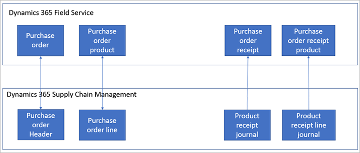

---
# required metadata

title: Integrate procurement between Supply Chain Management and Field Service
description: Dual-write integration supports purchase order creation and updates from both Supply Chain Management and Field Service.
author: mkirknel
manager: tfehr
ms.date: 11/11/2020
ms.topic: article
ms.prod: 
ms.service: dynamics-ax-applications
ms.technology: 

# optional metadata

audience: Application User
# ms.devlang: 
ms.reviewer: rhaertle
# ms.tgt_pltfrm: 
ms.search.region: Global
ms.author: mkirknel
ms.search.validFrom: 2020-11-11
ms.dyn365.ops.version: Release 10.0.17
---

# Integrate procurement between Supply Chain Management and Field Service

[!include [banner](../../includes/banner.md)]

[!include [banner](../../includes/preview-banner.md)]

Dynamics 365 Supply Chain Management provides robust procurement functionality. Dynamics 365 Field Service offers similar functionality to support the purchasing processes associated with the service motion. These functions are integrated through dual-write. The resulting cross-functional use-cases are enabled through table mappings, solution logic, views, and forms.

This integration supports purchase order creation and, in most cases, updates from both applications. However, Dynamics 365 Supply Chain Management controls pricing, addresses, and product receipt. Several powerful cross-functional use cases are enabled for organizations using both Field Service and Dynamics 365 Supply Chain Management. These use cases allow procurements to be initiated and tracked across both systems.

The following illustration shows the tables and entities in each system and how map they to one another. Purchase orders in Field Service reference an *account* row, while purchase orders in Dynamics 365 Supply Chain Management reference a *vendor* row. To resolve this correctly, dual-write makes use of a reference to link *vendor* rows with *account* rows. For more information, see [Integrated vendor master](vendor-mapping.md).

## Prerequisites

To integrate Dynamics 365 Supply Chain Management with Field Service, you must install the following components:

- Field Service, version 8.8.31.60 or later for comprehensive purchase order integration.
- Dynamics 365 Supply Chain Management, version 10.0.14 or higher.
- Dual-write is required to run the OneFSSCM solution.

## Installation guidelines

### Prerequisites

+ Dual-write: For more information, see the [Dual-write home page](dual-write-home-page.md#dual-write-setup).
+ Dynamics 365 Field Service: For more information, see [How to install Dynamics 365 Field Service](https://docs.microsoft.com/dynamics365/field-service/install-field-service#step-1-install-dynamics-365-field-service).

When enabled in Microsoft Dataverse, dual-write and Field Service introduce a number of solution layers that extend the environment with new metadata, forms, views, and logic, as shown in the following figure. These solutions can be enabled in any order.

The figure references the following elements, which you typically install in the following order:

1. Field Service Common: Field Service Common is installed when Field Service is installed in the environment.
2. Field Service (Anchor): Field Service (Anchor) is installed when Field Service is installed in the environment. 
3. Supply Chain Management Extended: Supply Chain Management Extended is installed automatically when dual-write is enabled in an environment. 
4. OneFSSCM solution: OneFSSCM is installed automatically by whichever of the two solution packages (Field Service or Supply Chain Management) installs last.

    + If Field Service is installed in the environment already and you enable dual-write, which installs Supply Chain Management Extended, then OneFSSCM is installed.
    + If Supply Chain Management Extended is installed and you install Field Service in the environment, then OneFSSCM is installed.

## Initial synchronization

To create purchase orders and work with existing purchase order, you must synchronize the reference data between Supply Chain Management and Dataverse. Use the initial write functionality to detect the table relationships and find the tables you need to enable for a given map.

You must synchronize the following tables.

- Products templates. When you run the initial write, you will get a full list of the tables needed. Some examples are:
  - All products
  - Released products V2
  - Dataverse released distinct products
- Sites
- Warehouses
- Procurement categories templates. Some examples are:
  - Procurement categories
  - Pro
  - Product category hierarchy
  - Product category assignments
- Vendor templates, such as Vendor V2
- Contact person template, for example Dataverse Contacts V2
- Worker template, such as Worker

Synchronizing the tables ensures that all documents (purchase orders and Product receipts) in Supply Chain Management are available in Dataverse.

### Account and Vendor tables
The Field Service Purchase Order relies on the Account table to track Vendors. This means that the Dataverse tables for Purchase Order use the Account to track Vendor. In order to accommodate this key difference, there are four workflows that must be enabled to keep the Accounts as Vendors in sync. 

The following four workflows must be activated:

- Create Vendors in Accounts table
- Create Vendors in Vendors table
- Update Vendors in Accounts table
- Update Vendors in Vendors table

If OneFSSCM installs because both Field Service and Supply Chain Management Extended are installed, these workflows will be enabled automatically. If Field Service is not present, but you want to integrate the Purchase Order tables with Dataverse, then you must activate these workflows.

In either case, unless you are starting from scratch, you might have to ensure that all Vendors are created in Dataverse as Accounts before creating Purchase Orders. Ootherwise you may see errors.

### Initial sync

Once all of the prerequisites are in place, if you want existing purchase orders and product receipts to be available in both systems, then do an initial sync of the following templates:

- Purchase Order Header V2
- CDS Purchase Order Line
- CDS Purchase Order Line soft delete
- Purchase Order Receipt
- Purchase Order Receipt Product

## Mappings with logic

The procurement integration extends the product mapping with the following logic to ensure that the **Field Service Product Type** column is set correctly in the products table in Dataverse:

- If **Product Type** is *Product* and **Item model group, Stocked product** is *True*, then **Field Service Product Type** is *Inventory*.
- If **Product type** is *Product* and **Item model group, Stocked product** is *False*, then **Field Service Product Type** is *Non-Inventory*.
- If **Product Type** is *Service*, then **Field Service Product Type** is *Service*.

In addition, there is logic in Dataverse that maps vendors with their related accounts. It sets the default *Invoice Vendor Account*. On create, server-side plug-in logic defaults the *Invoice Vendor Account* from the Account's related Vendor. Vendor has a reference to Invoice Account that is used to populate this value.

## Supported scenarios

+ Purchase orders can be created and updated by Dataverse users but the process and data are controlled by Supply Chain Management. The constraints of updating purchase order fields in Supply Chain Management apply when updates come from Field Service. For example if a purchase order is finalized you cannot update it. 
+ If the purchase order is controlled by change management in Supply Chain Management, then a Field Service user can only update the purchase order when the Supply Chain Management approval status is `Draft`.
+ Several fields are managed by Supply Chain Management only. Those fields can't be updated in Field Service. Review the mapping tables in the product to find out which fields can't be updated. Most of these fields will be set to read-only in the Dataverse forms to simplify use. One example of fields managed by Supply Chain Management is the price information. Supply Chain Management has trade agreements that Field Service can benefit from. Fields such as Unit price, Discount and Net Amount come only from Supply Chain Management. To ensure that the price is synced to Field Service the **Sync** button should by used on the Purchase Order and Purchase Order Product form in Dataverse when purchase order data has been entered. For more information, see [Sync with the Dynamics 365 Supply Chain Management procurement data on demand](#sync-procurement).
+ The **Totals** field is only available in Field Service, because there are no up-to-date totals of the purchase order in Supply Chain Management. The totals in Supply Chain Management are calculated based on multiple parameters that are not available in Field Service.
+ Purchase order lines with only a procurement category specified or where the product specified is an item of **Type** or **Field Service Product Type** *Service* can only be initiated in Supply Chain Management. They are synced to Dataverse and are visible in the Field Service app.
+ When Supply Chain Management is not installed and only Field Service is installed then the warehouse field is mandatory on the purchase order; however, when Supply Chain Management is installed this requirement is relaxed because Supply Chain Management allows a purchase order line without a warehouse in certain situations.
+ Product receipts (purchase order receipts in Dataverse) are managed by Supply Chain Management and cannot be created from Dataverse when Supply Chain Management is installed. The product receipts from Supply Chain Management are synced from Supply Chain Management to Dataverse.
+ Under delivery is allowed in Supply Chain Management. The OneFSSCM solution adds logic that, on create or update of the Product Receipt Line (Purchase Order Receipt Product in Dataverse), an Inventory Journal record in Dataverse is created to adjust the remaining on order quantity for under-delivery scenarios.

## Unsupported scenarios

+ Adding a line to a Canceled Purchase Order in Supply Chain Management is blocked by Field Service. The workaround is to change the PO System Status in Field Service, then to add the new line in either Field Service or Supply Chain Management.
+ While procurement records will impact inventory levels in both systems, this integration does not assure inventory alignment across Supply Chain Management and Field Service. Both Field Service and Supply Chain Management have other processes which update inventory levels that are outside the scope of procurement.

## Status Management

The status for a purchase order in Field Service is different from the status in Supply Chain Management.

### Field Service Purchase order and purchase order product statuses

| Header – System status | Header - Approval status | Item status |
|---|---|---|
| `Draft` `Submitted` `Cancelled` `Product received` `Billed` | `Null` `Approved` `Rejected` | `Pending` `Received` `Cancelled` |

### Supply Chain Management purchase order and purchase order line statuses

Line approval status is only active when there is a line workflow.

| Header – documents status | Header - Approval status | Line status | Line approval status |
|---|---|---|---|
| `Open Order (Back order)` `Received` `Invoiced` `Cancelled` | `Draft` `In Review` `Approved` `Rejected` `In External Review` `Confirmed` `Finalized` | `Open Order (back order)` `Received` `Invoiced` `Cancelled` | `Not Submitted` `In Review` `Approved` `Rejected` |

The following rules are applied to the status fields:

+ The status in Supply Chain Management cannot be updated from Field Service. However the status in Field Service will in some cases be updated when the purchase order status in Supply Chain Management changes.
+ When the purchase order in Supply Chain Management is under change management and processing a change, then the `Approval` status is `Draft` or `In Review`. In this case the Field Service approval status will be set to `Null`.
+ If the purchase order approval status in Supply Chain Management is set to `Approved`, `In External review`, `Confirmed`, or `Finalized`, then the Field Service purchase order approval status will be set to `Approved`.
+ When the purchase order approval status in Supply Chain Management is set to `Rejected` the Field Service purchase order approval status will be set to `Rejected`.
+ When the document header status in Supply Chain Management changes to `Open order (Back order)` and the Field Service purchase order status is `Draft` or `Cancelled` then the Fields service purchase order status will change to `Submitted`.
+ When the document header status in Supply Chain Management changes to `Cancelled` and there are no purchase order receipt products in Field Service associated with the purchase order (via purchase order products), then the field service System status is set to `Cancelled`.
+ When purchase order line status in Supply Chain Management is `Cancelled` then purchase order product status in Field Service is set to `Cancelled`. In addition, when Purchase order Line Status in Supply Chain Management is changed from `Cancelled` to `Back Order`, then the Purchase Order Product Item Status in Field service is set to `Pending`.

##  Sync with the Dynamics 365 Supply Chain Management procurement data on demand

Dynamics 365 Supply Chain Management includes procurement data that handles trade agreements, discounts, and other scenarios that rely on secondary processes within Supply Chain Management. The procurement engine uses complex rules to determine the best price for a given purchase order. When you use dual-write, data is not always kept synchronous across the two machines, especially in scenarios where the record was created or updated from Dataverse and may trigger follow-on processes in Supply Chain Management.

## Sync the procurement data from Supply Chain Management

To sync the procurement data from Supply Chain Management:

1. In Dataverse, go to **Inventory \> Purchase Order.**
2. Select **New** to create a new purchase order or select an existing purchase order record.
3. From the Purchase Order or Purchase Order line.
4. Select **Sync** on the Action Pane.

All fields from Dataverse and Field Service that are shared by Supply Chain Management will be synced.

When to use the **Sync** function:

- You should consider using the **Sync** function when you make multiple changes to the same record in succession from Dataverse.
- If you are not sure if this might be the second successive change from the Dataverse, it may make sense to use the **Sync** function.
- If you are getting an error about updating a value from Supply Chain Management, run the **Sync** function and then retry the update in Dataverse.

## Templates

The following templates are available for integrating procurement related documents.

| Supply Chain Management | Field Service | Description |
|---|---|---|
| Purchase order header V2 | msdyn\_Purchaseorders | This entity contains the fields from representing the purchase order header. |
| Purchase order line entity | msdyn\_PurchaseOrderProducts | This table contains the rows that represent lines on a purchase order.  The product number is used for synchronization. This identifies the product as a SKU (including product dimensions). For more information about product integration with Dataverse, see [Unified product experience](product-mapping.md).|
| Product receipt header | msdyn\_purchaseorderreceipts | This entity contains the product receipt headers that are created when a product receipt is posted in Supply Chain Management. |
| Product receipt line | msdyn\_purchaseorderreceiptproducts | This entity contains the product receipt lines that are created when a product receipt is posted in Supply Chain Management. |
| Purchase order line soft deleted entity | msdyn\_purchaseorderproducts | This entity contains information about which purchase order lines that are soft deleted. A purchase order line in Supply Chain Management can only be soft-deleted when the purchase order has been confirmed or approved if change management is enabled. The record exists in the Supply Chain Management database with a marking as IsDeleted. Dataverse does not have a concept of soft delete so this information is important to synchronize to Dataverse to automatically delete lines from Dataverse when they are soft deleted in Supply Chain Management. Logic for deleting a line in Dataverse in this case is located in Supply Chain Management extended. |

[!include [banner](../../includes/dual-write-symbols.md)]

[!include [Currency](includes/productreceiptheader-msdyn-purchaseorderreceipts.md)]

[!include [Currency](includes/productreceiptline-msdyn-purchaseorderreceiptproducts.md)]

[!include [Currency](includes/purchaseorderheadersv2-msdyn-purchaseorders.md)]

[!include [Currency](includes/purchaseorderlinesoftdeletedtable-msdyn-purchaseorderproducts.md)]

[!include [Currency](includes/purchaseorderlinetable-msdyn-purchaseorderproducts.md)]
